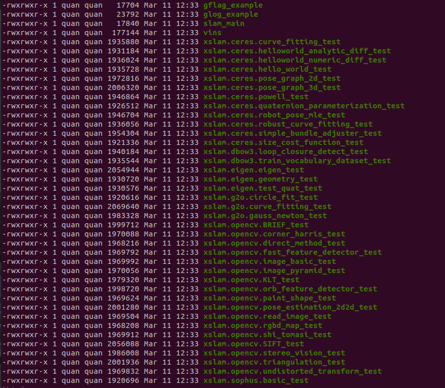
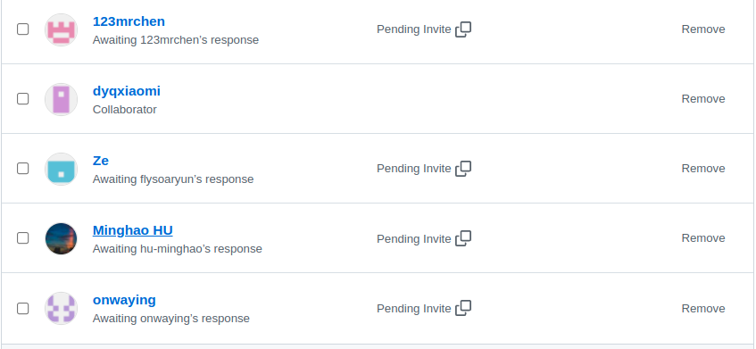

# LTSLAM
## 1 Introduction

I hope you can lean slam step by step, you will can learn online  [LTSLAM documents tutorial](https://ltslam-doc.readthedocs.io/en/latest/index.html)

You can learn slam knowledge by [哔哩哔哩 bilibili ](https://space.bilibili.com/478832908). This video website has a detailed explanation of the code and the corresponding SLAM technology principle. Let's start a happy journey. enjoy....

XSLAM is an open source C++ demo for learn vision slam and lidar slam. Through open source engineering, we can learn the following knowledge content:

* <font color='red'> **C++**  </font> [tutorial](https://ltslam-doc.readthedocs.io/en/latest/tutorial/c%2B%2B/c%2B%2B.html)
* <font color='red'> **CMake** </font> [tutorial](https://ltslam-doc.readthedocs.io/en/latest/tutorial/cmake/cmake.html)
* <font color='red'> **Eigen**  </font> [tutorial](https://ltslam-doc.readthedocs.io/en/latest/tutorial/eigen/eigen.html)
* <font color='red'> **OpenCV**  </font> [tutorial](https://ltslam-doc.readthedocs.io/en/latest/tutorial/opencv/opencv_tutorial.html)
* <font color='red'> **Quaternions**  </font> [tutorial](https://ltslam-doc.readthedocs.io/en/latest/math/math.html)
* <font color='red'> **Ceres Solver**  </font> [tutorial](https://ltslam-doc.readthedocs.io/en/latest/tutorial/ceres/ceres_solver_tutorial.html)
* <font color='red'> **Kalman Filter**  </font> [tutorial](https://ltslam-doc.readthedocs.io/en/latest/kalman_filter/kalman_filter.html)
* <font color='red'> **VINS Mono( VINS Project)**  </font> [tutorial](https://ltslam-doc.readthedocs.io/en/latest/vins/vins.html)

### 1.1 <font color='green'>Project directory:</font>

* xlsam
* xlsam_ros
  * slam2d (2D lidar SLAM)
  * vins-mono (VSLAM)

### 1.2  <font color='green'>Download LTSLAM source:</font>

```shell
git clone https://github.com/quanduyong/LTSLAM.git
```

## 2 Install dependency

### 2.1 Generate study documents
主要目的实现本地帮助文档doc下，以html网页的格式方便查看

* 安装Sphinx

  ```shell
  pip install -U sphinx
  ```

* 安装主题

  ```shell
  pip install sphinx_rtd_theme
  ```

* 安装markdown插件

  ```shell
  pip install recommonmark
  pip install myst-parser
  pip install sphinx_markdown_tables
  ```

### 2.2 Third party library

<font  color='green'>(推荐)</font>我已经提供了第三方库源码文件3rdparty目录下，执行以下命令安装，<font  color='red'>不然会出现版本不匹配问题</font>：

  ```shell
  mkdir build && cd build
  cmake ..
  make -j6 
  sudo make install
  ```

​     <font  color='red'>(不推荐)</font>如果你想自己源码安装第三方库请使用以下步骤：

* 安装Eigen

  ```
  git clone https://gitlab.com/libeigen/eigen.git
  cd eigen
  git checkout 3.3.8
  mkdir build && cd build
  cmake ..
  make -j6 
  sudo make install
  ```

* 安装Sophus

  ```shell
  git clone https://github.com/strasdat/Sophus.git
  cd Sophus
  mkdir build && cd build
  cmake ..
  make -j6 
  sudo make install
  ```

* 安装abseil 

  在abseil项目的CMakeLists.txt的project(absl LANGUAGES CXX) 下添加以下命令：

  `add_compile_options(-fPIC)`

  ```shell
  git clone https://github.com/abseil/abseil-cpp.git
  cd abseil-cpp
  mkdir build && cd build
  cmake ..
  make -j6 
  sudo make install
  ```

* 安装 DBow3

  ```
  git clone https://github.com/rmsalinas/DBow3.git
  cd abseil-cpp
  mkdir build && cd build
  cmake ..
  make -j6 
  sudo make install  
  ```

* 安装googletest

  ```
  git clone https://github.com/google/googletest.git
  cd googletest
  mkdir build && cd build
  cmake ..
  make -j6 
  sudo make install  
  ```

* 安装g2o

  ```
  git clone https://github.com/rmsalinas/DBow3.git
  cd abseil-cpp
  git checkout 9b41a4ea
  mkdir build && cd build
  cmake ..
  make -j6 
  sudo make install  
  ```

* 安装opencv & opencv_contrib (4.5-x)

  ```
  git clone https://github.com/opencv/opencv.git
  git clone https://github.com/opencv/opencv_contrib.git
  
  cd opencv
  mkdir build && cd build
  cmake-gui .. # 选择extra module opencv_contrib
  make -j6 
  sudo make install
  ```

## 3  工程编译

```shell
cd LTSLAM
mkdir build
cd build 
cmake ..
make -j6
```

## 4 如何运行工程demo

在工程的build/bin目录中，你可以看到对应的每个可执行二进制文件



Let ‘s run xslam.opencv.KLT_test shell command 

```
# KLT 光流跟踪算法
./xslam.opencv.KLT_test
```

## 5 Contact Me

我们有微信群和QQ群：<font color='green'> 710288823 </font>，你可以加入我们一起成长，所有代码和教学视频免费。


```
email ： quandy2020@126.com
```

加入我们吧！！！


## 6 Github贡献者

* 123mrchen
* Ze
* Minghao HU
* onwaying



