<center> <font color='green' size=12>G2O</font></center>

作者： 杜永全

邮箱：quandy2020@126.com

## 0 Introduction

g2o源码地址：

```shell
https://github.com/RainerKuemmerle/g2o.git
```

g2o的结构 :


如你所见，g2o项目中含有若干文件夹。刨开那些gitignore之类的零碎文件，主要有以下几个：

- EXTERNAL　　			三方库，有ceres, csparse, freeglut，可以选择性地编译；
- cmake_modules　　 给cmake用来寻找库的文件。我们用g2o时也会用它里头的东西，例如FindG2O.cmake
- doc　　　　　          文档。包括g2o自带的说明书（难度挺大的一个说明文档）。
- g2o　　　　　　      最重要的源代码都在这里！
- script　　　　           在android等其他系统编译用的脚本，由于我们在ubuntu下就没必要多讲了。

综上所述，最重要的就是g2o的源代码文件啦！所以我们要进一步展开看一看！


我们同样地介绍一下各文件夹的内容：

- apps　　　　一些应用程序。好用的g2o_viewer就在这里。其他还有一些不常用的命令行工具等。
- core　　　　核心组件，很重要！基本的顶点、边、图结构的定义，算法的定义，求解器接口的定义在这里。
- examples　　一些例程，可以参照着这里的东西来写。不过注释不太多。
- solvers　　　求解器的实现。主要来自choldmod, csparse。在使用g2o时要先选择其中一种。
- stuff　　　　对用户来讲可有可无的一些工具函数。
- types　　　   各种顶点和边，很重要！我们用户在构建图优化问题时，先要想好自己的顶点和边是否已经提供了定义。如果没有，要自己实现。如果有，就用g2o提供的即可。


​		就经验而言，solvers给人的感觉是大同小异，而 types 的选取，则是 g2o 用户主要关心的内容。然后 core 下面的内容，我们要争取弄的比较熟悉，才能确保使用中出现错误可以正确地应对。

　　那么，g2o最基本的类结构是怎么样的呢？我们如何来表达一个Graph，选择求解器呢？我们祭出一张图：

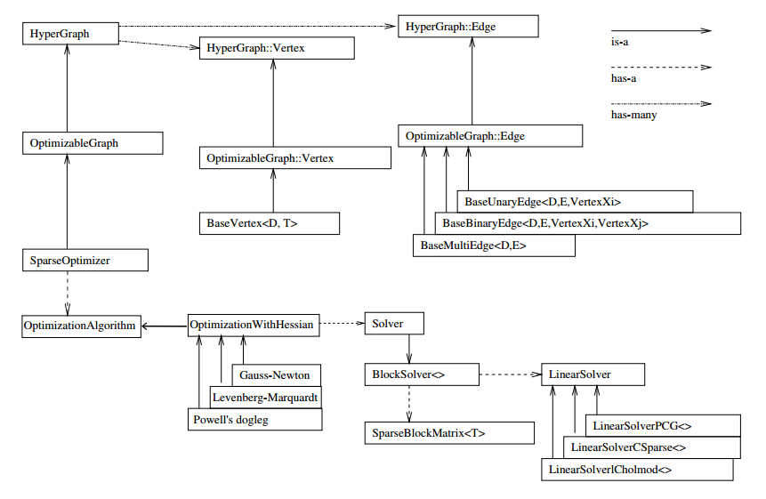

一个是 SparseBlockMatrix ，用于计算稀疏的雅可比和海塞； 一个是用于计算迭代过程中最关键的一步 :
$$
H\Delta{x} = b
$$
这就需要一个线性方程的求解器。而这个求解器，可以从 PCG, CSparse, Choldmod 三者选一。

综上所述，在g2o中选择优化方法一共需要6个步骤：

> 1. 选择一个线性方程求解器，从 PCG, CSparse, Choldmod中选，实际则来自 g2o/solvers 文件夹中定义的东东。
> 2. 创建BlockSolver。并用上面定义的线性求解器初始化。
> 3. 创建总求解器solver。并从GN, LM, DogLeg 中选一个，再用上述块求解器BlockSolver初始化。
> 4. 创建终极大boss 稀疏优化器（SparseOptimizer），并用已定义求解器作为求解方法。
> 5. 定义图的顶点和边。并添加到SparseOptimizer中。
> 6. 设置优化参数，开始执行优化。

## 1 (Hyper)Graph-Embeddable Optimization Problems

最小二乘优化问题描述如下：
$$
\begin{align}
	F(x) &= 
		\sum_{k\in {C}}
			\underbrace
			{
				\mathbf{e}_{k}(x_k, z_k)^{T}\Omega_{k}\mathbf{e}_{k}(x_k, z_k)
			}_{F_{k}}
	\\
	x^{\star} &= argmin{F(\mathbf{x})}

\end{align}
$$


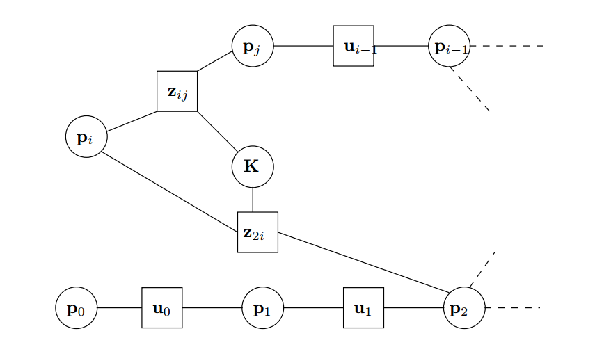


  其中：

* $\boldsymbol{X} = \{ x_1^{T}, x_2^{T}, \cdots,x_n^{T} \} $  是一个参数向量，其中每个 $x_i$代表一个通用参数块。
* $z_k$ 和 $Ω_k$ 分别表示与 xk 中的参数相关的约束的均值和信息矩阵。
* $e_k(x_k, z_k)$ 是一个向量误差函数，用于测量 $x_k$ 中的参数块满足约束 $z_k$ 的程度。


为简单起见，在本文的其余部分中，我们将在误差函数的索引中对测量进行编码：
$$
\boldsymbol{e}_k(x_k, z_k) = \boldsymbol{e}_k(\boldsymbol{x_k}) = \boldsymbol{e}_k(\boldsymbol{X})
$$


## 2 Least Squares Optimization

误差方程一阶泰勒展开：
$$
\begin{align}
	\breve{\mathbf{e}}(x_k + \Delta{x_k}) &= 
		\breve{\mathbf{e}}(x_k + \mathbf{\Delta{x}}) \\
		&\backsimeq \mathbf{e}_k + J_k\Delta{\mathbf{x}}
\end{align}
$$
where : $J_k$ Jacobian

so that, we obtatin :
$$
\begin{align}
F_k(\mathbf{x} + \Delta{\mathbf{x}})
	&= \breve{\mathbf{e}}(x_k + \Delta{x_k})^{T}\Omega_{k}\breve{\mathbf{e}}(x_k + \Delta{x_k}) \\
	
	&\backsimeq (\mathbf{e}_k + J_k\Delta{\mathbf{x}})^{T}\Omega_{k}(\mathbf{e}_k + J_k\Delta{\mathbf{x}})\\
	
	&= \underbrace{\mathbf{e}_k^{T}\Omega_{k}\mathbf{e}_k}_{c_k}+ 
	2\underbrace{\mathbf{e}_k^{T}\Omega_{k}J_k^{T}}_{\mathbf{b}_k} \Delta{\mathbf{x}} +
	\Delta{\mathbf{x}}^{T}\underbrace{J_k^{T} \Omega_{k}J_k}_{H_k}\Delta{\mathbf{x}} \\
		
   &= c_k + 2\mathbf{b}_k\Delta{\mathbf{x}} +
   		\Delta{\mathbf{x}}^{T}H_k\Delta{\mathbf{x}}

	
\end{align}
$$
It can be minimized in $\Delta{\mathbf{x}}$ by solving the linear system :
$$
H\Delta{\mathbf{x^{\star}}} = -\mathbf{b}
$$

线性方程的求解，可以通过稀疏代数库包括SBA、PCG、CSparse、Cholmod等，然后通过将计算的增量添加到初始猜测中来获得线性化解
$$
\boldsymbol{x}^{*} = \breve{\boldsymbol{x}} + \Delta\boldsymbol{x}^{*}
$$

- LinearSolverCholmod ：使用sparse cholesky分解法，继承自LinearSolverCCS。
- LinearSolverCSparse：使用CSparse法，继承自LinearSolverCCS。
- LinearSolverPCG ：使用preconditioned conjugate gradient 法，继承自LinearSolver。
- LinearSolverDense ：使用dense cholesky分解法，继承自LinearSolver。
- LinearSolverEigen：依赖项只有eigen，使用eigen中sparse Cholesky 求解，因此编译好后可以方便的在其他地方使用，性能和CSparse差不多，继承自LinearSolver。


## 3 Considerations about the Structure of the Linearized System


## 4 Least Squares on Manifold


## 5 Robust Least Squares

least squares optimization can be robustified, rror terms:
$$
F_k = \mathbf{e}_k^{T}\Omega_k\mathbf{e}_k = \rho_{2}
\left( 
	\sqrt{\mathbf{e}_k^{T}\Omega_k\mathbf{e}_k}
\right)
\quad with \quad 
\rho_{2}(x) := x^2
$$
Huber cost function $ρ_H$:
$$
\rho_{H}(x): =
\begin{cases}
	x^2 	\quad \quad \quad \quad\text {if |x| < b} \\
	2b|x| - b^2 \quad \text{else}
\end{cases}
$$
Then, $e_k$ is replaced by a weighted version :
$$
(w_k\mathbf{e}_k)^{T}\Omega_{k}w_k(\mathbf{e}_k) = \rho_{H}
\left(
	\sqrt{\mathbf{e}_k^{T}\Omega_k\mathbf{e}_k}
\right)
$$
Here, the weights wk are calculated as follows:
$$
w_k = \frac{\sqrt{\rho_{H}(||\mathbf{e}_k||_{\Omega})}}{||\mathbf{e}_k||_{\Omega}}

\quad with  \quad ||\mathbf{e}_k||_{\Omega}:= \sqrt{\mathbf{e}_k^{T}\Omega_k\mathbf{e}_k}
$$

## 6 Library Overview

### 6.1 Representation of an Optimization Problem

* BaseVertex
* BaseBinaryEdge
* BaseMultiEdge

### 6.2 Construction and Representation of the Linearized Problem

* Initialization
* Compute error
* Linearizing the system
* Building the system
* Updating Levenberg-Marquardt
* Solvers
  * PCG
  * G-N
  * L-M

## 7 g2o Tools

g2o 带有两个工具，可以处理存储在文件中的数据。 数据可以从文件中加载并在处理后再次存储。 下面我们将简要介绍这些工具，即命令行界面和图形用户界面。

###  7.1 g2o Command Line Interface

g2o 是 g2o 中包含的命令行界面。 它允许优化存储在文件中的图形并将结果保存回文件。 这允许优化问题的快速原型设计，因为它只需要实现新类型或求解器。 g2o 发行版包括一个数据文件夹，其中包含一些可以应用 g2o 的数据文件。

### 7.2 g2o Viewer

图 3 中描绘的图形用户界面允许可视化优化问题。 此外，可以控制算法的各种参数。

### 7.3 g2o incremental

g2o 包含一个实验二进制文件，用于以增量方式执行优化，即在插入一个或多个节点及其测量值后进行优化。 在这种情况下，g2o 对 Hessian 矩阵执行 ranke 更新以更新线性系统。 有关其他信息，请参阅 g2o_incremental 子文件夹中的自述文件。

Example for the Manhattan3500 dataset :

```shell
g2o_incremental -i manhattanOlson3500.g2o
```

### 7.4 Plug-in Architecture

工具都支持在运行时从动态库加载类型和优化算法。

## 8 2D SLAM: An Example


## 9 G2O Example

所有代码均为官方自带demo, 本文实现的demo的git地址 :

```shell
git clone https://gitee.com/quanduyong/slam_tutorial.git
```

### 9.0 使用步骤：

> 1. 创建一个线性求解器LinearSolver。
> 2. 创建BlockSolver，并用上面定义的线性求解器初始化。
> 3. 创建总求解器solver，并从GN/LM/DogLeg 中选一个作为迭代策略，再用上述块求解器BlockSolver初始化。
> 4. 创建图优化的核心：稀疏优化器（SparseOptimizer）。
> 5. 定义图的顶点和边，并添加到SparseOptimizer中。
> 6. 设置优化参数，开始执行优化。

<font color='green'>1 创建一个线性求解器LinearSolver </font>

这一步中我们可以选择不同的求解方式来求解线性方程 $Ax= b$ ，g2o中提供的求解方式主要有：

```bash
LinearSolverCholmod ：使用sparse cholesky分解法，继承自LinearSolverCCS。
LinearSolverCSparse ：使用CSparse法，继承自LinearSolverCCS。
LinearSolverPCG     ：使用preconditioned conjugate gradient 法，继承自LinearSolver。
LinearSolverDense   ：使用dense cholesky分解法，继承自LinearSolver。
LinearSolverEigen   ：依赖项只有eigen，使用eigen中sparse Cholesky 求解，因此编译好后可以方便的在其他地方使用，性能和CSparse差不多，继承自                             LinearSolver。
```

<font color='green'>2 创建BlockSolver，并用上面定义的线性求解器初始化 </font>

BlockSolver有两种定义方式：

```c++
// 固定变量的solver。
// p代表pose的维度（是流形manifold下的最小表示），
// l表示landmark的维度
// using BlockSolverPL = BlockSolver< BlockSolverTraits<p, l> >;
// 可变尺寸的solver。Pose和Landmark在程序开始时并不能确定，所有参数都在中间过程中被确定。
// using BlockSolverX = BlockSolverPL<Eigen::Dynamic, Eigen::Dynamic>;
```

此外g2o还预定义了以下几种常用类型：

```bash
BlockSolver_6_3 ：表示pose 是6维，观测点是3维，用于3D SLAM中的BA。
BlockSolver_7_3：在BlockSolver_6_3 的基础上多了一个scale。
BlockSolver_3_2：表示pose 是3维，观测点是2维。
```

<font color='green'> 3 创建总求解器solver，并从GN/LM/DogLeg 中选一个作为迭代策略，再用上述块求解器BlockSolver初始化 </font>

注意看程序中只使用了一行代码进行创建：右侧是初始化；左侧含有我们选择的迭代策略，在这一部分，我们有三迭代策略可以选择：

```c++
g2o::OptimizationAlgorithmGaussNewton
g2o::OptimizationAlgorithmLevenberg
g2o::OptimizationAlgorithmDogleg
```

<font color='green'>4 创建图优化的核心：稀疏优化器（SparseOptimizer） </font>

```c++
// 根据程序中的代码示例，创建稀疏优化器：
g2o::SparseOptimizer  optimizer;

// 设置求解方法：
SparseOptimizer::setAlgorithm(OptimizationAlgorithm* algorithm);

// 设置优化过程输出信息：
SparseOptimizer::setVerbose(bool verbose);
```

<font color='green'>5 定义图的顶点和边，并添加到SparseOptimizer中 </font>

<font color='green'>6 设置优化参数，开始执行优化 </font>

```c++
// 设置SparseOptimizer的初始化、迭代次数、保存结果等。
// 初始化：
SparseOptimizer::initializeOptimization(HyperGraph::EdgeSet& eset);

// 设置迭代次数：
SparseOptimizer::optimize(int iterations,bool online);
```


<font color='green'>Vertex </font>

```c++
// Dim 是int 类型，表示vertex的最小维度，例如3D空间中旋转是3维的，则 Dim = 3
// Type 是待估计vertex的数据类型，例如用四元数表达三维旋转，则 Type 就是Quaternion 类型
g2o::BaseVertex<Dim, Type>

virtual bool read(std::istream& /*is*/);
virtual bool write(std::ostream& /*os*/) const;

virtual void setToOriginImpl();
virtual void oplusImpl(const double* update);
```


<font color='green'>Edge </font>

图优化中的边：BaseUnaryEdge，BaseBinaryEdge，BaseMultiEdge 分别表示一元边，两元边，多元边。

```c++
// D 是 int 型，表示测量值的维度 （dimension）
// E 表示测量值的数据类型
// VertexXi，VertexXj 分别表示不同顶点的类型
BaseBinaryEdge<2, Vector2D, VertexSBAPointXYZ, VertexSE3Expmap>;

virtual void computeError();

// 存储观测值_error;  
// 存储computeError() 函数计算的误差_vertices[]; 
// 存储顶点信息，比如二元边，_vertices[]大小为2
// 存储顺序和调用setVertex(int, vertex) 和设定的int有关（0或1）setId(int);  
// 定义边的编号（决定了在H矩阵中的位置）setMeasurement(type);  
// 定义观测值setVertex(int, vertex);  
// 定义顶点setInformation();  
// 定义协方差矩阵的逆
_measurement;
```


### 9.1 circle_fit

* Linear least squares solution :

circle function:
$$
(x - a)^2 + (y - b)^2 = r^2
$$
Let$ (a, b)$ be the center of the circle and $r $the radius of the circle :
$$
\begin{bmatrix}
-2x &
-2y &
1
\end{bmatrix}

\begin{bmatrix}
a \\
b \\ c
\end{bmatrix}
=
-x^2 - y^2
$$
where : $c = a^2 + b^2 - r^2$

rewrite circle function ：
$$
\underbrace
{
	 \begin{bmatrix}
    -2x &
    -2y &
    1
    \end{bmatrix}
}_\mathbf{A} 
  
\underbrace
{
    \begin{bmatrix}
    a \\
    b \\ c
    \end{bmatrix}
}_\mathbf{x}
=
\underbrace
{
	-x^2 - y^2
}_\mathbf{b}
$$


compute the normal equation to obtain a solution for (a b c)

* Iterative least squares solution

```c++
Eigen::MatrixXd A(numPoints, 3);
Eigen::VectorXd b(numPoints);
for (int i = 0; i < numPoints; ++i) 
{
    A(i, 0) = -2*points[i].x();
    A(i, 1) = -2*points[i].y();
    A(i, 2) = 1;
    b(i) = -pow(points[i].x(), 2) - pow(points[i].y(), 2);
}
Eigen::Vector3d solution = (A.transpose()*A).ldlt().solve(A.transpose() * b);
```

circle极坐标的方程表示:
$$
\begin{cases}
	x = x_0 + r\cos{\theta} \\
	y = y_0 + r\sin{\theta}
\end{cases}
$$
where :  $r$ 半径; $(x_0, y_0)$圆心

均匀分布：

```c++
/**
 * sample a number from a uniform distribution
 */
static number_t uniformRand(number_t lowerBndr, number_t upperBndr)
{
	return lowerBndr + ((number_t) std::rand() / (RAND_MAX + 1.0)) * (upperBndr - lowerBndr);
}
```

高斯分布：

```c++
/**
 * Gaussian random with a mean and standard deviation. Uses the
 * Polar method of Marsaglia.
 */
static number_t gaussRand(number_t mean, number_t sigma)
{
    number_t x, y, r2;
    do {
        x = -1.0 + 2.0 * uniformRand(0.0, 1.0);
        y = -1.0 + 2.0 * uniformRand(0.0, 1.0);
        r2 = x * x + y * y;
    } while (r2 > 1.0 || r2 == 0.0);
    return mean + sigma * y * std::sqrt(-2.0 * log(r2) / r2);
}
```

---

Vertex类型VertexCircle:

```c++
/**
 * A circle located at x,y with radius r
 */
class VertexCircle : public ::g2o::BaseVertex<3, Eigen::Vector3d>
{
public:
    EIGEN_MAKE_ALIGNED_OPERATOR_NEW;
    VertexCircle(){}

    virtual bool read(std::istream& /*is*/);
    virtual bool write(std::ostream& /*os*/) const;

    virtual void setToOriginImpl();
    virtual void oplusImpl(const double* update);
};
```

```c++
bool VertexCircle::read(std::istream& /*is*/)
{
    std::cerr << __PRETTY_FUNCTION__ << " not implemented yet" << std::endl;
    return false;
}

bool VertexCircle::write(std::ostream& /*os*/) const
{
    std::cerr << __PRETTY_FUNCTION__ << " not implemented yet" << std::endl;
    return false;
}

void VertexCircle::setToOriginImpl()
{
    std::cerr << __PRETTY_FUNCTION__ << " not implemented yet" << std::endl;
}

void VertexCircle::oplusImpl(const double* update)
{
    Eigen::Vector3d::ConstMapType v(update);
    _estimate += v;
}
```

---

Edge类型EdgePointOnCircle：

```c++
bool EdgePointOnCircle::read(std::istream& /*is*/)
{
    std::cerr << __PRETTY_FUNCTION__ << " not implemented yet" << std::endl;
    return false;
}

bool EdgePointOnCircle::write(std::ostream& /*os*/) const
{
    std::cerr << __PRETTY_FUNCTION__ << " not implemented yet" << std::endl;
    return false;
}

void EdgePointOnCircle::computeError()
{
    const VertexCircle* circle = static_cast<const VertexCircle*>(vertex(0));

    const Eigen::Vector2d& center = circle->estimate().head<2>();
    const double& radius = circle->estimate()(2);

    _error(0) = (measurement() - center).norm() - radius;
}
```

设置真值 : $r = 2$ , center $(4, 2)$

误差项：
$$
r = (x - a)^2 + (y - b)^2-  r^2
$$

```c++
_error(0) = (measurement() - center).norm() - radius; 
```

加入高斯噪声数据求得： $r = 2.00662$ , center $(4.01514 1.99241)$

---


### 9.2 curve_fit

曲线方程：
$$
y = \exp(ax^2 + bx + c) + w
$$
where :

* $a, b, c$为曲线参数
* $w$为高斯噪声

Vertex类型:

```c++
// 曲线模型的顶点，模板参数：优化变量维度和数据类型
class CurveFittingVertex : public ::g2o::BaseVertex<3, Eigen::Vector3d>
{
public:
    EIGEN_MAKE_ALIGNED_OPERATOR_NEW

    // 重置
    virtual void setToOriginImpl() override {
        _estimate << 0, 0, 0;
    }

    // 更新
    virtual void oplusImpl(const double *update) override {
        _estimate += Eigen::Vector3d(update);
    }

    // 存盘和读盘：留空
    virtual bool read(std::istream &in) {}
    virtual bool write(std::ostream &out) const {}
};
```

Edge类型：

```c++
// 误差模型 模板参数：观测值维度，类型，连接顶点类型
class CurveFittingEdge : public ::g2o::BaseUnaryEdge<1, double, CurveFittingVertex>
{
public:
    EIGEN_MAKE_ALIGNED_OPERATOR_NEW
    CurveFittingEdge(double x) : BaseUnaryEdge(), _x(x) {}

    // 计算曲线模型误差
    virtual void computeError() override
    {
        const CurveFittingVertex *v = static_cast<const CurveFittingVertex *> (_vertices[0]);
        const Eigen::Vector3d abc = v->estimate();
        _error(0, 0) = _measurement - std::exp(abc(0, 0) * _x * _x + abc(1, 0) * _x + abc(2, 0));
    }

    // 计算雅可比矩阵
    virtual void linearizeOplus() override
    {
        const CurveFittingVertex *v = static_cast<const CurveFittingVertex *> (_vertices[0]);
        const Eigen::Vector3d abc = v->estimate();
        double y = exp(abc[0] * _x * _x + abc[1] * _x + abc[2]);
        _jacobianOplusXi[0] = -_x * _x * y;
        _jacobianOplusXi[1] = -_x * y;
        _jacobianOplusXi[2] = -y;
    }

    virtual bool read(std::istream &in) {}
    virtual bool write(std::ostream &out) const {}
public:
    double _x;  // x 值， y 值为 _measurement
};
```

### 9.3 sphere


### 9.4 simple_optimize


### 9.5 ba

*BA的主要思想是***最小化重投影误差**，以其作为目标函数来优化位姿、地图点、相机参数等

#### 1 计算投影点

##### 针孔相机模型

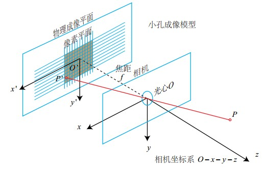

相似三角形

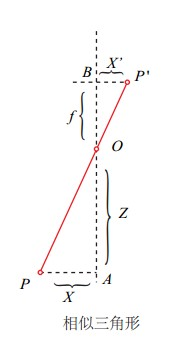

那么根据三角形相似的关系有：
$$
\frac{Z}{f} = - \frac{X}{X’} = - \frac{Y}{Y’}
$$
其中负号是因为成的像是**倒**的，所以坐标系数会相反，不过一般为了简化模型，我们统一将成像平面对称到相机的前方，使得成像平面与三维空间点一起放在摄像机坐标系的同一侧，这叫做**虚像**。这样，我们可以去掉上式中的负号，如下：
$$
\frac{Z}{f} = \frac{X}{X’} = \frac{Y}{Y’}
$$

##### 相机几何坐标转换

如上的针孔模型，一个空间点在投影到2d的像素平面上时会经历如下三步：

* 空间点从世界坐标系转换到相机坐标系:

$$
P_c=R(P_w - C)
$$

* 由空间点的相机坐标系的坐标得到成像平面上投影点的坐标:

$$
x = f\frac{X}{Z} \\

y = f\frac{Y}{Z}
$$

* 最后由成像平面投影点的坐标得到像素平面上的像素坐标 :

$$
u = \alpha x + c_x \\

v = \beta y + c_y
$$

其中$α$代表的含义可以理解为横轴分辨率(1m有多少像素)，$β$类似，接下来将上面两个式子合并，得到直接**从相机坐标系坐标到像素坐标**的变换如下：
$$
u = f_x\frac{X}{Z} + c_x \\
v = f_y\frac{Y}{Z} + c_y
$$
下面是使用矩阵表示，左边使用齐次坐标:
$$
\begin{bmatrix}
u \\ 
v \\ 
1
\end{bmatrix} 
=
\frac{1}{Z}
\begin{bmatrix}
f_x & 0     & c_x   \\
0   & f_y   & c_y   \\ 
0   & 0     & 1 
\end{bmatrix}
\begin{bmatrix}
X \\ 
Y \\ 
Z
\end{bmatrix} 
=
\frac{1}{Z} KP_c
$$

##### 透镜畸变

*需要说明的是，下面的畸变模型都是基于***针孔模型**(一般的相机)得到的结果。而如果遇到一些特殊的相机，比如说鱼眼相机，它的投影模型会与针孔模型有些不同，它是投影在球面而不是平面上的。这样下面的畸变模型就不管用了。因此对于不同的相机，我们要使用不同的投影模型来建立畸变模型。

现代相机为了获得更好的成像效果，相机里一般都加入了透镜。而透镜的加入对成像过程中光线的传播会产生新的影响，进而出现畸变，一般有两种主要的畸变（其实也还有其他的种类的畸变，但是不如这两种明显）：

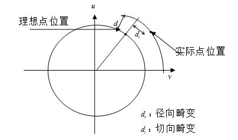

##### 径向畸变

- 径向畸变：透镜自身的形状对光线传播会有影响；

  - 桶形畸变：图像放大率随着与光轴之间的距离增加而减小
  - 枕形畸变：图像放大率随着与光轴之间的距离增大而增大

  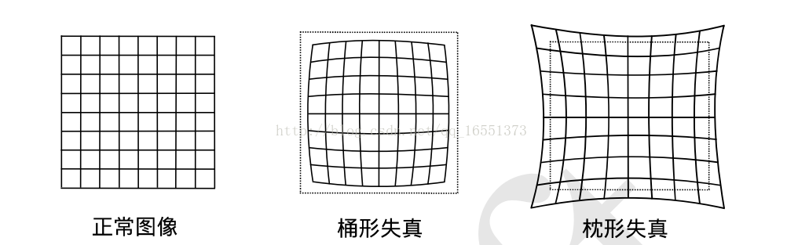

* 一般径向畸变对于二维平面上一个坐标(x,y)（如上图畸变最小的点为坐标原点，一般在图像中心，r是点到原点的距离）的影响可以使用如下公式表述：
  $$
  \begin{aligned}
      x_{distorted} &= x( 1 + k_1 r^2 + k_2 r^4 + k_3 r^6)　 \\ 
      y_{distorted} &= y( 1 + k_1 r^2 + k_2 r^4 + k_3 r^6)
  \end{aligned}
  $$
  *无论是桶形畸变还是枕形畸变，由于他们都是随着与中心之间的距离增加而增加，因此可以使用一个***多项式函数**来描述畸变前后的像素坐标变化。这个公式中，对于畸变较小的图像中心区域，畸变主要是*k1k1*在起作用；而对于畸变较大的边缘区域，主要是*k2k2*在起作用。一般的普通摄像头用这两个系数就已经可以很好地纠正径向畸变了。但是对于一部分畸变很大的摄像头，比如说鱼眼镜头等，还需要加入*k3k3*畸变项才能比较好的表述畸变情况。

##### 切向畸变


* **切向畸变**：在机械组装过程中，透镜和成像平面不可能完全平行，这也会使得光线穿过透镜投影到成像面时的位置出现变化

* 一般切向畸变对于二维平面上的坐标(x,y)的影响可以使用如下公式进行表述
  $$
  x_{distorted} = x + [ 2p_1xy + p_2(r^2+2x^2)] \\
  y_{distorted} = y + [ p_1(r^2+ 2y^2)+ 2p_2xy]
  $$


我们可以知道将一个空间中地图点投影到像素平面上流程如下：

* 首先，世界坐标系下有一个固定的点P，界坐标是 $ P_w $

* 获得点P的**相机坐标系坐标**，可以利用相机外参R与t得到 $P_c=RP_w+t$

* 在2中获得的 $P_c$ 仍然是三维的$ (X,Y,Z) $，将其投影到归一化平面 $Z=1$上，得到**归一化相机坐标**：$P_C=[X/Z,Y/Z,1]^T$

* 此处加入**畸变**因素，畸变公式如下(其中，$x=X/Z,y=Y/Z$)：
  $$
  \begin{aligned}
      x_{distorted} &= x( 1 + k_{1} r^2 + k_{2} r^4 + k_{3} r^6) + [ 2p_{1}xy + p_{2}(r^2+2x^2) \\ 
  	y_{distorted} &= y( 1 + k_{1} r^2 + k_{2} r^4 + k_{3} r^6) + [ p_{1}(r^2+ 2y^2)+ 2p_{2}xy]
  \end{aligned}
  $$

* 最后一步，利用内参K，将归一化相机坐标转换成**像素坐标**： $P_{uv}=KP_{distorted}$

#### 2 BA的目标函数

在BA中，待优化的变量有相机的位姿$\boldsymbol{x}$，即外参$R,t$，它对应的李代数为$\xi$；地图点$\boldsymbol{y}$的三维坐标$\boldsymbol{p}$。而观测数据是像素坐标$z≜[u,v]^T$。 所以每次观测方程的误差是$\boldsymbol{y}$ :
$$
\boldsymbol{e}=\boldsymbol{z}-h(\xi, \boldsymbol{p})
$$

#### 3 BA的求解

由上面我们知道我们需要求解的是一个非线性优化问题，很自然的我们想到高斯牛顿等方法。使用这些方法，我们首先将所有待优化的变量组织成一个向量$\boldsymbol{x}$，这个向量便是目标函数的自变量：
$$
\boldsymbol{x}=\left[\boldsymbol{\xi}_{1}, \ldots, \boldsymbol{\xi}_{m}, \boldsymbol{p}_{1}, \ldots, \boldsymbol{p}_{n}\right]^{T}
$$


我们每次迭代时都需要寻找一个$Δx$，它是自变量的迭代增量。利用高斯牛顿的原理，我们为自变量添加一个增量时，目标函数变为：
$$
\frac{1}{2}|f(\boldsymbol{x}+\Delta \boldsymbol{x})|^{2} 
	\approx 
	\frac{1}{2} \sum_{i=1}^{m} \sum_{j=1}^{n}\left|\boldsymbol{e}_{ij}+
	\boldsymbol{F}_{i j} \Delta \boldsymbol{\xi}{i}+
	\boldsymbol{E}_{i j} \Delta \boldsymbol{p}_{j}\right|^{2}
$$
其中$F_{ij}$表示j地图点投影到i时刻相机像素平面投影残差对i时刻相机姿态的偏导数，而$E_{i,j}$表示$j$地图点投影到$i$时刻相机像素平面上的投影残差对$j$地图点的三维世界坐标的偏导数。

我们将相机位姿变量放在一起：
$$
\boldsymbol{x}_{p}=\left[\boldsymbol{p}_{1}, \boldsymbol{p}_{2}, \ldots, \boldsymbol{p}_{n}\right]^{T} \in \mathbb{R}^{3 n}
$$
然后使用大矩阵表示矩阵简化上面公式
$$
\frac{1}{2}|f(\boldsymbol{x}+\Delta \boldsymbol{x})|^{2}=\frac{1}{2}\left|\boldsymbol{e}+\boldsymbol{F} \Delta \boldsymbol{x}{c}+\boldsymbol{E} \Delta \boldsymbol{x}{p}\right|^{2}
$$


此处我们将原本由很多小型二次项之和的形式变成了一个更整体的样子。此处EE与FF是整体目标函数对整体变量的导数，他们是比较大的偏导数矩阵，其中有很多项是0。


#### 4 使用高斯牛顿进行求解

上面已经将投影误差进行了泰勒一阶展开，此时不论是使用高斯牛顿还是LM方法对其进行优化，都需要求解一个方程
$$
\boldsymbol{H} \Delta \boldsymbol{x}=\boldsymbol{g}
$$
如果使用GN法，则$H$取$J^TJ$；如果使用LM法，则$H$取$J^TJ+λI$。不管哪种方法，其中$J$都是
$$
J =
\begin{bmatrix}
	F & E
\end{bmatrix}
$$
如果是高斯牛顿，则$H$矩阵为
$$
\boldsymbol{H} = \boldsymbol{J}^{T} \boldsymbol{J} = 
\begin{bmatrix}
	F^TF & F^TE  \\
	E^TF & E^TE
\end{bmatrix}
$$

#### 5 $H$矩阵的稀疏性与边缘化

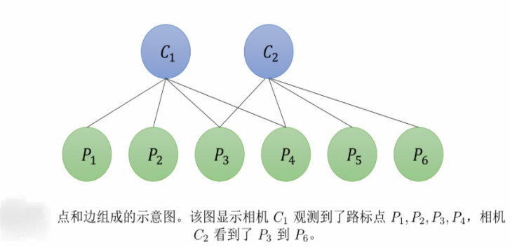

对于上述图模型，我们构建目标函数，并求解其$J$与$H$矩阵，会得到如下形式的结果。

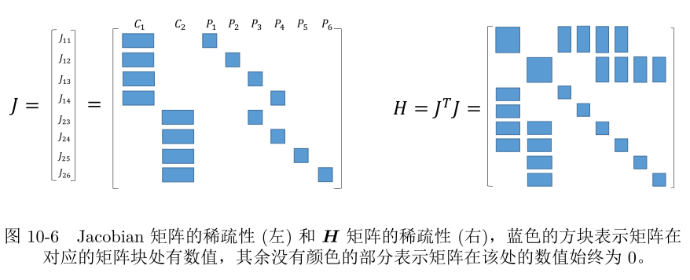

**对于一条边（一个误差项），只对其关联的节点的偏导数不为0。**图中$H$矩阵的行列维度都是节点的个数，前两行（与前两列）是相机姿态节点的关联关系，后六行（与后六列）是地图点坐标节点的关联关系。图中JJ矩阵的行数是图中边的个数，列数是图中节点的个数，每一行是对每一个误差项（边）求的偏导数向量，每一列可以理解为对应的节点都关联到了哪条边上。


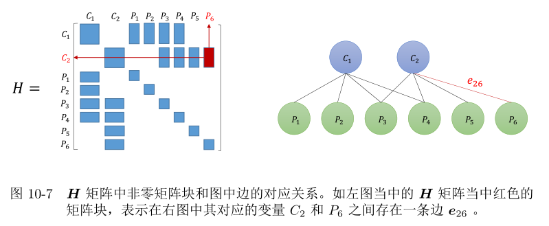

上图中的H矩阵除了对角线上的元素外与图的**邻接矩阵**具有完全一致的结构。由上，我们可以讲H矩阵划分成如下四个部分组成。

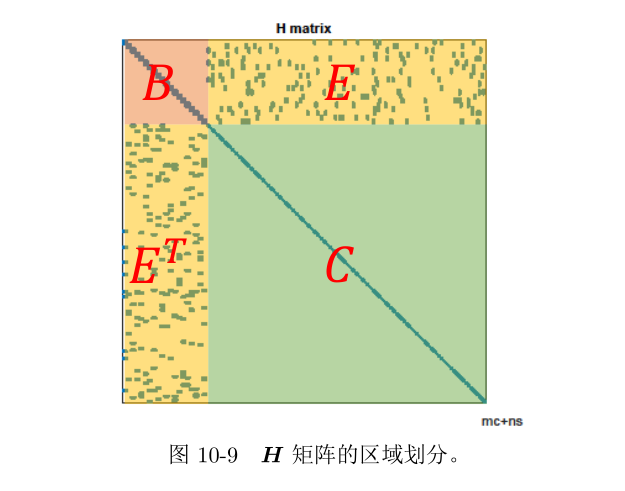

> *注意，这个矩阵的独特性质是，***左上角的矩阵B与右下角的矩阵C是两个对角矩阵，E矩阵如何由图的性质决定。**这种稀疏性是由这种图模型的连接属性决定的，这种图模型有一个特点，**那就是每个相机位姿节点只与地图点节点关联，与其他相机节点不关联（因为没考虑运动方程）这使得B是对角矩阵，而地图点节点只与相机节点关联，与其他地图点不关联，这使得C是对角矩阵。**


这样，对应的增量方程$HΔx=g$也就变为
$$
\begin{bmatrix}
	B   & E  \\
	E^T & C
\end{bmatrix}
\begin{bmatrix}
	\Delta \boldsymbol{x}_{c} \\
	\Delta \boldsymbol{x}_{p}
\end{bmatrix}
=
\begin{bmatrix}
	\boldsymbol{v} \\
	\boldsymbol{w}
\end{bmatrix}
$$
我们可以**利用$H$的稀疏性来加速求解这个方程**。有很多方法，在slam中最常用的是：SchurSchur消元，也叫作MarginalizationMarginalization（边缘化）


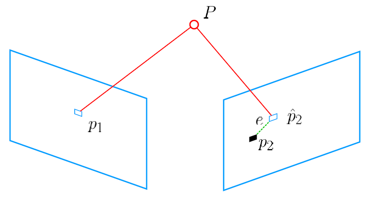

* BA本质是把PnP问题当成李代数上的非线性最小二乘问题
* 线性问题的方式：先求相机位姿，再求空间点位置

**问题**：给定 $n$个三维空间点$P$和投影$p$ ，希望计算相机的位姿$R$和 $t$ ,对应的李代数为 $ξ$. 假设： $Pi=[X_i,Y_i,Z_i]^T $, 则像素位置与空间位置的关系为：
$$
s
\begin{bmatrix}
	u_i \\
	v_i
\end{bmatrix} =
K exp(\xi^{\land})
\begin{bmatrix}
	X_i  \\
	Y_i  \\
	Z_i  \\
	1
\end{bmatrix}
$$
写在矩阵形式为：
$$
s\boldsymbol{u}_i = K exp(\xi^{\land})P_i
$$
上式中隐含有一个 `齐次坐标到非齐次坐标的转换`。把误差求和，构建最小二乘问题，寻找最好的相机位姿：
$$
\xi^{*} = argmin \frac{1}{2} \sum_{i = 1}^{n} | \boldsymbol{u}_i - \frac{1}{s_i} K exp(\xi^{\land})P_i|^{2}
$$
上式为重投影误差.
应用G-N或L-M等方法之前，要知道误差项关于变量的导数，即：
$$
\boldsymbol{e}( \boldsymbol{x} + \Delta{\boldsymbol{x}}) 
 \approx 
 \boldsymbol{e}( \boldsymbol{x}) + J\Delta{\boldsymbol{x}}
$$
其中：

* $\boldsymbol{e}$ 的意义为像素坐标误差，为2维
* $\boldsymbol{x}$ 为相机位姿，6维变量
* $\boldsymbol{J}$ 为 $2 \times 6 $ 的矩阵，需要进一步推导


$$
\frac{\partial{\boldsymbol{e}}}{\partial{\delta{\xi}}} =
	\lim_{\delta{\xi} \to 0} \frac{\boldsymbol{e}(\delta{\xi} \oplus \xi)}{\delta{\xi}}
	= \frac{\partial{\boldsymbol{e}}}{\partial{P^{\prime}}} \frac{P^{\prime}}{\partial{\delta{\xi}}}
$$


先求$\frac{\partial{\boldsymbol{e}}}{\partial{P^{\prime}}}$
$$
=

\begin{aligned}
	-
	\begin{bmatrix}
		\frac{\partial{u}}{\partial{X^{\prime}}} & \frac{\partial{u}}{\partial{Y^{\prime}}} & \frac{\partial{u}}		                 		{\partial{Z^{\prime}}} \\
		\frac{\partial{v}}{\partial{X^{\prime}}} & \frac{\partial{v}}{\partial{Y^{\prime}}} & \frac{\partial{v}}				                {\partial{Z^{\prime}}}
	\end{bmatrix}
\end{aligned}
= 
-
\begin{bmatrix}
	\frac{f_x}{Z^{\prime}} & 0 & -\frac{f_xX^{\prime}}{Z^{\prime 2}} \\
	0 & \frac{f_y}{Z^{\prime}} & -\frac{f_yY^{\prime}}{Z^{\prime 2}} 
\end{bmatrix}
$$
再求$\frac{P^{\prime}}{\partial{\delta{\xi}}}$
$$
P^{\prime} = TP = RP_c + t 
$$
那么
$$
\frac{P^{\prime}}{\partial{\delta{\xi}}} =
\frac{TP}{\partial{\delta{\xi}}} = 
(TP)^{\odot} =

\begin{bmatrix}
	I & -P^{\prime {\land}} \\
	\boldsymbol{0}^{T} & \boldsymbol{0}^{T}
\end{bmatrix}
$$
将这两项相乘后雅可比矩阵为
$$
\frac{\partial{\boldsymbol{e}}}{\partial{P^{\prime}}} \frac{P^{\prime}}{\partial{\delta{\xi}}} = -
\begin{bmatrix}
	\frac{f_x}{Z^{\prime}} & 0 & -\frac{f_xX^{\prime}}{Z^{\prime 2}} \\
	0 & \frac{f_y}{Z^{\prime}} & -\frac{f_yY^{\prime}}{Z^{\prime 2}} 
\end{bmatrix}
\begin{bmatrix}
	I & -P^{\prime {\land}}
\end{bmatrix}
=
\begin{bmatrix}
	\frac{f_x}{Z^{\prime}} & 0 & -\frac{f_xX^{\prime}}{Z^{\prime 2}} & -\frac{f_xX^{\prime}Y^{\prime}}{Z^{\prime 2}} & f_x + \frac{f_xX^{\prime 2}}{Z^{\prime 2}} & -\frac{f_x Y^{\prime}}{Z^{\prime}} \\
	
		0 & \frac{f_y}{Z^{\prime}}  & -\frac{f_yY^{\prime}}{Z^{\prime 2}} & -f_y - \frac{f_yY^{\prime 2}}{Z^{\prime 2}}  & \frac{f_yX^{\prime}Y^{\prime}}{Z^{\prime 2}} & \frac{f_y X^{\prime}}{Z^{\prime}} 
\end{bmatrix}
$$

```c++
void SimpleBA::RunDemo(const std::string& image1, const std::string& image2)
{
    // 读取图像
    cv::Mat img1 = cv::imread(image1);
    cv::Mat img2 = cv::imread(image2);

    // 找到对应点
    std::vector<cv::Point2f> pts1, pts2;
    if (FindCorrespondingPoints( img1, img2, pts1, pts2 ) == false)
    {
        std::cout << "匹配点不够！" << std::endl;
        return;
    }

    std::cout << "找到了" << pts1.size() << "组对应特征点。"<< std::endl;


    // 构造g2o中的图
    // 先构造求解器
    ::g2o::SparseOptimizer optimizer;

    // 使用Cholmod中的线性方程求解器
    auto linearSolver = ::g2o::make_unique<::g2o::LinearSolverCholmod<::g2o::BlockSolver_6_3::PoseMatrixType>>();

    // 6*3 的参数
    // L-M 下降
    ::g2o::OptimizationAlgorithmLevenberg* algorithm = new ::g2o::OptimizationAlgorithmLevenberg(
        ::g2o::make_unique<::g2o::BlockSolver_6_3>(std::move(linearSolver)));

    optimizer.setAlgorithm(algorithm);
    optimizer.setVerbose(false );

    // 添加节点
    // 两个位姿节点
    for (int i = 0; i < 2; i++)
    {
        ::g2o::VertexSE3Expmap* v = new ::g2o::VertexSE3Expmap();
        v->setId(i);
        if (i == 0) {
            // 第一个点固定为零
            v->setFixed(true); 
        }
            
        // 预设值为单位Pose，因为我们不知道任何信息
        v->setEstimate(::g2o::SE3Quat());
        optimizer.addVertex(v);
    }

    // 很多个特征点的节点
    // 以第一帧为准
    for (size_t i = 0; i < pts1.size(); i++)
    {
        ::g2o::VertexSBAPointXYZ* v = new ::g2o::VertexSBAPointXYZ();
        v->setId(2 + i);

        // 由于深度不知道，只能把深度设置为1了
        double z = 1;
        double x = (pts1[i].x - cx) * z / fx;
        double y = (pts1[i].y - cy) * z / fy;
        v->setMarginalized(true);
        v->setEstimate(Eigen::Vector3d(x,y,z));
        optimizer.addVertex(v);
    }


    // 准备相机参数
    ::g2o::CameraParameters* camera = new ::g2o::CameraParameters(fx, Eigen::Vector2d(cx, cy), 0);
    camera->setId(0);
    optimizer.addParameter( camera );

    // 准备边
    // 第一帧
    std::vector<::g2o::EdgeProjectXYZ2UV*> edges;
    for ( size_t i = 0; i < pts1.size(); i++ )
    {
        ::g2o::EdgeProjectXYZ2UV* edge = new ::g2o::EdgeProjectXYZ2UV();
        edge->setVertex(0, dynamic_cast<::g2o::VertexSBAPointXYZ*>(optimizer.vertex(i+2)));
        edge->setVertex(1, dynamic_cast<::g2o::VertexSE3Expmap*>(optimizer.vertex(0)));
        edge->setMeasurement(Eigen::Vector2d(pts1[i].x, pts1[i].y));
        edge->setInformation(Eigen::Matrix2d::Identity());
        edge->setParameterId(0, 0);

        // 核函数
        edge->setRobustKernel(new ::g2o::RobustKernelHuber());
        optimizer.addEdge(edge);
        edges.push_back(edge);
    }

    // 第二帧
    for ( size_t i = 0; i < pts2.size(); i++)
    {
        ::g2o::EdgeProjectXYZ2UV* edge = new ::g2o::EdgeProjectXYZ2UV();
        edge->setVertex(0, dynamic_cast<::g2o::VertexSBAPointXYZ*>(optimizer.vertex(i+2)));
        edge->setVertex(1, dynamic_cast<::g2o::VertexSE3Expmap*>(optimizer.vertex(1)));
        edge->setMeasurement(Eigen::Vector2d(pts2[i].x, pts2[i].y));
        edge->setInformation(Eigen::Matrix2d::Identity());
        edge->setParameterId(0,0);

        // 核函数
        edge->setRobustKernel(new ::g2o::RobustKernelHuber());
        optimizer.addEdge(edge);
        edges.push_back(edge);
    }

    std::cout<< "开始优化 "<< std::endl;
    optimizer.setVerbose(true);
    optimizer.initializeOptimization();
    optimizer.optimize(10);
    std::cout<< "优化完毕" << std::endl;

    //我们比较关心两帧之间的变换矩阵
    ::g2o::VertexSE3Expmap* v = dynamic_cast<::g2o::VertexSE3Expmap*>(optimizer.vertex(1));
    Eigen::Isometry3d pose = v->estimate();
    std::cout << "Pose = " << std::endl 
              << pose.matrix() 
              << std::endl;

    // 以及所有特征点的位置
    for (size_t i = 0; i < pts1.size(); i++)
    {
        ::g2o::VertexSBAPointXYZ* v = dynamic_cast<::g2o::VertexSBAPointXYZ*>(optimizer.vertex(i+2));
        std::cout << "vertex id " << i + 2 << ", pos = ";
        Eigen::Vector3d pos = v->estimate();
        std::cout << pos(0) << "," << pos(1) << "," << pos(2) << std::endl;
    }

    // 估计inlier的个数
    int inliers = 0;
    for ( auto e : edges ) {
        e->computeError();
        // chi2 就是 error*\Omega*error, 如果这个数很大，说明此边的值与其他边很不相符
        if ( e->chi2() > 1 ) {
            std::cout<<"error = " << e->chi2() << std::endl;
        }
        else {
            inliers++;
        }
    }

    std::cout << "inliers in total points: "<< inliers << "/" << pts1.size() + pts2.size() << std::endl;
    optimizer.save("ba.g2o");
}
```

### 9.6 bal


### 9.7 ba_anchored_inverse_depth


### 9.8 data_convert


### 9.9 icp


### 9.10 slam2d


### 9.11 tutorial_slam2d


### 9.12 line_slam


### 9.13 plane_slam


### 9.14 interactive_slam


### 9.15 calibration_odom_laser


## 10 参考

1 [[深入理解图优化与g2o：g2o篇](https://www.cnblogs.com/gaoxiang12/p/5304272.html)](https://www.cnblogs.com/gaoxiang12/p/5304272.html)

2 [g2o: A general Framework for (Hyper) Graph Optimization](https://github.com/RainerKuemmerle/g2o/blob/master/doc/g2o.pdf)

