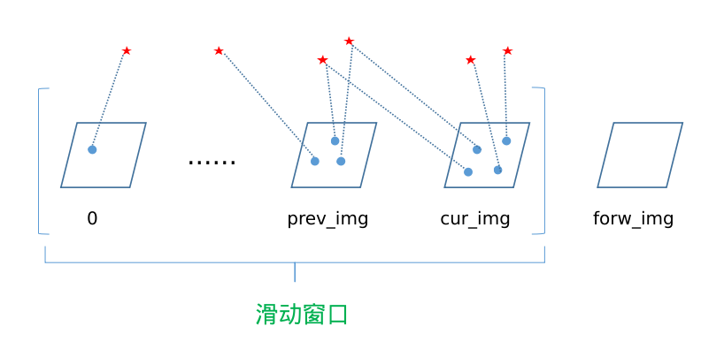
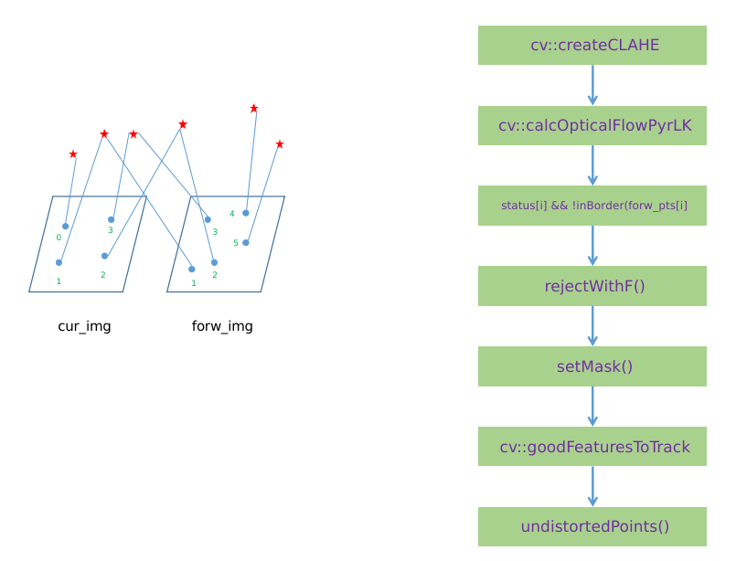

<center> <font color='green' size='15'> VINS-Mono </font> </center>

## 1 VINS-MONO 框架


## 2 Feature Tracker

### 2.1 数据输入和输出


输入 cam0

>topic: /cam0/image_raw

输出:

* feature_img
* feature
* restart

> feature_img: 
>
> feature: 
>
> restart:


### 2.2 前端逻辑（Front）


### 2.3 关键帧提取feature point



note:

* prev_img: 上上一帧
* cur_img: 上一帧
* forw_ing: 当前帧

```c++
prev_img: 上上一帧void FeatureTracker::readImage(const cv::Mat &_img, double _cur_time)
{
    // 判断forw_img是否为空，第一帧判断
    if (forw_img.empty())
    {
        // prev_img: 上上一帧
        // cur_img: 上一帧
        // forw_ing: 当前帧
        prev_img = cur_img = forw_img = img;
    }
    else
    {
        // 不是第一帧，则接收新的图像
        forw_img = img;
    }
    forw_pts.clear();
    
    ....
}
```


### 2.4 光流跟踪



### 2.5 特征点管理


## 3 IMU Pre-integration


## 4


## 5

