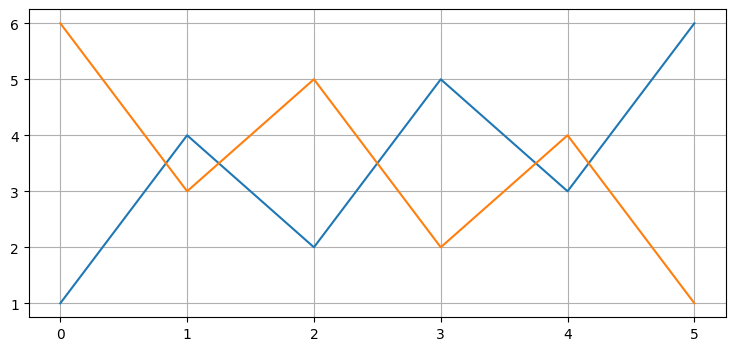

.. highlight:: python

.. default-domain:: cpp

============
Ch00 Preface
============

ubuntu18 安装conda
------------------

.. NOTE::

    conda下载网址,两种版本
    https://repo.anaconda.com/archive/
    或者
    https://repo.anaconda.com/miniconda/

    选择适合自己的版本，用wget命令下载。
    wget -c https://repo.anaconda.com/miniconda/Miniconda3-latest-Linux-x86_64.sh

.. code-block:: bash

    安装命令：
    chmod 777 Miniconda3-latest-Linux-x86_64.sh #给执行权限
    bash Miniconda3-latest-Linux-x86_64.sh #运行

Jupyter
-------

.. NOTE::

    首先，关于在本书中使用 Jupyter Notebooks 的一些话。 这本书是互动的。 
    如果您想运行代码示例，特别是如果您想查看动画图，则需要运行代码单元。 
    我不能教你关于 Jupyter Notebooks 的一切。 然而，有几件事让读者大吃一惊。
    您可以访问 http://jupyter.org/ 获取详细文档。

SciPy
-----

.. NOTE::

    SciPy 是一个开源的数学软件集合。 SciPy 中包含 NumPy，它提供数组对象、线性代数、随机数等。
    Matplotlib 提供 NumPy 数组的绘图。 SciPy 的模块复制了 NumPy 中的一些功能，同时添加了优化、
    图像处理等功能。

NumPy
-----

.. NOTE::

    numpy.array 实现一维或多维数组。 它的类型是 numpy.ndarray，我们将其简称为 ndarray。
    您可以使用任何类似列表的对象来构造它。 下面从一个列表构造一个一维数组：

.. code-block:: python

    import numpy as np
    x = np.array([1, 2, 3])
    print(type(x))
    x
    <class 'numpy.ndarray'> 

 

使用元组：

.. code-block:: python

    x = np.array((4,5,6))

使用嵌套括号创建多维数组：

.. code-block:: python

    x = np.array([[1, 2, 3],
              [4, 5, 6]])

下标位置访问数组元素：

.. code-block:: python

    x = np.array([[1, 2, 3],
              [4, 5, 6]])

    print(x[1,2])

使用切片访问列或行。 用作下标的冒号 (:) 是该行或列中所有数据的简写。 
所以 x[:,0] 返回第一列中所有数据的数组（0 指定第一列）：

.. code-block:: python

    x[:, 0]

array([1, 4])

.. code-block:: python

    x[1, :]

array([4, 5, 6])

Matplotlib
----------

.. code:: python

    import matplotlib.pyplot as plt
    a = np.array([6, 3, 5, 2, 4, 1])
    plt.plot([1, 4, 2, 5, 3, 6])
    plt.plot(a)

