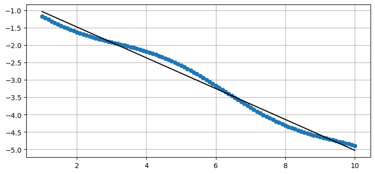
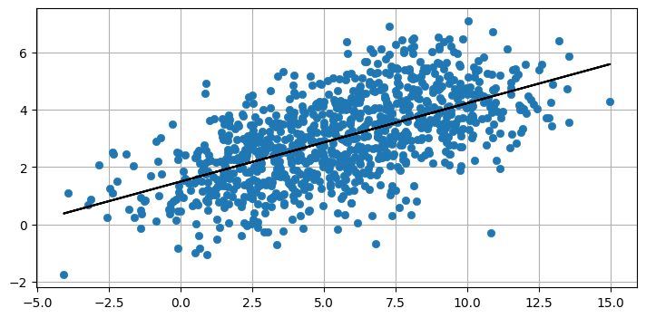
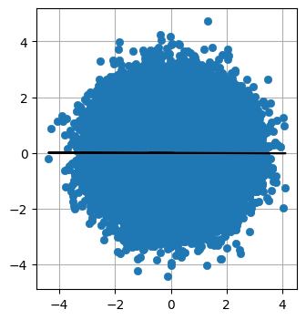
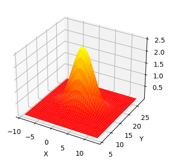

.. highlight:: c++

.. default-domain:: cpp

============================
第5章 多元高斯分布
============================

5.1  介绍
============================

上一章中的技术非常强大，但它们只适用于一个变量或维度。 它们无法表示多维数据，例如狗在田野中的位置和速度。 
位置和速度是相互关联的，正如我们在 g-h 章节中学到的，我们永远不应该丢弃信息。
在本章中，我们将学习如何以概率的方式描述这种关系。 通过这一关键见解，我们将获得明显更好的过滤器性能。

5.2 多元高斯分布
============================

我们一直将高斯用于标量随机变量，表示为 :math:`\mathcal{N}(\mu, \sigma^2)` 。 
一个更正式的术语是*单变量正常*，其中单变量表示“一个变量”。 高斯的概率分布称为 **单变量正态分布** 。

多元正态分布*可能是什么？ **Multivariate** 表示多个变量。 我们的目标是能够表示具有多个维度的正态分布。
我不一定指空间维度——如果我们跟踪飞机在 (x, y, z) 中的位置、速度和加速度，这会给我们带来九维问题。 考虑一个二维情况。
它可能是机器人的 **x** 和 **y** 坐标，可能是狗在 x 轴上的位置和速度，或者是奶牛场的产奶量和进料速度。 这并不重要。 
我们可以看到，对于 :math:`N` 维度，我们需要 :math:`N` 均值，我们将其排列在列矩阵（向量）中，如下所示：

.. math::

  \mu = \begin{bmatrix}\mu_1\\\mu_2\\ \vdots \\\mu_n\end{bmatrix}

假设我们相信 :math:`x = 2` 和 :math:`y = 17` 。 我们会有

.. math::

  \mu = \begin{bmatrix}2\\17\end{bmatrix} 

下一步是表示我们的方差。 乍一看，我们可能认为我们还需要 N 个维度的 N 个方差。 我们可能想说 x 的方差是 10，y 的方差是 4，就像这样。

.. math::

  \sigma^2 = \begin{bmatrix}10\\4\end{bmatrix}

这是不完整的，因为它没有考虑更一般的情况。 在 **Gaussians** 章节中，我们计算了学生身高的方差。 这是衡量高度如何相对于彼此变化的量度。 
如果所有学生的身高相同，则方差为 0，如果他们的身高相差很大，则方差会很大。

身高和体重之间也有关系。 一般来说，高个子比矮个子重。 身高和体重 **相关** 。 我们想要一种方法，不仅可以表达我们认为的身高和体重的差异，
还可以表达它们的相关程度。 换句话说，我们想知道体重与身高相比如何变化。 我们称之为 **协方差** 。

在我们能够理解多元正态分布之前，我们需要了解相关性和协方差背后的数学。

5.3 相关性和协方差
============================

**协方差** 描述了两个变量一起变化的程度。协方差是*相关方差*的缩写。换句话说， **variance** 是衡量总体之间如何变化的量度，
而 **covariance** 是衡量两个变量相对于彼此变化多少的量度。例如，随着身高的增加，体重通常也会增加。这些变量是*相关的*。
它们是 **正相关的** ，因为随着一个变量变大，另一个变量也会变大。随着室外温度降低，家庭取暖费用增加。这些是 **负相关** 或 **负相关** ，
因为随着一个变量变大，另一个变量会降低。茶叶的价格和我的狗摇尾巴的次数彼此之间没有关系，我们说它们是 **不相关** 或
**独立** ——每个都可以独立改变。

相关性允许预测。如果你比我高很多，我可以预测你也比我重。随着冬天的到来，我预测我会花更多的钱来取暖。如果我的狗更多地摇尾巴，
我不会断定茶叶价格会发生变化。

例如，这是学校田径队学生的身高和体重图。如果一个学生身高 68 英寸，我可以预测他们的体重约为 160 磅。由于相关性并不完美，我的预测也不完美。

.. code-block:: python

  from kf_book.gaussian_internal import plot_correlated_data

  height = [60, 62, 63, 65, 65.1, 68, 69, 70, 72, 74]
  weight = [95, 120, 127, 119, 151, 143, 173, 171, 180, 210]
  plot_correlated_data(height, weight, 'Height (in)', 'Weight (lbs)', False)

.. figure:: ./images/5.1.png
   :align: center

在本书中，我们只考虑线性相关。 我们假设变量之间的关系是线性的。 也就是说，直线非常适合数据。 我在上图中的数据中拟合了一条直线。 
非线性相关的概念存在，但我们不会使用它。

:math:`X` 和 :math:`Y` 之间的协方差方程为

.. math::

  COV(X, Y) = \sigma_{xy} = \mathbb E\big[(X-\mu_x)(Y-\mu_y)\big]

其中 :math:`\mathbb E[X]` 是 :math:`X` 的 **预期值** ，定义为

.. math::

  \mathbb E[X] =  \begin{cases} \sum_{i=1}^n p_ix_i & \mbox{discrete}\\ \int_{-\infty}^\infty f(x)\, x & \mbox{continuous}\end{cases}

我们假设每个数据点的可能性相等，所以每个数据点的概率是 :math:`\frac{1}{N}` ，给出

.. math::
  
  \mathbb E[X] =  \frac{1}{N}\sum_{i=1}^n x_i

对于我们将要考虑的离散情况。

将协方差方程与方差方程进行比较。 如您所见，它们非常相似：

.. math::

  \begin{aligned}VAR(X) = \sigma_x^2 &= \mathbb E[(X - \mu)^2]\\
  COV(X, Y) = \sigma_{xy} &= \mathbb E\big[(X-\mu_x)(Y-\mu_y)\big]\end{aligned}

特别是，如果你计算 :math:`COV(X, X)` ，你会得到 :math:`VAR(X)` 的等式，它支持我的说法，即方差计算随机变量如何在自身之间变化。

我们使用 **协方差矩阵** 来表示多元正态分布的协方差，它看起来像这样：

.. math::

  \Sigma = \begin{bmatrix}
    \sigma_1^2 & \sigma_{12} & \cdots & \sigma_{1n} \\
    \sigma_{21} &\sigma_2^2 & \cdots & \sigma_{2n} \\
    \vdots  & \vdots  & \ddots & \vdots  \\
    \sigma_{n1} & \sigma_{n2} & \cdots & \sigma_n^2
    \end{bmatrix}

对角线包含每个变量的方差，非对角线元素包含 :math:`i^{th}` 和 :math:`j^{th}` 变量之间的协方差。 
所以 :math:`\sigma_3^2` 是第三个变量的方差，:math:`\sigma_{13}` 是第一个和第三个变量的协方差。

协方差为 0 表示没有相关性。 如果 :math:`x` 的方差是 10，:math:`y` 的方差是 4，并且 :math:`x` 和 :math:`y` 之间没有线性相关，
那么我们可以写

.. math::

  \Sigma = \begin{bmatrix}10&0\\0&4\end{bmatrix}

如果 :math:`x` 和 :math:`y` 之间存在少量正相关，我们可能会有

.. math::

  \Sigma = \begin{bmatrix}10&1.2\\1.2&4\end{bmatrix}

其中 1.2 是 :math:`x` 和 :math:`y` 之间的协方差。 我说相关性是“小”的，因为 1.2 的协方差相对于 10 的方差很小。

如果 :math:`x` 和 :math:`y` 之间存在大量负相关，我们可能会有

.. math::

  \Sigma = \begin{bmatrix}10&-9.7\\-9.7&4\end{bmatrix}

协方差矩阵是对称的。 毕竟，:math:`x` 和 :math:`y` 之间的协方差总是等于 :math:`y` 和 :math:`x` 之间的协方差。 
也就是说，对于任何 :math:`x` 和 :math:`y` ， :math:`\sigma_{xy}=\sigma_{yx}` 。

我担心我可能会失去你，所以让我们举个例子。 在 **Gaussians** 章节中，
我们有一班身高 H=[1.8, 2.0, 1.7, 1.9, 1.6] 米的学生。 我们计算了：

.. math::

  \begin{aligned}
  \mathit{VAR}(H) &= E[(H - \mu_H)^2] \\
  &= \frac{1}{N}\sum_{i=1}^n (H_i - \mu_H)^2 \\
  &= \frac{1}{5}\left[(1.8-1.8)^2 + (2-1.8)^2 + (1.7-1.8)^2 + (1.9-1.8)^2 + (1.6-1.8)^2\right] \\
  &= 0.02
  \end{aligned}

容易，对吧？ 如果我们给学生称重，我们可能会发现他们的权重为 W = [70.1, 91.2, 59.5, 93.2, 53.5]。 
我们可以使用协方差方程来创建协方差矩阵吗？ 当然。 它看起来像：

.. math::

  \Sigma = \begin{bmatrix}\sigma_H^2 & \sigma_{H,W} \\
  \sigma_{W,H} & \sigma_{W}^2\end{bmatrix}

我们刚刚计算了高度的方差，它将位于矩阵的左上角。 右下角包含权重的变化。 使用相同的方程，我们得到：

.. math::

  \begin{aligned}
  \mu_W &= \frac{1}{5}(70.1 + 91.2 + 59.5 + 93.2 + 53.5) = 73.5 \\
  \sigma_W^2 &= \frac{1}{5}\left[(70.1-73.5)^2 + (91.2-73.5)^2 + (59.5-73.5)^2 + (93.2-73.5)^2 + (53.5-73.5)^2\right] \\
  &= 261.8
  \end{aligned}

现在是协方差。 使用上面的公式，我们计算：

.. math::

  \begin{aligned}
    \sigma_{H,W} &= \mathbb E\big[(H-\mu_H)(W-\mu_W)\big] \\
    &= \frac{1}{N}\sum_{i=1}^n (H_i-\mu_H)(W_i-\mu_W) \\
    &= \frac{1}{5}[(1.8-1.8)(70.1-73.5) + (2-1.8)(91.2-73.5) + (1.7-1.8)(59.5-73.5)\, +\\
    &\, \, \, \,  \, (1.9-1.8)(93.2-73.5) + (1.6-1.8)(53.5-73.5)] \\
    &= 2.18
  \end{aligned}

这很乏味，但很容易。 我们再也不会这样做了，因为当然，NumPy 会为你计算它。 

.. code-block:: python

  import numpy as np

  W = [70.1, 91.2, 59.5, 93.2, 53.5]
  H = [1.8, 2.0, 1.7, 1.9, 1.6]
  np.cov(H, W)

array([[  0.025,   2.727],
       [  2.727, 327.235]])

这与我们的计算不符！什么地方出了错？没有什么。 NumPy 对小样本量进行校正；
它使用 :math:`\frac{1}{N-1}` 作为归一化项，而不是 :math:`\frac{1}{N}` 。

这有点超出了本书的范围。简而言之，假设实际班级规模为 200 名学生，我们抽取了 5 名学生的样本来执行此计算，
因为我们负担不起对所有 200 名学生进行测量和称重的费用。几乎可以肯定，我们的估计器中会有一些错误，因为样本不太可能完美地代表该类。
当我们的样本量接近 200 时，误差将接近 0。我们说后者没有 **bias** ，并且我们有一个 **unbiased estimator**。相反，当我们取一个小样本时，
就会有偏差（误差不为零），并且我们有一个 **biased estimator**。

如果误差为零，则除以 :math:`N` 是有意义的。我不会证明原因，但对于有偏差的估计器，我们使用 :math:`\frac{1}{N-1}` 来纠正小样本量。 
NumPy 默认情况下会这样做，因为实际上我们几乎总是使用来自更大集合的数据样本。如果您想要我们上面计算的无偏估计器，
请在调用“np.cov”时使用“bias=1”。

.. code-block:: python

  np.cov(H, W, bias=1)

  array([[  0.02 ,   2.182],
        [  2.182, 261.788]])

这与我们的计算一致。 我们不会在本书中再次使用 `bias=1`，因为我们使用的是 **随机变量** ，这些变量是从我们正在跟踪的对象的无限位置集合中采样的。 
在这里，我们正在计算整个总体的方差和协方差，因此 `bias=1` 是正确的。

这个矩阵告诉我们什么？ 它告诉我们身高的变化是 0.02 :math:`m^2` ，体重的变化是 261.788 :math:`kg^2` 。 此外，它告诉我们体重和身高呈
正相关——随着身高的增加，体重也会增加。

让我们创建完全相关的数据。 我的意思是数据完全适合一条线 - 这条线没有差异。

.. code-block:: python

  X = np.linspace(1, 10, 100)
  Y = np.linspace(1, 10, 100)
  np.cov(X, Y)

array([[6.956, 6.956],
       [6.956, 6.956]])

我们可以从协方差矩阵中看到，协方差等于 x 和 y 的方差。

现在让我们为其中一个变量添加一些噪音，使它们不再完全相关。 我将使 :math:`Y` 为负以创建负相关。

.. code-block:: python

  X = np.linspace(1, 10, 100)
  Y = -(np.linspace(1, 5, 100) + np.sin(X)*.2)
  plot_correlated_data(X, Y)
  print(np.cov(X, Y))

[[ 6.956 -3.084]
 [-3.084  1.387]]

数据不再形成一条直线。 协方差为 :math:`\sigma_{xy}=-3.08` 。 与 :math:`\sigma_x^2` 和 :math:`\sigma_y^2` 的大小相比，
它并不接近于零，因此我们知道仍然存在高度相关性。 我们可以通过查看图表来验证这一点。 数据几乎形成一条直线。

现在我将随机噪声添加到一条直线上。

.. code-block:: python

  from numpy.random import randn
  X = np.linspace(1, 10, 1000) + randn(1000)*2
  Y = np.linspace(1, 5, 1000) + randn(1000)
  plot_correlated_data(X, Y)
  print(np.cov(X, Y))

[[11.105  3.04 ]
 [ 3.04   2.316]]

我们看到协方差相对于方差较小，反映了 :math:`X` 和 :math:`Y` 之间的较低相关性。 我们仍然可以通过这些数据拟合一条直线，
但数据的变化要大得多。

最后，这是完全随机数据之间的协方差。

.. code-block:: python

  X = randn(100000)
  Y = randn(100000)
  plot_correlated_data(X, Y)
  print(np.cov(X, Y))

[[ 1.003 -0.003]
 [-0.003  0.997]]

这里的协方差非常接近于零。 正如您在图中看到的那样，没有明确的方法可以绘制一条线来拟合数据。 一条垂直线与我展示的水平线一样令人信服。

5.4 正态分布方程
============================

回想一下 **Gaussians** 章节中的正态分布方程：

.. math::

  f(x, \mu, \sigma) = \frac{1}{\sqrt{2\pi\sigma^2}} \exp \Big [{-\frac{1}{2}}{(x-\mu)^2}/\sigma^2 \Big ]

这是 :math:`n` 维度的多元正态分布。

.. math::

  f(\mathbf{x},\, \mu,\,\Sigma) = \frac{1}{\sqrt{(2\pi)^n|\Sigma|}}\, \exp  \Big [{ -\frac{1}{2}(\mathbf{x}-\mu)^\mathsf{T}\Sigma^{-1}(\mathbf{x}-\mu) \Big ]}

多变量版本仅用矩阵替换单变量方程的标量。 如果你相当精通线性代数，这个方程应该看起来很容易处理。 
如果没有，请不要担心，FilterPy 和 SciPy 都提供了为您计算它的函数。 让我们暂时忽略计算并绘制它以查看它的样子。

.. code-block:: python

  import kf_book.mkf_internal as mkf_internal

  mean = [2., 17.]
  cov = [[10., 0.], 
        [0., 4.]]

  mkf_internal.plot_3d_covariance(mean, cov)

这是一个多元高斯图，平均值为 :math:`\mu=[\begin{smallmatrix}2\\17\end{smallmatrix}]` ，
协方差为 :math:`\Sigma=[\begin{smallmatrix}10&0\\0&4 \end{smallmatrix}]` 。
三维形状显示 z 轴上任何 :math:`(X, Y)` 值的概率密度。我已将 x 和 y 的方差投影到图表的墙上——您可以看到它们呈现高斯钟形曲线形状。 
:math:`X` 的曲线比 :math:`$` 的曲线更宽，这可以通过 :math:`\sigma_x^2=10` 和 :math:`\sigma_y^2=4` 来解释。 
3D 表面的最高点位于 :math:`X` 和 :math:`Y` 的均值处。

所有多元高斯分布都具有这种形状。如果我们将其视为狗位置的高斯分布，则 (:math:`X, Y`) 的每个点的 z 值就是狗在该位置的概率密度。
严格来说，这是 **联合概率密度函数** ，我将很快对其进行定义。因此，狗靠近 (2, 17) 的概率最高，靠近 (5, 14) 的概率适中，
靠近 (10, 10) 的概率非常低。与单变量情况一样，这是 **概率密度** ，而不是 **概率** 。连续分布具有无限范围，因此恰好位于 (2, 17) 
或任何其他点的概率为 0%。我们可以通过用积分计算表面下的体积来计算在给定范围内的概率。

.. code-block:: python

  from filterpy.stats import gaussian, multivariate_gaussian

我将演示如何使用它，然后继续做更有趣的事情。

首先，如果我们认为我们的狗在 (2, 7) 的概率密度为 (2, 7)，则让我们找到它的概率密度，其中 :math:`x` 的方差为 8，:math:`y` 的方差为 3。

首先将 :math:`x` 设置为 (2.5, 7.3)。 您可以使用元组、列表或 NumPy 数组。

.. code-block:: python

  x = [2.5, 7.3]

接下来，我们设置我们的信念的平均值：

.. code-block:: python
  
mu = [2.0, 7.0]
