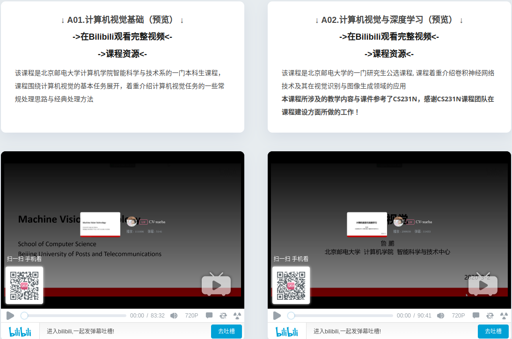
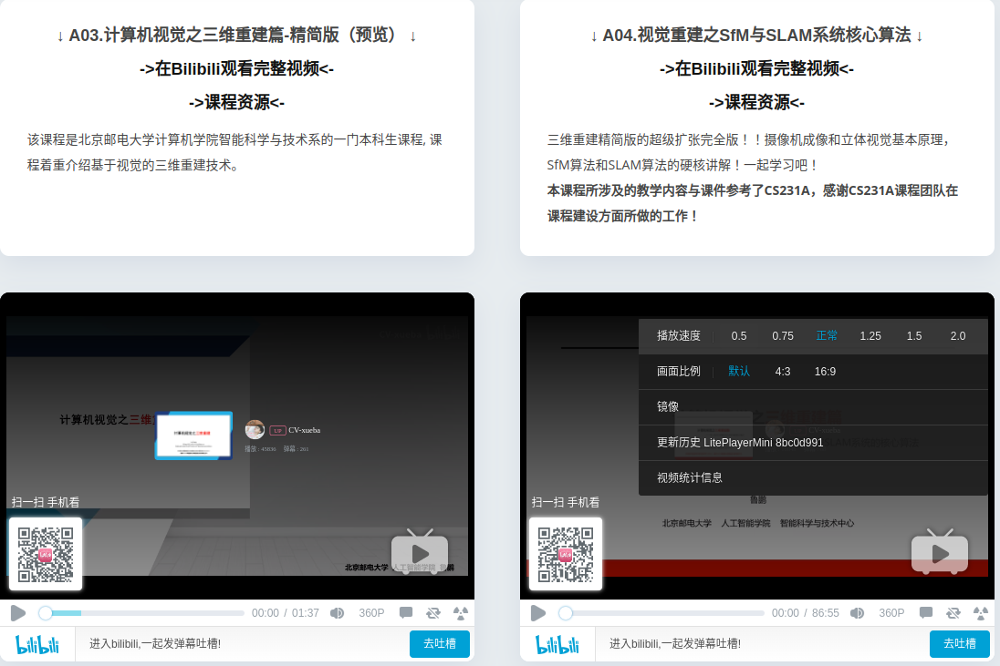

=========
Resources
=========

Books
------------

  * OpenCV3编程入门
  * OpenCV3计算机视觉python语言实现
  * 计算机视觉——算法与应用
  * 学习OpenCV 4
  * 计算机视觉：算法与应用
  * 计算机视觉：一种现代方法
  * 计算机视觉中的多视图几何
  * An Invitation to 3-D Vision
  * 计算机视觉： 计算理论与算法基础
  * 数字图像处理
  * 模式识别
  * 模式分类
  * Computer Vision: Models, Learning, and Inference
  * Pattern Recognition and Machine Learning
  * 深度学习
  * Generalized Principal Component Analysi

Peoples
------------

Laboratory
------------

github
------------

Mechatronics and Robotic Systems (MaRS) Laboratory

.. code-block:: bash

  https://github.com/hku-mars

OpenVINS

.. code-block:: bash

  https://docs.openvins.com/index.html

Course
------------

**1 北京邮电大学计算机学院(鲁鹏)**

* `北京邮电大学视频网站 <https://cv-xueba.club/>`_

**2 F1TENTH - Course Documentation**

.. figure:: ./images/F1TENTH.png
   :align: center

* `F1TENTH网站 <https://f1tenth-coursekit.readthedocs.io/en/latest/index.html>`_

 

