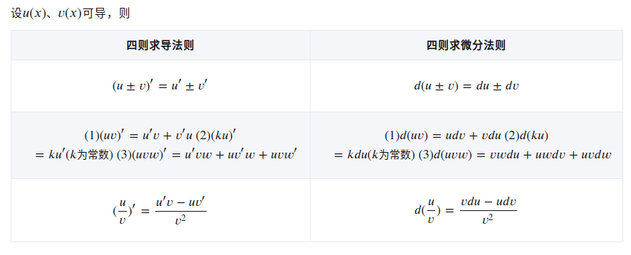
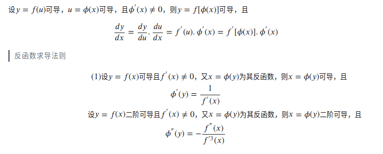

.. highlight:: c++

.. default-domain:: cpp

===========
Derivative
===========

泰勒公式
----------

.. math::

    f(x) = \frac{f(x_0)}{0!} + \frac{f^{\prime}(x_0)}{1!}(x- x_0) + \frac{f^{\prime{\prime}}(x_0)}{2!}(x- x_0)^2 + \cdots + \frac{f^{(n)}(x_0)}{n!}(x- x_0)^n + R_n(x)

so that 

.. math::

    \begin{align}
        e^{x}   &= 1 + x + \frac{1}{2!}x^2 + \frac{1}{3!}x^3 + \cdots \\
        \sin{x} &= x - \frac{1}{3!}x^3 + \frac{1}{5!}x^5 + \cdots \\
        \cos{x} & = 1 -  \frac{1}{2!}x^2 + \frac{1}{4!}x^4+ \cdots \\
    \end{align}

求导基础公式
--------------

.. figure:: ../images/derivative/1.png

求导运算法则
--------------

复合函数求导法则-链式法则
-------------------------

