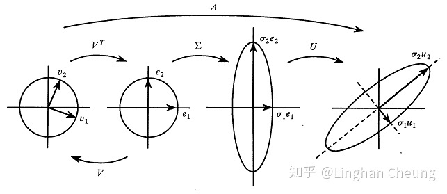

.. highlight:: c++

.. default-domain:: cpp

=====================
Solve Ax = b Equation
=====================

Cholesky factorization solve Ax = b
====================================

LU factorization solve Ax = b
=============================

QR factorization solve Ax = b
=============================

SVD factorization solve Ax = b
==============================

**SVD的数学涵义**

矩阵在线性代数系统中是一个核心的概念, 其从不同的角度出发都能拥丰富的内涵。

.. math::

    Ax = b

* 矩阵 :math:`A` 是线性方程组 :math:`Ax=b` 的系数组成的矩阵, 其每一行是 :math:`Ax=b` 中每一个方程式的系数部分,
  通过分析矩阵的秩 :math:`rank(A)` 和其极大线性无关组的情况, 我们可以了解方程的解的情况, 同时, 对于使用高斯消元法等进行求解也比较方便;

* 当 :math:`m \ge n \cap rank(A) = n` 时, 矩阵 :math:`A` 是 :math:`\mathbb R^{n}` 空间中的一个基, 在这个基上面, 有向量 :math:`\vec{x} = [x_1, x_2, \cdots, x_n]`, 
  而此向量在标准正交基上表示为 :math:`\vec{b} = [b_1, b_2, \cdots, b_n]`, 此时 :math:`Ax=b` 隐含着一个基变换的关系,
  即 :math:`Ax = Ib`, :math:`I` 为标准正交基;

* 矩阵 :math:`A` 本身表示一个线性变换, (线性方程组 :math:`Ax=b` 表示其对向量 :math:`\vec{x}` 进行线性变换得到向量 :math:`\vec{b}` 的过程.

上述的关于矩阵的各种角色与我们阐述SVD有什么关系呢? 当我们将矩阵视为一种线性变换时, SVD可以帮我们揭示组成该线性变换的最本质的变换, 具体地, 
SVD揭示了这样的一个事实: 对于任意的矩阵 :math:`A`  , 我们总能找到一组单位正交基, 使得 :math:`A`  对其进行变换之后, 得到的向量组仍然是正交的. 
这样的表述还是相当地晦涩, 我们不妨在二维平面中举一个例子.

设有矩阵 :math:`A` , 其对单位正交基 :math:`\vec{v}_1, \vec{v}_2` 进行线性变换, 得到的向量仍然是彼此正交的, 
即 :math:`A\vec{v}_1, A\vec{v}_2` 仍然是正交的. 设 :math:`A\vec{v}_1, A\vec{v}_2` 方向上的单位向量是 :math:`\vec{\mu}_1, \vec{\mu}_2` , 
长度是 :math:`\sigma_1, \sigma_2` , 则我们可得

.. math::

    A\vec{v}_1 = \sigma_1 \vec{\mu}_1 \\
    A\vec{v}_2 = \sigma_2 \vec{\mu}_2 \\

现在利用矩阵 :math:`A` 对向量 :math:`\vec{x}` 进行线性变换. 我们先将向量 :math:`\vec{x}` 在单位正交基 :math:`\vec{v}_1, \vec{v}_2` 上进行表示, 即

.. math::

    \begin{aligned}
    \vec{x} &=
        \begin{bmatrix}
            \vec{v}_1, \vec{v}_2
        \end{bmatrix}
        \cdot 
         \begin{bmatrix}
                v_1^{T} \\
                v_2^{T}
         \end{bmatrix}
         \cdot 
    \vec{x} \\
    &=
    \begin{bmatrix}
            \vec{v}_1, \vec{v}_2
    \end{bmatrix}
     \cdot 
     \begin{bmatrix}
         v_1^{T} \vec{x} \\
         v_2^{T} \vec{x}
     \end{bmatrix}
  \end{aligned}

因此

.. math::
    
  \begin{aligned}
      A\vec{x} &= A
          \begin{bmatrix}
              \vec{v}_1, \vec{v}_2
          \end{bmatrix}
          \cdot 
          \begin{bmatrix}
                  v_1^{T} \\
                  v_2^{T}
          \end{bmatrix}
          \cdot 
      \vec{x} \\
      &=
      \begin{bmatrix}
            A \vec{v}_1, A \vec{v}_2
      \end{bmatrix}
      \cdot 
      \begin{bmatrix}
          v_1^{T}  \\
          v_2^{T} 
      \end{bmatrix}
      \cdot 
      \vec{x}
      \\
      &=
      \begin{bmatrix}
            \sigma_1\mu_1, \sigma_2\mu_2
      \end{bmatrix}
      \cdot 
      \begin{bmatrix}
          v_1^{T}  \\
          v_2^{T} 
      \end{bmatrix}
      \cdot 
      \vec{x}
      \\
      &=
      \begin{bmatrix}
            \mu_1, \mu_2
      \end{bmatrix}
      \begin{bmatrix}
            \sigma_1, 0 \\
            0, \sigma_2
      \end{bmatrix}
      \begin{bmatrix}
          v_1^{T}  \\
          v_2^{T} 
      \end{bmatrix}
      \vec{x}
      \\
      &=
      \mathbf{U} \mathbf{\Sigma} \mathbf{V}^{T}
  \end{aligned}

至此, 我们由"对于任意的矩阵 :math:`A` , 我们总能找到一组单位正交基, 使得 :math:`A` 对其进行变换之后, 得到的向量组仍然是正交的",  得到了矩阵 :math:`A` 最终的分解形式
:math:`A = \mathbf{U} \mathbf{\Sigma} \mathbf{V}^{T}` 。 对于任意的矩阵 :math:`A` , 我们总可以将其分解为一个酉矩阵 :math:`U`, 一个对角矩阵 :math:`\mathbf{\Sigma}` 
和另一个酉矩阵的转置 :math:`\mathbf{V}^{T}` 的乘积, 这便是SVD的核心内容.

**SVD的几何涵义**

现在我们知道, 对于任意的矩阵 :math:`A` , 我们总可以将其分解为一个酉矩阵 :math:`U` , 一个对角矩阵 :math:`\Sigma` 和另一个酉矩阵的转置 :math:`V^{T}` 的乘积,
即等式 :math:`A = \mathbf{U} \mathbf{\Sigma} \mathbf{V}^{T}` 所表述的内容. :math:`A = \mathbf{U} \mathbf{\Sigma} \mathbf{V}^{T}` 表示矩阵 :math:`A` 
所代表的线性变换可以由更简单的旋转, 拉伸变换进行合成. 这些更简单的变换是怎么进行生效的呢? 我们还是在二维平面中举例说明.

当使用矩阵 :math:`A` 对向量 :math:`\vec{x}` 进行变化时, 我们可以先将向量 :math:`\vec{x}` 在单位正交基 :math:`\vec{v}_1, \vec{v}_2` 上进行表示, 
我们不妨令 :math:`\xi_1 = v_1^T \vec{x}, \xi_2 = v_2^T \vec{x}` , 则 :math:`\xi_1, \xi_2` 是向量 :math:`\vec{x}` 在单位正交基 :math:`\vec{v}_1, \vec{v}_2` 上的坐标, 即

.. math::

  \begin{aligned}
      \vec{x} &= 
          \begin{bmatrix}
              \vec{v}_1, \vec{v}_2
          \end{bmatrix}
          \begin{bmatrix}
                  v_1^{T} \\
                  v_2^{T}
          \end{bmatrix}
          \cdot 
      \vec{x} \\
      &=
      \begin{bmatrix}
              \vec{v}_1,  \vec{v}_2
      \end{bmatrix}
        \begin{bmatrix}
          v_1^{T} \vec{x} \\
          v_2^{T} \vec{x}
      \end{bmatrix} 
      \\
      &=
      \begin{bmatrix}
              \vec{v}_1, \vec{v}_2
      \end{bmatrix}
      \begin{bmatrix}
          \xi_1 \\
          \xi_2
      \end{bmatrix} 
  \end{aligned}

因此

.. math::

    \begin{aligned}
      A \vec{x} &= \mathbf{U} \mathbf{\Sigma} \mathbf{V}^{T} \vec{x} \\
            &=  
            \begin{bmatrix}
                    \mu_1, \mu_2
                \end{bmatrix} 
                \begin{bmatrix}
                    \sigma_1, 0 \\
                    0, \sigma_2
                \end{bmatrix}
                \begin{bmatrix}
                    v_1^T \\
                    v_2^T
                \end{bmatrix} 
                \vec{x} 
                \\
            &=  
            \begin{bmatrix}
                    \mu_1, \mu_2
                \end{bmatrix} 
                \begin{bmatrix}
                    \sigma_1, 0 \\
                    0, \sigma_2
                \end{bmatrix}
                \begin{bmatrix}
                    v_1^T \\
                    v_2^T
                \end{bmatrix} 
                \begin{bmatrix}
                    v_1,
                    v_2
                \end{bmatrix} 
                  \begin{bmatrix}
                    \xi_1 \\
                    \xi_2
                \end{bmatrix} 
    \end{aligned}

分析矩阵的具体操作效果

如(9)所示, 矩阵 :math:`A` 对向量 :math:`\vec{x}` 进行线性变换, 其先将向量 :math:`\vec{x}` 用单位正交基 :math:`V` 进行表示. 
然后使用酉矩阵 :math:`V^T`  进行旋转, 由酉矩阵的性质我们可知 :math:`VV^T = V^TV = I `  , 所以旋转之后我们可得到标准正交基 :math:`I` . \
然后使用矩阵 :math:`\Sigma`对标准正交基 :math:`I` 进行拉伸, 使得 :math:`x-axis, y-axis` 分别拉伸 :math:`\sigma_1, \sigma_2` 倍的长度. 
最后再使用酉矩阵 :math:`U` 对拉伸之后的正交基进行旋转, 得到最终的基, 从而得到最终的向量为

.. math::

    \begin{aligned}
      A \vec{x} &= 
            \begin{bmatrix}
                    \sigma_1 \mu_1, \sigma_2 \mu_2
                \end{bmatrix} 
                  \begin{bmatrix}
                    \xi_1 \\
                    \xi_2
                \end{bmatrix} 
                \\
                &=
                \xi_1\sigma_1 \mu_1 + \xi_2 \sigma_2 \mu_2
    \end{aligned}

上述过程可表示为下图

通过SVD, 我们找到了能代表矩阵 :math:`A` 作为线性变换时最本质的操作. 而 :math:`\sigma_1, \sigma_2` 就是所谓的奇异值, 表示对标准正交基各个轴进行拉伸的程度.

**SVD的求解过程**

