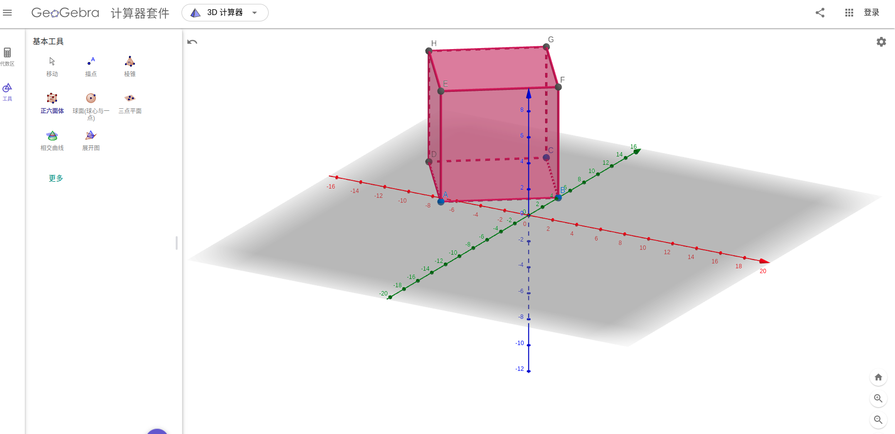
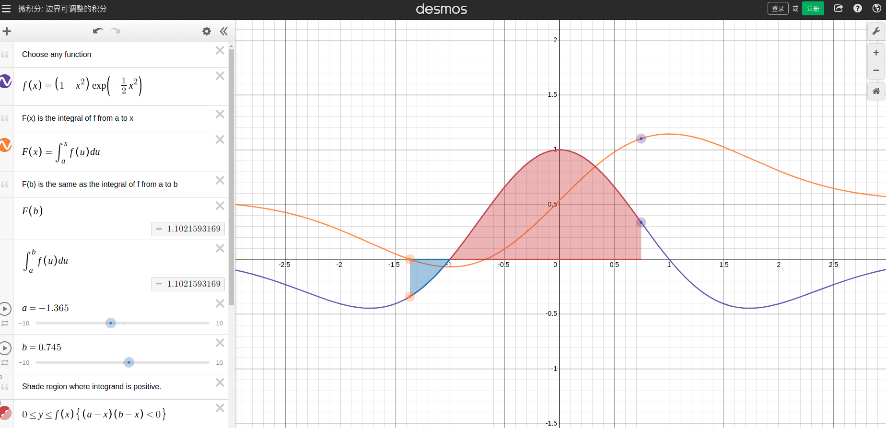

.. _chapter-math:

====
Math
====

.. toctree::
   :maxdepth: 1

   vector/vector
   matrix/matrix
   quaternion/quaternion
   derivative/derivative
   probability/probability
   linear_equation/linear_equation
   nls/nls

数学图形和函数可视化网站推荐
===================================

* `geogebra <https://www.geogebra.org/calculator>`_
* `desmos <https://www.desmos.com/calculator?lang=zh-CN>`_

