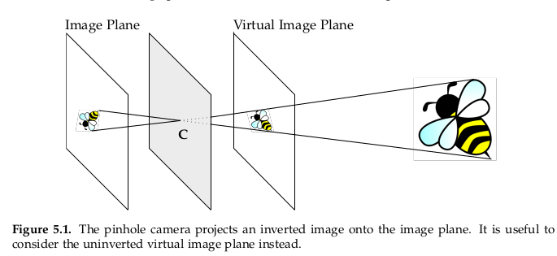
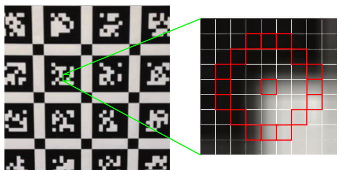
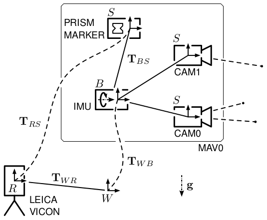
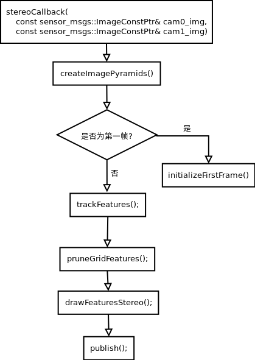
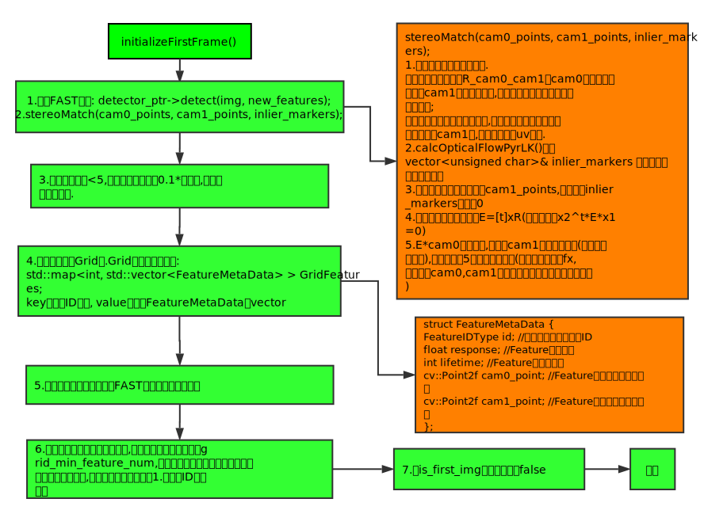
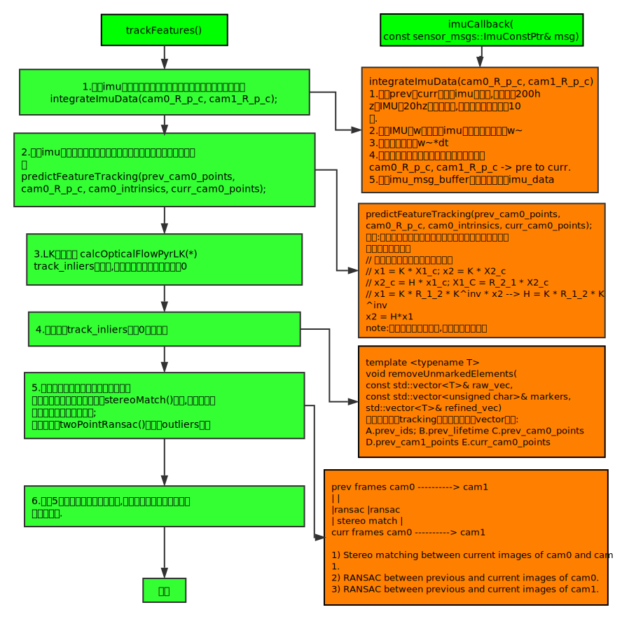
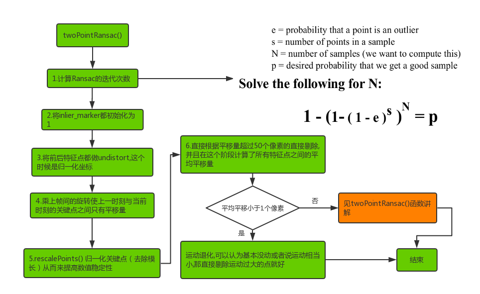
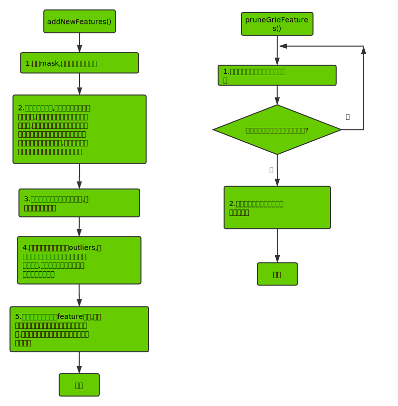

.. _chapter-msckf:

=====
MSCKF
=====

.. NOTE::

  * `代码: MSCKF_VIO <https://github.com/KumarRobotics/msckf_vio>`_ 
  * `论文: Robust Stereo Visual Inertial Odometry for Fast Autonomous Flight <https://arxiv.org/pdf/1712.00036.pdf>`_

1 介绍
=====================

**编译安装**

.. code-block:: bash

  # 安装依赖
  sudo apt-get install libsuitesparse-dev

  cd your_work_space
  catkin_make --pkg msckf_vio --cmake-args -DCMAKE_BUILD_TYPE=Release

**运行**

* 下载  EuRoC or the UPenn fast flight dataset

.. code-block:: bash

  # EuRoC
  roslaunch msckf_vio msckf_vio_euroc.launch

  # UPenn fast flight 
  roslaunch msckf_vio msckf_vio_fla.launch

  # rosbag
  rosbag play V1_01_easy.bag

  # RVIZ
  rosrun rviz rosrun

**MSCKF的ros graph**

.. image:: ./images/msckf_vio.png
   :align: center

**视频结果**

* `bilibili <https://www.bilibili.com/video/BV1hM4y1g7N9?spm_id_from=333.337.search-card.all.click>`_
* `youtube <https://www.youtube.com/watch?v=jxfJFgzmNSw&t>`_ 

2 符号表示
================

.. figure:: ./images/coordinate_frames.png
   :align: center

* G : 世界坐标系
* C : 相机坐标系
* B : 机体坐标系

3 概率状态估计
================

**概率论基础**

:math:`P(x = X)` 在某个范围内的概率等于 概率密度函数 :math:`p(x)` 在该范围内的积分

.. figure:: ./images/probability_density_function.png
   :align: center

均值和方差

* :math:`\mathbb{E}(x) = \int x p(x) dx`   
* :math:`Var(x) = \mathbb{E}[x - \mathbb{E}(x)^2] = \sigma^2`

**高斯分布**

一维高斯密度函数

.. math:: 

  p(x; \mu, \sigma) = \frac{1}{\sqrt{2 \pi \sigma^2}} exp
  \left\{ 
    -\frac{(x- \mu)^2}{2\sigma^2}
  \right\}

.. figure:: ./images/normal_distribution.png
   :align: center

:math:`N` 维高斯密度函数

.. math:: 

  p(\mathbf{x}; \mathbf{\mu}, \mathbf{\Sigma}) =
  \frac{1}{\sqrt{(2\pi)^2|\mathbf{\Sigma}|}} exp
  \left\{ 
    -\frac{1}{2} (\mathbf{x}- \mathbf{\mu})^T\Sigma^{-1}(\mathbf{x}- \mathbf{\mu})
  \right\}

其中：

  .. math:: 

    \begin{aligned}
    Cov(\mathbf{x}, \mathbf{y}) &= \mathbb{E[(\mathbf{x} - \mathbb{E(x)})(\mathbf{y} - \mathbb{E(y)})]} \\
    Cov\left(\begin{bmatrix}
      x_1 \\
      x_2 \\
      \vdots \\
      x_n
    \end{bmatrix}
    \right) &=
    \begin{bmatrix}
      \sigma_{x_1}^2 & \rho_{(x_1, x_2)}\sigma_{x_1}\sigma_{x_2} & \dots & \rho_{(x_1, x_n)}\sigma_{x_1}\sigma_{x_n}  \\
      \rho_{(x_2, x_1)}\sigma_{x_2}\sigma_{x_1} & \sigma_{x_2}^2 & \dots & \rho_{(x_2, x_n)}\sigma_{x_2}\sigma_{x_n}  \\
      \vdots & \vdots & \ddots & \vdots  \\
      \rho_{(x_n, x_1)}\sigma_{x_n}\sigma_{x_1} &  \rho_{(x_n, x_2)}\sigma_{x_n}\sigma_{x_2} & \dots  & \sigma_{x_n}^2
    \end{bmatrix}
    \end{aligned} 

.. figure:: ./images/two-dimensional_normal_distribution.png
   :align: center

**条件高斯**

.. math:: 

    \begin{bmatrix}
      \mathbf{x} \\
      \mathbf{y} 
    \end{bmatrix} =
    N(\mathbf{\mu}, \mathbf{\Sigma}) =
    \left(
        \begin{bmatrix}
            \mu_x \\
            \mu_y 
        \end{bmatrix},
        \begin{bmatrix}
            \Sigma_{xx} & \Sigma_{xy} \\
            \Sigma_{yx} & \Sigma_{yy} 
        \end{bmatrix}
    \right)

边缘化

.. math:: 

  p(x) = \int p(x,y) dy = \int p(x|y) p(y)dy = N(\mu_x, \Sigma_{xx})

条件概率

.. math:: 

    p\left(
    \begin{bmatrix}
        x \\
        y 
    \end{bmatrix}
    \right) 
    =
    N\left(
        \begin{bmatrix}
            \mu_x \\
            \mu_y 
        \end{bmatrix},
        \begin{bmatrix}
            \Sigma_{xx} & \Sigma_{xy} \\
            \Sigma_{yx} & \Sigma_{yy} 
        \end{bmatrix}
    \right)
    =
    N\left(
        \begin{bmatrix}
            \mu_x \\
            A\mu_x + b 
        \end{bmatrix},
        \begin{bmatrix}
            \Sigma_{xx} & \Sigma_{xx}A^T \\
            A\Sigma_{xx} & A\Sigma_{xx}A^T + Q 
        \end{bmatrix}
    \right)

其中：

* :math:`\mathbf{x} \sim N(\mu_x, \Sigma_{xx})`
* :math:`y = Ax + b, \quad b \sim N(0, Q)`

4 卡尔曼滤波
================

4.1 **卡尔曼滤波**
-------------------------------

初始状态估计

.. math:: 

    \mathbf{x_0} \sim N(\hat{\mathbf{x}}_{0|0}, \mathbf{\Sigma}_{0|0})

预测

.. math::

    \mathbf{Given}: \mathbf{x}_{t+1} = \mathbf{A}_{t}\mathbf{x}_{t} + \mathbf{B}_{t}\mathbf{u}_{t} + \mathbf{\epsilon}_{t} \quad \mathbf{\epsilon}_{t} \sim N(\mathbf{0}, \mathbf{Q}_t)
    \\
    \begin{aligned}
      \hat{\mathbf{x}}_{t+1|t} &= \mathbf{A}_{t|t}\hat{\mathbf{x}}_{t} + \mathbf{B}_{t}\mathbf{u}_{t} \\
      \hat{\mathbf{\Sigma}}_{t+1|t} &= \mathbf{A}_{t}\hat{\mathbf{\Sigma}}_{t}\mathbf{A}_{t}^T + \mathbf{Q}_{t}
    \end{aligned}

更新

.. math::

  \mathbf{Given}: \mathbf{x}_{t} = \mathbf{C}_{t}\mathbf{x}_{t} + 	\mathbf{\epsilon}_{t} \quad \mathbf{\delta}_{t} \sim N(\mathbf{0}, \mathbf{R}_t)
  \\
  \begin{aligned}
    \hat{\mathbf{x}}_{t|t} &= \hat{\mathbf{x}}_{t|t-1} + \mathbf{K}_{t}(\mathbf{z}_t - C_t\hat{\mathbf{x}}_{t|t-1}) \\
    \mathbf{\Sigma}_{t|t} &= \mathbf{\Sigma}_{t|t-1} - K_t C_t \mathbf{\Sigma}_{t|t-1} \\
    \mathbf{K}_{t} &= \mathbf{\Sigma}_{t|t-1}C_t^T(C_t\mathbf{\Sigma}_{t|t-1}C_t^T + R_t)^{-1}
  \end{aligned}

4.2 **扩展卡尔曼滤波EKF**
-------------------------------

4.3 **卡尔曼滤波Python例子**
-------------------------------

二次函数添加噪点，二次函数

.. math::

  y = -x^{2} - 2x + 2

Python例子

.. code-block:: python

  import numpy as np

  class KalmanFilter(object):
      def __init__(self, F = None, B = None, H = None, Q = None, R = None, P = None, x0 = None):

          if(F is None or H is None):
              raise ValueError("Set proper system dynamics.")

          self.n = F.shape[1]
          self.m = H.shape[1]

          self.F = F
          self.H = H
          self.B = 0 if B is None else B
          self.Q = np.eye(self.n) if Q is None else Q
          self.R = np.eye(self.n) if R is None else R
          self.P = np.eye(self.n) if P is None else P
          self.x = np.zeros((self.n, 1)) if x0 is None else x0

      def predict(self, u = 0):
          self.x = np.dot(self.F, self.x) + np.dot(self.B, u)
          self.P = np.dot(np.dot(self.F, self.P), self.F.T) + self.Q
          return self.x

      def update(self, z):
          y = z - np.dot(self.H, self.x)
          S = self.R + np.dot(self.H, np.dot(self.P, self.H.T))
          K = np.dot(np.dot(self.P, self.H.T), np.linalg.inv(S))
          self.x = self.x + np.dot(K, y)
          I = np.eye(self.n)
          self.P = np.dot(np.dot(I - np.dot(K, self.H), self.P), 
            (I - np.dot(K, self.H)).T) + np.dot(np.dot(K, self.R), K.T)

  def example():
    dt = 1.0/60
    F = np.array([[1, dt, 0], [0, 1, dt], [0, 0, 1]])
    H = np.array([1, 0, 0]).reshape(1, 3)
    Q = np.array([[0.05, 0.05, 0.0], [0.05, 0.05, 0.0], [0.0, 0.0, 0.0]])
    R = np.array([0.5]).reshape(1, 1)

    x = np.linspace(-10, 10, 100)
    ground_truths = -x**2 - 2*x + 2
    measurements = -(x**2 + 2*x - 2) + np.random.normal(0, 2, 100)

    kf = KalmanFilter(F = F, H = H, Q = Q, R = R)
    predictions = []

    for z in measurements:
      predictions.append(np.dot(H,  kf.predict())[0])
      kf.update(z)

    import matplotlib.pyplot as plt
    plt.plot(range(len(ground_truths)), ground_truths, label = 'GroundTruth')
    plt.plot(range(len(measurements)), measurements, label = 'Measurements')
    plt.plot(range(len(predictions)), np.array(predictions), label = 'Kalman Filter Prediction')
    plt.legend()
    plt.show()

  if __name__ == '__main__':
      example()

**kalman filter结果**

.. figure:: ./images/python_kalman_filter_demo.png
   :align: center

5 IMU
================

5.1 **Accelerometers(加速计)**
-------------------------------

.. math::

    ^B \mathbf{a}_m = \mathbf{T}_a {_G^B}\mathbf{R}(^G\mathbf{a} - ^G\mathbf{g}) + \mathbf{n}_a + \mathbf{b}_a

其中：

* :math:`\mathbf{T}_a` : 加速度计测量中导致未对准和比例误差的矩阵系数
* :math:`^G\mathbf{a}` : 全局坐标系中 IMU 的真实加速度，{ B } 表示惯性体（IMU）坐标系。
* :math:`^G\mathbf{g}: \quad \mathbf{g} = (0, 0, -1)^T`  

* :math:`\mathbf{n}_a \sim N(0, N_a)` 
* :math:`\mathbf{b}_a：` 随时间变化，建模为随机游走过程噪声 :math:`n_{wa} \sim N(0,N_{wa} )` 

5.2 **Gyroscope(陀螺仪)**
-------------------------------

.. figure:: ./images/gyroscope.png
   :align: center

.. math::

    ^B \mathbf{\omega}_m = \mathbf{T}_g \omega +\mathbf{T}_s ^B\mathbf{a} + \mathbf{n}_g + \mathbf{b}_g

其中：

* :math:`\mathbf{n}_g \sim N(0, N_g)` 
* :math:`\mathbf{b}_g：` 随时间变化，建模为随机游走过程噪声 :math:`n_{wg} \sim N(0,N_{wg})` 

5.3 **Noise and Bias Characteristics(噪声和零偏特性)**
--------------------------------------------------------------

5.4 **运动模型**
-------------------------------

状态向量：

.. math::

  \mathbf{X} = \begin{bmatrix}
    _G^I\mathbf{q}(t)^T, 
    \mathbf{b}_g(t)^T, 
    ^G\mathbf{v}_I(t)^T, 
    \mathbf{b}_a(t)^T,
    ^G\mathbf{p}_I(t)^T, 
    _C^I\mathbf{q}(t)^T, 
    ^I{\mathbf{p}(t)_C}^T
  \end{bmatrix}

* :math:`_G^I\mathbf{q}(t)^T` : 代表惯性系到IMU坐标系的旋转
* :math:`\mathbf{b}_g(t)^T` : 表示在IMU坐标系中测量值线加速度的biases
* :math:`^G\mathbf{v}_I(t)^T` : 代表IMU坐标系在惯性系中的速度
* :math:`\mathbf{b}_a(t)^T` : 表示在IMU坐标系中测量值角速度的biases
* :math:`^G\mathbf{p}_I(t)^T` : 代表IMU坐标系在惯性系中的位置
* :math:`C^I\mathbf{q}(t)^T` : 表示相机坐标系和IMU坐标系的相对位置，其中相机坐标系取左相机坐标系。
* :math:`^I{\mathbf{p}(t)_C}^T` : 表示相机坐标系和IMU坐标系的相对位置，其中相机坐标系取左相机坐标系。
* :math:`\mathbf{w}(t)^T = [w_x(t), w_y(t), w_z(t)]^T` : 是IMU角速度在IMU系中的坐标

IMU的观测值为

.. math::

  \begin{aligned}
    \mathbf{\omega}_m &=  \mathbf{\omega} + C(_G^I\mathbf{q}) \mathbf{\omega}_G + \mathbf{b}_g +  \mathbf{n}_g  \\
    \mathbf{a}_m &= C(_G^I\mathbf{q}) (^G\mathbf{a}_I - ^G\mathbf{g} + 2 \mathbf{{\omega}_G}_{\times} ^G\mathbf{v}_I + {{\omega}_G}_{\times}^2(^G\mathbf{p}_I)) + \mathbf{b}_a +  \mathbf{n}_a 
  \end{aligned}

* 将地球自转的影响忽略不计
* 其中 :math:`w_{G}` 为地球的自转速度在 :math:`G` 系的坐标

.. math::

  \tilde{\mathbf{X}}_{IMU} = \mathbf{F} \tilde{{X}}_{IMU} + \mathbf{G} \mathbf{n}_{IMU}

矩阵形式

.. math::

  \begin{aligned}
  \underbrace{
    \begin{bmatrix}
      \dot{\delta{\theta}}_{I} \\
      \dot{\tilde{b}}_{g}  \\
      ^{G}\dot{\tilde{v}}_{I} \\
      \dot{\tilde{b}}_{a}  \\
      ^{G}\dot{\tilde{p}}_{I}
          \end{bmatrix}
  }_{\dot{\tilde{\mathbf{X}}}_{IMU}} = 
  \underbrace {
    \begin{bmatrix}
      -\mathbf{[w]}_{\times} & -\mathbf{I}_{3} & \mathbf{0}_{3 \times 3} 
          & \mathbf{0}_{3 \times 3}  & \mathbf{0}_{3 \times 3} \\
          \mathbf{0}_{3 \times 3} &  \mathbf{0}_{3 \times 3}  & \mathbf{0}_{3 \times 3}  & \mathbf{0}_{3 \times 3}  & \mathbf{0}_{3 \times 3}  \\
          -C (^I_G\hat{\mathbf{q}})^{T}\mathbf{[\hat{a}_{\times}]} & \mathbf{0}_{3 \times 3} & \mathbf{0}_{3 \times 3} & -C (^I_G\hat{\mathbf{q}})^{T} & \mathbf{0}_{3 \times 3} \\
          \mathbf{0}_{3 \times 3} &  \mathbf{0}_{3 \times 3}  & \mathbf{0}_{3 \times 3}  & \mathbf{0}_{3 \times 3}  & \mathbf{0}_{3 \times 3}  \\
          \mathbf{0}_{3 \times 3} &  \mathbf{0}_{3 \times 3}  & \mathbf{I}_{3}  & \mathbf{0}_{3 \times 3}  & \mathbf{0}_{3 \times 3} 
      \end{bmatrix}
  }_{F}
  \underbrace{
    \begin{bmatrix}
      \delta{\theta}_{I} \\
      \tilde{b}_{g}  \\
      ^{G}\tilde{v}_{I} \\
      \tilde{b}_{a}  \\
      ^{G}\tilde{p}_{I}
          \end{bmatrix}
  }_{\tilde{\mathbf{X}}_{IMU}} \\ 
  + 
  \underbrace{
    \begin{bmatrix}
      -\mathbf{I}_{3} & \mathbf{0}_{3 \times 3} & \mathbf{0}_{3 \times 3} & \mathbf{0}_{3 \times 3} \\
      \mathbf{0}_{3 \times 3} & \mathbf{I}_{3 } & \mathbf{0}_{3 \times 3} & \mathbf{0}_{3 \times 3} \\
      \mathbf{0}_{3 \times 3} & \mathbf{0}_{3 \times 3} &  -C (^I_G\hat{\mathbf{q}})^{T} &  \mathbf{0}_{3 \times 3}  \\
      \mathbf{0}_{3 \times 3} & \mathbf{0}_{3 \times 3} & \mathbf{0}_{3 \times 3}  & \mathbf{I}_{3 } \\
      \mathbf{0}_{3 \times 3} & \mathbf{0}_{3 \times 3} & \mathbf{0}_{3 \times 3} & \mathbf{0}_{3 \times 3}
          \end{bmatrix}
  }_{G}
  \underbrace{
    \begin{bmatrix}
      \mathbf{n}_g \\
      \mathbf{n}_{wg} \\
      \mathbf{n}_a \\
      \mathbf{n}_{wa} 
    \end{bmatrix}
  }_{\mathbf{n}_{IMU}}
  \end{aligned}

5.5 **状态转移矩阵**
-------------------------------

.. math::

  \dot{\mathbf{\Phi}}(t_k + \tau, t_k) = \mathbf{F}\mathbf{\Phi}(t_k + \tau, t_k)

性质：

* :math:`\mathbf{\Phi}(t_k, t_k) = \mathbf{I}_{15 \times 15}`
* :math:`\mathbf{\Phi} \approx I + F \Delta {t}` 

因此:

.. math::

  \tilde{\mathbf{X}}_{k+1} = \mathbf{\Phi}(t_k + T, t_k) \tilde{\mathbf{X}}_{k}

5.6 **四阶Runge-Kutta积分**
-------------------------------

ODE方程：

.. math::

  y\prime = f(x, y), y(x_0) = y_0, x_0 \le x \le x_n

so that:

.. math::

  \begin{aligned}
    y_{i+1} &= y_i + \frac{1}{6} h (k_1 + 2k_2 + 2k_3 + k_4) \\
    k_1 &= f(x_i, y_i) \\
    k_2 &= f(x_i + \frac{1}{2}h, y_i + \frac{1}{2} k_1 h) \\
    k_3 &= f(x_i + \frac{1}{2}h, y_i + \frac{1}{2} k_2 h) \\
    k_4 &= f(x_i + h, y_i + k_3 h) 
  \end{aligned}

例

.. math::

  2 y\prime + y = e^{-x}, y(0) = \frac{1}{2}, 0 \le x \le 2

.. code-block:: matlab

  % 输入参数
  fun = @(x, y) (exp(-x) - y) / 2;
  x = 0 : 0.1 : 2;
  y0 = 1/2;
  % 调用RK4函数求解
  y = RK4(fun, x, y0);
  % 设置图幅
  fig = gcf;
  fig.Color = 'w';
  fig.Position = [250, 250, 960, 540];
  % 绘制数值解
  p = plot(x, y);
  p.LineStyle = 'none';
  p.Marker = 'p';
  p.MarkerEdgeColor = 'r';
  p.MarkerFaceColor = 'b';
  p.MarkerSize = 8;
  hold on, grid on
  % 求解符号解
  syms y(x)
  equ = 2 * diff(y, x) == exp(-x) - y;
  cond = y(0) == 1/2;
  y = dsolve(equ, cond);
  % 绘制符号解
  fplot(y, [0, 2])
  % 设置信息
  xlabel('x', 'fontsize', 12);
  ylabel('y', 'fontsize', 12);
  title('RK4求解ODE', 'fontsize', 14);
  legend({'数值解', '符号解'}, 'fontsize', 12);

RK4函数如下

.. code-block:: matlab

  function y = RK4(fun, x, y0)

    %RK4 使用经典的RK4方法求解一阶常微分方程。
    % fun是匿名函数。
    % x是迭代区间
    % y0迭代初始值。

    y = 0 * x;
    y(1) = y0;
    h = x(2) - x(1);
    n = length(x);

    for m = 1 : n-1
        k1 = fun(x(m), y(m));
        k2 = fun(x(m)+h/2, y(m)+h*k1/2);
        k3 = fun(x(m)+h/2, y(m)+h*k2/2);
        k4 = fun(x(m)+h, y(m)+h*k3);
        y(m+1) = y(m) + h*(k1 + 2*k2 + 2*k3 + k4) / 6;
    end
  end
    
求解如下：

.. figure:: ./images/rk4.png
   :align: center

6 计算机视觉
=================

6.1 **Pinhole Camera Model(针孔模型)**
------------------------------------------

 
6.2 **相机投影**
------------------------------------------

.. figure:: ./images/camera_projection.png
   :align: center

投影变换

.. math::

  \begin{aligned}
    x = f_x \frac{X}{Z} + c_x \\
    y = f_y \frac{Y}{Z} + c_y
  \end{aligned}

.. figure:: ./images/camera_and_pixel_coordinate_frames.png
   :align: center

6.3 **图像畸变**
------------------------------------------

.. math::

  \begin{aligned}
    \mathbf{h}
      \begin{pmatrix}
          X \\
          Y \\
          Z
      \end{pmatrix} &=
      \begin{bmatrix}
          f_x &   0 \\
          0   & f_y 
      \end{bmatrix}
      \begin{pmatrix}
        d_r
        \begin{bmatrix}
          u \\
          v
        \end{bmatrix}
        + d_t
      \end{pmatrix} +
      \begin{bmatrix}
          c_x \\
          c_y 
      \end{bmatrix}
      \\
      d_r &= (1 + k_1r + k_2r^2 + k_3r^3) \\
      d_t &= 
      \begin{bmatrix}
          2uvt_1 + (r+2u^2)t_2 \\
          2uvt_2 + (r+2v^2)t_1 
      \end{bmatrix}
      \\
      with \quad u &= \frac{X}{Z}, v = \frac{Y}{Z}, r = u^2 + v^2
  \end{aligned}

6.4 **Triangulation（三角化）**
------------------------------------------

.. figure:: ./images/triangulation.png
   :align: center

:math:`C_0` 帧是第一次观察到该点的相机帧，该点在第 :math:`i` 个相机 :math:`C_i` 帧中的位置如下。

.. math::

  \begin{aligned}
    ^{C_i}\mathbf{p}_f &= _{C_0}^{C_i}\mathbf{R}(^{C_0}\mathbf{p}_f - ^{C_0}\mathbf{p}_{C_{i}}) \\
    ^{C_i}\mathbf{p}_f &= _{C_0}^{C_i}\mathbf{R} ^{C_0}\mathbf{p}_f + ^{C_i}\mathbf{p}_{C_{0}}
  \end{aligned}

这可以用逆深度参数化重写，以提高数值稳定性并帮助避免局部最小值

.. math::

  \begin{aligned}
    ^{C_i}\mathbf{p}_f &= _{C_0}^{C_i}\mathbf{R} ^{C_0}\mathbf{p}_f + ^{C_i}\mathbf{p}_{C_{0}} \\
    & = _{C_0}^{C_i}\mathbf{R} ^{C_0}
    \begin{bmatrix} 
      c_n X \\
      c_n Y \\
      c_n Z
    \end{bmatrix}
    + ^{C_i}\mathbf{p}_{C_{0}} \\
    &= ^{C_0} Z
    \begin{pmatrix} 
      _{C_0}^{C_i}\mathbf{R} 
      \begin{bmatrix}
        \frac{^{C_0}X}{^{C_0}Z} \\
        \frac{^{C_0}Y}{^{C_0}Z} \\
        1
      \end{bmatrix} +
      \frac{1}{^{C_0}Z} ^{C_i} \mathbf{p}_{C_{0}}
    \end{pmatrix} \\
    &= ^{C_0} Z
    \begin{pmatrix} 
      _{C_0}^{C_i}\mathbf{R}
      \begin{bmatrix}
        \alpha \\
        \beta \\
        1
      \end{bmatrix} +
      \rho ^{C_i}\mathbf{p}_{C_{0}}
    \end{pmatrix} \\
    &= ^{C_0} Z \mathbf{g}_i
    \begin{pmatrix} 
      \alpha \\
      \beta \\
      \rho 
    \end{pmatrix}
  \end{aligned}

其中：

* :math:`\alpha = \frac{^{C_0}X}{^{C_0}Z}`
* :math:`\beta = \frac{^{C_0}Y}{^{C_0}Z}$`
* :math:`\rho = \frac{1}{^{C_0}Z}`

6.5 **高斯牛顿最小化**
---------------------------------------

.. math::

  \mathbf{f}_i(\mathbf{\theta}) = \mathbf{Z}_i - \mathbf{h}(\mathbf{g}_i(\mathbf{\theta})) \quad with: \quad 
    \mathbf{\theta} =
      \begin{pmatrix} 
        \alpha \\
        \beta \\
        \rho 
      \end{pmatrix}

损失函数cosnt function

.. math::

  S(\mathbf{\theta}) = \sum_{i=1}^{n} \mathbf{f}_i(\mathbf{\theta})^2

雅可比矩阵Jacobian

.. math::

  \mathbf{J}_{\mathbf{f}} = \frac{\partial{\mathbf{f}}}{\partial{\mathbf{\theta}}} = \frac{\partial{\mathbf{\mathbf{h}}}}{\partial{\mathbf{\mathbf{g}}}} 
  \frac{\partial{\mathbf{\mathbf{g}}}}{\partial{\mathbf{\mathbf{\theta}}}}

其中：

.. math::

  \frac{\partial{\mathbf{\mathbf{h}}}}{\partial{\mathbf{\mathbf{g}}}} =
  \begin{bmatrix}
      f_x & 0 \\
      0 & f_y 
  \end{bmatrix}
  \begin{bmatrix}
      \frac{d_r}{z} + \frac{\partial{d_r}}{\partial{x}}u  + \frac{\partial{d_t}}{\partial{x}} &   \frac{\partial{d_r}}{\partial{y}}u + \frac{\partial{d_t}}{\partial{y}} &  -\frac{d_r}{z}u +  \frac{\partial{d_r}}{\partial{z}}u  + \frac{\partial{d_t}}{\partial{z}} \\
      \frac{\partial{d_r}}{\partial{x}}v + \frac{\partial{d_t}}{\partial{y}} & \frac{d_r}{z} +  \frac{\partial{d_r}}{\partial{y}}v + \frac{\partial{d_t}}{\partial{y}} &   -\frac{d_r}{z}v +  \frac{\partial{d_r}}{\partial{z}}v  + \frac{\partial{d_t}}{\partial{z}} 
  \end{bmatrix}

参数更新

.. math::

  \mathbf{\theta}_i^{(s+1)} = \mathbf{\theta}_i^{(s)} -
  \left(\mathbf{J}_{\mathbf{f}}^T \mathbf{J}_{\mathbf{f}} \right)^{-1}\mathbf{J}_{\mathbf{f}}^T
  \mathbf{f}( \mathbf{\theta}_i^{(s)})

6.6 **Feature Points Detect**
------------------------------------------

6.7 **Feature Matching**
------------------------------------------

7 MSCKF-VIO
================

**EuRoC数据集**

.. figure:: ./images/euroc_datasets.png
   :align: center

微型飞行器（MAV）上收集的视觉惯性数据集

* 使用的机型为：Asctec Firefly六角旋翼直升机
* 觉惯性测量的传感器包括：视觉（双相机）惯性测量单元（IMU）

视觉惯性传感器与groundtruth数据之间，通过外部校准使得时间戳同步。

**groundtruth采集**

* Leica MS50 激光跟踪扫描仪：毫米精确定位

.. NOTE::

  * LEICA0：激光追踪器配套的传感器棱镜【prism】
  * Leica Nova MS50: 激光追踪器，测量棱镜prism的位置，毫米精度，帧率20Hz，

**数据集内包含的数据**

* Vicon 6D运动捕捉系统

.. NOTE::

  * VICON0：维肯动作捕捉系统的配套反射标志，叫做marker
  * Vicon motion capture system: 维肯动作捕捉系统，提供在单一坐标系下的6D位姿测量，测量方式是通过在MAV上贴上一组反射标志，帧率100Hz，毫米精度

视觉惯性传感器：

.. NOTE::

  * 双相机 (Aptina MT9V034型号 全局快门， 单色， 相机频率20Hz)
  * MEMS IMU (ADIS16448型号 , 测量角速度与加速度，测量频率200 Hz)（以视觉图像的时间戳为基准进行对齐）

groundtruth

.. NOTE::

  * Vicon运动捕捉系统【marker】（6D姿势）
  * Leica MS50激光跟踪仪（3D位置）
  * Leica MS50 3D 结构扫描

传感器校准

.. NOTE::

  * 相机内参
  * 相机-IMU外参

文件名 **MH_01_easy** [工厂场景]

.. NOTE::

  ——mav0
      — cam0
        data :图像文件
        data.csv :图像时间戳
        sensor.yaml : 相机参数【内参fu,fv,cu,cv、外参T_BS(相机相对于b系的位姿)、畸变系数】
      — cam1
        data :图像文件
        data.csv :图像时间戳
        sensor.yaml : 相机参数【内参fu,fv,cu,cv、外参T_BS(相机相对于b系的位姿)、畸变系数】
      — imu0
        data.csv : imu测量数据【时间戳、角速度xyz、加速度xyz】
        sensor.yaml : imu参数【外参T_BS、惯性传感器噪声模型以及噪声参数】
      — leica0
        data.csv : leica测量数据【时间戳、prism的3D位置】
        sensor.yaml : imu参数【外参T_BS】
      — state_groundtruth_estimae0**
        data.csv :地面真实数据【时间戳、3D位置、姿态四元数、速度、ba、bg】
        sensor.yaml :

在每个传感器文件夹里配一个senor.yaml文件，记录传感器相对于Body坐标系的坐标变换，以及传感器自身参数信息

**groundtruth输出格式**

.. code-block:: bash

  timestamp,
  p_RS_R_x [m]
  p_RS_R_y [m]
  p_RS_R_z [m] 
  q_RS_w [] 
  q_RS_x [] 
  q_RS_y [] 
  q_RS_z [] 
  v_RS_R_x [ m/s]
  v_RS_R_y [ m/s]
  v_RS_R_z [ m/s]
  b_w_RS_S_x [rad /s] 
  b_w_RS_S_x [rad /s]
  b_w_RS_S_z [rad /s]
  b_a_RS_S_x [rad /s]
  b_a_RS_S_y [rad /s]
  b_a_RS_S_z [rad /s]

* timestamp：18位的时间戳
* position：MAV的空间3D坐标
* p_RS_R_x [m]
* p_RS_R_y [m]
* p_RS_R_z [m]

**传感器安装的相对位置**

机体上载有4个传感器，其中prism和marker公用一个坐标系
无人机的body系 以IMU传感器为基准，即，imu系为body系。

EuRoC数据集的使用

* EuRoC数据集可用于视觉算法、视觉惯性算法的仿真测试
* 在VIO算法中涉及到很多坐标系的转换、在精度测量过程中也需要进行统一坐标系

.. NOTE::

  * 传感器数据的读取
      以相机图像与imu测量作为算法输入，首先就是要进行数据读取、将输入输出模块化
  * 建立统一坐标系
      传感器放置于统一平台上，但每个传感器都有其各自的坐标系，索性EuRoC中给出了所有传感器相对于机体body系的相对位移（sensor.yaml文件中的T_BS），因此可以将各传感器的位姿数据统一到统一坐标系下，但实际使用中需要根据代码情况灵活运用。
  * 坐标系变换:
      下标表示形式【 矩阵坐标系之间的变换矩阵的下标采用双字母进行标注】
      如：旋转矩阵R_BC，表示从c系旋转到b系的变换阵

7.1 **Overview**
------------------------------------------

传统的EKF-SLAM框架中，特征点的信息会加入到特征向量和协方差矩阵里,这种方法的缺点是特征点的信息会给一个初始深度和初始协方差，
如果不正确的话，极容易导致后面不收敛，出现inconsistent的情况。MSCKF维护一个pose的FIFO，按照时间顺序排列，
可以称为滑动窗口，一个特征点在滑动窗口的几个位姿都被观察到的话，就会在这几个位姿间建立约束，从而进行KF的更新。
如下图所示, 左边代表的是传统EKF SLAM, 红色五角星是old feature,这个也是保存在状态向量中的,另外状态向量中只保存最新的相机姿态; 
中间这张可以表示的是keyframe-based SLAM, 它会保存稀疏的关键帧和它们之间相关联的地图点; 
最右边这张则可以代表MSCKF的一个基本结构, MSCKF中老的地图点和滑窗之外的相机姿态是被丢弃的, 
它只存了滑窗内部的相机姿态和它们共享的地图点.

.. figure:: ./images/msckf_instrduction.png
   :align: center

7.2 **前端**
------------------------------------------

**跟踪流程**

**初始化Initialization**

**trackFeatures**

**twoPointRansac**

对极几何可约束

.. math::

  p_2^T [t]_{\times} R p_1  = 0

* :math:`p_1 = [x_1, y_1, 1]^T`
* :math:`p_2 = [x_2, y_2, 1]^T`

.. math::

  \begin{bmatrix}
    x_2 & y_2 & 1
  \end{bmatrix}
  \begin{bmatrix}
    0 & -t_z & t_y \\
    t_z & 0 & -t_x \\
    -t_y & t_x & 0
  \end{bmatrix}
  \begin{bmatrix}
    x_1 \\
      y_1 \\
      1
  \end{bmatrix}
  = 0

展开之后我们可以得到

.. math::

  \begin{bmatrix}
    y_1 - y_2 & -(x_1 - x_2) & x_1y_2 - x_2y_1
  \end{bmatrix}
  \begin{bmatrix}
    t_x \\
      t_y \\
      t_z
  \end{bmatrix}
  = 0

7.3 **State Representation**
------------------------------------------

**publish**

.. code-block:: bash

  uint64 id
  # Normalized feature coordinates (with identity intrinsic matrix)
  float64 u0 # horizontal coordinate in cam0
  float64 v0 # vertical coordinate in cam0
  float64 u1 # horizontal coordinate in cam0
  float64 v1 # vertical coordinate in cam0

其实前端基本上可以说是非常简单了,也没有太多的trick,最后我们来看一下前端的跟踪效果的动图:

.. figure:: ./images/StereoFeatures.gif
   :align: center

7.4 **Propagation**
------------------------------------------

**误差状态协方差更新**

IMU误差状态方程离散化：

.. math::

  \tilde{\mathbf{X}}_{IMU} = \mathbf{F} \tilde{{X}}_{IMU} + \mathbf{G} \mathbf{n}_{IMU}

从 :math:`t_{k}` 到 :math:`t_{k+1}` 的状态转移矩阵 :math:`\Phi_{k}` 和噪声项 :math:`Q_{k}` 为：

.. math::

  \begin{aligned}
    \mathbf{\Phi}_{k} &= \mathbf{\Phi}_{k+1} = exp\left( \int_{t_k}^{t_{k+1}} F(\tau)d\tau\right) \\
    \mathbf{Q}_{k} &= \int_{t_k}^{t_{k+1}} \mathbf{\Phi}(t_{k+1}, t_k) G QG^T \mathbf{\Phi}(t_{k+1}, t_k)^Td\tau\
  \end{aligned}

其中：

* :math:`Q = \mathbf{n_I n_I^{T}}`

:math:`k` 时刻 :math:`\mathbf{X}_{IMU}` 变化对系统误差状态协方差矩阵 :math:`P_{k|k}` , 系统误差状态协方差矩阵为：

.. math::

  \mathbf{P}_{k|k} = 
  \begin{bmatrix}
      P_{II_{k|k}}  & P_{IC_{k|k}} \\
      P_{IC_{k|k}}^{T} & P_{CC_{k|k}} 
  \end{bmatrix}

:math:`k+1` 时刻预测的IMU误差状态协方差矩阵为

.. math::

  P_{II_{k|k}} = \Phi_{k}P_{II} \Phi_{k}^T + Q_{k}

:math:`k+1` 时刻预测的系统误差状态协方差矩阵为：

.. math::

  \mathbf{P}_{k+1|k} =
    \begin{bmatrix}
        P_{II_{k+1|k}}  & \Phi_{k} P_{IC_{k|k}} \\
        P_{IC_{k|k}}^{T} \Phi_{k}^T  & P_{CC_{k|k}} 
    \end{bmatrix}

整个状态(IMU+Camera)的covariance传播过程如图所示:

.. figure:: ./images/imu_propagate.png
   :align: center

7.5 **Augmentation**
------------------------------------------

**MSCKF系统的误差状态向量**

.. math::

  \mathbf{X}_{k} = 
  \begin{bmatrix}
    \mathbf{x}_{I_{k}}^{T},
    \mathbf{\delta \theta}_{C_{1}}^{T}, _G\mathbf{p}_{C_{1}}^{T}
    \dots,
    \mathbf{\delta \theta}_{C_{N}}^{T}, _G\mathbf{p}_{C_{N}}^{T}
  \end{bmatrix}

它包括 :math:`IMU` 误差状态与 :math:`N` 个相机状态。在没有图像进来时，对 :math:`IMU` 状态进行预测，
并计算系统误差状态协方差矩阵；在有图像进来时，根据相机与 :math:`IMU` 的相对外参计算当前相机的位姿。
然后将最新的相机状态加入到系统状态向量中去，然后扩增误差状态协方差矩阵。

**状态向量扩增**

根据预测的IMU位姿和相机与IMU的相对外参计算当前相机位姿：

.. math::

  \begin{aligned}
    _G^{C}\hat{q} &= _I^{C} \hat{q} \otimes _G^{I}\hat{q} \\
    ^{G} \hat{p}_{C} &=  ^{G} \hat{p}_{I} + C(_I^{C} \hat{q})^T (^{I}\hat{p}_C)
  \end{aligned}

然后将当前相机状态 :math:`_G^{C}\hat{q}， ^{G} \hat{p}_{C}` 加入到状态向量。

* :math:`_G^{C}\hat{q}` : 相机的方向
* :math:`^{G} \hat{p}_{C}`: 相机的位置

**误差状态协方差矩阵扩增**

系统新误差状态 :math:`X_{new}` 与系统原误差状态 :math:`X_{old}` 的关系为：

.. math::

  X_{new}  = \frac{\partial{X_{new}}}{\partial{X_{old} }} + C_{0}

其中

.. math::

  \frac{\partial{X_{new}}}{\partial{X_{old} }} = 
  \begin{bmatrix}
    \mathbf{I}_{6N+21} \\
    \mathbf{J}
  \end{bmatrix}

:math:`J` 是新增相机误差状态对原系统误差状态的Jacobian：

.. math::

  \mathbf{J} =
  \begin{bmatrix}
    \frac{\partial{_G^{C_{new}} \delta\theta}}{\partial{\mathbf{x}_{I}}}_{3 \times 21} & \frac{\partial{_G^{C_{new}} \delta\theta}}{\partial{\mathbf{x}_{C}}}_{3 \times 6N} \\
    \frac{\partial{^G p_{C_{new}}}}{\partial{\mathbf{x}_{I}}}_{3 \times 21} & \frac{\partial{^G p_{C_{new}}}}{\partial{\mathbf{x}_{C}}}_{3 \times 6N}
  \end{bmatrix}_{6 \times (21 + 6N)}

假设上一时刻共有N个相机姿态在状态向量中,那么当新一帧图像到来时,这个时候整个滤波器的状态变成了 :math:`21 + 6(N+1)` 的向量, 
那么它对应的covariance维度为 :math:`(21 + 6(N+1)) \times (21 + 6(N+1))` 。求出 :math:`J` 后，误差状态协方差矩阵扩增为：

.. math::

  P_{k|k} \leftarrow
  \begin{bmatrix}
    \mathbf{I}_{6N + 21} \\
    \mathbf{J}
  \end{bmatrix}
  P_{k|k}
  \begin{bmatrix}
    \mathbf{I}_{6N + 21} \\
    \mathbf{J}
  \end{bmatrix}^T
  =
  \begin{bmatrix}
    P_{k|k} & P_{k|k} \mathbf{J}^T \\
    \mathbf{J} P_{k|k} & \mathbf{J} P_{k|k} \mathbf{J}^T
  \end{bmatrix}_{[6(N+1)+21] \times [6(N+1)+21]}

这个过程对应如下图过程:

.. figure:: ./images/covariance_augmentation.png
   :align: center

7.6 **Update Step**
------------------------------------------

MSCKF的观测模型是以特征点为分组的,我们可以知道一个特征(之前一直处于跟踪成功状态)会拥有多个Camera State.
所有这些对于同一个3D点的Camera State都会去约束观测模型. 那这样其实隐式的将特征点位置从状态向量中移除,
取而代之的便是Camera State. 我们考虑单个feture :math:`f_j` ，假设它所对应到 :math:`M_j` 个相机姿态 :math:`[{}_G^{C_{i}}\mathbf{q}, {}^G \mathbf{p}_{C_i}]^T, i \in j` 。
当然双目版本的包含左目和右目两个相机姿态, :math:`[{}_G^{C_{i,1}}\mathbf{q}, {}^G \mathbf{p}_{C_i, 1}]^T` 和
:math:`[{}_G^{C_{i,2}}\mathbf{q}, {}^G \mathbf{p}_{C_i, 2}]^T` 右相机很容易能通过外参得到. 其中双目的观测值可以表示如下:

.. math::

  \mathbf{z}_{i}^{j} = 
  \begin{bmatrix}
      u_{i, 1}^{j}  \\
      v_{i, 1}^{j}  \\
      u_{i, 2}^{j}  \\
    v_{i, 2}^{j}  \\
  \end{bmatrix} =
  \begin{bmatrix}
    \frac{1}{{}^{C_{i,1}}Z_j} & \mathbf{0}_{2 \times 2} \\
    \mathbf{0}_{2 \times 2} & \frac{1}{{}^{C_{i,2}}Z_j}
  \end{bmatrix}
  \begin{bmatrix}
      \frac{1}{{}^{C_{i,1}}X_j}  \\
      \frac{1}{{}^{C_{i,1}}Y_j}  \\
      \frac{1}{{}^{C_{i,2}}X_j}  \\
      \frac{1}{{}^{C_{i,2}}Y_j}  
  \end{bmatrix}

而特征点在两个相机坐标系下可以分别表示为:

.. math::

  \begin{aligned}
    {}^{C_{i,1}}\mathbf{p} &= 
          \begin{bmatrix}
            {}^{C_{i,1}}\mathbf{X}_j \\
            {}^{C_{i,1}}\mathbf{Y}_j \\
            {}^{C_{i,1}}\mathbf{Z}_j 
          \end{bmatrix} = 
          C({}_G^{C_{i,1}}\mathbf{q)}({}^{G}\mathbf{p}_j - {}^{G}\mathbf{p}_{C_{i, 1}}) \\
      {}^{C_{i,2}}\mathbf{p} &= 
          \begin{bmatrix}
            {}^{C_{i,2}}\mathbf{X}_j \\
            {}^{C_{i,2}}\mathbf{Y}_j \\
            {}^{C_{i,2}}\mathbf{Z}_j 
          \end{bmatrix} = 
          C({}_G^{C_{i,2}}\mathbf{q)}({}^{G}\mathbf{p}_j - {}^{G}\mathbf{p}_{C_{i, 2}}) \\
          &=  C({}_{C_{i,1}}^{C_{i,2}}\mathbf{q)}({}^{C_{i,1}}\mathbf{p}_j - {}^{C_{i,1}}\mathbf{p}_{C_{i, 2}})
  \end{aligned}

其中 :math:`{}^{G}\mathbf{p}_j` 是特征点在惯性系下的坐标,这个是通过这个特征点的对应的所有camera state三角化得到的结果. 将观测模型在当前状态线性化可以得到如下式子:

.. math::

  \begin{aligned}
    \mathbf{r}^{j}_{i}  &= \mathbf{z}^{j}_{i} - \mathbf{\hat{z}}^{j}_{i}\\
              &=\mathbf{H}_{C_{i}}^{j} \mathbf{x} + {\color{Red}{\mathbf{H}^{f_j w} \mathbf{p}_{j}}}+ \mathbf{n}^{j}_{i}
  \end{aligned}

其中 :math:`\mathbf{n}^{j}_{i}` 是观测噪声, :math:`\mathbf{H}_{C_{i}}^{j}` 和 :math:`\mathbf{H}^{f_j w}` 是对应的雅克比矩阵。
对应到的是单个特征点对应的其中某一个相机姿态, 但是这个特征点会对应到很多相机姿态。

.. math::

  \begin{aligned}
    \mathbf{r}^{j}_{o} &= \mathbf{V}^{T}( \mathbf{z}^{j}  - \mathbf{\hat{z}}^{j}) \\
                &= \mathbf{V}^{T}\mathbf{H}^{j} \mathbf{x} + \mathbf{V}^{T}\mathbf{H}^{f_j w} \mathbf{p}_{j} + \mathbf{V}^{T} \mathbf{n}^{j}  \\
                &=  \mathbf{V}^{T}\mathbf{H}^{j} \mathbf{x} + \mathbf{V}^{T} \mathbf{n}^{j} \\
                &= \mathbf{H}^{j}_{0} \mathbf{x} + \mathbf{n}^{j}_{o}
  \end{aligned}

但是这个其实并不是一个标准的EKF观测模型,因为我们知道 :math:`\mathbf{\tilde{p}_j}` 并不在我们的状态向量里边,
所以做法是将式子中红色部分投影到零空间, 假设 :math:`\mathbf{H^{f_{j}w}}` 的left null space为 :math:`\mathbf{V}^T` , 
即有 :math:`\mathbf{V}^T \mathbf{H^{f_{j}w}} = 0`, 所以：

.. math::

  \mathbf{r}^{j}_{o} = \mathbf{H}^{j}_{0} \mathbf{x} + \mathbf{n}^{j}_{o}

这样就是一个标准的EKF观测模型了,下面简单分析一下维度.分析时针对单个特征点, 
我们知道 :math:`\mathbf{H^{f_{j}w}}` 的维度是 :math:`{4M_j} \times 3` , 
那么它的left null space的维度即 :math:`\mathbf{V}^T$的维度为$(4M_j -3) \times 4M_j` , 
则最终 :math:`\mathbf{H}^{j}_{0} \mathbf{x}` 的维度变为 :math:`(4M_j-3) \times 6` , 
残差的维度变为 :math:`(4M_j-3) \times 1` , 假设一共有L个特征的话,那最终残差的维度会是 :math:`L (4M_j-3) \times 6`.

7.7 **Post EKF Update**
------------------------------------------

大致是有两种更新策略,假设新进来一帧图像,这个时候会丢失一些特征点,这个时候丢失的特征点(且三角化成功)用于滤波器更新,如下图所示:

.. figure:: ./images/post_ekf_update.png
   :align: center

8 参考文献
================

* `openvins <https://docs.openvins.com/index.html>`_
* `msckf_notes <http://www.xinliang-zhong.vip/msckf_notes/>`_
* `S-MSCKF图解 <https://matheecs.tech/study/2019/05/23/MSCKF.html>`_
* `一步一步推导S-MSCKF系列 <https://blog.csdn.net/liu2015302026/article/details/105342495?spm=1001.2014.3001.5501>`_
* `学习MSCKF笔记——后端、状态预测、状态扩增、状态更新 <https://blog.csdn.net/weixin_44580210/article/details/108021350?spm=1001.2101.3001.6650.5&utm_medium=distribute.pc_relevant.none-task-blog-2%7Edefault%7ECTRLIST%7Edefault-5-108021350-blog-118578146.pc_relevant_blogantidownloadv1&depth_1-utm_source=distribute.pc_relevant.none-task-blog-2%7Edefault%7ECTRLIST%7Edefault-5-108021350-blog-118578146.pc_relevant_blogantidownloadv1&utm_relevant_index=8>`_
* `MSCKF那些事（一）MSCKF算法简介 <https://zhuanlan.zhihu.com/p/76341809>`_
* `Indirect Kalman Filter for 3D Attitude Estimation <http://mars.cs.umn.edu/tr/reports/Trawny05b.pdf>`_
* `Quaternion kinematics for the error-state Kalman filter <https://www.iri.upc.edu/people/jsola/JoanSola/objectes/notes/kinematics.pdf>`_
* `Improving the Accuracy of EKF-Based Visual-Inertial Odometry <http://citeseerx.ist.psu.edu/viewdoc/download;jsessionid=188A46DC6DD79B40220CE2E9CCB42647?doi=10.1.1.261.1422&rep=rep1&type=pdf>`_
* `Monocular Visual Inertial Odometryon a Mobile Device <https://vision.in.tum.de/_media/spezial/bib/shelley14msc.pdf>`_
* `A Multi-State Constraint Kalman Filter for Vision-aided Inertial Navigation <https://www-users.cse.umn.edu/~stergios/papers/ICRA07-MSCKF.pdf>`_