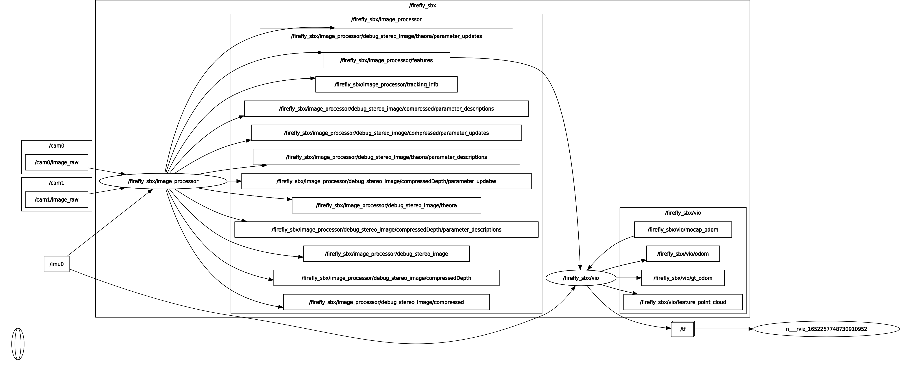
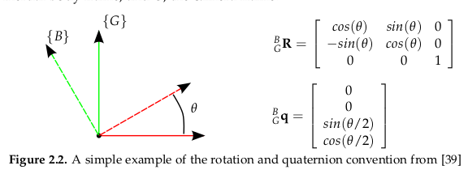
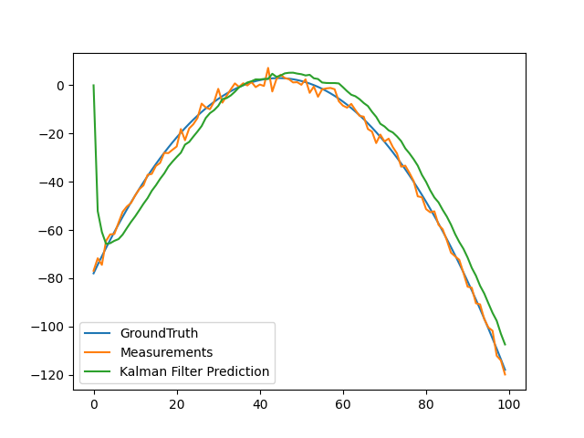

.. _chapter-msckf:

=====
MSCKF
=====

`代码: MSCKF_VIO <https://github.com/KumarRobotics/msckf_vio>`_ 

`论文: Robust Stereo Visual Inertial Odometry for Fast Autonomous Flight <https://arxiv.org/pdf/1712.00036.pdf>`_

1 介绍
=====================

**编译安装**

.. code-block:: bash

  # 安装依赖
  sudo apt-get install libsuitesparse-dev

  cd your_work_space
  catkin_make --pkg msckf_vio --cmake-args -DCMAKE_BUILD_TYPE=Release

**运行**

* 下载  EuRoC or the UPenn fast flight dataset

.. code-block:: bash

  # EuRoC
  roslaunch msckf_vio msckf_vio_euroc.launch

  # UPenn fast flight 
  roslaunch msckf_vio msckf_vio_fla.launch

  # rosbag
  rosbag play V1_01_easy.bag

  # RVIZ
  rosrun rviz rosrun

**MSCKF的ros graph**

**视频结果**

* `bilibili <https://www.bilibili.com/video/BV1hM4y1g7N9?spm_id_from=333.337.search-card.all.click>`_
* `youtube <https://www.youtube.com/watch?v=jxfJFgzmNSw&t>`_ 

2 符号表示
================

* G : 世界坐标系
* C : 相机坐标系
* B : 机体坐标系

3 概率状态估计
================

**概率论基础**

:math:`P(x = X)` 在某个范围内的概率等于 概率密度函数 :math:`p(x)` 在该范围内的积分

.. figure:: ./images/probability_density_function.png
   :align: center

均值和方差

* :math:`\mathbb{E}(x) = \int x p(x) dx`   
* :math:`Var(x) = \mathbb{E}[x - \mathbb{E}(x)^2] = \sigma^2`

**高斯分布**

一维高斯密度函数

.. math:: 

  p(x; \mu, \sigma) = \frac{1}{\sqrt{2 \pi \sigma^2}} exp
  \left\{ 
    -\frac{(x- \mu)^2}{2\sigma^2}
  \right\}

.. figure:: ./images/normal_distribution.png
   :align: center

:math:`N` 维高斯密度函数

.. math:: 

  p(\mathbf{x}; \mathbf{\mu}, \mathbf{\Sigma}) =
  \frac{1}{\sqrt{(2\pi)^2|\mathbf{\Sigma}|}} exp
  \left\{ 
    -\frac{1}{2} (\mathbf{x}- \mathbf{\mu})^T\Sigma^{-1}(\mathbf{x}- \mathbf{\mu})
  \right\}

其中：

  .. math:: 

    \begin{aligned}
    Cov(\mathbf{x}, \mathbf{y}) &= \mathbb{E[(\mathbf{x} - \mathbb{E(x)})(\mathbf{y} - \mathbb{E(y)})]} \\
    Cov\left(\begin{bmatrix}
      x_1 \\
      x_2 \\
      \vdots \\
      x_n
    \end{bmatrix}
    \right) &=
    \begin{bmatrix}
      \sigma_{x_1}^2 & \rho_{(x_1, x_2)}\sigma_{x_1}\sigma_{x_2} & \dots & \rho_{(x_1, x_n)}\sigma_{x_1}\sigma_{x_n}  \\
      \rho_{(x_2, x_1)}\sigma_{x_2}\sigma_{x_1} & \sigma_{x_2}^2 & \dots & \rho_{(x_2, x_n)}\sigma_{x_2}\sigma_{x_n}  \\
      \vdots & \vdots & \ddots & \vdots  \\
      \rho_{(x_n, x_1)}\sigma_{x_n}\sigma_{x_1} &  \rho_{(x_n, x_2)}\sigma_{x_n}\sigma_{x_2} & \dots  & \sigma_{x_n}^2
    \end{bmatrix}
    \end{aligned} 

.. figure:: ./images/two-dimensional_normal_distribution.png
   :align: center

**条件高斯**

.. math:: 

    \begin{bmatrix}
      \mathbf{x} \\
      \mathbf{y} 
    \end{bmatrix} =
    N(\mathbf{\mu}, \mathbf{\Sigma}) =
    \left(
        \begin{bmatrix}
            \mu_x \\
            \mu_y 
        \end{bmatrix},
        \begin{bmatrix}
            \Sigma_{xx} & \Sigma_{xy} \\
            \Sigma_{yx} & \Sigma_{yy} 
        \end{bmatrix}
    \right)

边缘化

.. math:: 

  p(x) = \int p(x,y) dy = \int p(x|y) p(y)dy = N(\mu_x, \Sigma_{xx})

条件概率

.. math:: 

    p\left(
    \begin{bmatrix}
        x \\
        y 
    \end{bmatrix}
    \right) 
    =
    N\left(
        \begin{bmatrix}
            \mu_x \\
            \mu_y 
        \end{bmatrix},
        \begin{bmatrix}
            \Sigma_{xx} & \Sigma_{xy} \\
            \Sigma_{yx} & \Sigma_{yy} 
        \end{bmatrix}
    \right)
    =
    N\left(
        \begin{bmatrix}
            \mu_x \\
            A\mu_x + b 
        \end{bmatrix},
        \begin{bmatrix}
            \Sigma_{xx} & \Sigma_{xx}A^T \\
            A\Sigma_{xx} & A\Sigma_{xx}A^T + Q 
        \end{bmatrix}
    \right)

其中：

* :math:`\mathbf{x} \sim N(\mu_x, \Sigma_{xx})`
* :math:`y = Ax + b, \quad b \sim N(0, Q)`

4 卡尔曼滤波
================

4.1 **卡尔曼滤波**
-------------------------------

初始状态估计

.. math:: 

    \mathbf{x_0} \sim N(\hat{\mathbf{x}}_{0|0}, \mathbf{\Sigma}_{0|0})

预测

.. math::

    \mathbf{Given}: \mathbf{x}_{t+1} = \mathbf{A}_{t}\mathbf{x}_{t} + \mathbf{B}_{t}\mathbf{u}_{t} + \mathbf{\epsilon}_{t} \quad \mathbf{\epsilon}_{t} \sim N(\mathbf{0}, \mathbf{Q}_t)
    \\
    \begin{aligned}
      \hat{\mathbf{x}}_{t+1|t} &= \mathbf{A}_{t|t}\hat{\mathbf{x}}_{t} + \mathbf{B}_{t}\mathbf{u}_{t} \\
      \hat{\mathbf{\Sigma}}_{t+1|t} &= \mathbf{A}_{t}\hat{\mathbf{\Sigma}}_{t}\mathbf{A}_{t}^T + \mathbf{Q}_{t}
    \end{aligned}

更新

.. math::

  \mathbf{Given}: \mathbf{x}_{t} = \mathbf{C}_{t}\mathbf{x}_{t} + 	\mathbf{\epsilon}_{t} \quad \mathbf{\delta}_{t} \sim N(\mathbf{0}, \mathbf{R}_t)
  \\
  \begin{aligned}
    \hat{\mathbf{x}}_{t|t} &= \hat{\mathbf{x}}_{t|t-1} + \mathbf{K}_{t}(\mathbf{z}_t - C_t\hat{\mathbf{x}}_{t|t-1}) \\
    \mathbf{\Sigma}_{t|t} &= \mathbf{\Sigma}_{t|t-1} - K_t C_t \mathbf{\Sigma}_{t|t-1} \\
    \mathbf{K}_{t} &= \mathbf{\Sigma}_{t|t-1}C_t^T(C_t\mathbf{\Sigma}_{t|t-1}C_t^T + R_t)^{-1}
  \end{aligned}

4.2 **扩展卡尔曼滤波EKF**
-------------------------------

4.3 **卡尔曼滤波Python例子**
-------------------------------

二次函数添加噪点，二次函数

.. math::

  y = -x^{2} - 2x + 2

Python例子

.. code-block:: python

  import numpy as np

  class KalmanFilter(object):
      def __init__(self, F = None, B = None, H = None, Q = None, R = None, P = None, x0 = None):

          if(F is None or H is None):
              raise ValueError("Set proper system dynamics.")

          self.n = F.shape[1]
          self.m = H.shape[1]

          self.F = F
          self.H = H
          self.B = 0 if B is None else B
          self.Q = np.eye(self.n) if Q is None else Q
          self.R = np.eye(self.n) if R is None else R
          self.P = np.eye(self.n) if P is None else P
          self.x = np.zeros((self.n, 1)) if x0 is None else x0

      def predict(self, u = 0):
          self.x = np.dot(self.F, self.x) + np.dot(self.B, u)
          self.P = np.dot(np.dot(self.F, self.P), self.F.T) + self.Q
          return self.x

      def update(self, z):
          y = z - np.dot(self.H, self.x)
          S = self.R + np.dot(self.H, np.dot(self.P, self.H.T))
          K = np.dot(np.dot(self.P, self.H.T), np.linalg.inv(S))
          self.x = self.x + np.dot(K, y)
          I = np.eye(self.n)
          self.P = np.dot(np.dot(I - np.dot(K, self.H), self.P), 
            (I - np.dot(K, self.H)).T) + np.dot(np.dot(K, self.R), K.T)

  def example():
    dt = 1.0/60
    F = np.array([[1, dt, 0], [0, 1, dt], [0, 0, 1]])
    H = np.array([1, 0, 0]).reshape(1, 3)
    Q = np.array([[0.05, 0.05, 0.0], [0.05, 0.05, 0.0], [0.0, 0.0, 0.0]])
    R = np.array([0.5]).reshape(1, 1)

    x = np.linspace(-10, 10, 100)
    ground_truths = -x**2 - 2*x + 2
    measurements = -(x**2 + 2*x - 2) + np.random.normal(0, 2, 100)

    kf = KalmanFilter(F = F, H = H, Q = Q, R = R)
    predictions = []

    for z in measurements:
      predictions.append(np.dot(H,  kf.predict())[0])
      kf.update(z)

    import matplotlib.pyplot as plt
    plt.plot(range(len(ground_truths)), ground_truths, label = 'GroundTruth')
    plt.plot(range(len(measurements)), measurements, label = 'Measurements')
    plt.plot(range(len(predictions)), np.array(predictions), label = 'Kalman Filter Prediction')
    plt.legend()
    plt.show()

  if __name__ == '__main__':
      example()

**kalman filter结果**

5 IMU
================

5.1 **Accelerometers(加速计)**
-------------------------------

.. math::

    ^B \mathbf{a}_m = \mathbf{T}_a {_G^B}\mathbf{R}(^G\mathbf{a} - ^G\mathbf{g}) + \mathbf{n}_a + \mathbf{b}_a

其中：

* :math:`\mathbf{T}_a` : 加速度计测量中导致未对准和比例误差的矩阵系数
* :math:`^G\mathbf{a}` : 全局坐标系中 IMU 的真实加速度，{ B } 表示惯性体（IMU）坐标系。
* :math:`^G\mathbf{g}: \quad \mathbf{g} = (0, 0, -1)^T`  

* :math:`\mathbf{n}_a \sim N(0, N_a)` 
* :math:`\mathbf{b}_a：` 随时间变化，建模为随机游走过程噪声 :math:`n_{wa} \sim N(0,N_{wa} )` 

5.2 **Gyroscope(陀螺仪)**
-------------------------------

.. figure:: ./images/gyroscope.png
   :align: center

.. math::

    ^B \mathbf{\omega}_m = \mathbf{T}_g \omega +\mathbf{T}_s ^B\mathbf{a} + \mathbf{n}_g + \mathbf{b}_g

其中：

* :math:`\mathbf{n}_g \sim N(0, N_g)` 
* :math:`\mathbf{b}_g：` 随时间变化，建模为随机游走过程噪声 :math:`n_{wg} \sim N(0,N_{wg})` 

5.3 **Noise and Bias Characteristics(噪声和零偏特性)**
--------------------------------------------------------------

5.4 **运动模型**
-------------------------------

状态向量：

.. math::

  \mathbf{X} = \begin{bmatrix}
    _G^I\mathbf{q}(t)^T, 
    \mathbf{b}_g(t)^T, 
    ^G\mathbf{v}_I(t)^T, 
    \mathbf{b}_a(t)^T,
    ^G\mathbf{p}_I(t)^T, 
    _C^I\mathbf{q}(t)^T, 
    ^I{\mathbf{p}(t)_C}^T
  \end{bmatrix}

* :math:`_G^I\mathbf{q}(t)^T` : 代表惯性系到IMU坐标系的旋转
* :math:`\mathbf{b}_g(t)^T` : 表示在IMU坐标系中测量值线加速度的biases
* :math:`^G\mathbf{v}_I(t)^T` : 代表IMU坐标系在惯性系中的速度
* :math:`\mathbf{b}_a(t)^T` : 表示在IMU坐标系中测量值角速度的biases
* :math:`^G\mathbf{p}_I(t)^T` : 代表IMU坐标系在惯性系中的位置
* :math:`C^I\mathbf{q}(t)^T` : 表示相机坐标系和IMU坐标系的相对位置，其中相机坐标系取左相机坐标系。
* :math:`^I{\mathbf{p}(t)_C}^T` : 表示相机坐标系和IMU坐标系的相对位置，其中相机坐标系取左相机坐标系。
* :math:`\mathbf{w}(t)^T = [w_x(t), w_y(t), w_z(t)]^T` : 是IMU角速度在IMU系中的坐标

IMU的观测值为

.. math::

  \begin{aligned}
    \mathbf{\omega}_m &=  \mathbf{\omega} + C(_G^I\mathbf{q}) \mathbf{\omega}_G + \mathbf{b}_g +  \mathbf{n}_g  \\
    \mathbf{a}_m &= C(_G^I\mathbf{q}) (^G\mathbf{a}_I - ^G\mathbf{g} + 2 \mathbf{{\omega}_G}_{\times} ^G\mathbf{v}_I + {{\omega}_G}_{\times}^2(^G\mathbf{p}_I)) + \mathbf{b}_a +  \mathbf{n}_a 
  \end{aligned}

* 将地球自转的影响忽略不计
* 其中 :math:`w_{G}` 为地球的自转速度在 :math:`G` 系的坐标

.. math::

  \tilde{\mathbf{X}}_{IMU} = \mathbf{F} \tilde{{X}}_{IMU} + \mathbf{G} \mathbf{n}_{IMU}

矩阵形式

.. math::

  \begin{aligned}
  \underbrace{
    \begin{bmatrix}
      \dot{\delta{\theta}}_{I} \\
      \dot{\tilde{b}}_{g}  \\
      ^{G}\dot{\tilde{v}}_{I} \\
      \dot{\tilde{b}}_{a}  \\
      ^{G}\dot{\tilde{p}}_{I}
          \end{bmatrix}
  }_{\dot{\tilde{\mathbf{X}}}_{IMU}} = 
  \underbrace {
    \begin{bmatrix}
      -\mathbf{[w]}_{\times} & -\mathbf{I}_{3} & \mathbf{0}_{3 \times 3} 
          & \mathbf{0}_{3 \times 3}  & \mathbf{0}_{3 \times 3} \\
          \mathbf{0}_{3 \times 3} &  \mathbf{0}_{3 \times 3}  & \mathbf{0}_{3 \times 3}  & \mathbf{0}_{3 \times 3}  & \mathbf{0}_{3 \times 3}  \\
          -C (^I_G\hat{\mathbf{q}})^{T}\mathbf{[\hat{a}_{\times}]} & \mathbf{0}_{3 \times 3} & \mathbf{0}_{3 \times 3} & -C (^I_G\hat{\mathbf{q}})^{T} & \mathbf{0}_{3 \times 3} \\
          \mathbf{0}_{3 \times 3} &  \mathbf{0}_{3 \times 3}  & \mathbf{0}_{3 \times 3}  & \mathbf{0}_{3 \times 3}  & \mathbf{0}_{3 \times 3}  \\
          \mathbf{0}_{3 \times 3} &  \mathbf{0}_{3 \times 3}  & \mathbf{I}_{3}  & \mathbf{0}_{3 \times 3}  & \mathbf{0}_{3 \times 3} 
      \end{bmatrix}
  }_{F}
  \underbrace{
    \begin{bmatrix}
      \delta{\theta}_{I} \\
      \tilde{b}_{g}  \\
      ^{G}\tilde{v}_{I} \\
      \tilde{b}_{a}  \\
      ^{G}\tilde{p}_{I}
          \end{bmatrix}
  }_{\tilde{\mathbf{X}}_{IMU}} \\ 
  + 
  \underbrace{
    \begin{bmatrix}
      -\mathbf{I}_{3} & \mathbf{0}_{3 \times 3} & \mathbf{0}_{3 \times 3} & \mathbf{0}_{3 \times 3} \\
      \mathbf{0}_{3 \times 3} & \mathbf{I}_{3 } & \mathbf{0}_{3 \times 3} & \mathbf{0}_{3 \times 3} \\
      \mathbf{0}_{3 \times 3} & \mathbf{0}_{3 \times 3} &  -C (^I_G\hat{\mathbf{q}})^{T} &  \mathbf{0}_{3 \times 3}  \\
      \mathbf{0}_{3 \times 3} & \mathbf{0}_{3 \times 3} & \mathbf{0}_{3 \times 3}  & \mathbf{I}_{3 } \\
      \mathbf{0}_{3 \times 3} & \mathbf{0}_{3 \times 3} & \mathbf{0}_{3 \times 3} & \mathbf{0}_{3 \times 3}
          \end{bmatrix}
  }_{G}
  \underbrace{
    \begin{bmatrix}
      \mathbf{n}_g \\
      \mathbf{n}_{wg} \\
      \mathbf{n}_a \\
      \mathbf{n}_{wa} 
    \end{bmatrix}
  }_{\mathbf{n}_{IMU}}
  \end{aligned}

5.5 **状态转移矩阵**
-------------------------------

.. math::

  \dot{\mathbf{\Phi}}(t_k + \tau, t_k) = \mathbf{F}\mathbf{\Phi}(t_k + \tau, t_k)

性质：

* :math:`\mathbf{\Phi}(t_k, t_k) = \mathbf{I}_{15 \times 15}`
* :math:`\mathbf{\Phi} \approx I + F \Delta {t}` 

因此:

.. math::

  \tilde{\mathbf{X}}_{k+1} = \mathbf{\Phi}(t_k + T, t_k) \tilde{\mathbf{X}}_{k}

5.6 **四阶Runge-Kutta积分**
-------------------------------

ODE方程：

.. math::

  y\prime = f(x, y), y(x_0) = y_0, x_0 \le x \le x_n

so that:

.. math::

  \begin{aligned}
    y_{i+1} &= y_i + \frac{1}{6} h (k_1 + 2k_2 + 2k_3 + k_4) \\
    k_1 &= f(x_i, y_i) \\
    k_2 &= f(x_i + \frac{1}{2}h, y_i + \frac{1}{2} k_1 h) \\
    k_3 &= f(x_i + \frac{1}{2}h, y_i + \frac{1}{2} k_2 h) \\
    k_4 &= f(x_i + h, y_i + k_3 h) 
  \end{aligned}

例

.. math::

  2 y\prime + y = e^{-x}, y(0) = \frac{1}{2}, 0 \le x \le 2

.. code-block:: matlab

  % 输入参数
  fun = @(x, y) (exp(-x) - y) / 2;
  x = 0 : 0.1 : 2;
  y0 = 1/2;
  % 调用RK4函数求解
  y = RK4(fun, x, y0);
  % 设置图幅
  fig = gcf;
  fig.Color = 'w';
  fig.Position = [250, 250, 960, 540];
  % 绘制数值解
  p = plot(x, y);
  p.LineStyle = 'none';
  p.Marker = 'p';
  p.MarkerEdgeColor = 'r';
  p.MarkerFaceColor = 'b';
  p.MarkerSize = 8;
  hold on, grid on
  % 求解符号解
  syms y(x)
  equ = 2 * diff(y, x) == exp(-x) - y;
  cond = y(0) == 1/2;
  y = dsolve(equ, cond);
  % 绘制符号解
  fplot(y, [0, 2])
  % 设置信息
  xlabel('x', 'fontsize', 12);
  ylabel('y', 'fontsize', 12);
  title('RK4求解ODE', 'fontsize', 14);
  legend({'数值解', '符号解'}, 'fontsize', 12);

RK4函数如下

.. code-block:: matlab

  function y = RK4(fun, x, y0)

    %RK4 使用经典的RK4方法求解一阶常微分方程。
    % fun是匿名函数。
    % x是迭代区间
    % y0迭代初始值。

    y = 0 * x;
    y(1) = y0;
    h = x(2) - x(1);
    n = length(x);

    for m = 1 : n-1
        k1 = fun(x(m), y(m));
        k2 = fun(x(m)+h/2, y(m)+h*k1/2);
        k3 = fun(x(m)+h/2, y(m)+h*k2/2);
        k4 = fun(x(m)+h, y(m)+h*k3);
        y(m+1) = y(m) + h*(k1 + 2*k2 + 2*k3 + k4) / 6;
    end
  end
    
求解如下：

.. figure:: ./images/rk4.png
   :align: center

6 Computer Vision
=================

6.1 **Pinhole Camera Model(针孔模型)**
------------------------------------------
 
6.2 **相机投影**
------------------------------------------

 
6.3 **图像畸变**
------------------------------------------

 
6.4 **Triangulation（三角化）**
------------------------------------------

6.5 **Feature Points Detect**
------------------------------------------

6.6 **Feature Matching**
------------------------------------------

7 MSCKF-VIO
================

