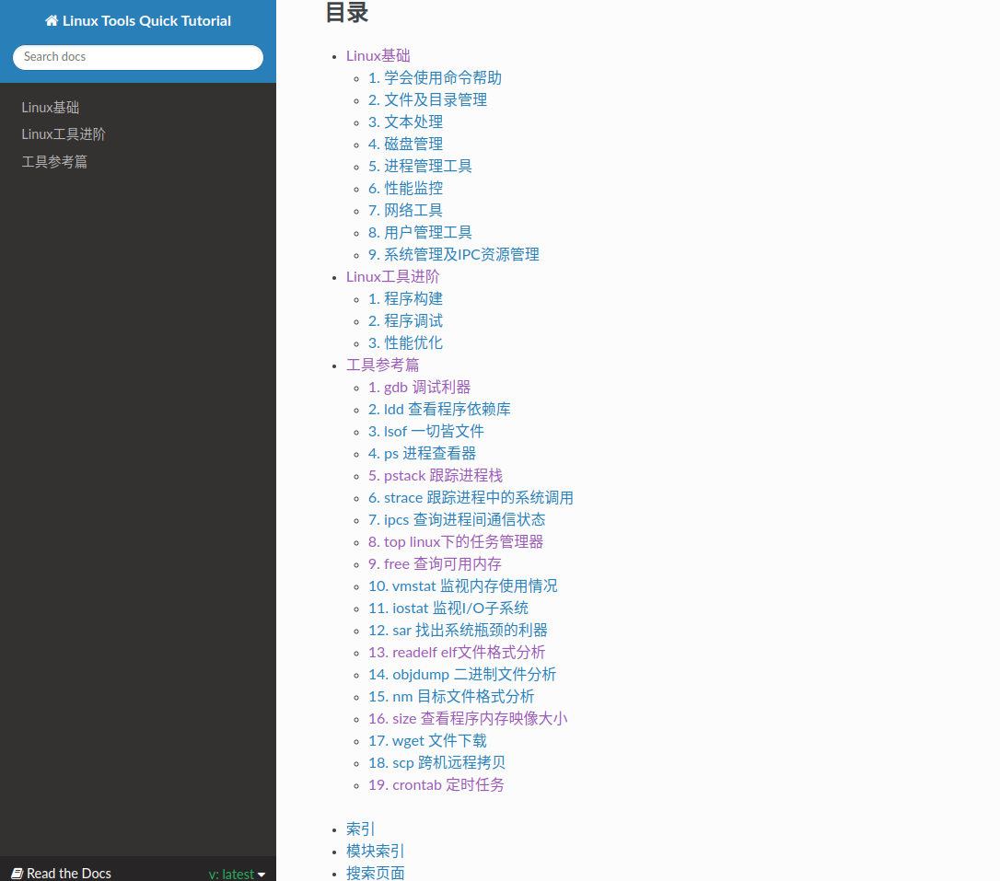

.. _chapter-c++_tutorial:

============
C++ Tutorial
============

推荐学习的CPP网站
====================

* `cppreference <https://zh.cppreference.com/w/%E9%A6%96%E9%A1%B5>`_

* `purecpp论坛 <http://purecpp.org/>`_

* `Google 开源项目风格指南——中文版 <https://zh-google-styleguide.readthedocs.io/en/latest/contents/>`_

* `C++ Templates - The Complete Guide <http://www.tmplbook.com./>`_

* `awesome-cpp <https://github.com/fffaraz/awesome-cpp>`_

* `CPlusPlusThings <https://github.com/Light-City/CPlusPlusThings>`_

* `CppTemplateTutorial <https://github.com/wuye9036/CppTemplateTutorial>`_

* `modern-cpp-tutorial <https://github.com/changkun/modern-cpp-tutorial>`_

* `advanced-cplusplus <https://github.com/caveofprogramming/advanced-cplusplus>`_

* `cpp-cheat-sheets <https://hackingcpp.com/cpp/cheat_sheets.html>`_

工程中使用到的C++技能
=========================
.. toctree::
   :maxdepth: 2

   cpp11_14_17/cpp11_14_17
   smart_pointer/smart_pointer
   template/template
   threading/threading
   stl/stl
   design_patterns/design_patterns
   3rdparty/3rdparty

Linux工具快速教程
==========================

* `Linux工具快速教程 <https://linuxtools-rst.readthedocs.io/zh_CN/latest/index.html>`_
* `GDB 调试利器 <https://linuxtools-rst.readthedocs.io/zh_CN/latest/tool/gdb.html>`_