.. highlight:: c++

.. default-domain:: cpp

=============
C++ 新特性
=============

Standard Containers
==========================

**std::vector**

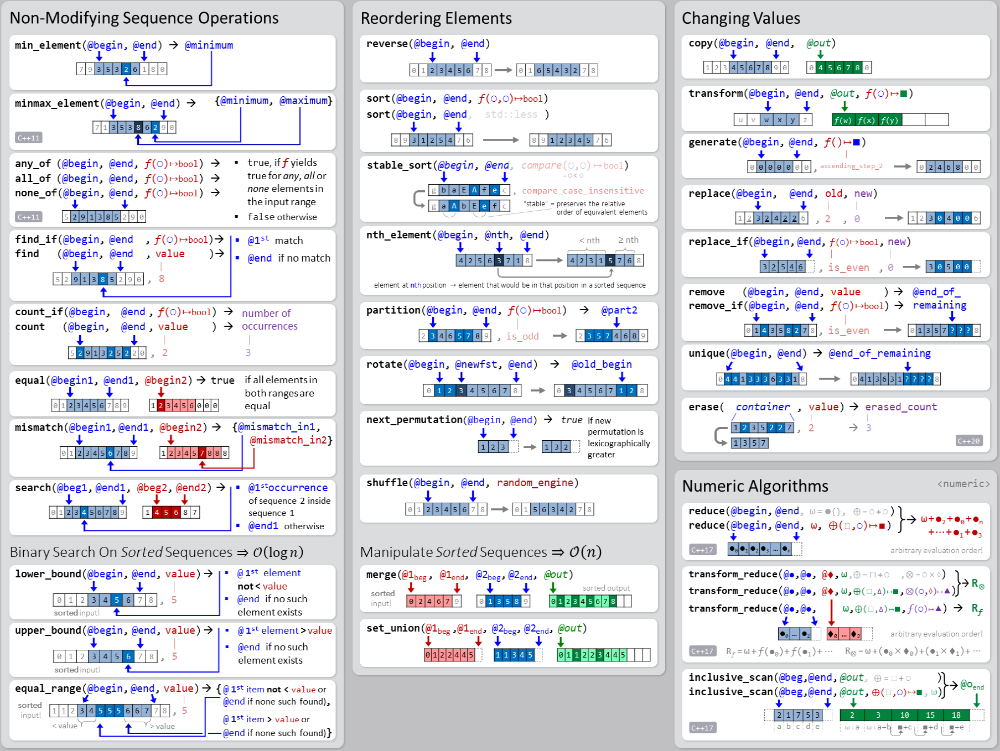

**std::deque**

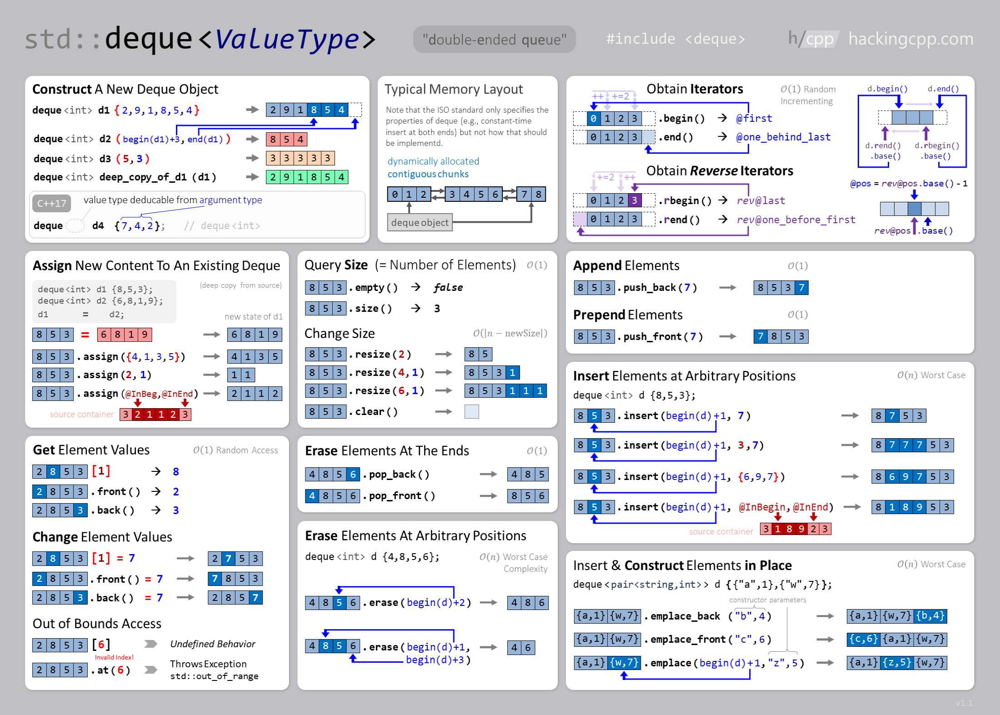

**std::list**

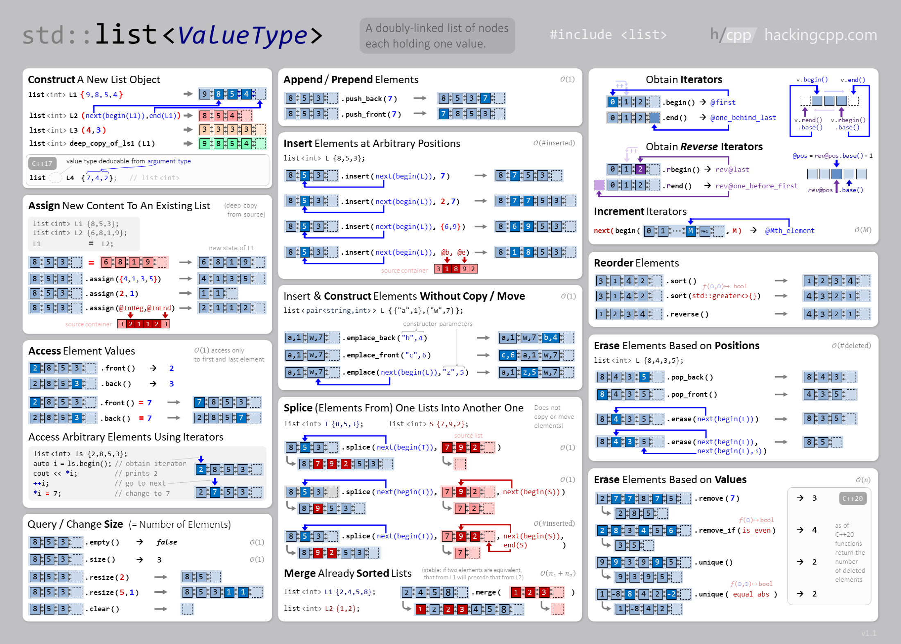

**std::forward_list**

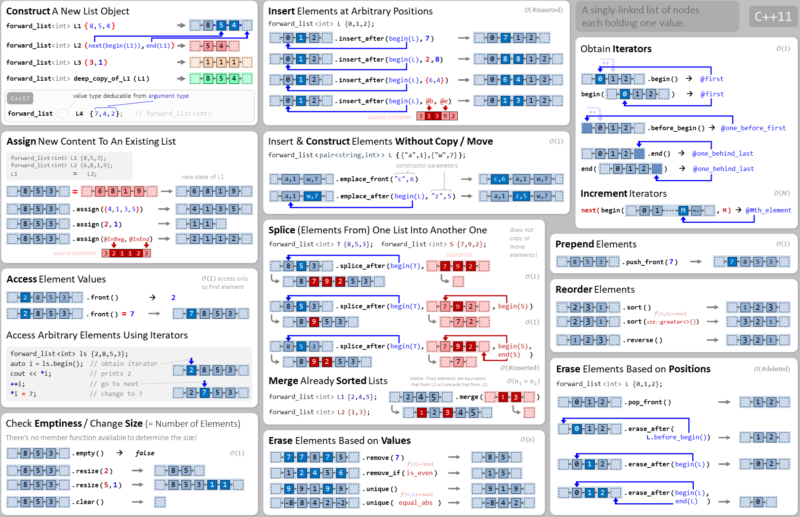

**std::string Interface & Utilities Overview**

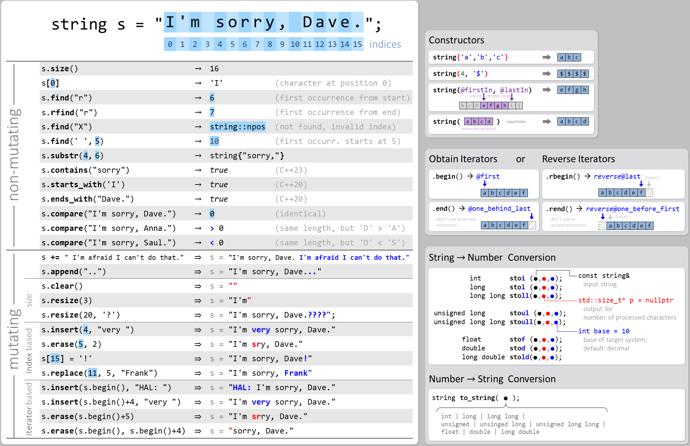

**std::set**

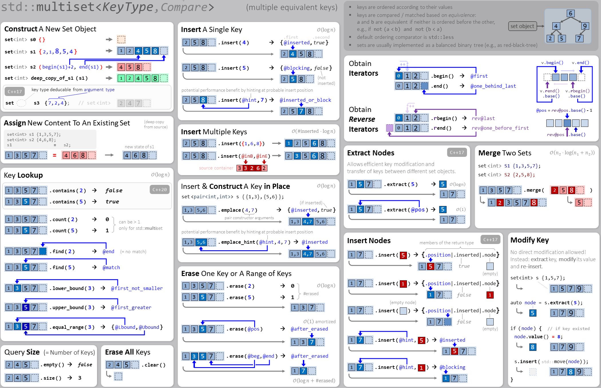

**std::map**

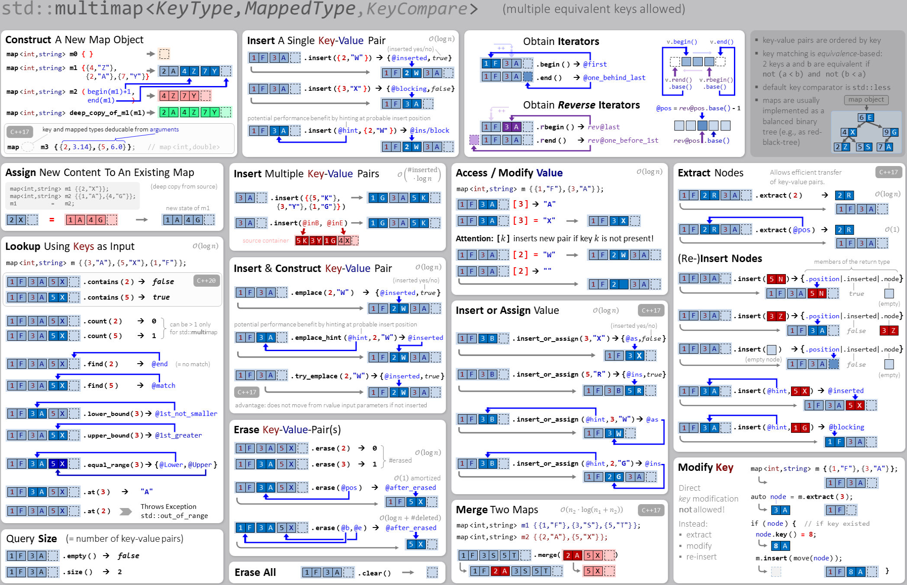

**std::unordered_set**

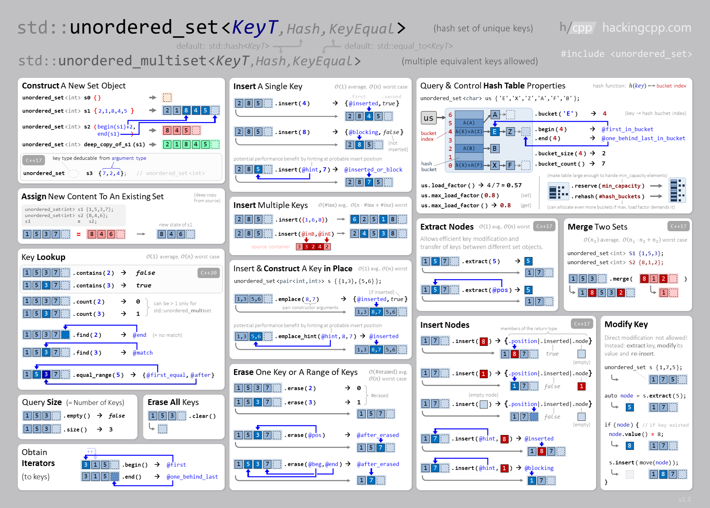

**std::unordered_map**

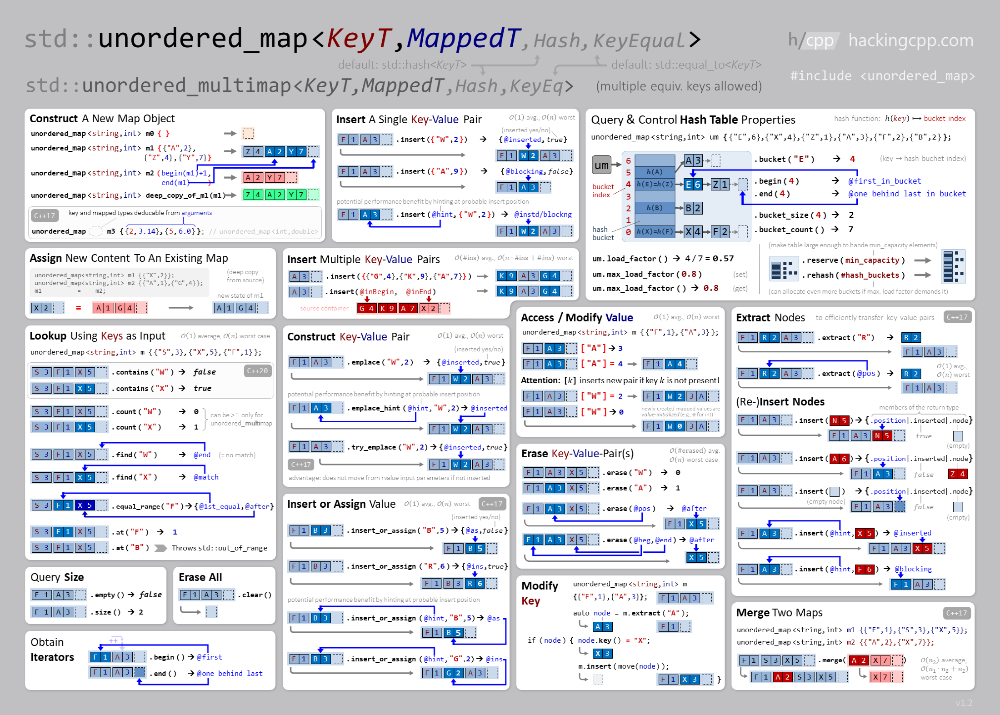

**std::span**

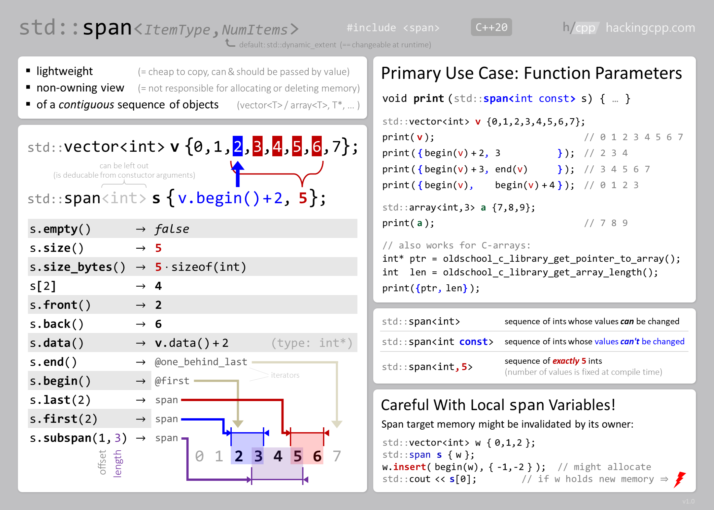

**std::string_view**

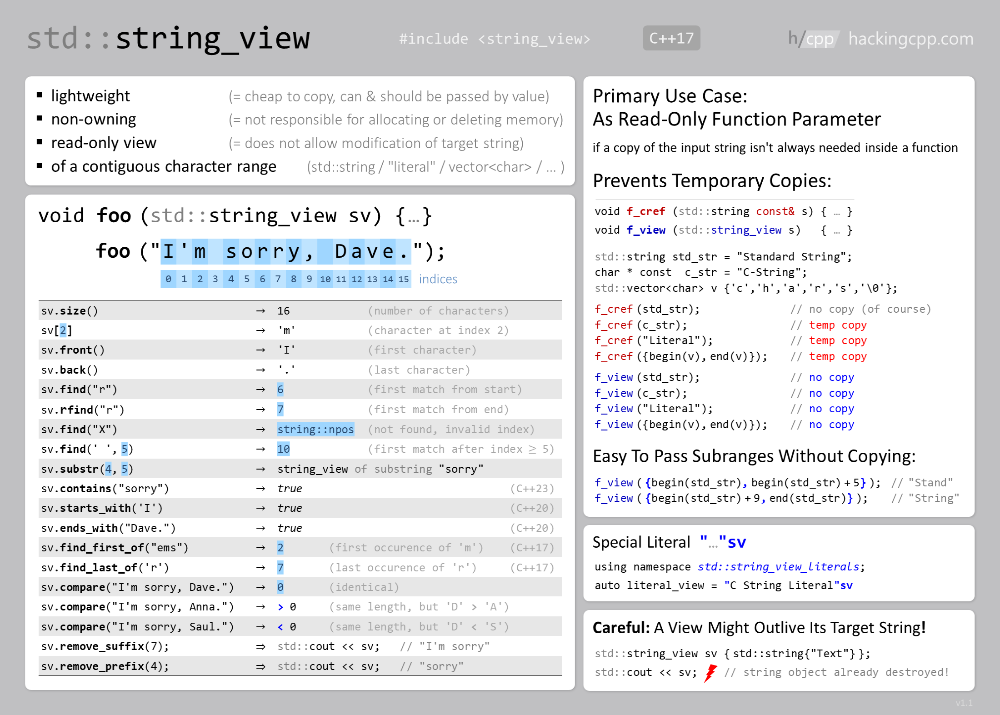

Special Containers
==========================

**special_containers**

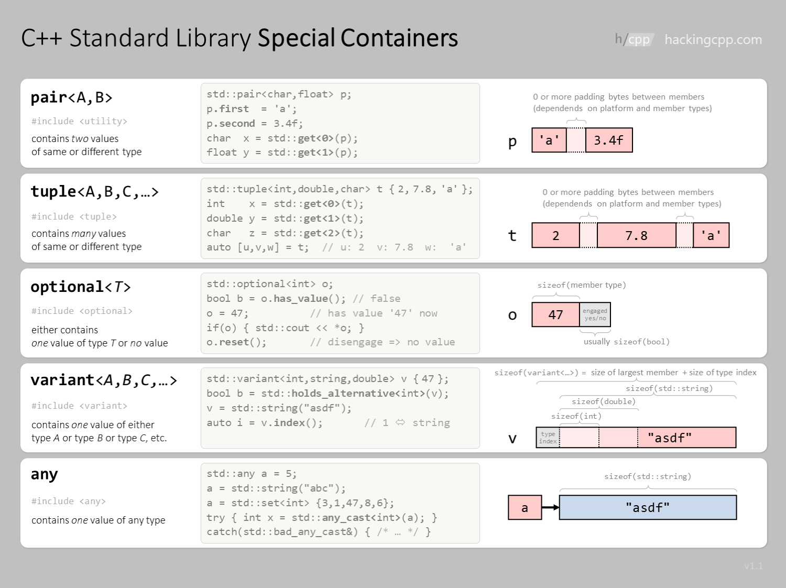

   
Lambda Expressions
==========================

**Lambda Expressions**

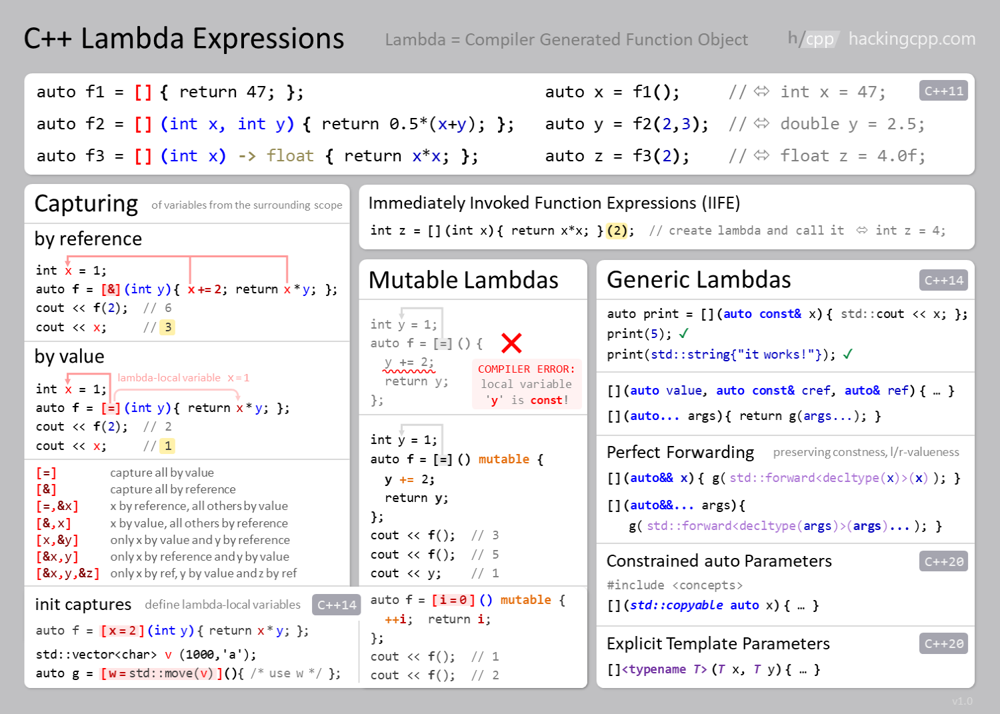

**Lambda Expression Syntax**

  .. figure:: ./images/lambda_syntax.png
   :align: center
