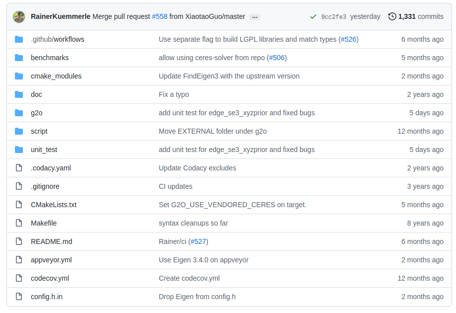

.. highlight:: c++

.. default-domain:: cpp

.. _chapter-g2o_tutorial:

============
G2O Tutorial
============

0 Introduction
===============================================

`g2o源码地址 <https://github.com/RainerKuemmerle/g2o.git>`_ ：

.. code-block:: bash

  https://github.com/RainerKuemmerle/g2o.git

如你所见，g2o项目中含有若干文件夹。刨开那些gitignore之类的零碎文件，主要有以下几个：

* EXTERNAL　　		三方库，有ceres, csparse, freeglut，可以选择性地编译；
* cmake_modules　给cmake用来寻找库的文件。我们用g2o时也会用它里头的东西，例如FindG2O.cmake
* doc　　　　　   文档。包括g2o自带的说明书（难度挺大的一个说明文档）。
* g2o　　　　　　  最重要的源代码都在这里！
* script　　　　  在android等其他系统编译用的脚本，由于我们在ubuntu下就没必要多讲了。

综上所述，最重要的就是g2o的源代码文件啦！所以我们要进一步展开看一看！

我们同样地介绍一下各文件夹的内容：

- apps　　一些应用程序。好用的g2o_viewer就在这里。其他还有一些不常用的命令行工具等。
- core　　核心组件，很重要！基本的顶点、边、图结构的定义，算法的定义，求解器接口的定义在这里。
- examples　一些例程，可以参照着这里的东西来写。不过注释不太多。
- solvers　 求解器的实现。主要来自choldmod, csparse。在使用g2o时要先选择其中一种。
- stuff　　 对用户来讲可有可无的一些工具函数。
- types　　各种顶点和边，很重要！我们用户在构建图优化问题时，先要想好自己的顶点和边是否已经提供了定义。如果没有，要自己实现。如果有，就用g2o提供的即可。

就经验而言，solvers给人的感觉是大同小异，而 types 的选取，则是 g2o 用户主要关心的内容。然后 core 下面的内容，我们要争取弄的比较熟悉，才能确保使用中出现错误可以正确地应对。

那么，g2o最基本的类结构是怎么样的呢？我们如何来表达一个Graph，选择求解器呢？我们祭出一张图：

.. image:: ./images/g2o_class.png
   :align: center

一个是 SparseBlockMatrix ，用于计算稀疏的雅可比和海塞； 一个是用于计算迭代过程中最关键的一步 :

.. math:: 

  H\Delta{x} = b

这就需要一个线性方程的求解器。而这个求解器，可以从 PCG, CSparse, Choldmod 三者选一。

综上所述，在g2o中选择优化方法一共需要6个步骤：

* 1. 选择一个线性方程求解器，从 PCG, CSparse, Choldmod中选，实际则来自 g2o/solvers 文件夹中定义的东东。
* 2. 创建BlockSolver。并用上面定义的线性求解器初始化。
* 3. 创建总求解器solver。并从GN, LM, DogLeg 中选一个，再用上述块求解器BlockSolver初始化。
* 4. 创建终极大boss 稀疏优化器（SparseOptimizer），并用已定义求解器作为求解方法。
* 5. 定义图的顶点和边。并添加到SparseOptimizer中。
* 6. 设置优化参数，开始执行优化。

1 (Hyper)Graph-Embeddable Optimization Problems
===============================================

误差方程一阶泰勒展开：

.. math:: 

  \begin{align}
	\breve{\mathbf{e}}(x_k + \Delta{x_k}) &= 
		\breve{\mathbf{e}}(x_k + \mathbf{\Delta{x}}) \\
		&\backsimeq \mathbf{e}_k + J_k\Delta{\mathbf{x}}
  \end{align}

where : :math:`J_k` Jacobian

so that, we obtatin :

.. math:: 

  \begin{align}
  F_k(\mathbf{x} + \Delta{\mathbf{x}})
    &= \breve{\mathbf{e}}(x_k + \Delta{x_k})^{T}\Omega_{k}\breve{\mathbf{e}}(x_k + \Delta{x_k}) \\
    &\backsimeq (\mathbf{e}_k + J_k\Delta{\mathbf{x}})^{T}\Omega_{k}(\mathbf{e}_k + J_k\Delta{\mathbf{x}})\\
    &= \underbrace{\mathbf{e}_k^{T}\Omega_{k}\mathbf{e}_k}_{c_k}+ 
    2\underbrace{\mathbf{e}_k^{T}\Omega_{k}J_k^{T}}_{\mathbf{b}_k} \Delta{\mathbf{x}} +
    \Delta{\mathbf{x}}^{T}\underbrace{J_k^{T} \Omega_{k}J_k}_{H_k}\Delta{\mathbf{x}} \\
    &= c_k + 2\mathbf{b}_k\Delta{\mathbf{x}} +
        \Delta{\mathbf{x}}^{T}H_k\Delta{\mathbf{x}}
  \end{align}

It can be minimized in :math:`\Delta{\mathbf{x}}` by solving the linear system :

.. math:: 

  H\Delta{\mathbf{x^{\star}}} = -\mathbf{b}

2 Least Squares Optimization
===============================================

3 Considerations about the Structure of the Linearized System
==============================================================

4 Least Squares on Manifold
===============================================

5 Robust Least Squares
===============================================

least squares optimization can be robustified, error terms:

.. math:: 

  F_k = \mathbf{e}_k^{T}\Omega_k\mathbf{e}_k = \rho_{2}
  \left( 
    \sqrt{\mathbf{e}_k^{T}\Omega_k\mathbf{e}_k}
  \right)
  \quad with \quad 
  \rho_{2}(x) := x^2

Huber cost function :math:`ρ_H` :

.. math:: 

  \rho_{H}(x): =
  \begin{cases}
    x^2 	\quad \quad \quad \quad\text {if |x| < b} \\
    2b|x| - b^2 \quad \text{else}
  \end{cases}

Then, :math:`e_k` is replaced by a weighted version :

.. math:: 

  (w_k\mathbf{e}_k)^{T}\Omega_{k}w_k(\mathbf{e}_k) = \rho_{H}
  \left(
    \sqrt{\mathbf{e}_k^{T}\Omega_k\mathbf{e}_k}
  \right)

Here, the weights wk are calculated as follows:

.. math:: 

  w_k = \frac{\sqrt{\rho_{H}(||\mathbf{e}_k||_{\Omega})}}{||\mathbf{e}_k||_{\Omega}}
  \quad with  \quad ||\mathbf{e}_k||_{\Omega}:= \sqrt{\mathbf{e}_k^{T}\Omega_k\mathbf{e}_k}

6 Library Overview
===============================================

6.1 Representation of an Optimization Problem
-----------------------------------------------

* BaseVertex
* BaseBinaryEdge
* BaseMultiEdge

6.2 Construction and Representation of the Linearized Problem
--------------------------------------------------------------

* Initialization
* Compute error
* Linearizing the system
* Building the system
* Updating Levenberg-Marquardt
* Solvers

  * PCG
  * G-N
  * L-M

7 g2o Tools
===============================================

g2o 带有两个工具，可以处理存储在文件中的数据。 数据可以从文件中加载并在处理后再次存储。 下面我们将简要介绍这些工具，即命令行界面和图形用户界面。

7.1 g2o Command Line Interface
-----------------------------------------------

g2o 是 g2o 中包含的命令行界面。 它允许优化存储在文件中的图形并将结果保存回文件。 这允许优化问题的快速原型设计，因为它只需要实现新类型或求解器。 
g2o 发行版包括一个数据文件夹，其中包含一些可以应用 g2o 的数据文件。

7.2 g2o Viewer
-----------------------------------------------

图 3 中描绘的图形用户界面允许可视化优化问题。 此外，可以控制算法的各种参数。

7.3 g2o incremental
-----------------------------------------------

g2o 包含一个实验二进制文件，用于以增量方式执行优化，即在插入一个或多个节点及其测量值后进行优化。 
在这种情况下，g2o 对 Hessian 矩阵执行 ranke 更新以更新线性系统。 有关其他信息，请参阅 g2o_incremental 子文件夹中的自述文件。

Example for the Manhattan3500 dataset :

.. code-block:: bash

  g2o_incremental -i manhattanOlson3500.g2o

7.4 Plug-in Architecture
-----------------------------------------------

8 2D SLAM: An Example
===============================================

9 G2O Example
===============================================

9.1 Example: circle fit
----------------------------------------------

.. _section-circle_fit:

circle function：

.. math:: 

    (x - a)^2 + (y - b)^2 = r^2

circle极坐标的方程表示:

.. math:: 

    \begin{cases}
        x = x_0 + r\cos{\theta} \\
        y = y_0 + r\sin{\theta}
    \end{cases}

demo源码 [#f1]_ [#f2]_ [#f3]_ :

VertexCircle :

.. code-block:: c++

    /**
     * A circle located at x,y with radius r
     */
    class VertexCircle : public ::g2o::BaseVertex<3, Eigen::Vector3d>
    {
    public:
        EIGEN_MAKE_ALIGNED_OPERATOR_NEW;
        VertexCircle(){}

        virtual bool read(std::istream& /*is*/);
        virtual bool write(std::ostream& /*os*/) const;

        virtual void setToOriginImpl();
        virtual void oplusImpl(const double* update);
    };

EdgePointOnCircle :

.. code-block:: c++

    /**
     * measurement for a point on the circle
     *
     * Here the measurement is the point which is on the circle.
     * The error function computes the distance of the point to
     * the center minus the radius of the circle.
     */
    class EdgePointOnCircle : public ::g2o::BaseUnaryEdge<1, Eigen::Vector2d, VertexCircle>
    {
    public:
        EIGEN_MAKE_ALIGNED_OPERATOR_NEW

        EdgePointOnCircle() {}

        virtual bool read(std::istream & /*is*/);
        virtual bool write(std::ostream & /*os*/) const;

        void computeError();
    };

.. code-block:: c++

    void CircleFit::RunDemo()
    {
        int numPoints = 100;
        int maxIterations = 10;
        bool verbose = true;

        // --1 generate random data
        Eigen::Vector2d center(4.0, 2.0);
        double radius = 2.0;
        Eigen::Vector2d* points = new Eigen::Vector2d[numPoints];

        ::g2o::Sampler::seedRand();
        for (int i = 0; i < numPoints; ++i) {
            double r = ::g2o::Sampler::gaussRand(radius, 0.05);
            double angle = ::g2o::Sampler::uniformRand(0.0, 2.0 * M_PI);
            points[i].x() = center.x() + r * cos(angle);
            points[i].y() = center.y() + r * sin(angle);
        }

        // --2 setup the solver
        ::g2o::SparseOptimizer optimizer;
        optimizer.setVerbose(false);
        ::g2o::OptimizationAlgorithmLevenberg* solver = new ::g2o::OptimizationAlgorithmLevenberg(
                ::g2o::make_unique<MyBlockSolver>(::g2o::make_unique<MyLinearSolver>()));
        optimizer.setAlgorithm(solver);

        // --3 build the optimization problem given the points
        // 3.1. add the circle vertex
        VertexCircle* circle = new VertexCircle();
        circle->setId(0);
        circle->setEstimate(Eigen::Vector3d(3.0, 3.0, 3.0)); // some initial value for the circle
        optimizer.addVertex(circle);
        // 3.2. add the points we measured
        for (int i = 0; i < numPoints; ++i) {
            EdgePointOnCircle* e = new EdgePointOnCircle;
            e->setInformation(Eigen::Matrix<double, 1, 1>::Identity());
            e->setVertex(0, circle);
            e->setMeasurement(points[i]);
            optimizer.addEdge(e);
        }

        // --4 perform the optimization
        optimizer.initializeOptimization();
        optimizer.setVerbose(verbose);
        optimizer.optimize(maxIterations);

        if (verbose) {
            std::cout << std::endl;
        }

        // --5 print out the result
        std::cout << "Iterative least squares solution" << std::endl;
        std::cout << "center of the circle " << circle->estimate().head<2>().transpose() << std::endl;
        std::cout << "radius of the cirlce " << circle->estimate()(2) << std::endl;
        std::cout << "error " << ErrorOfSolution(numPoints, points, circle->estimate()) << std::endl;
        std::cout << std::endl;
        
        // clean up
        delete[] points;
    }

.. rubric:: Footnotes

.. [#f1] `circle_fit.cpp
   <https://github.com/quanduyong/LTSLAM/blob/main/xslam/xslam/g2o/circle_fit.cpp>`_
.. [#f2] `circle_fit.h
   <https://github.com/quanduyong/LTSLAM/blob/main/xslam/xslam/g2o/circle_fit.h>`_
.. [#f3] `circle_fit_test.cpp
    <https://github.com/quanduyong/LTSLAM/blob/main/xslam/xslam/g2o/circle_fit_test.cpp>`_

9.2 Example: curve fit
----------------------------------------------

曲线方程：

.. math:: 

  y = \exp(ax^2 + bx + c) + w

where :

  * :math:`a, b, c` 为曲线参数
  * :math:`w` 为高斯噪声

Vertex类型:

.. code-block:: c++

  // 曲线模型的顶点，模板参数：优化变量维度和数据类型
  class CurveFittingVertex : public ::g2o::BaseVertex<3, Eigen::Vector3d>
  {
  public:
      EIGEN_MAKE_ALIGNED_OPERATOR_NEW

      // 重置
      virtual void setToOriginImpl() override {
          _estimate << 0, 0, 0;
      }

      // 更新
      virtual void oplusImpl(const double *update) override {
          _estimate += Eigen::Vector3d(update);
      }

      // 存盘和读盘：留空
      virtual bool read(std::istream &in) {}
      virtual bool write(std::ostream &out) const {}
  };

Edge类型：

.. code-block:: c++

  // 误差模型 模板参数：观测值维度，类型，连接顶点类型
  class CurveFittingEdge : public ::g2o::BaseUnaryEdge<1, double, CurveFittingVertex>
  {
  public:
      EIGEN_MAKE_ALIGNED_OPERATOR_NEW
      CurveFittingEdge(double x) : BaseUnaryEdge(), _x(x) {}

      // 计算曲线模型误差
      virtual void computeError() override
      {
          const CurveFittingVertex *v = static_cast<const CurveFittingVertex *> (_vertices[0]);
          const Eigen::Vector3d abc = v->estimate();
          _error(0, 0) = _measurement - std::exp(abc(0, 0) * _x * _x + abc(1, 0) * _x + abc(2, 0));
      }

      // 计算雅可比矩阵
      virtual void linearizeOplus() override
      {
          const CurveFittingVertex *v = static_cast<const CurveFittingVertex *> (_vertices[0]);
          const Eigen::Vector3d abc = v->estimate();
          double y = exp(abc[0] * _x * _x + abc[1] * _x + abc[2]);
          _jacobianOplusXi[0] = -_x * _x * y;
          _jacobianOplusXi[1] = -_x * y;
          _jacobianOplusXi[2] = -y;
      }

      virtual bool read(std::istream &in) {}
      virtual bool write(std::ostream &out) const {}
  public:
      double _x;  // x 值， y 值为 _measurement
  };

9.3 Example: sphere
----------------------------------------------

9.4 Example:  simple optimize
----------------------------------------------

9.5 Example: ba
----------------------------------------------

9.6 Example: bal
----------------------------------------------

9.7 Example: ba anchored inverse depth
----------------------------------------------

9.8 Example: data convert
----------------------------------------------

9.9 Example: icp
----------------------------------------------

9.10 Example: slam2d
----------------------------------------------

9.11 Example: tutorial slam2d
----------------------------------------------

9.12 Example: line slam
----------------------------------------------

9.13 Example: plane slam
----------------------------------------------

9.14 Example: interactive slam
----------------------------------------------

9.15 Example: calibration odom laser
----------------------------------------------

9.2 Example: Curve Fit
----------------------------------------------

10 参考
===============================================

* 1 `[深入理解图优化与g2o：g2o篇] <https://www.cnblogs.com/gaoxiang12/p/5304272.html)](https://www.cnblogs.com/gaoxiang12/p/5304272.html>`_ 

* 2 `[g2o: A general Framework for (Hyper) Graph Optimization] <https://github.com/RainerKuemmerle/g2o/blob/master/doc/g2o.pdf>`_ 

