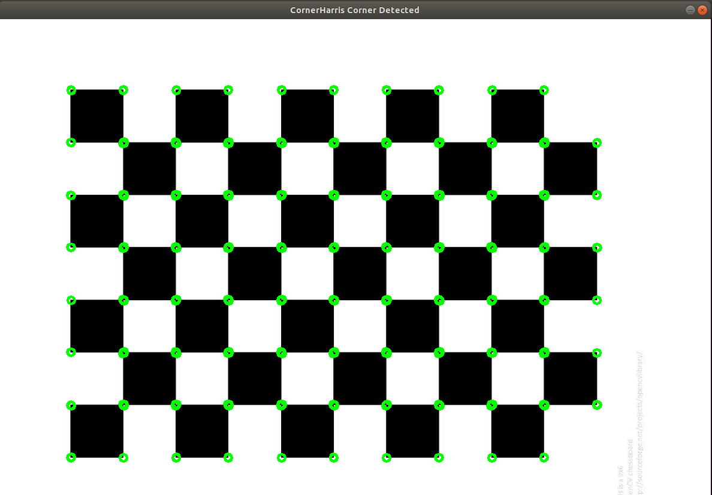
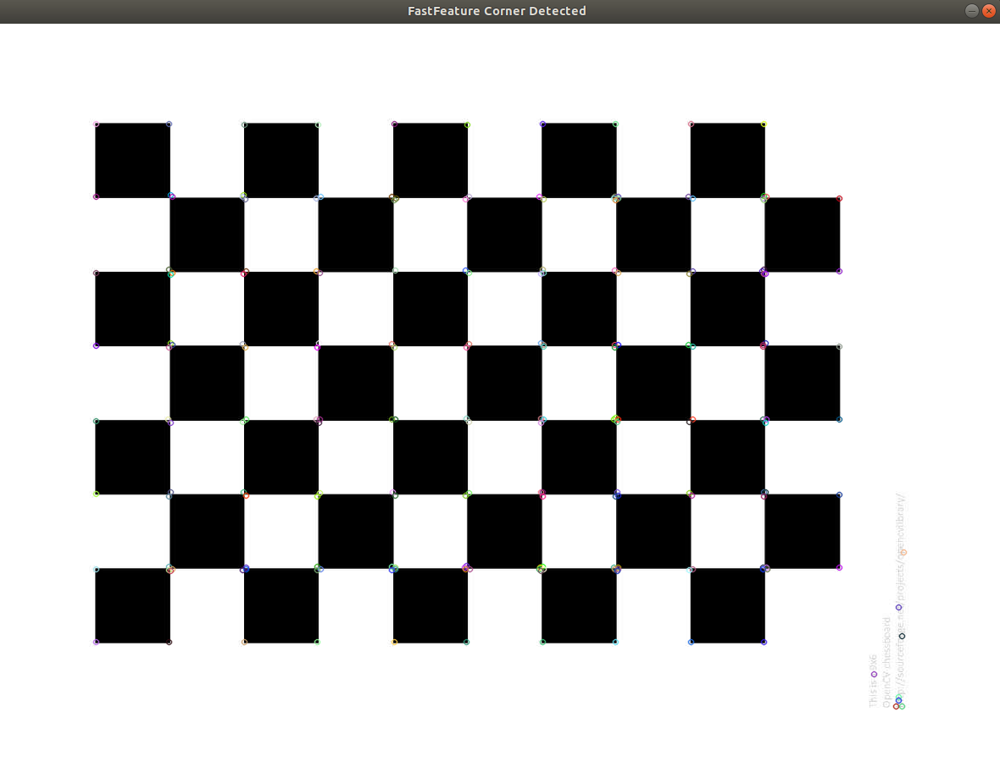

.. highlight:: c++

.. default-domain:: cpp

==================
Feature Detection
==================

1 理解特征
==================

寻找独特的，易于跟踪和比较的特定模板或特定特征。如果我们对这种特征进行定义，可能会发现很难用语言来表达它，
但是我们知道它们是什么。如果有人要求你指出一项可以在多张图像中进行比较的良好特征，则可以指出其中一项。

因此，我们的一个基本问题扩展到更多，但变得更加具体。这些特征是什么？（答案对于计算机也应该是可以理解的。）

很难说人类如何发现这些特征。这已经在我们的大脑中进行了编码。但是，如果我们深入研究某些图片并搜索不同的模板，
我们会发现一些有趣的东西。例如，看以下的图片：

.. figure:: ./images/feature_building.jpg
   :align: center

2 Harris角点检测
==================

它基本上找到了 :math:`(u，v)` 在所有方向上位移的强度差异。表示如下：

.. math:: 

    E(u, v) = \sum_{x,y} w(x, y) [I(x+u, y+v) - I(x, y)]

窗口函数要么是一个矩形窗口,要么是高斯窗口,它在下面赋予了值。

我们必须最大化这个函数 :math:`E(u,v)` 用于角检测。这意味着,我们必须最大化第二个项。
将泰勒扩展应用于上述方程,并使用一些数学步骤(请参考任何你喜欢的标准文本书),
我们得到最后的等式:

.. math::

    E(u, v) \simeq   
    \begin{bmatrix}
        u & v
    \end{bmatrix} M 
    \begin{bmatrix}
        u \\
        v
    \end{bmatrix}

其中

.. math::

    M = \sum_{x,y} w(x, y)
     \begin{bmatrix}
        I_{x}I_{x} & I_{x}I_{y} \\
        I_{x}I_{y} & I_{y}I_{y} 
    \end{bmatrix}

在此，:math:`Ix` 和 :math:`Iy`分别是在x和y方向上的图像导数。（可以使用 **cv::Sobel()** 轻松找到）。

然后是主要部分。之后，他们创建了一个分数，基本上是一个等式，
它将确定一个窗口是否可以包含一个角。

.. math::

    R = det(M) - k(trace(M))^2

其中
   * :math:`det(M)=λ1λ2`

   * :math:`trace(M)=λ1+λ2`

   * :math:`λ1` and :math:`λ2` 是 :math:`M` 的特征值

可以用如下图来表示：

.. figure:: ./images/harris_region.jpg
   :align: center

因此，Harris Corner Detection的结果是具有这些分数的灰度图像。
合适的阈值可为您提供图像的各个角落。我们将以一个简单的图像来完成它。

Opencv API :

.. code-block:: c++

    void cornerHarris( InputArray src, OutputArray dst, int block Size, 
        int ksize, double k, int borderType = BORDER_DEFAULT)

.. NOTE:: 

    * InputArray类型的src，输入图像，即原图像，填Mat类型即可，且需要为单通道8位或者浮点型图像
    * OutputArray类型的dst，函数调用后的运算结果存在这里，即这个参数用于存放Harris角点检测的输出结果，和原图片有一样的尺寸和类型
    * int类型的blockSize，表示邻域的大小，更多详细信息在cornerEigenValsAndVecs()中讲到
    * int类型的ksize，表示Sobel()算子的孔径的大小
    * double类型的k，Harris参数
    * int类型的borderType，图像像素的边界模式。注意它有默认值BORDER_DEFAULT

demo调用, 源码 

.. code-block:: c++

    TEST(CornerHarris, cornerDetect)
    {
        std::string filename = GetOpenCVDatasetDirectory() + "/0002_chessboard.jpeg";
        CornerHarris demo;
        demo.CornerDetect(filename);
    }

函数使用：

.. code-block:: c++
        
    void CornerHarris::CornerDetect(const std::string& filename)
    {
        // 1 read a image
        cv::Mat image = cv::imread(filename);
        if (image.data == nullptr) {
            std::cout << "Load image error." << std::endl;
            exit(-1);
        }

        // 2 convert to gray
        cv::Mat gray;
        cv::cvtColor(image, gray,cv::COLOR_BGR2GRAY);

        // 3 cornerHarris角点检测
        // 进行角点检测
        // 领域大小为 2
        // sobel 算子孔径 3
        // harris 参数
        cv::Mat dstImage;       //目标图
        cv::Mat normImage;      //归一化后的图
        cv::Mat scaledImage;    //线性变换后的八位无符号整型的图

        //置零当前需要显示的两幅图，即清除上一次调用此函数时他们的值
        dstImage = cv::Mat::zeros(image.size(), CV_32FC1 );
        cv::cornerHarris(gray, dstImage, 2, 3, 0.04, cv::BORDER_DEFAULT );

        // 归一化与转换
        cv::normalize( dstImage, normImage, 0, 255, cv::NORM_MINMAX, CV_32FC1, cv::Mat() );
        convertScaleAbs( normImage, scaledImage );      //将归一化后的图线性变换成8位无符号整型

        // 4、进行绘制
        // 将检测到的，且符合阈值条件的角点绘制出来
        int corner_count = 0;
        for( int j = 0; j < normImage.rows ; j++ )
            for( int i = 0; i < normImage.cols; i++ )
            {
                if( (int) normImage.at<float>(j,i) > 80 )    //  设定阈值
                {
                    cv::circle(image, cv::Point( i, j ), 6,  cv::Scalar(0,255,5), 2, 1, 0 );
                }
            }

        // 5 显示最终效果
        cv::imshow("CornerHarris Corner Detected", image);
        cv::waitKey(0);
        cv::destroyAllWindows();
    }

运行结果

.. code-block:: bash

    [bin] ./xslam.opencv.feature_detection.corner_harris_test

3 Fast ORB角点检测
==================

.. code-block:: c++

    Ptr<FastFeatureDetector> create(int threshold=10,
        bool nonmaxSuppression=true,int type=FastFeatureDetector::TYPE_9_16 );

.. NOTE:: 

    * threshold: 阈值
    * nonmaxSuppression: 非极大值抑制
    * type: 邻域类型

demo调用, 源码

.. code-block:: c++

    TEST(FastFeature, cornerDetect)
    {
        std::string filename = GetOpenCVDatasetDirectory() + "/0002_chessboard.jpeg";
        FastFeature demo;
        demo.CornerDetect(filename);
    }

函数使用：

.. code-block:: c++

    void FastFeature::CornerDetect(const std::string& filename)
    {
        // 1 read a image
        cv::Mat image = cv::imread(filename);
        if (image.data == nullptr) {
            std::cout << "Load image error." << std::endl;
            exit(-1);
        }

        // 2 convert to gray
        cv::Mat gray;
        cv::cvtColor(image, gray,cv::COLOR_BGR2GRAY);

        std::vector<cv::KeyPoint> keypoints;
        cv::Mat dst = image.clone();
        cv::Ptr<cv::FastFeatureDetector> detector = cv::FastFeatureDetector::create(40);
        detector->detect(image,keypoints);
        drawKeypoints(dst, keypoints, dst, cv::Scalar::all(-1), cv::DrawMatchesFlags::DRAW_OVER_OUTIMG);

        cv::imshow("FastFeature Corner Detected", dst);
        cv::waitKey(0);
        cv::destroyAllWindows();
    }

运行结果

.. code-block:: bash

    [bin] ./xslam.opencv.feature_detection.corner_harris_test

4 SIFT角点检测
==================

.. code-block:: c++

demo调用, 源码

.. code-block:: c++

函数使用：

.. code-block:: c++

运行结果

5 shi tomasi角点检测
=====================

.. code-block:: c++

demo调用, 源码

.. code-block:: c++

函数使用：

.. code-block:: c++

运行结果

6 BRIEF 角点检测
==================

.. code-block:: c++

demo调用, 源码

.. code-block:: c++

函数使用：

.. code-block:: c++

运行结果