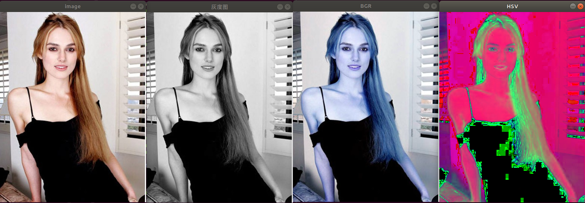
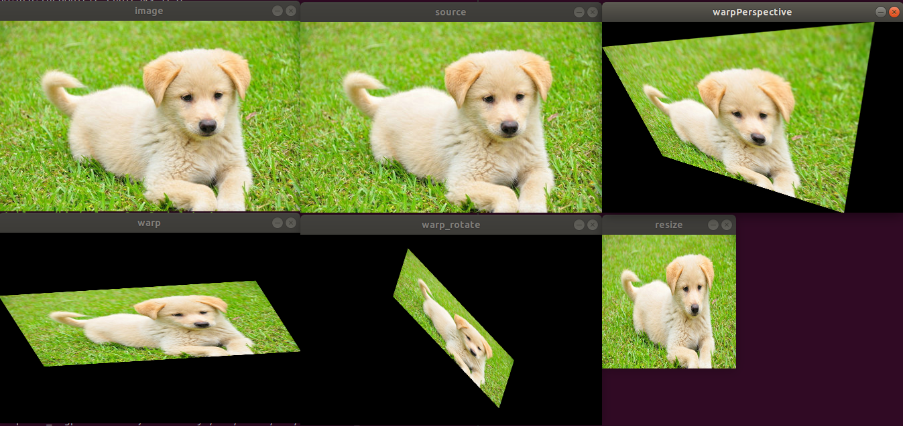
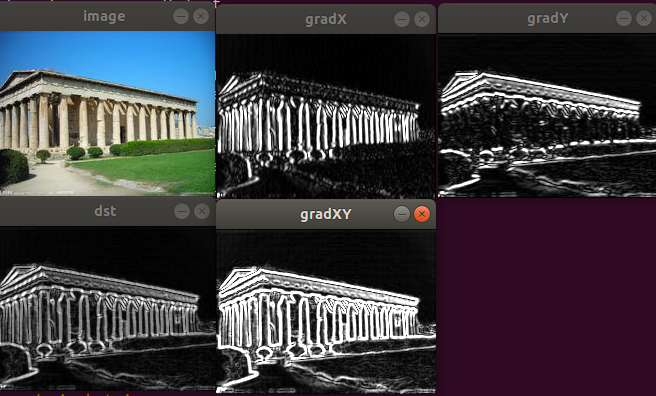
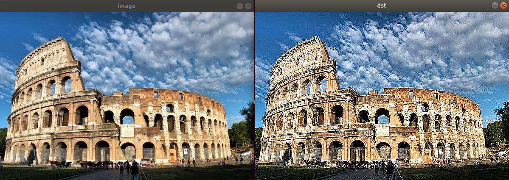
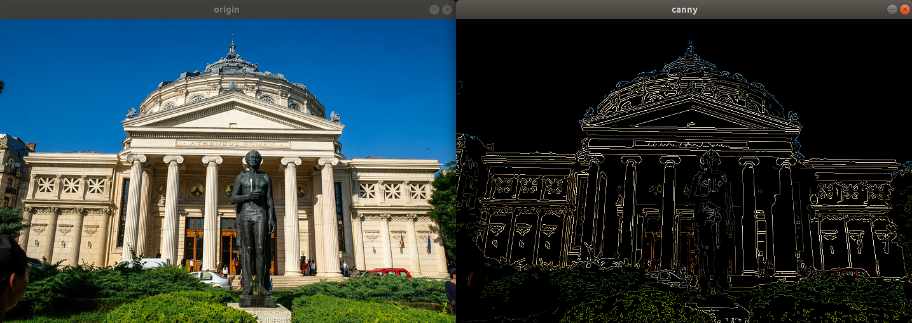

.. highlight:: c++

.. default-domain:: cpp

==================
Image Processing
==================

1 改变颜色空间
==================

OpenCV中有超过150种颜色空间转换方法。但是我们将研究只有两个最广泛使用的,BGR↔灰色和BGR↔HSV。

Opencv C++ API:

.. code-block:: c++

    void cvtColor(InputArray src, OutputArray dst, int code, int dstCn = 0);

.. NOTE::

    * src 输入图像
    * dst 输出图像
    * code 代码颜色空间转换代码
    * dstCn 目标图像中的信道数; 如果该参数为0，则通道的数量自动从SRC和code派生。

demo调用, 源码 

.. code-block:: c++

    TEST(CvtColor, demo)
    {
        std::string filename = GetOpenCVDatasetDirectory() + "/0015_gudian.jpg";
        CvtColor demo;
        demo.RunDemo(filename);
    }

函数使用：

.. code-block:: c++

    void CvtColor::RunDemo(const std::string& filename)
    {
        // 0. 读取图像
        cv::Mat image = cv::imread(filename);
        if (image.data == nullptr) {
            std::cout << "Load image error." << std::endl;
            exit(-1);
        }
        // 原图
        cv::imshow("image", image); // 展示源图像

        // 灰度图
        cv::Mat img1, img2, img3;
        cv::cvtColor(image, img1, cv::COLOR_RGB2GRAY);
        cv::imshow("灰度图", img1);

        // HSV
        cv::cvtColor(image, img2, cv::COLOR_RGB2HSV);
        cv::imshow("HSV", img2);

        // BGR
        cv::cvtColor(image, img3, cv::COLOR_RGB2BGR);
        cv::imshow("BGR", img3);
    
        cv::waitKey(0);
        cv::destroyAllWindows();
    }

运行结果

.. code-block:: bash

    [bin] ./xslam.opencv.image_processing.cvtColor_test

参考源码：

.. NOTE::

    * cvtColor_test.h
    * cvtColor.cpp
    * cvtColor.h

2 图像的几何变换
==================

几何变换应用到图像上，如平移、旋转、仿射变换等

OpenCV提供了两个转换函数**cv::warpAffine**和**cv::warpPerspective**，您可以使用它们进行各种转换。
**cv::warpAffine**采用2x3转换矩阵，而**cv::warpPerspective**采用3x3转换矩阵作为输入

**缩放**

缩放只是调整图像的大小。为此，OpenCV带有一个函数 **cv::resize()** 。图像的大小可以手动指定，
也可以指定缩放比例。也可使用不同的插值方法。首选的插值方法是 **cv::INTER_AREA** 用于缩小，**cv::INTER_CUBIC** （慢）
和 **cv::INTER_LINEAR** 用于缩放。默认情况下，出于所有调整大小的目的，使用的插值方法为 **cv::INTER_LINEAR** 。
您可以使用以下方法调整输入图像的大小：

Opencv C++ API:

.. code-block:: c++

    void cv::resize (InputArray src, OutputArray dst,
		Size dsize, double fx = 0, double fy = 0, int interpolation = INTER_LINEAR)

.. NOTE::

    * src - 输入图像。
    * dst - 输出图像；它的大小为 dsize（当它非零时）或从 src.size()、fx 和 fy 计算的大小；dst 的类型与 src 的类型相同。
    * dsize - 输出图像大小；如果它等于零，则计算为：dsize = Size(round(fx*src.cols), round(fy*src.rows))。dsize 或 fx 和 fy 必须为非零。
    * fx - 沿水平轴的比例因子；当它等于 0 时，它被计算为(double)dsize.width/src.cols
    * fy - 沿垂直轴的比例因子；当它等于 0 时，它被计算为(double)dsize.height/src.rows

**平移**

平移是物体位置的移动。如果您知道在(x,y)方向上的位移，则将其设为 :math:`(t_x, t_y)` ，你可以创建转换矩阵

.. math:: 

    \begin{bmatrix}
        1 & 0 & t_x \\
        0 & 1 & t_y
    \end{bmatrix}

Opencv C++ API:

.. code-block:: c++

    void warpAffine(InputArray src, OutputArray dst, InputArray M, Size dsize, 
        int flags=INTER_LINEAR, intborderMode=BORDER_CONSTANT, const Scalar& borderValue=Scalar())

.. NOTE::

    * InputArray src：输入的图像
    * OutputArray dst：输出的图像
    * InputArray M：透视变换的矩阵
    * Size dsize：输出图像的大小
    * int flags=INTER_LINEAR：输出图像的插值方
    * int borderMode=BORDER_CONSTANT：图像边界的处理方式
    * const Scalar& borderValue=Scalar()：边界的颜色设置，一般默认是0

**旋转**

Opencv C++ API:

.. code-block:: c++

    Mat getRotationMatrix2D(Point2f center, double angle, double scale)

.. NOTE::

    * Point2f center：表示旋转的中心点
    * double angle：表示旋转的角度
    * double scale：图像缩放因子

**仿射变换**

Opencv C++ API:

.. code-block:: c++

    Mat getAffineTransform(InputArray src, InputArray dst)

.. NOTE::

    * InputArray src：表示输入的三个点
    * InputArray dstL:表示输出的三个点

**透视变换**

Opencv C++ API:

.. code-block:: c++

    void warpPerspective(InputArray src, OutputArray dst, InputArray M, 
        Size dsize, int flags=INTER_LINEAR, int borderMode=BORDER_CONSTANT, 
            const Scalar& borderValue=Scalar())

.. NOTE::

    * InputArray src：输入的图像
    * OutputArray dst：输出的图像
    * InputArray M：透视变换的矩阵
    * Size dsize：输出图像的大小
    * int flags=INTER_LINEAR：输出图像的插值方法，
    * int borderMode=BORDER_CONSTANT：图像边界的处理方式
    * const Scalar& borderValue=Scalar()：边界的颜色设置，一般默认是0

demo调用, 源码 

.. code-block:: c++

    TEST(GeometryTransform, demo)
    {
        std::string filename = GetOpenCVDatasetDirectory() + "/0016_dog.jpg";
        GeometryTransform demo;
        demo.RunDemo(filename);
    }

函数使用：

.. code-block:: c++

    void GeometryTransform::RunDemo(const std::string& filename)
    {
        // 0. 读取图像
        cv::Mat image = cv::imread(filename);
        if (image.data == nullptr) {
            std::cout << "Load image error." << std::endl;
            exit(-1);
        }
        // 原图
        cv::imshow("image", image); // 展示源图像

        // resize
        Resize(image);

        // AffineTransform
        AffineTransform(image);

        // WarpPerspective
        WarpPerspective(image);

        cv::waitKey(0);
        cv::destroyAllWindows();
    }

    void GeometryTransform::Resize(const cv::Mat& image)
    {
        cv::Mat dst;
        cv::resize(image, dst, cv::Size(200, 200), 0, 0, cv::INTER_CUBIC);
        cv::imshow("resize", dst);
        cv::waitKey(0);
    }

    void GeometryTransform::AffineTransform(const cv::Mat& image)
    {
        cv::Point2f srcTri[3];
        cv::Point2f dstTri[3];

        cv::Mat rot_mat( 2, 3, CV_32FC1 );
        cv::Mat warp_mat( 2, 3, CV_32FC1 );
        cv::Mat warp_dst, warp_rotate_dst;

        // 设置目标图像的大小和类型与源图像一致
        warp_dst = cv::Mat::zeros( image.rows, image.cols, image.type() );

        /// 设置源图像和目标图像上的三组点以计算仿射变换
        srcTri[0] = cv::Point2f( 0,0 );
        srcTri[1] = cv::Point2f( image.cols - 1, 0 );
        srcTri[2] = cv::Point2f( 0, image.rows - 1 );

        dstTri[0] = cv::Point2f( image.cols*0.0, image.rows*0.33 );
        dstTri[1] = cv::Point2f( image.cols*0.85, image.rows*0.25 );
        dstTri[2] = cv::Point2f( image.cols*0.15, image.rows*0.7 );

        /// 求得仿射变换
        warp_mat = cv::getAffineTransform( srcTri, dstTri );

        /// 对源图像应用上面求得的仿射变换
        cv::warpAffine( image, warp_dst, warp_mat, warp_dst.size() );

        /** 对图像扭曲后再旋转 */

        // 计算绕图像中点顺时针旋转50度缩放因子为0.6的旋转矩阵
        cv::Point center = cv::Point( warp_dst.cols/2, warp_dst.rows/2 );
        double angle = -50.0;
        double scale = 0.6;

        // 通过上面的旋转细节信息求得旋转矩阵
        rot_mat = cv::getRotationMatrix2D( center, angle, scale );

        // 旋转已扭曲图像
        cv::warpAffine( warp_dst, warp_rotate_dst, rot_mat, warp_dst.size() );

        // 显示结果
        cv::namedWindow("source", cv::WINDOW_AUTOSIZE );
        cv::imshow("source", image );

        cv::namedWindow("warp", cv::WINDOW_AUTOSIZE );
        cv::imshow("warp", warp_dst );

        cv::namedWindow("warp_rotate", cv::WINDOW_AUTOSIZE );
        cv::imshow("warp_rotate", warp_rotate_dst );

        // 等待用户按任意按键退出程序
        cv::waitKey(0);
    }

    void GeometryTransform::WarpPerspective(const cv::Mat& image)
    {
        cv::Point2f srcTri[4];
        cv::Point2f dstTri[4];
    
        cv::Mat warpPerspective_mat( 3, 3, CV_32FC1 );
        cv::Mat warpPerspective_dst;
    
        // Set the dst image the same type and size as src
        warpPerspective_dst = cv::Mat::zeros( image.rows, image.cols, image.type() );
    
        /// 设置三组点，求出变换矩阵
        srcTri[0] = cv::Point2f( 0,0 );
        srcTri[1] = cv::Point2f( image.cols - 1,0 );
        srcTri[2] = cv::Point2f( 0, image.rows - 1);
        srcTri[3] = cv::Point2f(image.cols - 1, image.rows - 1);
    
        dstTri[0] = cv::Point2f( 0, image.rows * 0.13 );
        dstTri[1] = cv::Point2f( image.cols * 0.9, 0 );
        dstTri[2] = cv::Point2f( image.cols * 0.2, image.rows * 0.7 );
        dstTri[3] = cv::Point2f( image.cols * 0.8, image.rows );
    
        //计算3个二维点对之间的仿射变换矩阵（2行x3列）
        warpPerspective_mat = cv::getPerspectiveTransform( srcTri, dstTri );
    
        //应用仿射变换，可以恢复出原图
        warpPerspective( image, warpPerspective_dst, warpPerspective_mat, image.size() );
    
        //显示结果
        cv::namedWindow("source", cv::WINDOW_AUTOSIZE );
        cv::imshow("source", image);
    
        cv::namedWindow("warpPerspective", cv::WINDOW_AUTOSIZE );
        cv::imshow("warpPerspective", warpPerspective_dst );
        cv::waitKey(0);
    }

运行结果

.. code-block:: bash

    [bin] ./xslam.opencv.image_processing.geometry_transform_test

参考源码：

.. NOTE::

    * geometry_transform_test.h
    * geometry_transform.cpp
    * geometry_transform.h

3 图像阈值
==================

Opencv C++ API:

.. code-block:: c++

.. NOTE::

demo调用, 源码 

.. code-block:: c++

函数使用：

.. code-block:: c++

运行结果

.. code-block:: bash

    [bin] ./xslam.opencv.image_processing.image_gradient_test

参考源码：

.. NOTE::

    * image_gradient_test.h
    * image_gradient.cpp
    * image_gradient.h

4 图像平滑
==================

与一维信号一样，还可以使用各种低通滤波器（LPF），高通滤波器（HPF）等对图像进行滤波。
LPF有助于消除噪声，使图像模糊等。HPF滤波器有助于在图像中找到边缘。

OpenCV提供了一个函数 **cv.filter2D** 来将内核与图像进行卷积。例如，我们将尝试对图像进行平均滤波。
5x5平均滤波器内核如下所示：

.. math::

    K = \frac{1}{25}
    \begin{bmatrix}
        1 & 1 & 1 & 1 & 1  \\
        1 & 1 & 1 & 1 & 1  \\
        1 & 1 & 1 & 1 & 1  \\
        1 & 1 & 1 & 1 & 1  \\
        1 & 1 & 1 & 1 & 1
    \end{bmatrix}

操作如下:保持这个内核在一个像素上，将所有低于这个内核的25个像素相加，取其平均值，然后用新的平均值替换中心像素。
它将对图像中的所有像素继续此操作。

Opencv C++ API:

.. code-block:: c++

    void filter2D(InputArray src, OutputArray dst, int ddepth,
                  InputArray kernel, Point anchor = Point(-1,-1),
                  double delta = 0, int borderType = BORDER_DEFAULT );

.. NOTE::

    * src: 源图像Mat对象
    * dst: 目标图像Mat对象
    * ddepth: 目标图像的深度，一般填-1即可，表示源图像与目标图像深度相同。
    * kernel: 卷积核,一个单通道浮点型矩阵。如果想在图像不同的通道使用不同的kernel，可以先使用split()函数将图像通道事先分开。
    * anchor: 内核的基准点，其默认值为(-1,-1)说明位于kernel的中心位置。基准点即kernel中与进行处理的像素点重合的点，不填即默认值。
    * delta : 在储存目标图像前可选的添加到像素的值，默认值为0，不填就是默认值。
    * borderType: 像素向外逼近的方法，默认值是BORDER_DEFAULT,即对全部边界进行计算，不填就是默认。

demo调用, 源码 

.. code-block:: c++

    TEST(Filter2D, demo)
    {
        std::string filename = GetOpenCVDatasetDirectory() + "/0012_parthenon_temple.jpg";
        Filter2D demo;
        demo.RunDemo(filename);
    }

函数使用：

.. code-block:: c++

    void Filter2D::RunDemo(const std::string& filename)
    {
        // 0. 读取图像
        cv::Mat image = cv::imread(filename);
        if (image.data == nullptr) {
            std::cout << "Load image error." << std::endl;
            exit(-1);
        }

        cv::imshow("image", image); // 展示源图像
        cv::Mat dst;
        cv::Mat kernal = (cv::Mat_<char>(3, 3) << 0, -1, 0, -1, 5, -1, 0, -1, 0); // 生成卷积核
        cv::filter2D(image, dst, -1, kernal);
        cv::imshow("dst", dst); // 展示目标图像
        cv::waitKey(0);
        cv::destroyAllWindows();
    }

运行结果

.. code-block:: bash

    [bin] ./xslam.opencv.image_processing.filter2D_test

参考源码：

.. NOTE::

    * filter2D_test.h
    * filter2D.cpp
    * filter2D.h

5 形态学转换
==================

6 图像梯度
==================

OpenCV提供三种类型的梯度滤波器或高通滤波器, 即Sobel, Scharr和Laplacian。我们将看到他们每一种

**1. Sobel 和 Scharr 算子**

Sobel算子是高斯平滑加微分运算的联合运算, 因此它更抗噪声。逆可以指定要采用的导数方向,
垂直或水平（分别通过参数yorder和xorder）。逆还可以通过参数ksize指定内核的大小。
如果ksize = -1，则使用3x3 Scharr滤波器，比3x3 Sobel滤波器具有更好的结果。请参阅文档以了解所使用的内核。

**2. Laplacian 算子**

它计算了由关系 :math:`\Delta{src} = \frac{\partial^2{src}}{\partial{x^2}} + \frac{\partial^2{src}}{\partial{y^2}}` 
给出的图像的拉普拉斯图,它是每一阶导数通过Sobel算子计算。如果ksize = 1,然后使用以下内核用于过滤:

.. math::

    kernel = 
    \begin{bmatrix}
        0 &  1 & 0  \\
        1 & -4 & 1  \\
        0 &  1 & 0
    \end{bmatrix}

Opencv C++ API:

Sobel算子

.. code-block:: c++

    void Sobel( InputArray src, OutputArray dst, int ddepth,
           int dx, int dy, int ksize = 3,
           double scale = 1, double delta = 0,
           int borderType = BORDER_DEFAULT );

.. NOTE::

    * src表示输入的灰度图像
    * dst表示输出的梯度;
    * ddepth表示输出梯度的数据类型,必须大于输入的图像数据类型,关系如下图所示:
    * dx=1, dy=0表示对x方向计算梯度;
    * dx=0, dy=1表示对y方向计算梯度;

Scharr算子

.. code-block:: c++

    void Scharr( InputArray src, OutputArray dst, int ddepth,
            int dx, int dy, double scale = 1, double delta = 0,
            int borderType = BORDER_DEFAULT );

.. NOTE::

    * 参数与Sobel算子基本一致;
    * 但是不需要设置核的大小,因为Scharr默认就是3;

demo调用, 源码 

.. code-block:: c++

    TEST(Gradient, Sobel)
    {
        std::string filename = GetOpenCVDatasetDirectory() + "/0012_graient_parthenon_temple.jpg";
        Gradient demo;
        demo.RunDemo(filename);
    }

函数使用：

.. code-block:: c++

    void Gradient::RunDemo(const std::string& filename)
    {
    // 0. 读取图像
    cv::Mat image = cv::imread(filename);
    if (image.data == nullptr) {
        std::cout << "Load image error." << std::endl;
        exit(-1);
    }

    cv::namedWindow("image", cv::WINDOW_AUTOSIZE);
    cv::imshow("image", image); 

    // 1. 高斯模糊
    cv::Mat srcBlur;
    cv::GaussianBlur(image, srcBlur, cv::Size(3, 3), 0, 0);

    // 2. 转灰度
    cv::Mat srcGray;
    cvtColor(srcBlur, srcGray, cv::COLOR_BGR2GRAY);

    // 3. 求方向梯度
    cv::Mat gradX, gradY;
    cv::Sobel(srcGray, gradX, CV_16S, 1, 0, 3);
    cv::Sobel(srcGray, gradY, CV_16S, 0, 1, 3);

    cv::convertScaleAbs(gradX, gradX);  // calculates absolute values, and converts the result to 8-bit.
    cv::convertScaleAbs(gradY, gradY);
    cv::namedWindow("gradY", cv::WINDOW_AUTOSIZE);
    cv::imshow("gradX", gradX);
    cv::namedWindow("gradY", cv::WINDOW_AUTOSIZE);
    cv::imshow("gradY", gradY);

    printf("type: %d, %d", gradX.type(), gradY.type());

    // 4. 图像混合
    cv::Mat dst;
    cv::addWeighted(gradX, 0.5, gradY, 0.5, 0, dst);
    cv::namedWindow("dst", cv::WINDOW_AUTOSIZE);
    cv::imshow("dst", dst);

    // 4.1 void Gradient::RunDemo(const std::string& filename)
    {
        // 0. 读取图像
        cv::Mat image = cv::imread(filename);
        if (image.data == nullptr) {
            std::cout << "Load image error." << std::endl;
            exit(-1);
        }

        cv::namedWindow("image", cv::WINDOW_AUTOSIZE);
        cv::imshow("image", image); 

        // 1. 高斯模糊
        cv::Mat srcBlur;
        cv::GaussianBlur(image, srcBlur, cv::Size(3, 3), 0, 0);

        // 2. 转灰度
        cv::Mat srcGray;
        cvtColor(srcBlur, srcGray, cv::COLOR_BGR2GRAY);

        // 3. 求方向梯度
        cv::Mat gradX, gradY;
        cv::Sobel(srcGray, gradX, CV_16S, 1, 0, 3);
        cv::Sobel(srcGray, gradY, CV_16S, 0, 1, 3);

        cv::convertScaleAbs(gradX, gradX);  // calculates absolute values, and converts the result to 8-bit.
        cv::convertScaleAbs(gradY, gradY);
        cv::namedWindow("gradY", cv::WINDOW_AUTOSIZE);
        cv::imshow("gradX", gradX);
        cv::namedWindow("gradY", cv::WINDOW_AUTOSIZE);
        cv::imshow("gradY", gradY);

        printf("type: %d, %d", gradX.type(), gradY.type());

        // 4. 图像混合
        cv::Mat dst;
        cv::addWeighted(gradX, 0.5, gradY, 0.5, 0, dst);
        cv::namedWindow("dst", cv::WINDOW_AUTOSIZE);
        cv::imshow("dst", dst);

        // 4.1 
        cv::Mat gradXY = cv::Mat(gradX.size(), gradX.type());
        for (int row = 0; row < gradX.rows; row++) 
        {
            for (int col = 0; col < gradX.cols; col++)
            {
                int gX = gradX.at<uchar>(row, col);
                int gY = gradY.at<uchar>(row, col);
                gradXY.at<uchar>(row, col) = cv::saturate_cast<uchar>(gX + gY);
            }
        }
        cv::namedWindow("gradXY", cv::WINDOW_AUTOSIZE);
        cv::imshow("gradXY", gradXY);
        cv::waitKey(0);
        cv::destroyAllWindows();
    }

运行结果

.. code-block:: bash

    [bin] ./xslam.opencv.image_processing.image_gradient_test

参考源码：

.. NOTE::

    * image_gradient_test.h
    * image_gradient.cpp
    * image_gradient.h

7 Canny边缘检测
==================

由于边缘检测容易受到图像中噪声的影响, 因此第一步是使用5x5高斯滤波器消除图像中的噪声。

**查找图像的强度梯度**

然后使用Sobel核在水平和垂直方向上对平滑的图像进行滤波, 以在水平方向(Gx)和垂直方向(Gy)上获得一阶导数。
从这两张图片中，我们可以找到每个像素的边缘渐变和方向，如下所示：

.. math::

    Edge\_Gradient \; (G) = \sqrt{G_x^2 + G_y^2} \\ Angle \; (\theta) = \tan^{-1} \bigg(\frac{G_y}{G_x}\bigg)

渐变方向始终垂直于边缘。将其舍入为代表垂直，水平和两个对角线方向的四个角度之一。

Opencv C++ API:

.. code-block:: c++

    void Canny(InputArray image, OutputArray edges, 
        double threshold1, double threshold2, int apertureSize=3, bool L2gradient=false)

.. NOTE::

    * image: InputArray类型的image, 输入图像, Mat对象节课, 需为单通道8位图像。
    * edges: OutputArray类型的edges, 输出的边缘图，需要和输入图像有相同的尺寸和类型。
    * threshold1: double类型的threshold1, 第一个滞后性阈值。
    * threshold2: double类型的threshold2, 第二个滞后性阈值。
    * apertureSize: int类型的apertureSize, 表示算子的孔径的大小, 默认值时3.
    * L2gradient: bool类型的L2gradient, 一个计算图像梯度复制的标识, 默认false。

demo调用, 源码 

.. code-block:: c++

    TEST(Canny, shape)
    {
        LOG(INFO) << "Run Canny demos ...";
        
        // OpenCV
        std::string filename = GetOpenCVDatasetDirectory() + "/0011_canny.jpg";
        Canny demo;
        demo.RunDemo(filename);
    }

函数使用：

.. code-block:: c++

    void Canny::RunDemo(const std::string& filename)
    {
        // , grayImage;
        cv::Mat image = cv::imread(filename);
        if (image.data == nullptr) {
            std::cout << "Load image error." << std::endl;
            exit(-1);
        }

        cv::Mat grayImage;
        cv::Mat srcImage1 = image.clone();
        cv::cvtColor(image, grayImage, cv::COLOR_BGR2GRAY);
        cv::Mat dstImage, edge;
    
        cv::blur(grayImage, grayImage, cv::Size(3,3));
        cv::Canny(grayImage, edge, 150, 100, 3);
    
        dstImage.create(srcImage1.size(), srcImage1.type());
        srcImage1.copyTo(dstImage, edge);

        cv::imshow("origin", image);
        cv::imshow("canny", dstImage);
        cv::waitKey(0);
        cv::destroyAllWindows();
    }

运行结果

.. code-block:: bash

    [bin] ./xslam.opencv.image_processing.canny_test

参考源码：

.. NOTE::

    * canny_test.h
    * canny.cpp
    * canny.h

8 图像金字塔
==================

Opencv C++ API:

.. code-block:: c++

.. NOTE::

demo调用, 源码 

.. code-block:: c++

函数使用：

.. code-block:: c++

运行结果

.. code-block:: bash

    [bin] ./xslam.opencv.image_processing.image_gradient_test

参考源码：

.. NOTE::

    * image_gradient_test.h
    * image_gradient.cpp
    * image_gradient.h

9 轮廓
==================

Opencv C++ API:

.. code-block:: c++

.. NOTE::

demo调用, 源码 

.. code-block:: c++

函数使用：

.. code-block:: c++

运行结果

.. code-block:: bash

    [bin] ./xslam.opencv.image_processing.image_gradient_test

参考源码：

.. NOTE::

    * image_gradient_test.h
    * image_gradient.cpp
    * image_gradient.h

10 直方图
==================

Opencv C++ API:

.. code-block:: c++

.. NOTE::

demo调用, 源码 

.. code-block:: c++

函数使用：

.. code-block:: c++

运行结果

.. code-block:: bash

    [bin] ./xslam.opencv.image_processing.image_gradient_test

参考源码：

.. NOTE::

    * image_gradient_test.h
    * image_gradient.cpp
    * image_gradient.h

11 傅里叶变换
==================

Opencv C++ API:

.. code-block:: c++

.. NOTE::

demo调用, 源码 

.. code-block:: c++

函数使用：

.. code-block:: c++

运行结果

.. code-block:: bash

    [bin] ./xslam.opencv.image_processing.image_gradient_test

参考源码：

.. NOTE::

    * image_gradient_test.h
    * image_gradient.cpp
    * image_gradient.h

12 模板匹配
==================

Opencv C++ API:

.. code-block:: c++

.. NOTE::

demo调用, 源码 

.. code-block:: c++

函数使用：

.. code-block:: c++

运行结果

.. code-block:: bash

    [bin] ./xslam.opencv.image_processing.image_gradient_test

参考源码：

.. NOTE::

    * image_gradient_test.h
    * image_gradient.cpp
    * image_gradient.h

13 霍夫线变换
==================

Opencv C++ API:

.. code-block:: c++

.. NOTE::

demo调用, 源码 

.. code-block:: c++

函数使用：

.. code-block:: c++

运行结果

.. code-block:: bash

    [bin] ./xslam.opencv.image_processing.image_gradient_test

参考源码：

.. NOTE::

    * image_gradient_test.h
    * image_gradient.cpp
    * image_gradient.h

14 霍夫圆变换
==================

Opencv C++ API:

.. code-block:: c++

.. NOTE::

demo调用, 源码 

.. code-block:: c++

函数使用：

.. code-block:: c++

运行结果

.. code-block:: bash

    [bin] ./xslam.opencv.image_processing.image_gradient_test

参考源码：

.. NOTE::

    * image_gradient_test.h
    * image_gradient.cpp
    * image_gradient.h

15 图像分割与Watershed算法
==========================

Opencv C++ API:

.. code-block:: c++

.. NOTE::

demo调用, 源码 

.. code-block:: c++

函数使用：

.. code-block:: c++

运行结果

.. code-block:: bash

    [bin] ./xslam.opencv.image_processing.image_gradient_test

参考源码：

.. NOTE::

    * image_gradient_test.h
    * image_gradient.cpp
    * image_gradient.h

16 交互式前景提取使用GrabCut算法
================================

Opencv C++ API:

.. code-block:: c++

.. NOTE::

demo调用, 源码 

.. code-block:: c++

函数使用：

.. code-block:: c++

运行结果

.. code-block:: bash

    [bin] ./xslam.opencv.image_processing.image_gradient_test

参考源码：

.. NOTE::

    * image_gradient_test.h
    * image_gradient.cpp
    * image_gradient.h

