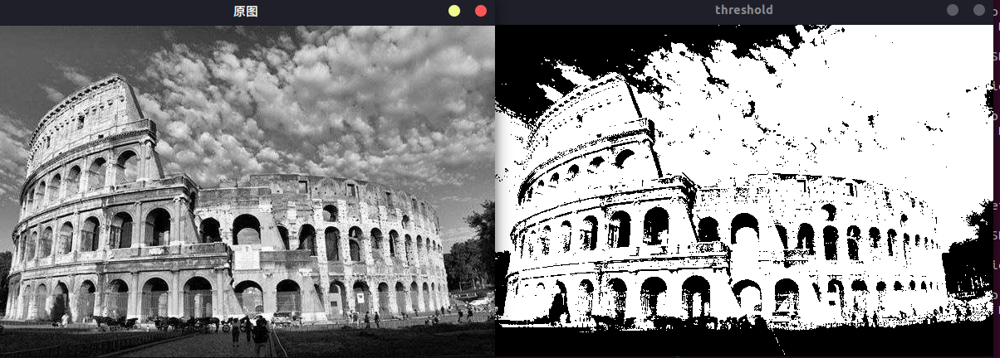
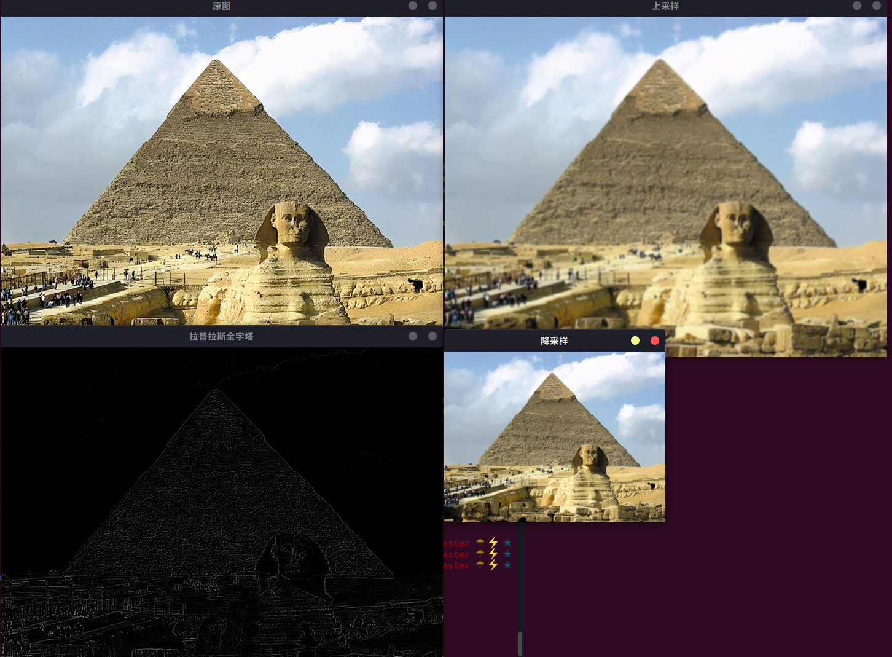
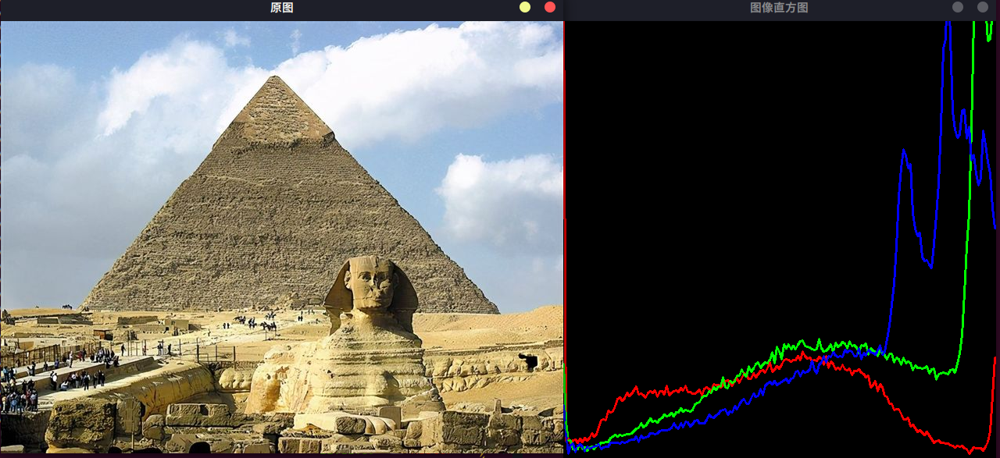

.. highlight:: c++

.. default-domain:: cpp

==================
Image Processing
==================

1 改变颜色空间
==================

OpenCV中有超过150种颜色空间转换方法。但是我们将研究只有两个最广泛使用的,BGR↔灰色和BGR↔HSV。

Opencv C++ API:

.. code-block:: c++

    void cvtColor(InputArray src, OutputArray dst, int code, int dstCn = 0);

.. NOTE::

    * src 输入图像
    * dst 输出图像
    * code 代码颜色空间转换代码
    * dstCn 目标图像中的信道数; 如果该参数为0，则通道的数量自动从SRC和code派生。

demo调用, 源码 

.. code-block:: c++

    TEST(CvtColor, demo)
    {
        std::string filename = GetOpenCVDatasetDirectory() + "/0015_gudian.jpg";
        CvtColor demo;
        demo.RunDemo(filename);
    }

函数使用：

.. code-block:: c++

    void CvtColor::RunDemo(const std::string& filename)
    {
        // 0. 读取图像
        cv::Mat image = cv::imread(filename);
        if (image.data == nullptr) {
            std::cout << "Load image error." << std::endl;
            exit(-1);
        }
        // 原图
        cv::imshow("image", image); // 展示源图像

        // 灰度图
        cv::Mat img1, img2, img3;
        cv::cvtColor(image, img1, cv::COLOR_RGB2GRAY);
        cv::imshow("灰度图", img1);

        // HSV
        cv::cvtColor(image, img2, cv::COLOR_RGB2HSV);
        cv::imshow("HSV", img2);

        // BGR
        cv::cvtColor(image, img3, cv::COLOR_RGB2BGR);
        cv::imshow("BGR", img3);
    
        cv::waitKey(0);
        cv::destroyAllWindows();
    }

运行结果

.. code-block:: bash

    [bin] ./xslam.opencv.image_processing.cvtColor_test

.. figure:: ./images/cvtColor.png
   :align: center

参考源码：

.. NOTE::

    * cvtColor_test.cpp
    * cvtColor.cpp
    * cvtColor.h

2 图像的几何变换
==================

几何变换应用到图像上，如平移、旋转、仿射变换等

OpenCV提供了两个转换函数**cv::warpAffine**和**cv::warpPerspective**，您可以使用它们进行各种转换。
**cv::warpAffine**采用2x3转换矩阵，而**cv::warpPerspective**采用3x3转换矩阵作为输入

**缩放**

缩放只是调整图像的大小。为此，OpenCV带有一个函数 **cv::resize()** 。图像的大小可以手动指定，
也可以指定缩放比例。也可使用不同的插值方法。首选的插值方法是 **cv::INTER_AREA** 用于缩小，**cv::INTER_CUBIC** （慢）
和 **cv::INTER_LINEAR** 用于缩放。默认情况下，出于所有调整大小的目的，使用的插值方法为 **cv::INTER_LINEAR** 。
您可以使用以下方法调整输入图像的大小：

Opencv C++ API:

.. code-block:: c++

    void cv::resize (InputArray src, OutputArray dst,
		Size dsize, double fx = 0, double fy = 0, int interpolation = INTER_LINEAR)

.. NOTE::

    * src - 输入图像。
    * dst - 输出图像；它的大小为 dsize（当它非零时）或从 src.size()、fx 和 fy 计算的大小；dst 的类型与 src 的类型相同。
    * dsize - 输出图像大小；如果它等于零，则计算为：dsize = Size(round(fx*src.cols), round(fy*src.rows))。dsize 或 fx 和 fy 必须为非零。
    * fx - 沿水平轴的比例因子；当它等于 0 时，它被计算为(double)dsize.width/src.cols
    * fy - 沿垂直轴的比例因子；当它等于 0 时，它被计算为(double)dsize.height/src.rows

**平移**

平移是物体位置的移动。如果您知道在(x,y)方向上的位移，则将其设为 :math:`(t_x, t_y)` ，你可以创建转换矩阵

.. math:: 

    \begin{bmatrix}
        1 & 0 & t_x \\
        0 & 1 & t_y
    \end{bmatrix}

Opencv C++ API:

.. code-block:: c++

    void warpAffine(InputArray src, OutputArray dst, InputArray M, Size dsize, 
        int flags=INTER_LINEAR, intborderMode=BORDER_CONSTANT, const Scalar& borderValue=Scalar())

.. NOTE::

    * InputArray src：输入的图像
    * OutputArray dst：输出的图像
    * InputArray M：透视变换的矩阵
    * Size dsize：输出图像的大小
    * int flags=INTER_LINEAR：输出图像的插值方
    * int borderMode=BORDER_CONSTANT：图像边界的处理方式
    * const Scalar& borderValue=Scalar()：边界的颜色设置，一般默认是0

**旋转**

Opencv C++ API:

.. code-block:: c++

    Mat getRotationMatrix2D(Point2f center, double angle, double scale)

.. NOTE::

    * Point2f center：表示旋转的中心点
    * double angle：表示旋转的角度
    * double scale：图像缩放因子

**仿射变换**

Opencv C++ API:

.. code-block:: c++

    Mat getAffineTransform(InputArray src, InputArray dst)

.. NOTE::

    * InputArray src：表示输入的三个点
    * InputArray dstL:表示输出的三个点

**透视变换**

Opencv C++ API:

.. code-block:: c++

    void warpPerspective(InputArray src, OutputArray dst, InputArray M, 
        Size dsize, int flags=INTER_LINEAR, int borderMode=BORDER_CONSTANT, 
            const Scalar& borderValue=Scalar())

.. NOTE::

    * InputArray src：输入的图像
    * OutputArray dst：输出的图像
    * InputArray M：透视变换的矩阵
    * Size dsize：输出图像的大小
    * int flags=INTER_LINEAR：输出图像的插值方法，
    * int borderMode=BORDER_CONSTANT：图像边界的处理方式
    * const Scalar& borderValue=Scalar()：边界的颜色设置，一般默认是0

demo调用, 源码 

.. code-block:: c++

    TEST(GeometryTransform, demo)
    {
        std::string filename = GetOpenCVDatasetDirectory() + "/0016_dog.jpg";
        GeometryTransform demo;
        demo.RunDemo(filename);
    }

函数使用：

.. code-block:: c++

    void GeometryTransform::RunDemo(const std::string& filename)
    {
        // 0. 读取图像
        cv::Mat image = cv::imread(filename);
        if (image.data == nullptr) {
            std::cout << "Load image error." << std::endl;
            exit(-1);
        }
        // 原图
        cv::imshow("image", image); // 展示源图像

        // resize
        Resize(image);

        // AffineTransform
        AffineTransform(image);

        // WarpPerspective
        WarpPerspective(image);

        cv::waitKey(0);
        cv::destroyAllWindows();
    }

    void GeometryTransform::Resize(const cv::Mat& image)
    {
        cv::Mat dst;
        cv::resize(image, dst, cv::Size(200, 200), 0, 0, cv::INTER_CUBIC);
        cv::imshow("resize", dst);
        cv::waitKey(0);
    }

    void GeometryTransform::AffineTransform(const cv::Mat& image)
    {
        cv::Point2f srcTri[3];
        cv::Point2f dstTri[3];

        cv::Mat rot_mat( 2, 3, CV_32FC1 );
        cv::Mat warp_mat( 2, 3, CV_32FC1 );
        cv::Mat warp_dst, warp_rotate_dst;

        // 设置目标图像的大小和类型与源图像一致
        warp_dst = cv::Mat::zeros( image.rows, image.cols, image.type() );

        /// 设置源图像和目标图像上的三组点以计算仿射变换
        srcTri[0] = cv::Point2f( 0,0 );
        srcTri[1] = cv::Point2f( image.cols - 1, 0 );
        srcTri[2] = cv::Point2f( 0, image.rows - 1 );

        dstTri[0] = cv::Point2f( image.cols*0.0, image.rows*0.33 );
        dstTri[1] = cv::Point2f( image.cols*0.85, image.rows*0.25 );
        dstTri[2] = cv::Point2f( image.cols*0.15, image.rows*0.7 );

        /// 求得仿射变换
        warp_mat = cv::getAffineTransform( srcTri, dstTri );

        /// 对源图像应用上面求得的仿射变换
        cv::warpAffine( image, warp_dst, warp_mat, warp_dst.size() );

        /** 对图像扭曲后再旋转 */

        // 计算绕图像中点顺时针旋转50度缩放因子为0.6的旋转矩阵
        cv::Point center = cv::Point( warp_dst.cols/2, warp_dst.rows/2 );
        double angle = -50.0;
        double scale = 0.6;

        // 通过上面的旋转细节信息求得旋转矩阵
        rot_mat = cv::getRotationMatrix2D( center, angle, scale );

        // 旋转已扭曲图像
        cv::warpAffine( warp_dst, warp_rotate_dst, rot_mat, warp_dst.size() );

        // 显示结果
        cv::namedWindow("source", cv::WINDOW_AUTOSIZE );
        cv::imshow("source", image );

        cv::namedWindow("warp", cv::WINDOW_AUTOSIZE );
        cv::imshow("warp", warp_dst );

        cv::namedWindow("warp_rotate", cv::WINDOW_AUTOSIZE );
        cv::imshow("warp_rotate", warp_rotate_dst );

        // 等待用户按任意按键退出程序
        cv::waitKey(0);
    }

    void GeometryTransform::WarpPerspective(const cv::Mat& image)
    {
        cv::Point2f srcTri[4];
        cv::Point2f dstTri[4];
    
        cv::Mat warpPerspective_mat( 3, 3, CV_32FC1 );
        cv::Mat warpPerspective_dst;
    
        // Set the dst image the same type and size as src
        warpPerspective_dst = cv::Mat::zeros( image.rows, image.cols, image.type() );
    
        /// 设置三组点，求出变换矩阵
        srcTri[0] = cv::Point2f( 0,0 );
        srcTri[1] = cv::Point2f( image.cols - 1,0 );
        srcTri[2] = cv::Point2f( 0, image.rows - 1);
        srcTri[3] = cv::Point2f(image.cols - 1, image.rows - 1);
    
        dstTri[0] = cv::Point2f( 0, image.rows * 0.13 );
        dstTri[1] = cv::Point2f( image.cols * 0.9, 0 );
        dstTri[2] = cv::Point2f( image.cols * 0.2, image.rows * 0.7 );
        dstTri[3] = cv::Point2f( image.cols * 0.8, image.rows );
    
        //计算3个二维点对之间的仿射变换矩阵（2行x3列）
        warpPerspective_mat = cv::getPerspectiveTransform( srcTri, dstTri );
    
        //应用仿射变换，可以恢复出原图
        warpPerspective( image, warpPerspective_dst, warpPerspective_mat, image.size() );
    
        //显示结果
        cv::namedWindow("source", cv::WINDOW_AUTOSIZE );
        cv::imshow("source", image);
    
        cv::namedWindow("warpPerspective", cv::WINDOW_AUTOSIZE );
        cv::imshow("warpPerspective", warpPerspective_dst );
        cv::waitKey(0);
    }

运行结果

.. code-block:: bash

    [bin] ./xslam.opencv.image_processing.geometry_transform_test

.. figure:: ./images/geometry_transform.png
   :align: center

参考源码：

.. NOTE::

    * geometry_transform_test.cpp
    * geometry_transform.cpp
    * geometry_transform.h

3 图像阈值
==================

阈值化操作的基本思想是，给定一个输入数组和一个阈值，数组中的每个元素将根据其与阈值之间的大小发生相应的改变。

Opencv C++ API:

.. code-block:: c++

    double cv::threshold(
        cv::InputArray src, // 输入图像
        cv::OutputArray dst, // 输出图像
        double thresh, // 阈值
        double maxValue, // 向上最大值
        int thresholdType // 阈值化操作的类型 
    );

.. NOTE::

    * src：原图。可以是多通道，8位深度或者32位深度
    * dst：结果图像。大小和类型与原图一致
    * thresh：阈值
    * maxval：最大阈值。当阈值类型为THRESH_BINARY或THRESH_BINARY_INV时使用
    * type：阈值类型

demo调用, 源码 

.. code-block:: c++

    TEST(Threshold, demo)
    {
        std::string filename = GetOpenCVDatasetDirectory() + "/0014_roma.jpg";
        Threshold demo;
        demo.RunDemo(filename);
    }

函数使用：

.. code-block:: c++

    void Threshold::RunDemo(const std::string& filename)
    {
        // 0. 读取图像
        cv::Mat image = cv::imread(filename, cv::IMREAD_GRAYSCALE);
        if (image.data == nullptr) {
            std::cout << "Load image error." << std::endl;
            exit(-1);
        }

        cv::imshow("原图", image);
        cv::Mat dst;
    
        double thresh = 100;
        int maxVal = 255;
        cv::threshold(image, dst, thresh, maxVal, cv::THRESH_BINARY);
        cv::imshow("threshold", dst);

        while (true) 
        {
            if (27 == cv::waitKey()) {
                break;
            } 

            sleep(1);
        }
        
        cv::destroyAllWindows();
    }

运行结果

.. code-block:: bash

    [bin] ./xslam.opencv.image_processing.threshold_test

参考源码：

.. NOTE::

    * threshold_test.cpp
    * threshold.cpp
    * threshold.h

4 图像平滑
==================

与一维信号一样，还可以使用各种低通滤波器（LPF），高通滤波器（HPF）等对图像进行滤波。
LPF有助于消除噪声，使图像模糊等。HPF滤波器有助于在图像中找到边缘。

OpenCV提供了一个函数 **cv.filter2D** 来将内核与图像进行卷积。例如，我们将尝试对图像进行平均滤波。
5x5平均滤波器内核如下所示：

.. math::

    K = \frac{1}{25}
    \begin{bmatrix}
        1 & 1 & 1 & 1 & 1  \\
        1 & 1 & 1 & 1 & 1  \\
        1 & 1 & 1 & 1 & 1  \\
        1 & 1 & 1 & 1 & 1  \\
        1 & 1 & 1 & 1 & 1
    \end{bmatrix}

操作如下:保持这个内核在一个像素上，将所有低于这个内核的25个像素相加，取其平均值，然后用新的平均值替换中心像素。
它将对图像中的所有像素继续此操作。

Opencv C++ API:

.. code-block:: c++

    void filter2D(InputArray src, OutputArray dst, int ddepth,
                  InputArray kernel, Point anchor = Point(-1,-1),
                  double delta = 0, int borderType = BORDER_DEFAULT );

.. NOTE::

    * src: 源图像Mat对象
    * dst: 目标图像Mat对象
    * ddepth: 目标图像的深度，一般填-1即可，表示源图像与目标图像深度相同。
    * kernel: 卷积核,一个单通道浮点型矩阵。如果想在图像不同的通道使用不同的kernel，可以先使用split()函数将图像通道事先分开。
    * anchor: 内核的基准点，其默认值为(-1,-1)说明位于kernel的中心位置。基准点即kernel中与进行处理的像素点重合的点，不填即默认值。
    * delta : 在储存目标图像前可选的添加到像素的值，默认值为0，不填就是默认值。
    * borderType: 像素向外逼近的方法，默认值是BORDER_DEFAULT,即对全部边界进行计算，不填就是默认。

demo调用, 源码 

.. code-block:: c++

    TEST(Filter2D, demo)
    {
        std::string filename = GetOpenCVDatasetDirectory() + "/0012_parthenon_temple.jpg";
        Filter2D demo;
        demo.RunDemo(filename);
    }

函数使用：

.. code-block:: c++

    void Filter2D::RunDemo(const std::string& filename)
    {
        // 0. 读取图像
        cv::Mat image = cv::imread(filename);
        if (image.data == nullptr) {
            std::cout << "Load image error." << std::endl;
            exit(-1);
        }

        cv::imshow("image", image); // 展示源图像
        cv::Mat dst;
        cv::Mat kernal = (cv::Mat_<char>(3, 3) << 0, -1, 0, -1, 5, -1, 0, -1, 0); // 生成卷积核
        cv::filter2D(image, dst, -1, kernal);
        cv::imshow("dst", dst); // 展示目标图像
        cv::waitKey(0);
        cv::destroyAllWindows();
    }

运行结果

.. code-block:: bash

    [bin] ./xslam.opencv.image_processing.filter2D_test

.. figure:: ./images/filter2D.png
   :align: center

参考源码：

.. NOTE::

    * filter2D_test.cpp
    * filter2D.cpp
    * filter2D.h

5 形态学转换
==================

**理论**

形态变换是一些基于图像形状的简单操作。通常在二进制图像上执行。它需要两个输入，一个是我们的原始图像，
第二个是决定 `操作性质的结构元素` 或 `内核` 。两种基本的形态学算子是侵蚀和膨胀。然后，它的变体形式
（如“打开”，“关闭”，“渐变”等）也开始起作用。

**侵蚀**

侵蚀的基本思想就像土壤侵蚀一样，它侵蚀前景物体的边界(尽量使前景保持白色)。它是做什么的呢?内核滑动通过图像(在2D卷积中)。
原始图像中的一个像素(无论是1还是0)只有当内核下的所有像素都是1时才被认为是1, 否则它就会被侵蚀(变成0)。

结果是，根据内核的大小，边界附近的所有像素都会被丢弃。因此，前景物体的厚度或大小减小，或只是图像中的白色区域减小。
它有助于去除小的白色噪声(正如我们在颜色空间章节中看到的)，分离两个连接的对象等.

Opencv C++ API:

.. code-block:: c++

    void erode( InputArray src, OutputArray dst, InputArray kernel,
                Point anchor = Point(-1,-1), int iterations = 1,
                int borderType = BORDER_CONSTANT,
                const Scalar& borderValue = morphologyDefaultBorderValue() );

.. NOTE::

    * 参数 src: 输入图像;通道的数量可以是任意的，但是深度值应该是以下之一： CV_8U, CV_16U, CV_16S, CV_32F or CV_64F.
    * 参数 dst: 和源图像同样大小和类型的输出图像。
    * 参数 kernel: 用于腐蚀的结构元素;如果element=Mat(),是一个3 x 3的矩形结构元素. Kernel 可以通过使用getStructuringElement来创建。
    * 参数 anchor: 素中的锚点的位置，默认是值(-1,-1),也就是说锚点在元素的中心位置。
    * 参数 iterations: 腐蚀的迭代次数。
    * 参数 borderType: 像素外推方法。参见#BorderTypes， BORDER_WRAP不支持。
    * 参数 borderValue: 固定边缘的情况下的边缘值。
    * 参考 dilate, morphologyEx, getStructuringElement

**扩张**

它与侵蚀正好相反。如果内核下的至少一个像素为“ 1”，则像素元素为“ 1”。
因此，它会增加图像中的白色区域或增加前景对象的大小。通常，在消除噪音的情况下，腐蚀后会膨胀。
因为腐蚀会消除白噪声，但也会缩小物体。因此，我们对其进行了扩展。由于噪音消失了，它们不会回来，
但是我们的目标区域增加了。在连接对象的损坏部分时也很有用。

Opencv C++ API:

.. code-block:: c++

    void dilate( InputArray src, OutputArray dst, InputArray kernel,
                Point anchor = Point(-1,-1), int iterations = 1,
                int borderType = BORDER_CONSTANT,
                const Scalar& borderValue = morphologyDefaultBorderValue() );
.. NOTE::

    * InputArray类型的src，输入图像，如Mat类型。
    * OutputArray类型的dst，输出图像。
    * InputArray类型的kernel，膨胀操作的内核也就是上面所说的蒙版。为NULL时，默认表示以参考点为中心3*3的核。一般配合函数getStructuringElement使用，该函数可以构造一个指定形状和尺寸的蒙版。
    * Point类型的anchor，锚点。默认值（-1，-1），表示位于单位中心，一般不用。
    * nt类型的iterations，迭代使用的次数，默认值为1。
    * int类型的borderType，推断图像外部像素的边界模式，我OpenCV版本的默认值为BORDER_CONSTANT。如果图像边界需要扩展，则不同的模式下所扩展的像素，其生成原则不同。
    * const Scalar&类型的borderValue，当边界为常数时的边界值，默认值为morphologyDefaultBorderValue()。

**开运算**

开放只是 `侵蚀然后扩张` 的另一个名称。如上文所述，它对于消除噪音很有用。在这里，我们使用函数 `cv::morphologyEx()` 

Opencv C++ API:

.. code-block:: c++

    void morphologyEx(InputArray src, OutputArray dst, int op, InputArray kernel, 
                      Point anchor=Point(-1,-1), int iterations=1, int borderType=BORDER_CONSTANT, 
                      const Scalar& borderValue=morphologyDefaultBorderValue())

.. NOTE::

    * src：源图像
    * dst：目标图像。
    * op：表示形态学运算的类型，可以是如下之一的标识符：
    * MORPH_OPEN – 开运算（Opening operation）
    * MORPH_CLOSE – 闭运算（Closing operation）
    * MORPH_GRADIENT -形态学梯度（Morphological gradient）
    * MORPH_TOPHAT - “顶帽”（“Top hat”）
    * MORPH_BLACKHAT - “黑帽”（“Black hat“）
    * kernel：形态学运算的内核
    * anchor：锚的位置，其有默认值（-1，-1），表示锚位于中心。
    * iterations：迭代使用函数的次数，默认值为1。
    * borderType：用于推断图像外部像素的某种边界模式。注意它有默认值BORDER_CONSTANT。
    * borderValue：当边界为常数时的边界值，有默认值morphologyDefaultBorderValue()，一般我们不用去管他。

**闭运算**

闭运算与开运算相反，先扩张然后再侵蚀。在关闭前景对象内部的小孔或对象上的小黑点时很有用。

**形态学梯度**

这是图像扩张和侵蚀之间的区别。
结果将看起来像对象的轮廓。

**顶帽**

输入图像和图像开运算之差

**黑帽**

输入图像和图像闭运算之差

demo调用, 源码 

.. code-block:: c++

    TEST(Morphology, demo)
    {
        std::string filename = GetOpenCVDatasetDirectory() + "/0014_roma.jpg";
        Morphology demo;
        demo.RunDemo(filename);
    }

函数使用：

.. code-block:: c++

    void Morphology::RunDemo(const std::string& filename)
    {
        // 0. 读取图像
        cv::Mat image = cv::imread(filename);
        if (image.data == nullptr) {
            std::cout << "Load image error." << std::endl;
            exit(-1);
        }

        // erode
        cv::Mat erode;
        //自定义核
        cv::Mat element = cv::getStructuringElement(cv::MORPH_RECT, cv::Size(8, 8));
        cv::imshow("原图", image);
        cv::erode(image, erode, element);
        cv::imshow("腐蚀", erode);

        // dilate
        cv::Mat dilate_element = cv::getStructuringElement(cv::MORPH_RECT, cv::Size(3, 3));
        cv::Mat dilate;
        cv::dilate(image, dilate, dilate_element);
        imshow("dilate", dilate);

        // morphologyEx
        cv::Mat morphologyEx;
        //定义核
        cv::Mat morphologyEx_element(7, 7, CV_8U, cv::Scalar(1));
        //进行形态学开运算操作
        cv::morphologyEx(image, morphologyEx, cv::MORPH_OPEN, morphologyEx_element);
        imshow("形态学开运算", morphologyEx);

        while (true) 
        {
            if (27 == cv::waitKey()) {
                break;
            } 

            sleep(1);
        }
        
        cv::destroyAllWindows();
    }

运行结果

.. code-block:: bash

    [bin] ./xslam.opencv.image_processing.morphology_test

.. figure:: ./images/morphology.png
   :align: center

参考源码：

.. NOTE::

    * morphology_test.cpp
    * morphology.cpp
    * morphology.h

6 图像梯度
==================

OpenCV提供三种类型的梯度滤波器或高通滤波器, 即Sobel, Scharr和Laplacian。我们将看到他们每一种

**1. Sobel 和 Scharr 算子**

Sobel算子是高斯平滑加微分运算的联合运算, 因此它更抗噪声。逆可以指定要采用的导数方向,
垂直或水平（分别通过参数yorder和xorder）。逆还可以通过参数ksize指定内核的大小。
如果ksize = -1，则使用3x3 Scharr滤波器，比3x3 Sobel滤波器具有更好的结果。请参阅文档以了解所使用的内核。

**2. Laplacian 算子**

它计算了由关系 :math:`\Delta{src} = \frac{\partial^2{src}}{\partial{x^2}} + \frac{\partial^2{src}}{\partial{y^2}}` 
给出的图像的拉普拉斯图,它是每一阶导数通过Sobel算子计算。如果ksize = 1,然后使用以下内核用于过滤:

.. math::

    kernel = 
    \begin{bmatrix}
        0 &  1 & 0  \\
        1 & -4 & 1  \\
        0 &  1 & 0
    \end{bmatrix}

Opencv C++ API:

Sobel算子

.. code-block:: c++

    void Sobel( InputArray src, OutputArray dst, int ddepth,
           int dx, int dy, int ksize = 3,
           double scale = 1, double delta = 0,
           int borderType = BORDER_DEFAULT );

.. NOTE::

    * src表示输入的灰度图像
    * dst表示输出的梯度;
    * ddepth表示输出梯度的数据类型,必须大于输入的图像数据类型,关系如下图所示:
    * dx=1, dy=0表示对x方向计算梯度;
    * dx=0, dy=1表示对y方向计算梯度;

Scharr算子

.. code-block:: c++

    void Scharr( InputArray src, OutputArray dst, int ddepth,
            int dx, int dy, double scale = 1, double delta = 0,
            int borderType = BORDER_DEFAULT );

.. NOTE::

    * 参数与Sobel算子基本一致;
    * 但是不需要设置核的大小,因为Scharr默认就是3;

demo调用, 源码 

.. code-block:: c++

    TEST(Gradient, Sobel)
    {
        std::string filename = GetOpenCVDatasetDirectory() + "/0012_graient_parthenon_temple.jpg";
        Gradient demo;
        demo.RunDemo(filename);
    }

函数使用：

.. code-block:: c++

    void Gradient::RunDemo(const std::string& filename)
    {
    // 0. 读取图像
    cv::Mat image = cv::imread(filename);
    if (image.data == nullptr) {
        std::cout << "Load image error." << std::endl;
        exit(-1);
    }

    cv::namedWindow("image", cv::WINDOW_AUTOSIZE);
    cv::imshow("image", image); 

    // 1. 高斯模糊
    cv::Mat srcBlur;
    cv::GaussianBlur(image, srcBlur, cv::Size(3, 3), 0, 0);

    // 2. 转灰度
    cv::Mat srcGray;
    cvtColor(srcBlur, srcGray, cv::COLOR_BGR2GRAY);

    // 3. 求方向梯度
    cv::Mat gradX, gradY;
    cv::Sobel(srcGray, gradX, CV_16S, 1, 0, 3);
    cv::Sobel(srcGray, gradY, CV_16S, 0, 1, 3);

    cv::convertScaleAbs(gradX, gradX);  // calculates absolute values, and converts the result to 8-bit.
    cv::convertScaleAbs(gradY, gradY);
    cv::namedWindow("gradY", cv::WINDOW_AUTOSIZE);
    cv::imshow("gradX", gradX);
    cv::namedWindow("gradY", cv::WINDOW_AUTOSIZE);
    cv::imshow("gradY", gradY);

    printf("type: %d, %d", gradX.type(), gradY.type());

    // 4. 图像混合
    cv::Mat dst;
    cv::addWeighted(gradX, 0.5, gradY, 0.5, 0, dst);
    cv::namedWindow("dst", cv::WINDOW_AUTOSIZE);
    cv::imshow("dst", dst);

    // 4.1 void Gradient::RunDemo(const std::string& filename)
    {
        // 0. 读取图像
        cv::Mat image = cv::imread(filename);
        if (image.data == nullptr) {
            std::cout << "Load image error." << std::endl;
            exit(-1);
        }

        cv::namedWindow("image", cv::WINDOW_AUTOSIZE);
        cv::imshow("image", image); 

        // 1. 高斯模糊
        cv::Mat srcBlur;
        cv::GaussianBlur(image, srcBlur, cv::Size(3, 3), 0, 0);

        // 2. 转灰度
        cv::Mat srcGray;
        cvtColor(srcBlur, srcGray, cv::COLOR_BGR2GRAY);

        // 3. 求方向梯度
        cv::Mat gradX, gradY;
        cv::Sobel(srcGray, gradX, CV_16S, 1, 0, 3);
        cv::Sobel(srcGray, gradY, CV_16S, 0, 1, 3);

        cv::convertScaleAbs(gradX, gradX);  // calculates absolute values, and converts the result to 8-bit.
        cv::convertScaleAbs(gradY, gradY);
        cv::namedWindow("gradY", cv::WINDOW_AUTOSIZE);
        cv::imshow("gradX", gradX);
        cv::namedWindow("gradY", cv::WINDOW_AUTOSIZE);
        cv::imshow("gradY", gradY);

        printf("type: %d, %d", gradX.type(), gradY.type());

        // 4. 图像混合
        cv::Mat dst;
        cv::addWeighted(gradX, 0.5, gradY, 0.5, 0, dst);
        cv::namedWindow("dst", cv::WINDOW_AUTOSIZE);
        cv::imshow("dst", dst);

        // 4.1 
        cv::Mat gradXY = cv::Mat(gradX.size(), gradX.type());
        for (int row = 0; row < gradX.rows; row++) 
        {
            for (int col = 0; col < gradX.cols; col++)
            {
                int gX = gradX.at<uchar>(row, col);
                int gY = gradY.at<uchar>(row, col);
                gradXY.at<uchar>(row, col) = cv::saturate_cast<uchar>(gX + gY);
            }
        }
        cv::namedWindow("gradXY", cv::WINDOW_AUTOSIZE);
        cv::imshow("gradXY", gradXY);
        cv::waitKey(0);
        cv::destroyAllWindows();
    }

运行结果

.. code-block:: bash

    [bin] ./xslam.opencv.image_processing.image_gradient_test

.. figure:: ./images/grdient.png
   :align: center

参考源码：

.. NOTE::

    * image_gradient_test.cpp
    * image_gradient.cpp
    * image_gradient.h

7 Canny边缘检测
==================

由于边缘检测容易受到图像中噪声的影响, 因此第一步是使用5x5高斯滤波器消除图像中的噪声。

**查找图像的强度梯度**

然后使用Sobel核在水平和垂直方向上对平滑的图像进行滤波, 以在水平方向(Gx)和垂直方向(Gy)上获得一阶导数。
从这两张图片中，我们可以找到每个像素的边缘渐变和方向，如下所示：

.. math::

    Edge\_Gradient \; (G) = \sqrt{G_x^2 + G_y^2} \\ Angle \; (\theta) = \tan^{-1} \bigg(\frac{G_y}{G_x}\bigg)

渐变方向始终垂直于边缘。将其舍入为代表垂直，水平和两个对角线方向的四个角度之一。

Opencv C++ API:

.. code-block:: c++

    void Canny(InputArray image, OutputArray edges, 
        double threshold1, double threshold2, int apertureSize=3, bool L2gradient=false)

.. NOTE::

    * image: InputArray类型的image, 输入图像, Mat对象节课, 需为单通道8位图像。
    * edges: OutputArray类型的edges, 输出的边缘图，需要和输入图像有相同的尺寸和类型。
    * threshold1: double类型的threshold1, 第一个滞后性阈值。
    * threshold2: double类型的threshold2, 第二个滞后性阈值。
    * apertureSize: int类型的apertureSize, 表示算子的孔径的大小, 默认值时3.
    * L2gradient: bool类型的L2gradient, 一个计算图像梯度复制的标识, 默认false。

demo调用, 源码 

.. code-block:: c++

    TEST(Canny, shape)
    {
        LOG(INFO) << "Run Canny demos ...";
        
        // OpenCV
        std::string filename = GetOpenCVDatasetDirectory() + "/0011_canny.jpg";
        Canny demo;
        demo.RunDemo(filename);
    }

函数使用：

.. code-block:: c++

    void Canny::RunDemo(const std::string& filename)
    {
        // , grayImage;
        cv::Mat image = cv::imread(filename);
        if (image.data == nullptr) {
            std::cout << "Load image error." << std::endl;
            exit(-1);
        }

        cv::Mat grayImage;
        cv::Mat srcImage1 = image.clone();
        cv::cvtColor(image, grayImage, cv::COLOR_BGR2GRAY);
        cv::Mat dstImage, edge;
    
        cv::blur(grayImage, grayImage, cv::Size(3,3));
        cv::Canny(grayImage, edge, 150, 100, 3);
    
        dstImage.create(srcImage1.size(), srcImage1.type());
        srcImage1.copyTo(dstImage, edge);

        cv::imshow("origin", image);
        cv::imshow("canny", dstImage);
        cv::waitKey(0);
        cv::destroyAllWindows();
    }

运行结果

.. code-block:: bash

    [bin] ./xslam.opencv.image_processing.canny_test

.. figure:: ./images/canny.png
   :align: center

参考源码：

.. NOTE::

    * canny_test.cpp
    * canny.cpp
    * canny.h

8 图像金字塔
==================

Opencv C++ API:

.. code-block:: c++

    void pyrDown(InputArray src, OutputArray dst, const Size& dstsize=Size());
    void pyrUp(InputArray src, OutputArray dst, const Size& dstsize=Size());

.. NOTE::

    * 先对图像进行高斯平滑，然后再进行降采样（将图像尺寸行和列方向缩减一半）
    * 先对图像进行升采样（将图像尺寸行和列方向增大一倍），然后再进行高斯平滑；

demo调用, 源码 

.. code-block:: c++

    TEST(Threshold, demo)
    {
        std::string filename = GetOpenCVDatasetDirectory() + "/0017_pyr.jpg";
        PyrDownUp demo;
        demo.RunDemo(filename);
    }

函数使用：

.. code-block:: c++

    void PyrDownUp::RunDemo(const std::string& filename)
    {
        // 0. 读取图像
        cv::Mat image = cv::imread(filename);
        if (image.data == nullptr) {
            std::cout << "Load image error." << std::endl;
            exit(-1);
        }

        cv::imshow("原图", image);
        
        cv::Mat out;
        cv::pyrDown(image, out);
        cv::imshow("降采样", out);
        cv::pyrUp(out, out);
        cv::imshow("上采样", out);
        cv::subtract(image, out, out);
        cv::imshow("拉普拉斯金字塔", out);

        while (true) 
        {
            if (27 == cv::waitKey()) {
                break;
            } 

            sleep(1);
        }
        
        cv::destroyAllWindows();
    }

运行结果

.. code-block:: bash

    [bin] ./xslam.opencv.image_processing.pyr_down_up_test

参考源码：

.. NOTE::

    * pyr_down_up_test.cpp
    * pyr_down_up.cpp
    * pyr_down_up.h

9 轮廓
==================

Opencv C++ API:

.. code-block:: c++

.. NOTE::

demo调用, 源码 

.. code-block:: c++

函数使用：

.. code-block:: c++

运行结果

.. code-block:: bash

    [bin] ./xslam.opencv.image_processing.image_gradient_test

.. figure:: ./images/grdient.png
   :align: center

参考源码：

.. NOTE::

    * image_gradient_test.cpp
    * image_gradient.cpp
    * image_gradient.h

10 直方图
==================

Opencv C++ API:

.. code-block:: c++

    void cv::calcHist(const Mat *images,
            int     nimages,
            const int *channels,
            InputArray     mask,
            OutputArray    hist,
            int     dims,
            const int *histSize,
            const float **ranges,
            bool    uniform = true,
            bool    accumulate = false 
        )   

.. NOTE::

    * images: 输入的图像或数组，它们的深度必须为CV_8U, CV_16U或CV_32F中的一类，尺寸必须相同。
    * nimages: 输入数组个数，也就是第一个参数中存放了几张图像，有几个原数组。
    * channels: 需要统计的通道dim，第一个数组通道从0到image[0].channels()-1，第二个数组从image[0].channels()到images[0].channels()+images[1].channels()-1，以后的数组以此类推
    * mask: 可选的操作掩码。如果此掩码不为空，那么它必须为8位并且尺寸要和输入图像images[i]一致。非零掩码用于标记出统计直方图的数组元素数据。
    * hist: 输出的目标直方图，一个二维数组
    * dims: 需要计算直方图的维度，必须是正数且并不大于CV_MAX_DIMS(在opencv中等于32)
    * histSize: 每个维度的直方图尺寸的数组
    * ranges: 每个维度中bin的取值范围
    * uniform: 直方图是否均匀的标识符，有默认值true
    * accumulate: 累积标识符，有默认值false,若为true，直方图再分配阶段不会清零。此功能主要是允许从多个阵列中计算单个直方图或者用于再特定的时间更新直方图.

在计算图像直方图的时候一般配合minMaxLoc()和normalize()函数,minMaxLoc()函数是用于寻找最值的函数

.. code-block:: c++

    void cv::minMaxLoc(InputArray src,
        double *    minVal,
        double *    maxVal = 0,
        Point *     minLoc = 0,
        Point *     maxLoc = 0,
        InputArray  mask = noArray() 
    )   

.. NOTE::

    * src: 输入的单通道数组
    * minVal: double类型指针，用于返回最小值的指针，如果不需要返回则设置为NULL
    * maxVal: double类型的指针，用于返回最大值指针，如果不需要返回则设置为NULL
    * minLoc: 返回最小值位置指针(2D的情况下)，如果不需要则设置为NULL
    * maxLoc: 返回最大位置指针(2D情况下)，如果不需要则设置为NULL
    * mask: 可选掩模板。

normalize()函数的作用是将一个数组的值归一化到指定的范围

.. code-block:: c++

    void cv::normalize(InputArray src,
        InputOutputArray dst,
        double  alpha = 1,
        double  beta = 0,
        int     norm_type = NORM_L2,
        int     dtype = -1,
        InputArray  mask = noArray() 
    )   

.. NOTE::

    * src: 输入数组
    * dst: 输出数组，与src有相同的尺寸
    * alpha: 将数组归一化范围的最大值，有默认值1
    * beta: 归一化的最小值，有默认值0
    * norm_type: 归一化方式，可以查看NormTypes()函数查看详细信息，有默认值NORM_L2
    * dtype: 当该值取负数时，输出数组与src有相同类型，否则，与src有相同的通道并且深度为CV_MAT_DEPTH(dtype)
    * mask: 可选的掩膜版

demo调用, 源码 

.. code-block:: c++

    TEST(CalcHist, demo)
    {
        std::string filename = GetOpenCVDatasetDirectory() + "/0017_pyr.jpg";
        CalcHist demo;
        demo.RunDemo(filename);
    }

函数使用：

.. code-block:: c++

    void CalcHist::RunDemo(const std::string& filename)
    {
        // 0. 读取图像
        cv::Mat image = cv::imread(filename);
        if (image.data == nullptr) {
            std::cout << "Load image error." << std::endl;
            exit(-1);
        }

        cv::imshow("原图", image);

        //分割成三通道图像
        std::vector<cv::Mat> channels;
        cv::split(image, channels);

        //设定bin数目
        int histBinNum = 255;

        //设定取值范围
        float range[] = {0, 255};
        const float* histRange = {range};

        bool uniform = true;
        bool accumulate = false;

        //声明三个通道的hist数组
        cv::Mat red_hist, green_hist, blue_hist;

        //计算直方图
        cv::calcHist(&channels[0], 1, 0, Mat(), red_hist, 1, &histBinNum, &histRange, uniform, accumulate);
        cv::calcHist(&channels[1], 1, 0, Mat(), green_hist, 1, &histBinNum, &histRange, uniform, accumulate);
        cv::calcHist(&channels[2], 1, 0, Mat(), blue_hist, 1, &histBinNum, &histRange, uniform, accumulate);

        //创建直方图窗口
        int hist_w = 400;
        int hist_h = 400;
        int bin_w = cvRound((double)image.cols/histBinNum);

        cv::Mat histImage(image.cols, image.rows, CV_8UC3, Scalar(0, 0, 0));

        //将直方图归一化到范围[0, histImage.rows]
        cv::normalize(red_hist, red_hist, 0, histImage.rows, NORM_MINMAX, -1, Mat());
        cv::normalize(green_hist, green_hist, 0, histImage.rows, NORM_MINMAX, -1, Mat());
        cv::normalize(blue_hist, blue_hist, 0, histImage.rows, NORM_MINMAX, -1, Mat());

        //循环绘制直方图
        for(int i = 1; i < histBinNum; i++)
        {
            cv::line(histImage, Point(bin_w*(i-1), image.rows - cvRound(red_hist.at<float>(i-1))),
                Point(bin_w*(i), image.rows - cvRound(red_hist.at<float>(i))), Scalar(0, 0, 255), 2, 8, 0);
            cv::line(histImage, Point(bin_w*(i-1), image.rows - cvRound(green_hist.at<float>(i-1))),
                Point(bin_w*(i), image.rows - cvRound(green_hist.at<float>(i))), Scalar(0, 255, 0), 2, 8, 0);
            cv::line(histImage, Point(bin_w*(i-1), image.rows - cvRound(blue_hist.at<float>(i-1))),
                Point(bin_w*(i), image.rows - cvRound(blue_hist.at<float>(i))), Scalar(255, 0, 0), 2, 8, 0);
        }

        cv::namedWindow("图像直方图", cv::WINDOW_AUTOSIZE);
        cv::imshow("图像直方图", histImage);

        while (true) 
        {
            if (27 == cv::waitKey()) {
                break;
            } 

            sleep(1);
        }
        
        cv::destroyAllWindows();
    }

运行结果

.. code-block:: bash

    [bin] ./xslam.opencv.image_processing.calcHist_test

参考源码：

.. NOTE::

    * calcHist_test.cpp
    * calcHist.cpp
    * calcHist.h

11 傅里叶变换
==================

Opencv C++ API:

.. code-block:: c++

.. NOTE::

demo调用, 源码 

.. code-block:: c++

函数使用：

.. code-block:: c++

运行结果

.. code-block:: bash

    [bin] ./xslam.opencv.image_processing.image_gradient_test

.. figure:: ./images/grdient.png
   :align: center

参考源码：

.. NOTE::

    * image_gradient_test.cpp
    * image_gradient.cpp
    * image_gradient.h

12 模板匹配
==================

Opencv C++ API:

.. code-block:: c++

    void matchTemplate(InputArray image, InputArray temp1,OutputArray result,int method)

.. NOTE::

    * 第一个参数，InputArray类型的image，待搜索的图像，且需位8位或32位浮点型图像。
    * 第二个参数，InputArray类型的temp1，搜索模板，需和源图片有一样的数据类型，且尺寸不能大于源图像。
    * 第三个参数，OutputArray类型的result，比较结果的映射图像。其必须为单通道、32位浮点型图像。如果图像尺寸是WxH而temp1尺寸是wxh，则 此参数result一定是(W-w+1)x(H-h+1)。
    * 第四个参数，int类型的method，指定的匹配方法，OpenCV为我们提供了6种匹配方法。
        * 平方差匹配法 method=TM_SQDIFF
        * 归一化平方差匹配法 method=TM_SQDIFF_NORMED
        * 相关匹配法 method=TM_CCORR
        * 归一化相关匹配法 method=TM_CCORR_NORMED
        * 系数匹配法 method=TM_CCOEFF
        * 归一化相关系数匹配法 method=TM_CCOEFF_NORMED

demo调用, 源码 

.. code-block:: c++

    TEST(MatchTemplate, demo)
    {
        std::string filename = GetOpenCVDatasetDirectory() + "/0018_monkey.jpg";
        std::string template_image = GetOpenCVDatasetDirectory() + "/0018_monkey_template.png";
        MatchTemplate demo;
        demo.RunDemo(filename, template_image);
    }

函数使用：

.. code-block:: c++

    void MatchTemplate::RunDemo(const std::string& filename, const std::string& template_file)
    {
        // 加载源图像和模板图像
        cv::Mat image = cv::imread(filename);
        if (image.data == nullptr) {
            std::cout << "Load image error." << std::endl;
            exit(-1);
        }
        
        cv::Mat template_image = cv::imread(template_file);
        if (template_image.data == nullptr) {
            std::cout << "Load template_image error." << std::endl;
            exit(-1);
        }

        cv::Mat ftmp;
        cv::matchTemplate(image, template_image, ftmp, 5); //模板匹配
        std::cerr << cv::TM_CCOEFF_NORMED << std::endl;

        cv::normalize(ftmp, ftmp, 1, 0, cv::NORM_MINMAX); // 可以不归一化
        double minVal; double maxVal;
        cv::Point minLoc; 
        cv::Point maxLoc;
        cv::minMaxLoc(ftmp, &minVal, &maxVal, &minLoc, &maxLoc); // 找到最佳匹配点

        // 从匹配结果图像中找出最佳匹配点
        cv::rectangle(image, cv::Rect(maxLoc.x, maxLoc.y, template_image.cols, 
            template_image.rows), cv::Scalar(0, 0, 255), 2, 8); // 画出匹配到的矩形框

        cv::imshow("image", image);

        while (true) 
        {
            if (27 == cv::waitKey()) {
                break;
            } 

            sleep(1);
        }
        
        cv::destroyAllWindows();
    }

运行结果

.. code-block:: bash

    [bin] ./xslam.opencv.image_processing.matchTemplate_test

.. figure:: ./images/matchTemplate.png
   :align: center

参考源码：

.. NOTE::

    * matchTemplate_test.cpp
    * matchTemplate.cpp
    * matchTemplate.h

13 霍夫线变换
==================

Opencv C++ API:

.. code-block:: c++

.. NOTE::

demo调用, 源码 

.. code-block:: c++

函数使用：

.. code-block:: c++

运行结果

.. code-block:: bash

    [bin] ./xslam.opencv.image_processing.image_gradient_test

.. figure:: ./images/grdient.png
   :align: center

参考源码：

.. NOTE::

    * image_gradient_test.cpp
    * image_gradient.cpp
    * image_gradient.h

14 霍夫圆变换
==================

Opencv C++ API:

.. code-block:: c++

.. NOTE::

demo调用, 源码 

.. code-block:: c++

函数使用：

.. code-block:: c++

运行结果

.. code-block:: bash

    [bin] ./xslam.opencv.image_processing.image_gradient_test

.. figure:: ./images/grdient.png
   :align: center

参考源码：

.. NOTE::

    * image_gradient_test.cpp
    * image_gradient.cpp
    * image_gradient.h

15 图像分割与Watershed算法
==========================

Opencv C++ API:

.. code-block:: c++

.. NOTE::

demo调用, 源码 

.. code-block:: c++

函数使用：

.. code-block:: c++

运行结果

.. code-block:: bash

    [bin] ./xslam.opencv.image_processing.image_gradient_test

.. figure:: ./images/grdient.png
   :align: center

参考源码：

.. NOTE::

    * image_gradient_test.cpp
    * image_gradient.cpp
    * image_gradient.h

16 交互式前景提取使用GrabCut算法
================================

Opencv C++ API:

.. code-block:: c++

.. NOTE::

demo调用, 源码 

.. code-block:: c++

函数使用：

.. code-block:: c++

运行结果

.. code-block:: bash

    [bin] ./xslam.opencv.image_processing.image_gradient_test

.. figure:: ./images/grdient.png
   :align: center

参考源码：

.. NOTE::

    * image_gradient_test.cpp
    * image_gradient.cpp
    * image_gradient.h

