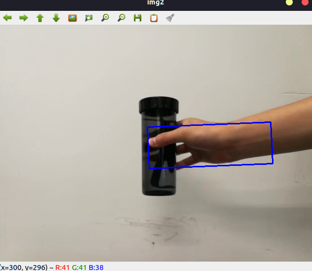
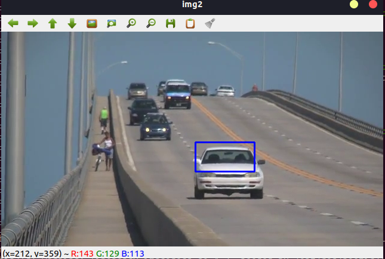
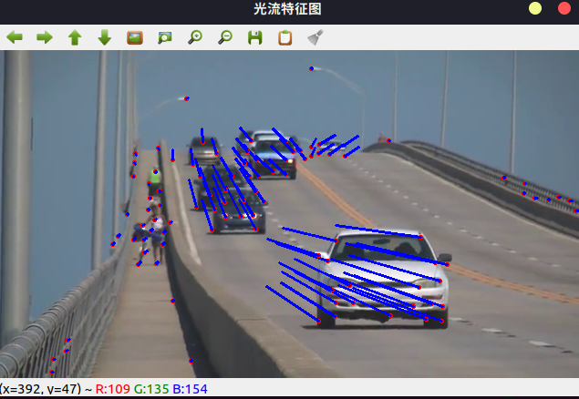

.. highlight:: c++

.. default-domain:: cpp

==================
Video Analysis
==================

1 Camshift
==================

Opencv C++ API:

.. code-block:: c++

    RotatedRect CamShift(InputArray probImage, Rect& window, TermCriteria criteria)

.. NOTE::

    * probImage: Back projection of the object histogram. See  calcBackProject()
    * window: Initial search window
    * riteria: Stop criteria for the underlying  meanShift()

demo调用, 源码 

.. code-block:: c++

    TEST(Camshift, demo)
    {
        std::string filename = GetOpenCVDatasetDirectory() + "/cup.mp4";
        Camshift demo;
        demo.RunDemo(filename);
    }

函数使用：

.. code-block:: c++

    void Camshift::RunDemo(const std::string& filename)
    {
        VideoCapture capture(filename);
        if (!capture.isOpened()){
            //error in opening the video input
            cerr << "Unable to open file!" << endl;
        }

        Mat frame, roi, hsv_roi, mask;
        // take first frame of the video
        capture >> frame;

        // setup initial location of window
        Rect track_window(300, 200, 100, 50); // simply hardcoded the values

        // set up the ROI for tracking
        roi = frame(track_window);
        cvtColor(roi, hsv_roi, COLOR_BGR2HSV);
        inRange(hsv_roi, Scalar(0, 60, 32), Scalar(180, 255, 255), mask);

        float range_[] = {0, 180};
        const float* range[] = {range_};
        Mat roi_hist;
        int histSize[] = {180};
        int channels[] = {0};
        calcHist(&hsv_roi, 1, channels, mask, roi_hist, 1, histSize, range);
        normalize(roi_hist, roi_hist, 0, 255, NORM_MINMAX);

        // Setup the termination criteria, either 10 iteration or move by atleast 1 pt
        TermCriteria term_crit(TermCriteria::EPS | TermCriteria::COUNT, 10, 1);

        while(true){
            Mat hsv, dst;
            capture >> frame;
            if (frame.empty())
                break;
            cvtColor(frame, hsv, COLOR_BGR2HSV);
            calcBackProject(&hsv, 1, channels, roi_hist, dst, range);

            // apply camshift to get the new location
            RotatedRect rot_rect = CamShift(dst, track_window, term_crit);

            // Draw it on image
            Point2f points[4];
            rot_rect.points(points);
            for (int i = 0; i < 4; i++)
                line(frame, points[i], points[(i+1)%4], 255, 2);
            imshow("img2", frame);

            int keyboard = waitKey(30);
            if (keyboard == 'q' || keyboard == 27)
                break;
        }
    }

运行结果

.. code-block:: bash

    [bin] ./xslam.opencv.video_analysis.cam_shift_test

参考源码：

.. NOTE::

    * cam_shift_test.cpp
    * cam_shift.cpp
    * cam_shift.h

2  Meanshift
==================

Opencv C++ API:

.. code-block:: c++

    int meanShift( InputArray probImage, CV_OUT CV_IN_OUT Rect& window, TermCriteria criteria );

.. NOTE::

    * probImage：概率分布图像，可以是目标直方图的反向投影(见 cvCalcBackProject)
    * Window：初始搜索窗口，可以是使用Rect定义ROI
    * Criteria：确定窗口搜索停止的准则，OpenCV实现该算法时定义了两个停止条件：迭代次数达到设置的最大值；窗口中心的漂移值小于某个设定的限值。

demo调用, 源码 

.. code-block:: c++

    TEST(Meanshift, demo)
    {
        std::string filename = GetOpenCVDatasetDirectory() + "/slow_traffic_small.mp4";
        Meanshift demo;
        demo.RunDemo(filename);
    }

函数使用：

.. code-block:: c++

    void Meanshift::RunDemo(const std::string& filename)
    {

        VideoCapture capture(filename);
        if (!capture.isOpened()){
            //error in opening the video input
            cerr << "Unable to open file!" << endl;
        }

        Mat frame, roi, hsv_roi, mask;
        // take first frame of the video
        capture >> frame;

        // setup initial location of window
        Rect track_window(300, 200, 100, 50); // simply hardcoded the values

        // set up the ROI for tracking
        roi = frame(track_window);
        cvtColor(roi, hsv_roi, COLOR_BGR2HSV);
        inRange(hsv_roi, Scalar(0, 60, 32), Scalar(180, 255, 255), mask);

        float range_[] = {0, 180};
        const float* range[] = {range_};
        Mat roi_hist;
        int histSize[] = {180};
        int channels[] = {0};
        calcHist(&hsv_roi, 1, channels, mask, roi_hist, 1, histSize, range);
        normalize(roi_hist, roi_hist, 0, 255, NORM_MINMAX);

        // Setup the termination criteria, either 10 iteration or move by atleast 1 pt
        TermCriteria term_crit(TermCriteria::EPS | TermCriteria::COUNT, 10, 1);

        while(true){
            Mat hsv, dst;
            capture >> frame;
            if (frame.empty())
                break;
            cvtColor(frame, hsv, COLOR_BGR2HSV);
            calcBackProject(&hsv, 1, channels, roi_hist, dst, range);

            // apply meanshift to get the new location
            meanShift(dst, track_window, term_crit);

            // Draw it on image
            rectangle(frame, track_window, 255, 2);
            imshow("img2", frame);

            int keyboard = waitKey(30);
            if (keyboard == 'q' || keyboard == 27)
                break;
        }
    }

运行结果

.. code-block:: bash

    [bin] ./xslam.opencv.video_analysis.mean_shift_test

参考源码：

.. NOTE::

    * mean_shift_test.cpp
    * mean_shift.cpp
    * mean_shift.h

3 OpticalFlow
==================

Opencv C++ API:

.. code-block:: c++

    void cv::calcOpticalFlowPyrLK(	
        InputArray 	prevImg,
        InputArray 	nextImg,
        InputArray 	prevPts,
        InputOutputArray nextPts,
        OutputArray 	status,
        OutputArray 	err,
        Size 	winSize = Size(21, 21),
        int 	maxLevel = 3,
        TermCriteria 	criteria = TermCriteria(TermCriteria::COUNT+TermCriteria::EPS, 30, 0.01),
        int 	flags = 0,
        double 	minEigThreshold = 1e-4 
    )		

.. NOTE::

    * prevImg ：buildOpticalFlowPyramid构造的第一个8位输入图像或金字塔。
    * nextImg ：与prevImg相同大小和相同类型的第二个输入图像或金字塔
    * prevPts ：需要找到流的2D点的矢量(vector of 2D points for which the flow needs to be found;);点坐标必须是单精度浮点数。
    * nextPts ：输出二维点的矢量（具有单精度浮点坐标），包含第二图像中输入特征的计算新位置;当传递OPTFLOW_USE_INITIAL_FLOW标志时，向量必须与输入中的大小相同。
    * status ：输出状态向量（无符号字符）;如果找到相应特征的流，则向量的每个元素设置为1，否则设置为0。
    * err ：输出错误的矢量; 向量的每个元素都设置为相应特征的错误，错误度量的类型可以在flags参数中设置; 如果未找到流，则未定义错误（使用status参数查找此类情况）。
    * winSize ：每个金字塔等级的搜索窗口的winSize大小。
    * maxLevel ：基于0的最大金字塔等级数;如果设置为0，则不使用金字塔（单级），如果设置为1，则使用两个级别，依此类推;如果将金字塔传递给输入，那么算法将使用与金字塔一样多的级别，但不超过maxLevel。
    * criteria ：参数，指定迭代搜索算法的终止条件（在指定的最大迭代次数criteria.maxCount之后或当搜索窗口移动小于criteria.epsilon时）。
    * flags ：操作标志：
        * OPTFLOW_USE_INITIAL_FLOW使用初始估计，存储在nextPts中;如果未设置标志，则将prevPts复制到nextPts并将其视为初始估计。
        * OPTFLOW_LK_GET_MIN_EIGENVALS使用最小特征值作为误差测量（参见minEigThreshold描述）;如果没有设置标志，则将原稿周围的色块和移动点之间的L1距离除以窗口中的像素数，用作误差测量。
    * minEigThreshold ：算法计算光流方程的2x2正常矩阵的最小特征值，除以窗口中的像素数;如果此值小于minEigThreshold，则过滤掉相应的功能并且不处理其流程，因此它允许删除坏点并获得性能提升

demo调用, 源码 

.. code-block:: c++

    TEST(OpticalFlow, demo)
    {
        std::string filename = GetOpenCVDatasetDirectory() + "/slow_traffic_small.mp4";
        OpticalFlow demo;
        demo.RunDemo(filename);
    }

函数使用：

.. code-block:: c++

    void OpticalFlow::RunDemo(const std::string& filename)
    {
        cv::Mat image1, image2;
        std::vector<cv::Point2f> point1, point2, pointCopy;
        std::vector<uchar> status;
        std::vector<float> err;

        cv::VideoCapture video(filename);
        video >> image1;
        cv::Mat image1Gray, image2Gray;
        cv::cvtColor(image1, image1Gray, cv::COLOR_RGB2GRAY);
        cv::goodFeaturesToTrack(image1Gray, point1, 100, 0.01, 10, cv::Mat());
        pointCopy = point1;

        for (int i = 0; i < point1.size(); i++)    //绘制特征点位  
        {
            cv::circle(image1, point1[i], 1, cv::Scalar(0, 0, 255), 2);
        }

        cv::namedWindow("光流特征图");
        while (true)
        {
            video >> image2;
            if (cv::waitKey(33) == ' ')  //按下空格选择当前画面作为标定图像  
            {
                cv::cvtColor(image2, image1Gray, cv::COLOR_RGB2GRAY);
                cv::goodFeaturesToTrack(image1Gray, point1, 100, 0.01, 10, cv::Mat());
                pointCopy = point1;
            }
            cv::cvtColor(image2, image2Gray, cv::COLOR_RGB2GRAY);
            cv::calcOpticalFlowPyrLK(image1Gray, image2Gray, point1, point2, status, err, cv::Size(50, 50), 3); // LK金字塔       
            int tr_num = 0;
            auto status_itr = status.begin();
            while (status_itr != status.end()) {
                if (*status_itr > 0)
                    tr_num++;
                status_itr++;
            }
            if (tr_num < 6) {
                std::cout << "you need to change the feat-img because the background-img was all changed" << std::endl;
                if (cv::waitKey(0) == ' ') {
                    cv::cvtColor(image2, image1Gray, cv::COLOR_RGB2GRAY);
                    cv::goodFeaturesToTrack(image1Gray, point1, 100, 0.01, 10, cv::Mat());
                    pointCopy = point1;
                }
            }
            for (int i = 0; i < point2.size(); i++)
            {
                cv::circle(image2, point2[i], 1, cv::Scalar(0, 0, 255), 2);
                cv::line(image2, pointCopy[i], point2[i], cv::Scalar(255, 0, 0), 2);
            }

            cv::imshow("光流特征图", image2);
            std::swap(point1, point2);
            image1Gray = image2Gray.clone();
        }
    }

运行结果

.. code-block:: bash

    [bin] ./xslam.opencv.video_analysis.optical_flow_test

参考源码：

.. NOTE::

    * optical_flow_test.cpp
    * optical_flow.cpp
    * optical_flow.h