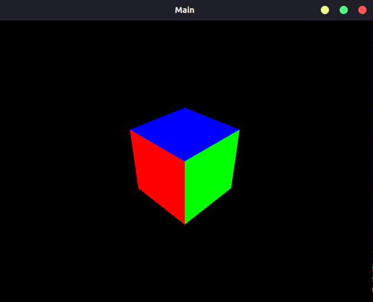
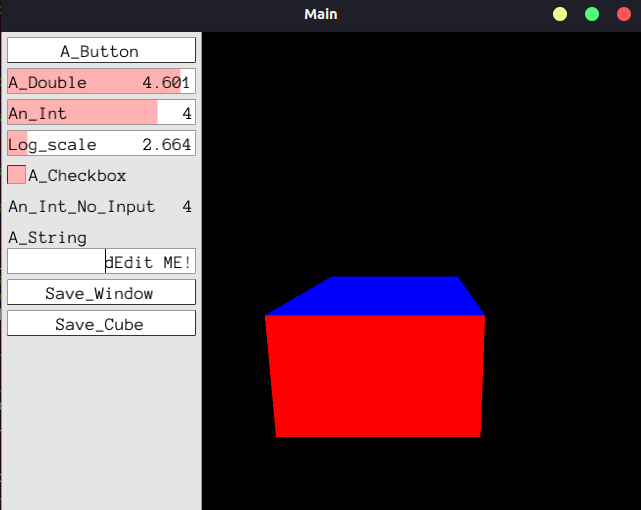
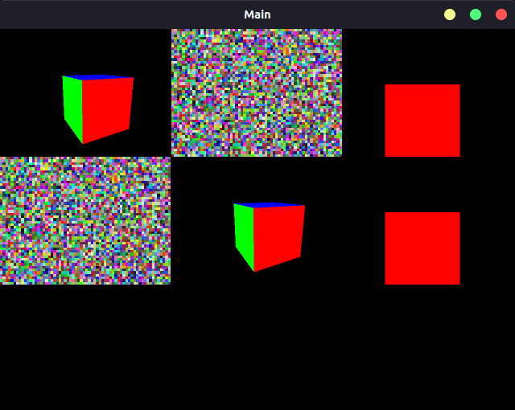

.. _chapter-pangolin_tutorial:

=================
Pangolin Tutorial
=================

1 介绍
===================

Pangolin 是一组轻量级和可移植的实用程序库，用于制作基于 3D、数字或视频的程序和算法的原型。 它在计算机视觉领域被广泛使用，
作为删除特定于平台的样板并使数据可视化变得容易的一种手段。

Pangolin 的总体精神是通过简单的界面和工厂，而不是窗口和视频，最大限度地减少样板文件并最大限度地提高可移植性和灵活性。
它还提供了一套用于交互式调试的实用程序，例如 3D 操作、绘图仪、调整变量，以及用于 python 脚本和实时调整的下拉式类似 
Quake 的控制台。

**主要特点**

* 跨平台窗口
    * 为 Windows、Linux、OSX 和 Web 构建（使用 Emscripten）
    * 支持不同的窗口实现，包括离屏缓冲区
* 视口管理和交互
    * 简单而高效的视口管理
    * 直观的 3D 导航和处理程序
    * 使用计算机视觉和机器人相机和坐标约定的实用程序
* 视频输入和输出
    * 用于普通和机器视觉相机和媒体格式的广泛视频输入/输出包装器
    * 灵活的过滤器接口，可轻松对视频通道和格式等进行后期处理。
* 调整变量
    * 有 101 个小部件库和几个 'tweak' var 库 - Pangolin 提供了另一种实现，具有一些优点和缺点
    * 单行定义和可扩展类型
* 下拉控制台
    * 可针对不同的 shell 进行扩展，但目前支持 Python 实时控制台
    * 轻松访问自省调整变量

**code**

.. code-block:: bash

    # Clone Pangolin along with it's submodules
    git clone --recursive https://github.com/stevenlovegrove/Pangolin.git

2 HelloPangolin
===================

demo调用, 源码 

.. code-block:: c++

    TEST(HelloPangolin, hello)
    {
        HelloPangolin demo;
        demo.RunDemo();
    }

函数使用：

.. code-block:: c++

    void HelloPangolin::RunDemo()
    {
        ::pangolin::CreateWindowAndBind("Main",640,480);
        glEnable(GL_DEPTH_TEST);

        // Define Projection and initial ModelView matrix
        ::pangolin::OpenGlRenderState s_cam(
            ::pangolin::ProjectionMatrix(640,480,420,420,320,240,0.2,100),
            ::pangolin::ModelViewLookAt(-2,2,-2, 0,0,0, ::pangolin::AxisY)
        );

        // Create Interactive View in window
        ::pangolin::Handler3D handler(s_cam);
        ::pangolin::View& d_cam = ::pangolin::CreateDisplay()
                .SetBounds(0.0, 1.0, 0.0, 1.0, -640.0f/480.0f)
                .SetHandler(&handler);

        while( !::pangolin::ShouldQuit() )
        {
            // Clear screen and activate view to render into
            glClear(GL_COLOR_BUFFER_BIT | GL_DEPTH_BUFFER_BIT);
            d_cam.Activate(s_cam);

            // Render OpenGL Cube
            ::pangolin::glDrawColouredCube();

            // Swap frames and Process Events
            ::pangolin::FinishFrame();
        }
    }

运行结果

.. code-block:: bash

    [bin] ./xslam.pangolin.hello_pangolin_test

参考源码：

.. NOTE::

    * hello_pangolin_test.cpp
    * hello_pangolin.cpp
    * hello_pangolin.h

3 SimpleDisplay
===================

demo调用, 源码 

.. code-block:: c++

    TEST(SimpleDisplay, hello)
    {
        SimpleDisplay demo;
        demo.RunDemo();
    }

函数使用：

.. code-block:: c++

    void SimpleDisplay::RunDemo()
    {
        // Create OpenGL window in single line
        ::pangolin::CreateWindowAndBind("Main",640,480);
        
        // 3D Mouse handler requires depth testing to be enabled
        glEnable(GL_DEPTH_TEST);

        // Define Camera Render Object (for view / scene browsing)
        ::pangolin::OpenGlRenderState s_cam(
            ::pangolin::ProjectionMatrix(640,480,420,420,320,240,0.1,1000),
            ::pangolin::ModelViewLookAt(-0,0.5,-3, 0,0,0, ::pangolin::AxisY)
        );

        // Choose a sensible left UI Panel width based on the width of 20
        // charectors from the default font.
        const int UI_WIDTH = 20* ::pangolin::default_font().MaxWidth();

        // Add named OpenGL viewport to window and provide 3D Handler
        ::pangolin::View& d_cam = ::pangolin::CreateDisplay()
            .SetBounds(0.0, 1.0, ::pangolin::Attach::Pix(UI_WIDTH), 1.0, 640.0f/480.0f)
            .SetHandler(new ::pangolin::Handler3D(s_cam));

        // Add named Panel and bind to variables beginning 'ui'
        // A Panel is just a View with a default layout and input handling
        ::pangolin::CreatePanel("ui")
            .SetBounds(0.0, 1.0, 0.0, ::pangolin::Attach::Pix(UI_WIDTH));

        // Safe and efficient binding of named variables.
        // Specialisations mean no conversions take place for exact types
        // and conversions between scalar types are cheap.
        ::pangolin::Var<bool> a_button("ui.A_Button",false,false);
        ::pangolin::Var<double> a_double("ui.A_Double",3,0,5);
        ::pangolin::Var<int> an_int("ui.An_Int",2,0,5);
        ::pangolin::Var<double> a_double_log("ui.Log_scale",3,1,1E4, true);
        ::pangolin::Var<bool> a_checkbox("ui.A_Checkbox",false,true);
        ::pangolin::Var<int> an_int_no_input("ui.An_Int_No_Input",2);
        ::pangolin::Var<std::string> a_string("ui.A_String", "Edit ME!");

        // std::function objects can be used for Var's too. These work great with C++11 closures.
        ::pangolin::Var<std::function<void(void)>> save_window("ui.Save_Window", {
            ::pangolin::SaveWindowOnRender("window");
        });

        ::pangolin::Var<std::function<void(void)>> save_cube_view("ui.Save_Cube", [&d_cam](){
            ::pangolin::SaveWindowOnRender("cube", d_cam.v);
        });

        // Demonstration of how we can register a keyboard hook to alter a Var
        ::pangolin::RegisterKeyPressCallback(::pangolin::PANGO_CTRL + 'b', [&](){
            a_double = 3.5;
        });

        // Default hooks for exiting (Esc) and fullscreen (tab).
        while( !::pangolin::ShouldQuit() )
        {
            // Clear entire screen
            glClear(GL_COLOR_BUFFER_BIT | GL_DEPTH_BUFFER_BIT);    

            if( ::pangolin::Pushed(a_button) )
            std::cout << "You Pushed a button!" << std::endl;

            // Overloading of Var<T> operators allows us to treat them like
            // their wrapped types, eg:
            if( a_checkbox )
            an_int = (int)a_double;

            an_int_no_input = an_int;

            if(d_cam.IsShown()) {
                // Activate efficiently by object
                d_cam.Activate(s_cam);

                // Render some stuff
                glColor3f(1.0,1.0,1.0);
                ::pangolin::glDrawColouredCube();
            }

            // Swap frames and Process Events
            ::pangolin::FinishFrame();
        }
    }

运行结果

.. code-block:: bash

    [bin] ./xslam.pangolin.simple_display_test

参考源码：

.. NOTE::

    * simple_display_test.cpp
    * simple_display.cpp
    * simple_display.h

4 SimpleMultiDisplay
====================

demo调用, 源码 

.. code-block:: c++

    TEST(SimpleMultiDisplay, hello)
    {
        SimpleMultiDisplay demo;
        demo.RunDemo();
    }

函数使用：

.. code-block:: c++

    void SimpleMultiDisplay::RunDemo()
    {
        // Create OpenGL window in single line
        ::pangolin::CreateWindowAndBind("Main",640,480);
        
        // 3D Mouse handler requires depth testing to be enabled
        glEnable(GL_DEPTH_TEST);  

        // Issue specific OpenGl we might need
        glEnable (GL_BLEND);
        glBlendFunc (GL_SRC_ALPHA, GL_ONE_MINUS_SRC_ALPHA);

        // Define Camera Render Object (for view / scene browsing)
        ::pangolin::OpenGlMatrix proj = ::pangolin::ProjectionMatrix(640,480,420,420,320,240,0.1,1000);
        ::pangolin::OpenGlRenderState s_cam(proj, ::pangolin::ModelViewLookAt(1,0.5,-2,0,0,0, ::pangolin::AxisY) );
        ::pangolin::OpenGlRenderState s_cam2(proj, ::pangolin::ModelViewLookAt(0,0,-2,0,0,0, ::pangolin::AxisY) );

        // Add named OpenGL viewport to window and provide 3D Handler
        ::pangolin::View& d_cam1 = ::pangolin::Display("cam1")
            .SetAspect(640.0f/480.0f)
            .SetHandler(new ::pangolin::Handler3D(s_cam));

        ::pangolin::View& d_cam2 = ::pangolin::Display("cam2")
            .SetAspect(640.0f/480.0f)
            .SetHandler(new ::pangolin::Handler3D(s_cam2));

        ::pangolin::View& d_cam3 = ::pangolin::Display("cam3")
            .SetAspect(640.0f/480.0f)
            .SetHandler(new ::pangolin::Handler3D(s_cam));

        ::pangolin::View& d_cam4 = ::pangolin::Display("cam4")
            .SetAspect(640.0f/480.0f)
            .SetHandler(new ::pangolin::Handler3D(s_cam2));

        ::pangolin::View& d_img1 = ::pangolin::Display("img1")
            .SetAspect(640.0f/480.0f);

        ::pangolin::View& d_img2 = ::pangolin::Display("img2")
            .SetAspect(640.0f/480.0f);

        // LayoutEqual is an EXPERIMENTAL feature - it requires that all sub-displays
        // share the same aspect ratio, placing them in a raster fasion in the
        // viewport so as to maximise display size.
        ::pangolin::Display("multi")
            .SetBounds(0.0, 1.0, 0.0, 1.0)
            .SetLayout(::pangolin::LayoutEqual)
            .AddDisplay(d_cam1)
            .AddDisplay(d_img1)
            .AddDisplay(d_cam2)
            .AddDisplay(d_img2)
            .AddDisplay(d_cam3)
            .AddDisplay(d_cam4);

        const int width =  64;
        const int height = 48;
        unsigned char* imageArray = new unsigned char[3*width*height];
        ::pangolin::GlTexture imageTexture(width,height,GL_RGB,false,0,GL_RGB,GL_UNSIGNED_BYTE);

        // Default hooks for exiting (Esc) and fullscreen (tab).
        while( !::pangolin::ShouldQuit() )
        {
            glClear(GL_COLOR_BUFFER_BIT | GL_DEPTH_BUFFER_BIT);

            // Generate random image and place in texture memory for display
            setImageData(imageArray,3*width*height);
            imageTexture.Upload(imageArray,GL_RGB,GL_UNSIGNED_BYTE);

            glColor3f(1.0,1.0,1.0);

            d_cam1.Activate(s_cam);
            ::pangolin::glDrawColouredCube();

            d_cam2.Activate(s_cam2);
            ::pangolin::glDrawColouredCube();

            d_cam3.Activate(s_cam);
            ::pangolin::glDrawColouredCube();

            d_cam4.Activate(s_cam2);
            ::pangolin::glDrawColouredCube();

            d_img1.Activate();
            glColor4f(1.0f,1.0f,1.0f,1.0f);
            imageTexture.RenderToViewport();

            d_img2.Activate();
            glColor4f(1.0f,1.0f,1.0f,1.0f);
            imageTexture.RenderToViewport();

            // Swap frames and Process Events
            ::pangolin::FinishFrame();
        }

        delete[] imageArray;
    }

    void SimpleMultiDisplay::setImageData(unsigned char * imageArray, int size)
    {
        for(int i = 0 ; i < size;i++) 
        {
            imageArray[i] = (unsigned char)(rand()/(RAND_MAX/255.0));
        }
    }

运行结果

.. code-block:: bash

    [bin] ./xslam.pangolin.simple_multi_display_test

参考源码：

.. NOTE::

    * simple_multi_display_test.cpp
    * simple_multi_display.cpp
    * simple_multi_display.h
