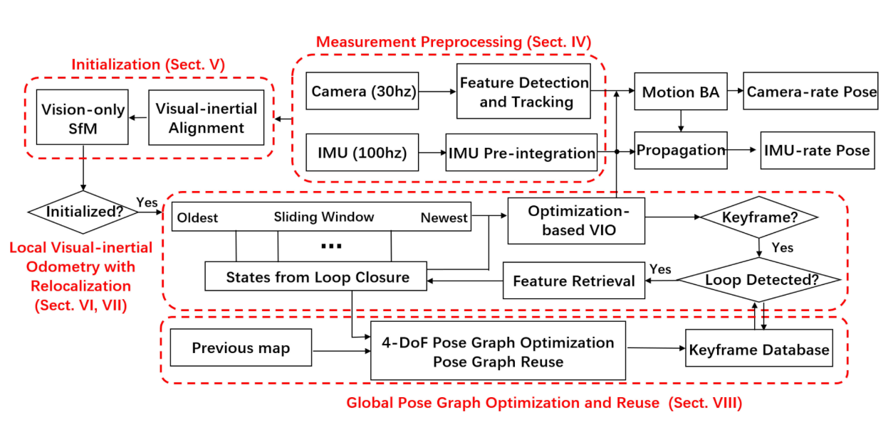

.. highlight:: c++

.. default-domain:: cpp

============
Introduction
============

Monocular visual-inertial odometry with relocalization achieved via nonlinear 
graph optimization-based,tightly-coupled, sliding window, visual-inertial bundle adjustment.

