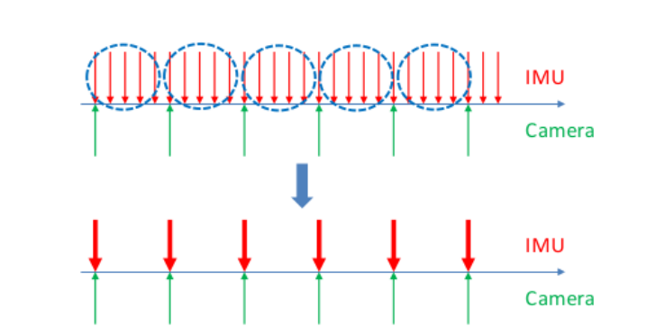

.. highlight:: c++

.. default-domain:: cpp

======================
Measurement Processing
======================

前端视觉处理
==============

Simple feature processing pipeline

自适应直方图均衡化（cv::CLAHE） 

掩模处理，特征点均匀分布（setMask）

提取图像 Harris 角点（cv::goodFeaturesToTrack）

KLT 金字塔光流跟踪（cv::calcOpticalFlowPyrLK）

连续帧跟踪 

基础矩阵 (RANSAC) 去除外点（rejectWithF） 

发布去畸变的点 feature_points(id_of_point, un_pts, cur_pts, pts_velocity)

Keyframe selection

.. NOTE::

    Case 1: Rotation-compensated average feature parallax is larger than a threshold
    Case 2: Number of tracked features in the current frame is less than a threshold

IMU测量方程
============

忽略地球自转，IMU 测量方程为

.. math::

    \begin{align}
        \hat{\mathbf{a}}_t &= \mathbf{a}_{t} + \mathbf{b}_{a_t} + \mathbf{R}_{w}^{t} \mathbf{g}^{w} + \mathbf{n}_{a} \\
        \hat{\mathbf{w}}_t &= \mathbf{w}_{t} + \mathbf{b}_{w_t} + \mathbf{n}_{w}
    \end{align}
    

预积分方程
============

由上面的IMU测量方程积分就可以计算出下一时刻的 :math:`\mathbf{p}`、 :math:`\mathbf{v}` 和 :math:`\mathbf{q}`

.. math::

    \begin{align}
        \mathbf{p}_{b_{k+1}}^{w} &= 
        	\mathbf{p}_{b_{k}}^{w} + \mathbf{v}_{b_{k}}^{w} \Delta t_{k} + 
            \iint_{t \in [t_{k}, t_{k+1}]} (\mathbf{R}_{t}^{w} 
            (\hat{\mathbf{a}}_t - \mathbf{b}_{a_t} - \mathbf{n}_{a}) - \mathbf{g}^{w})
            dt^{2} \\
        \mathbf{v}_{b_{k+1}}^{w} &= 
        	\mathbf{v}_{b_{k}}^{w} + 
        	\int_{t \in [t_{k}, t_{k+1}]} (\mathbf{R}_{t}^{w}
        	(\hat{\mathbf{a}}_t - \mathbf{b}_{a_t} - \mathbf{n}_{a}) - \mathbf{g}^{w}) _dt \\
        \mathbf{q}_{b_{k+1}}^{w} &= 
        	\mathbf{q}_{b_{k}}^{w} \otimes 
            \int_{t \in [t_{k}, t_{k+1}]} 
            \frac{1}{2} \Omega 
            (\hat{\mathbf{w}}_t - \mathbf{b}_{w_t} - \mathbf{n}_{w}) \mathbf{q}_{t}^{b_k}
            dt
    \end{align}

其中（Hamilton四元数左乘矩阵，实部在最后）

.. math::

    \Omega(\mathbf{w}) = 
        \begin{bmatrix}
            w \\
            0
        \end{bmatrix}_{R} = 
        \begin{bmatrix}
           -w_{\times} & w \\
            -w^{T}     & 0
        \end{bmatrix}_{R}, 
        \qquad w_{\times} = 
        \begin{bmatrix}
            0    & -w_z &  w_y \\
            w_z  & 0    & -w_x \\
            -w_y & w_x  & 0
        \end{bmatrix}

误差状态方程
============

误差状态方程:

.. math:: \delta{X}_{k+1} = (\mathbf{I} + \mathbf{F}\delta{t})\delta{X}_{k} + (\mathbf{G}\delta{t})\mathbf{n}

展开得 :

.. math:: 

    \underbrace
    {
        \begin{bmatrix}
            \delta\alpha_{k+1} \\
            \delta\theta_{k+1} \\
            \delta\beta_{k+1}  \\
            \delta{b_a}_{k+1}  \\
            \delta{b_g}_{k+1} 
        \end{bmatrix}
    }_{\delta{X}_{k+1}} 
    =
    \underbrace
    {
        \begin{bmatrix}
            I & \mathbf{f}_{01} &  \delta{\mathbf{t}} & -\frac{1}{4}(q_k + q_{k+1}\delta{t^2}) &  \mathbf{f}_{04} \\
            0  & I - [\frac{w_{k} + w_{k+1}}{2} - b_{wk}]_{\times}\delta{t} & 0 & 0 & -\delta{t} \\
            0 &  \mathbf{f}_{21}  & I & -\frac{1}{2}(q_k + q_{k+1}\delta{t}) & \mathbf{f}_{24}\\
            0 & 0 & 0 & I & 0  \\
            0 & 0 & 0 & 0 & I   
        \end{bmatrix}
    }_{\mathbf{I} + \mathbf{F}\delta{t}} 
    \underbrace
    {
        \begin{bmatrix}
            \delta\alpha_{k} \\
            \delta\theta_{k} \\
            \delta\beta_{k}  \\
            \delta{b_a}_{k}  \\
            \delta{b_g}_{k} 
        \end{bmatrix}
    }_{\delta{X}_{k}} 
    + \\
    \underbrace
    {
        \begin{bmatrix}
            \frac{1}{4}q_k\delta{t}^2 & v_{01} & \frac{1}{4}q_{k+1}\delta{t}^2 & v_{03} & 0 & 0 \\
            0 & \frac{1}{2}\delta{t} & 0 & \frac{1}{2}\delta{t} & 0 & 0\\
            \frac{1}{2}q_k \delta{t} & v_{21} & \frac{1}{2}{q_k+1}\delta{t} &  v_{23} & 0 & 0 \\
            0 & 0 & 0 & 0 & \delta{t} & 0 \\
            0 & 0 & 0 & 0 & 0 & \delta{t}
        \end{bmatrix}
    }_{\mathbf{G}\delta{t}}
    \underbrace
    {
        \begin{bmatrix}
            n_{a0} \\
            n_{w0} \\
            n_{a1} \\
            n_{w1} \\
            n_{ba} \\
            n_{bg} 
        \end{bmatrix}
    }_{\mathbf{n}}

其中：

.. math::

    \begin{cases}
        \begin{align}
            \mathbf{f}_{01} &=  -\frac{1}{4}(-q_{k}[a_{k} - b_{ak}]_{\times}\delta{t}^2)\delta{t} - \frac{1}{4}(q_{k+1}[a_{k+1} - b_{ak}]_{\times}(\mathbf{I} - [\frac{w_{k+1} + w_{k}}{2} - b_{gk}]_{\times}\delta{t})\delta{t}^2 \\
            \mathbf{f}_{21} &=  -\frac{1}{2}(-q_{k}[a_{k} - b_{ak}]_{\times}\delta{t})\delta{t} - \frac{1}{2}(q_{k+1}[a_{k+1} - b_{ak}]_{\times}(\mathbf{I} - [\frac{w_{k+1} + w_{k}}{2} - b_{gk}]_{\times}\delta{t})\delta{t}  \\
            \mathbf{f}_{04} &=  \frac{1}{4}(-q_{k+1}[a_{k+1} - b_{ak}]_{\times}\delta{t}^2)(-\delta{t}) \\
            \mathbf{f}_{24} &= \frac{1}{2}(-q_{k+1}[a_{k+1} - b_{ak}]_{\times}\delta{t})(-\delta{t})  \\
            v_{01} &=  \frac{1}{4}(-q_{k+1}[a_{k+1} - b_{ak}]_{\times}\delta{t}^2)\delta{t}\\
            v_{03} &=  \frac{1}{4}(-q_{k+1}[a_{k+1} - b_{ak}]_{\times}\delta{t}^2)\frac{1}{2}\delta{t}\\
            v_{21} &=  \frac{1}{2}(-q_{k+1}[a_{k+1} - b_{ak}]_{\times}\delta{t}^2)\frac{1}{2}\delta{t}\\
            v_{23} &=  \frac{1}{2}(-q_{k+1}[a_{k+1} - b_{ak}]_{\times}\delta{t}^2)\frac{1}{2}\delta{t}
        \end{align}
    \end{cases}

**integration_base.h** 代码如下:

.. code-block:: c++

    MatrixXd F = MatrixXd::Zero(15, 15);
    F.block<3, 3>(0, 0) = Matrix3d::Identity();
    F.block<3, 3>(0, 3) = -0.25 * delta_q.toRotationMatrix() * R_a_0_x * _dt * _dt + 
        -0.25 * result_delta_q.toRotationMatrix() * R_a_1_x * 
        (Matrix3d::Identity() - R_w_x * _dt) * _dt * _dt;
    F.block<3, 3>(0, 6) = MatrixXd::Identity(3,3) * _dt;
    F.block<3,3>(0,9) =-0.25(delta_q.toRotationMatrix()+result_delta_q.toRotationMatrix())*_dt*_dt;
    F.block<3, 3>(0, 12) = -0.25 * result_delta_q.toRotationMatrix() * R_a_1_x * _dt * _dt * -_dt;
    F.block<3, 3>(3, 3) = Matrix3d::Identity() - R_w_x * _dt;
    F.block<3, 3>(3, 12) = -1.0 * MatrixXd::Identity(3,3) * _dt;
    F.block<3, 3>(6, 3) = -0.5 * delta_q.toRotationMatrix() * R_a_0_x * _dt + 
        -0.5 *result_delta_q.toRotationMatrix() * R_a_1_x *(Matrix3d::Identity()-R_w_x * _dt)* _dt;
    F.block<3, 3>(6, 6) = Matrix3d::Identity();
    F.block<3, 3>(6, 9) = -0.5 * (delta_q.toRotationMatrix()+result_delta_q.toRotationMatrix())*_dt;
    F.block<3, 3>(6, 12) = -0.5 * result_delta_q.toRotationMatrix() * R_a_1_x * _dt * -_dt;
    F.block<3, 3>(9, 9) = Matrix3d::Identity();
    F.block<3, 3>(12, 12) = Matrix3d::Identity();

    MatrixXd V = MatrixXd::Zero(15,18);
    V.block<3, 3>(0, 0) =  0.25 * delta_q.toRotationMatrix() * _dt * _dt;
    V.block<3, 3>(0, 3) =  0.25 * -result_delta_q.toRotationMatrix() *R_a_1_x * _dt*_dt* 0.5 * _dt;
    V.block<3, 3>(0, 6) =  0.25 * result_delta_q.toRotationMatrix() * _dt * _dt;
    V.block<3, 3>(0, 9) =  V.block<3, 3>(0, 3);
    V.block<3, 3>(3, 3) =  0.5 * MatrixXd::Identity(3,3) * _dt;
    V.block<3, 3>(3, 9) =  0.5 * MatrixXd::Identity(3,3) * _dt;
    V.block<3, 3>(6, 0) =  0.5 * delta_q.toRotationMatrix() * _dt;
    V.block<3, 3>(6, 3) =  0.5 * -result_delta_q.toRotationMatrix() * R_a_1_x  * _dt * 0.5 * _dt;
    V.block<3, 3>(6, 6) =  0.5 * result_delta_q.toRotationMatrix() * _dt;
    V.block<3, 3>(6, 9) =  V.block<3, 3>(6, 3);
    V.block<3, 3>(9, 12) = MatrixXd::Identity(3,3) * _dt;
    V.block<3, 3>(12, 15) = MatrixXd::Identity(3,3) * _dt;

