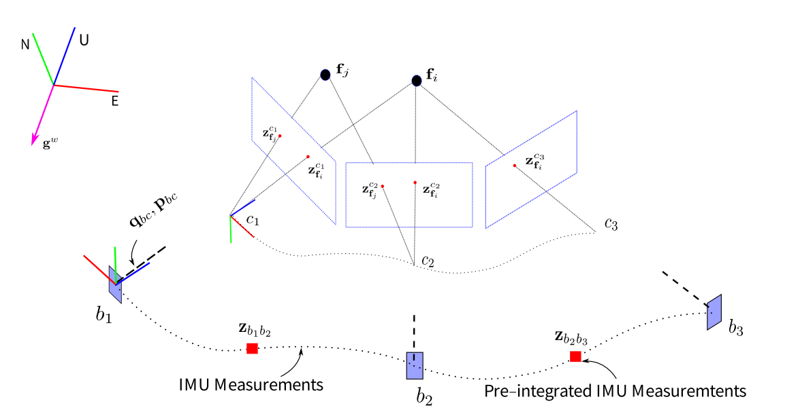

.. highlight:: c++

.. default-domain:: cpp

=====================
System Initialization
=====================

相机初始化
========== 

相机坐标系 :math:`c_0` 为世界坐标系:

本体坐标系转换到 :math:`c_0` 坐标系:

.. math::

    \begin{align}
        q_{b_k}^{c_0} &= q_{c_k}^{c_0}\otimes (q_{c}^{b})^{-1} \\
        sp_{b_k}^{c_0} &= s\bar{p}_{c_k}^{c_0} - R_{b_k}^{c_0}p_{c}^{b} \\
    \end{align}

其中参数 :math:`s` 给视觉测量的位移赋予尺度信息。

初始化速度、重力向量和尺度因子

待优化的变量为：

.. math::

    \chi_{I} = 
    \begin{bmatrix}
        \mathbf{v}_{b_0}^{b_0} \\
        \mathbf{v}_{b_0}^{b_0} \\
        \mathbf{v}_{b_0}^{b_0} \\
        \vdots 				   \\
        \mathbf{v}_{b_0}^{b_0} \\
        \mathbf{g}^{c_0} 	   \\
        s
    \end{bmatrix}

将预积分项广义的位置和速度中的世界坐标系 :math:`w` 换为 :math:`c_0` 坐标系：

.. math:: 

    \begin{align}
        \alpha_{b_{k+1}}^{b_{k}} &= 
            R_{c_{0}}^{b_{k}}(\mathbf{p}_{b_{k+1}}^{c_0} - 
            \mathbf{p}_{b_{k}}^{c_0} - 
            \mathbf{\upsilon}_{b_{k}}^{c_0} \Delta{t_k} + 
            \frac{1}{2}\mathbf{g}^{c_0} \Delta{t_k}^2)
        \\
        \beta_{b_{k+1}}^{b_{k}} &= 
            R_{c_{0}}^{b_{k}}(\mathbf{v}_{b_{k+1}}^{c_0} - 
            \mathbf{\upsilon}_{b_{k}}^{c_0} +
            \mathbf{g}^{c_0} \Delta{t_k})
    \end{align}

:math:`\mathbf{p}_{b_{k+1}}^{c_0}` 和 :math:`\mathbf{p}_{b_{k}}^{c_0}` 可由视觉 :math:`SFM` 获得: 

.. math::

    \begin{align}
        \mathbf{p}_{b_{k}}^{c_0} &= s\bar{\mathbf{p}}_{b_{k}}^{c_0} \\
        \mathbf{p}_{b_{k+1}}^{c_0} &=s\bar{\mathbf{p}}_{b_{k+1}}^{c_0}
    \end{align}

代入等式：

重力矢量的模长固定（ :math:`g = 9.8 m/s^2` ），其为2个自由度，在切空间上对其参数化

.. math::

    \begin{align}
	\hat{g} &= ||g|| \cdot \bar{\hat{g}} + w_1 \vec{b_1} + w_2 \vec{b_2} \\
			&= ||g|| \cdot \bar{\hat{g}} + B\vec{w}
    \end{align} , \quad \quad B\in \mathbb{R}^{3\times2}, \vec{w} \in \mathbb{R}^{2\times1}

令 :math:`\hat{g} = g^{c_0}` , 将其代入上一小节公式得 :

.. math::

    \begin{align}
    \begin{bmatrix}
        -I\Delta{t}_k & 0 & \frac{1}{2}R_{c_0}^{b_k}\Delta{t}_{k}^2B & R_{c_0}^{b_k}(\bar{p}_{c_{k+1}^{c_0}} - \bar{p}_{c_{k}^{c_0}} ) \\
        -I & R_{c_0}^{b_k}R_{b_{k+1}}^{c_0} & R_{c_0}^{b_k}\Delta{t}_{k}B & 0
    \end{bmatrix} 
    \begin{bmatrix}
        v_{b_k}^{b_k} \\
        v_{b_{k+1}}^{b_{k+1}} \\
        \vec{w} \\
        s
    \end{bmatrix} 
    \\
    =
    \begin{bmatrix}
        \alpha_{b_{k+1}}^{b_k} - p_{c}^{b} + R_{c_0}^{b_k}R_{b_{k+1}}^{c_0} p_{c}^{b} - \frac{1}{2}R_{c_0}^{b_k} \Delta{t}_{k}^2 ||g||\cdot \bar{\hat{g}} \\
        \beta_{b_{k+1}}^{b_k} - R_{c_0}^{b_k} \Delta{t}_{k} ||g||\cdot \bar{\hat{g}}
    \end{bmatrix}
    \end{align}

:math:`IMU` 测量残差

:math:`IMU` 测量残差 :math:`r_B(\hat{\mathbf{Z}}^{b_{k}}_{b_{k+1}}, \mathbf{\chi})` ：

.. math:: 

    r_B(\hat{\mathbf{Z}}^{b_{k}}_{b_{k+1}}, \mathbf{\chi})
    =
    \begin{bmatrix}
        \delta\alpha_{b_{k+1}}^{b_{k}} \\
        \delta\theta_{b_{k+1}}^{b_{k}} \\
        \delta\beta_{b_{k+1}}^{b_{k}}  \\
        \delta {\mathbf{b}}_{a}  \\
        \delta {\mathbf{b}}_{w}  \\
    \end{bmatrix}
    =
    \begin{bmatrix}
        \mathbf{R}_{w}^{b_k}(\mathbf{p}_{b_{k+1}^{w}} - \mathbf{p}_{b_{k}^{w}} - 						\mathbf{\upsilon}_{b_{k}^{w}} \Delta{t_k} + \frac{1}{2}\mathbf{g}^w \Delta{t_k}^2) -  \hat{\alpha}_{b_{k+1}}^{b_{k}} \\
        2\begin{bmatrix}
            (\hat{\mathbf{\gamma}}_{b_{k+1}}^{b_{k}})^{-1} \otimes \mathbf{q}_{b_{k}^{w}} 				\otimes \mathbf{q}_{b_{k+1}^{w}}
        \end{bmatrix} \\
        \mathbf{R}_{w}^{b_k}(\mathbf{\upsilon}_{b_{k+1}^{w}} - 											\mathbf{\upsilon}_{b_{k}^{w}} + \mathbf{g}^w \Delta{t_k}) - hat{\beta}_{b_{k+1}}^{b_{k}} \\
        \mathbf{b}_{ab_{k+1}} - \mathbf{b}_{wb_{k}} \\
        \mathbf{b}_{wb_{k+1}} - \mathbf{b}_{wb_{k}} \\
    \end{bmatrix}

对于两帧之间的 :math:`IMU` 测量残差，优化变量为：

.. math::

    \underbrace{
        \begin{bmatrix}
            \mathbf{p}_{b_{k}}^{w}, \mathbf{\theta}_{b_{k}}^{w} 
        \end{bmatrix}
        \quad 
        \begin{bmatrix}
            \mathbf{v}_{b_{k}}^{w}, \mathbf{b}_{a_{k}}, \mathbf{b}_{w_{k}} 
        \end{bmatrix}
    }_{k}
    \quad 
    \underbrace{
        \begin{bmatrix}
            \mathbf{p}_{b_{k+1}}^{w}, \mathbf{\theta}_{b_{k+1}}^{w} 
        \end{bmatrix}
        \quad 
        \begin{bmatrix}
            \mathbf{v}_{b_{k+1}}^{w}, \mathbf{b}_{a_{k+1}}, \mathbf{b}_{w_{k+1}} 
        \end{bmatrix}
    }_{k+1}

雅克比矩阵 :math:`jacobians` :

.. math::

    J=
    \begin{bmatrix}
        \frac{\partial{\delta\alpha_{b_{k+1}}^{b_{k}}}}{\mathbf{p}_{b_{k}}^{w}} & 				\frac{\partial{\delta\alpha_{b_{k+1}}^{b_{k}}}}{\mathbf{\theta}_{b_{k}}^{w}} & 
        \frac{\partial{\delta\alpha_{b_{k+1}}^{b_{k}}}}{\mathbf{v}_{b_{k}}^{w}} & 				\frac{\partial{\delta\alpha_{b_{k+1}}^{b_{k}}}}{\mathbf{b}_{a_{k}}}  &
        \frac{\partial{\delta\alpha_{b_{k+1}}^{b_{k}}}}{\mathbf{b}_{w_{k}}}  &
        \frac{\partial{\delta\alpha_{b_{k+1}}^{b_{k}}}}{\mathbf{p}_{b_{k+1}}^{w}} & 			\frac{\partial{\delta\alpha_{b_{k+1}}^{b_{k}}}}{\mathbf{\theta}_{b_{k+1}}^{w}} & 
        \frac{\partial{\delta\alpha_{b_{k+1}}^{b_{k}}}}{\mathbf{v}_{b_{k+1}}^{w}} & 			\frac{\partial{\delta\alpha_{b_{k+1}}^{b_{k}}}}{\mathbf{b}_{a_{k+1}}}  &
        \frac{\partial{\delta\alpha_{b_{k+1}}^{b_{k}}}}{\mathbf{b}_{w_{k+1}}} \\
        \frac{\partial{\delta\theta_{b_{k+1}}^{b_{k}}}}{\mathbf{p}_{b_{k}}^{w}} & 				\frac{\partial{\delta\theta_{b_{k+1}}^{b_{k}}}}{\mathbf{\theta}_{b_{k}}^{w}} & 
        \frac{\partial{\delta\theta_{b_{k+1}}^{b_{k}}}}{\mathbf{v}_{b_{k}}^{w}} & 				\frac{\partial{\delta\theta_{b_{k+1}}^{b_{k}}}}{\mathbf{b}_{a_{k}}}  &
        \frac{\partial{\delta\theta_{b_{k+1}}^{b_{k}}}}{\mathbf{b}_{w_{k}}}  &
        \frac{\partial{\delta\theta_{b_{k+1}}^{b_{k}}}}{\mathbf{p}_{b_{k+1}}^{w}} & 			\frac{\partial{\delta\theta_{b_{k+1}}^{b_{k}}}}{\mathbf{\theta}_{b_{k+1}}^{w}} & 
        \frac{\partial{\delta\theta_{b_{k+1}}^{b_{k}}}}{\mathbf{v}_{b_{k+1}}^{w}} & 			\frac{\partial{\delta\theta_{b_{k+1}}^{b_{k}}}}{\mathbf{b}_{a_{k+1}}}  &
        \frac{\partial{\delta\theta_{b_{k+1}}^{b_{k}}}}{\mathbf{b}_{w_{k+1}}} \\
        \frac{\partial{\delta\beta_{b_{k+1}}^{b_{k}}}}{\mathbf{p}_{b_{k}}^{w}} & 				\frac{\partial{\delta\beta_{b_{k+1}}^{b_{k}}}}{\mathbf{\theta}_{b_{k}}^{w}} & 
        \frac{\partial{\delta\beta_{b_{k+1}}^{b_{k}}}}{\mathbf{v}_{b_{k}}^{w}} & 				\frac{\partial{\delta\beta_{b_{k+1}}^{b_{k}}}}{\mathbf{b}_{a_{k}}}  &
        \frac{\partial{\delta\beta_{b_{k+1}}^{b_{k}}}}{\mathbf{b}_{w_{k}}}  &
        \frac{\partial{\delta\beta_{b_{k+1}}^{b_{k}}}}{\mathbf{p}_{b_{k+1}}^{w}} & 				\frac{\partial{\delta\theta_{b_{k+1}}^{b_{k}}}}{\mathbf{\theta}_{b_{k+1}}^{w}} & 
        \frac{\partial{\delta\beta_{b_{k+1}}^{b_{k}}}}{\mathbf{v}_{b_{k+1}}^{w}} & 				\frac{\partial{\delta\beta_{b_{k+1}}^{b_{k}}}}{\mathbf{b}_{a_{k+1}}}  &
        \frac{\partial{\delta\theta_{b_{k+1}}^{b_{k}}}}{\mathbf{b}_{w_{k+1}}} \\
        \frac{\partial{\delta{\mathbf{b}}_{{a}}}}{\mathbf{p}_{b_{k}}^{w}} & 					\frac{\partial{\delta{\mathbf{b}}_{{a}}}}{\mathbf{\theta}_{b_{k}}^{w}} & 
        \frac{\partial{\delta{\mathbf{b}}_{{a}}}}{\mathbf{v}_{b_{k}}^{w}} & 					\frac{\partial{\delta{\mathbf{b}}_{{a}}}}{\mathbf{b}_{a_{k}}}  &
        \frac{\partial{\delta{\mathbf{b}}_{{a}}}}{\mathbf{b}_{w_{k}}}  &
        \frac{\partial{\delta{\mathbf{b}}_{{a}}}}{\mathbf{p}_{b_{k+1}}^{w}} & 					\frac{\partial{\delta{\mathbf{b}}_{{a}}}}{\mathbf{\theta}_{b_{k+1}}^{w}} & 
        \frac{\partial{\delta{\mathbf{b}}_{{a}}}}{\mathbf{v}_{b_{k+1}}^{w}} & 					\frac{\partial{\delta{\mathbf{b}}_{{a}}}}{\mathbf{b}_{a_{k+1}}}  &
        \frac{\partial{\delta{\mathbf{b}}_{{a}}}}{\mathbf{b}_{w_{k+1}}} \\
        \frac{\partial{\delta{\mathbf{b}}_{{w}}}}{\mathbf{p}_{b_{k}}^{w}} & 					\frac{\partial{\delta{\mathbf{b}}_{{w}}}}{\mathbf{\theta}_{b_{k}}^{w}} & 
        \frac{\partial{\delta{\mathbf{b}}_{{w}}}}{\mathbf{v}_{b_{k}}^{w}} & 					\frac{\partial{\delta{\mathbf{b}}_{{w}}}}{\mathbf{b}_{a_{k}}}  &
        \frac{\partial{\delta{\mathbf{b}}_{{w}}}}{\mathbf{b}_{w_{k}}}  &
        \frac{\partial{\delta{\mathbf{b}}_{{w}}}}{\mathbf{p}_{b_{k+1}}^{w}} & 					\frac{\partial{\delta{\mathbf{b}}_{{w}}}}{\mathbf{\theta}_{b_{k+1}}^{w}} & 
        \frac{\partial{\delta{\mathbf{b}}_{{w}}}}{\mathbf{v}_{b_{k+1}}^{w}} & 					\frac{\partial{\delta{\mathbf{b}}_{{w}}}}{\mathbf{b}_{a_{k+1}}}  &
        \frac{\partial{\delta{\mathbf{b}}_{{w}}}}{\mathbf{b}_{w_{k+1}}} 
    \end{bmatrix}

其中：

 .. math::

    \begin{align}
        \frac{\partial{\delta\alpha_{b_{k+1}}^{b_{k}}}}{\mathbf{p}_{b_{k}}^{w}} &= \frac{\partial({\mathbf{R}_{w}^{b_k}(\mathbf{p}_{b_{k+1}}^{w} - \mathbf{p}_{b_{k}^{w}} - 						\mathbf{\upsilon}_{b_{k}^{w}} \Delta{t_k} + \frac{1}{2}\mathbf{g}^w 					\Delta{t_k}^2) -  \hat{\alpha}_{b_{k+1}}^{b_{k}}})}{\partial{\mathbf{p}_{b_{k}}^{w}}} \\
        &= -\mathbf{R}_{w}^{b_k}
    \end{align}

