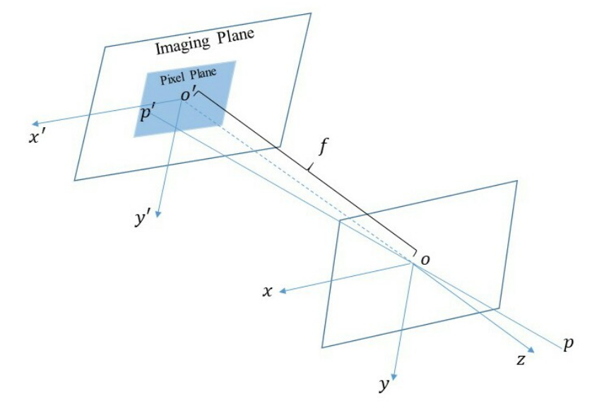
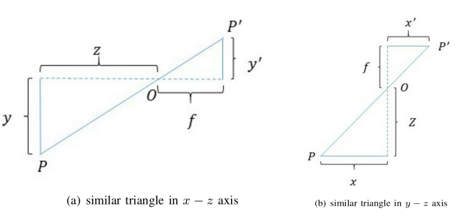
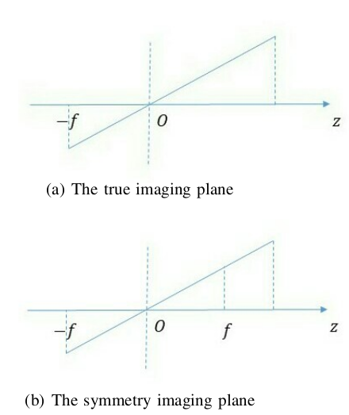
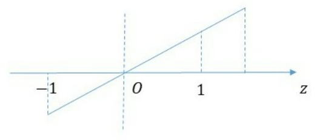
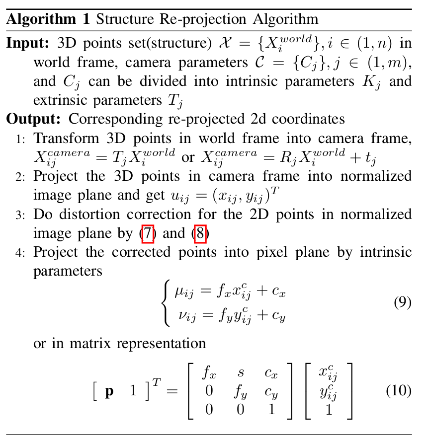
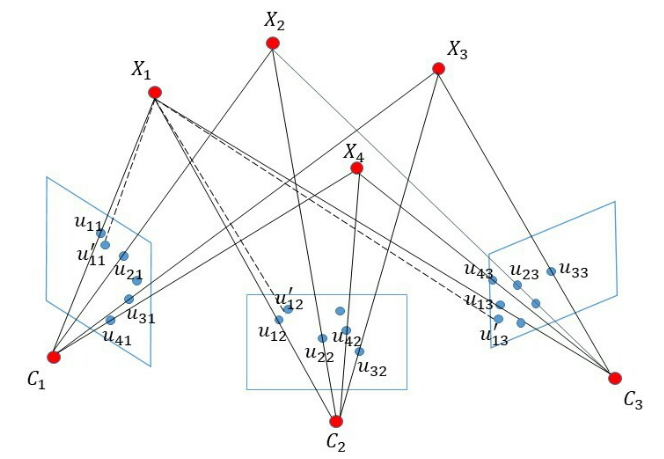
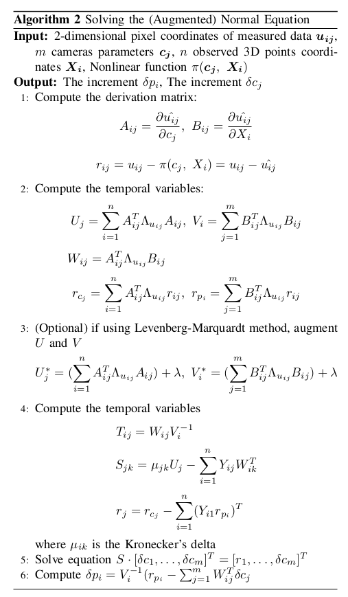

.. highlight:: c++

.. default-domain:: cpp

=================
Bundle Adjustment
=================
本文翻译于 `Bundle Adjustment Revisited <https://arxiv.org/pdf/1912.03858.pdf>`_

I. Introduction
===============================

集束平差法在大地测量学和 3D 重建（SLAM 和 SfM）中发挥着重要作用，但直到最近才被认为已解决。集束束调整构成大多数最先进的多视图几何系统中的核心组件，
并且通常作为最终细化阶段调用，以近似初始场景估计以及在增量重建中消除漂移的方法。 Levenberg-Marquardt 算法已被证明是解决该公式的最成功的方法，、
因为它易于实现、对初始化具有鲁棒性，并且其框架非常适合利用现在的稀疏形式的多视图几何的问题上。该算法的每一步都会产生一个参数估计值，
该估计值在前一个的基础上有所改进，由此产生的一系列迭代可以显示为收敛到手头目标函数的局部最小值。

因此，在过去十年中提出了许多捆绑调整的方法。 这些方法分为两组：第一个分支侧重于使捆绑调整算法尽可能高效，
而第二个分支侧重于减少单个捆绑调整的大小或调用频率。

集束调整是细化视觉重建以产生联合最优 3D 结构和观看参数估计的关键。 最优意味着通过最小化一些量化模型拟合误差的成本函数来找到参数估计，
同时，解决方案在结构和相机变化方面同时是最优的。 该名称指的是离开每个 3D 特征并会聚在每个相机中心的光线“束”，
这些光线针对特征和相机位置进行了最佳“调整”。

本文的主要目的有两个：

* 1 从理论和实践层面对集束平差法调整问题进行详细探索和推导。
* 2 展示平行束平差的发展历程，并给出未来束平差的方向。

我们的论文组织如下：首先在第二部分介绍投影相机模型和相机失真，然后展示如何使用引入的相机模型进行束调整。 
在第三节中，我们详细给出了传统捆绑调整的推导，分布式捆绑调整算法在第四节中给出。 最后，对我们的工作做一个总结。

II. Projection Camera Model
===============================

束调整描述了测量的像素坐标 :math:`u_{ij}` 和重新投影的像素坐标之间的误差总和。重新投影的像素坐标由结构（世界框架中的 3D 点坐标）
和相机参数计算得出。 因此，在我们深入研究捆绑调整之前，必须弄清楚重新投影的过程。 我们将在本节首先介绍针孔相机模型。

A. pinhole camera
-------------------------------

针孔相机模型如图1所示，相机坐标系 :math:`o-xyz` 中 :math:`p` 坐标为 :math:`(X,Y,Z)^T` ，相机焦距为 :math:`f` ，相机中心 :math:`o` 为针孔， 
并且 :math:`p` 被投影到成像平面 :math:`o-xy` 中，并由二维点 :math:`p^{\prime}` 表示。

    Figure 1. Pinhole camera model: p is a 3D point located in camera frame, o is
    the camera center, f is the focal length, p is projected into the imaging plane
    on a pinhole camera model.

   Figure 2. Similar Triangle

基于相似三角形理论（如图 2 所示），我们可以获得：

.. math:: 

    \frac{f}{Z} = -\frac{X^{\prime}}{X} = -\frac{Y^{\prime}}{Y} \tag{1}

然后（1）简化为 :math:`\frac{f}{Z} = \frac{X^{\prime}}{X} = \frac{Y^{\prime}}{Y}`, 那么

.. math::

  \begin{align}
    \begin{cases}
      X^{\prime} = f \frac{X}{Z} \\
      Y^{\prime} = f \frac{Y}{Z}
    \end{cases}  
  \end{align}  

为了简化模型，我们可以将成像平面连同 3D 点放在相机前面，如图 3 所示：

   Figure 3. Imaging Plane: (a) is the real imaging plane, (b) is the symmetry
   imaging plane that we put the imaging plane in (a) in front of camera.

但是，我们只能得到成像平面上的坐标，而实际上我们得到的是像素平面上的像素坐标。 假设在成像平面 :math:`ouv` 上固定有一个像素平面，
点 :math:`p^{\prime}` 在像素平面上的坐标为 :math:`(µ, ν)^T` 。 与比例和平移相关的像素帧和成像平面。 假设像素坐标在 :math:`u` 轴上按 :math:`α` 缩放，
在 :math:`v` 轴按 :math:`β` 缩放，到原点的平移是 :math:`(c_x , c_y )^T` 。 则成像平面坐标与像素平面坐标的关系为：

.. math::

  \begin{align}
    \begin{cases}
      \mu = \alpha X^{\prime}  + c_x\\
      \nu = \beta Y^{\prime}  + c_y
    \end{cases}  
  \end{align}  

将(2) 代入(3) 并设 :math:`f_x = \alpha · f` , :math:`f_y = \beta · f` ，我们可以得到：

.. math::

  \begin{align}
    \begin{cases}
      \mu = f_x \frac{X}{Z}  + c_x \\
      \nu = f_y \frac{Y}{Z}  + c_y 
    \end{cases}  
  \end{align}  

通常，(4) 写成矩阵形式：

.. math::

    \begin{bmatrix}
        \mu \\
        \nu \\
        1
    \end{bmatrix} =
    \begin{bmatrix}
        f_x & 0   & c_x  \\
        0    & f_y & c_y  \\
        0    & 0   & 1  
    \end{bmatrix} =
      \begin{bmatrix}
        \frac{X}{Z} \\
        \frac{Y}{Z} \\
        1
    \end{bmatrix} =
    \frac{1}{Z} KP

其中 :math:`K` 称为校准矩阵或内部矩阵。

上式中，:math:`P` 的 3D 坐标由于相机运动而位于相机坐标系中，而实际上我们只能获得其在世界坐标系 :math:`P_w` 中的坐标。 
所以我们必须先将 :math:`P_w` 转换为相机帧，然后才能使用它：

.. math::

    p_{\mu \nu} = 
    \begin{bmatrix}
        \mu \\
        \nu \\
        1
    \end{bmatrix} =
    \frac{1}{Z} K(RP_w + t)

其中 :math:`P_c = \frac{1}{Z}(RP_w + t)` 称为归一化坐标。 它位于 :math:`Z = 1` 的相机平面的前面，该平面称为图4中的归一化平面

   Figure 4. Normalized Imaging Plane

B. camera distortion
-------------------------------

为了获得更好的成像效果，通常在摄像头前加装光学镜头，这样在成像过程中可能会影响到光线的预测。 主要有两个原因：

* 受光学透镜影响的光线通过路径
* 组装相机时光学镜头与成像平面不严格平行

**径向畸变**

由光学透镜本身引起的畸变称为径向畸变。 相机镜头使图像中的直线变成曲线，越靠近图像的边界越清晰。 径向畸变通常分为桶形畸变和枕形畸变。
对于径向畸变，我们可以使用与图像中心距离相关的多项式函数对其进行校正。 径向畸变校正方程由下式给出

.. math::

    \begin{align}
      \begin{cases}
        x_c = x(1 + k_1r^2 + k_2r^4 + k_3r^6) \\
        x_y = y(1 + k_1r^2 + k_2r^4 + k_3r^6) 
      \end{cases}  
    \end{align}  

其中 :math:`(x, y)^T` 为校正前坐标，:math:`(x_c , y_c )^T` 为校正后坐标，:math:`r = x^2 + y^2` 。 
请注意，:math:`(x, y)^T` 和 :math:`(x_c , y_c )^T` 都位于归一化图像平面中

**切向畸变**

如本节开头所述，切向畸变是由光学镜头与像平面之间不严格平行造成的。 在切向畸变中，我们可以使用另外两个参数 :math:`p_1 , p_2` 进行校正。 
切向畸变校正方程由下式给出

.. math::

    \begin{align}
      \begin{cases}
        x_c = x + 2p_1xy + p_2(r^2 + 2x^2)  \\
        y_c = y + p_1(r^2 + 2y^2) + 2p_2xy 
      \end{cases}  
    \end{align}  

**使用相机模型执行捆绑调整**

有了上面的讨论，我们可以对重投影过程做一个总结，由算法1给出

   Algorithm 1. Structure Re-projection

III. Conventional Bundle Adjustment
===================================

   Figure 5. Bundle Adjustment: :math:`u_{ij}` is the observations, :math:`X_i` is the 3D points
   in world frame, :math:`C_j` is the camera center, :math:`u_{ij}` is the re-projected 2D points.
   The solid line represents the projection procedure, the dotted line represents
   the re-projection procedure.

束调整常用于从运动到结构的结构和 SLAM 的后端。 它试图最小化 2D 观测值和预测的 2D 点之间的误差总和，其中预测点通过相机参数从 3D 结构重新投影。 
它测量计算的 3D 结构和相机参数的准确性。 如图 5 所示，束调整实际上是一个非线性最小二乘问题，由以下等式描述

.. math::

    min \sum_{i=1}^{n} \sum_{j=1}^{m}(u_{ij} - \pi(C_j, X_i))^2   \tag{11}

其中 :math:`u_{ij}` 是像素级的观察点坐标，表示第 :math:`j` 个摄像机 :math:`C_j` 观察到的第 :math:`i` 个 3D 点 :math:`X_i` 。 :math:`\pi(C_j , X_i)` 
是第三节中描述的非线性运算

为了简化符号，令 :math:`r_{ij} = u_{ij} − \pi(C_j , X_i)` ，然后我们可以将 (11) 重写为

.. math::

    \min \mathbf{r}^T\mathbf{r} \tag{12}

然后，我们执行一阶泰勒展开

.. math::

    r(x + \delta x) = r(x) + g^T \delta x + \frac{1}{2} \delta x^T H \delta x \tag{13}

其中 :math:`g` 和 :math:`H` 分别是 :math:`r` 的梯度和 :math:`Hessian`。 通过对方程 13 求导并将其设置为零，我们得到

.. math::

    H \delta x = -g \tag{14}

对于最小二乘问题，:math:`H = J^TJ + S，g = J^Tr` ，其中 :math:`S = \sum_{i=1}^{n} \sum_{j=1}^{m} r_{ij} \nabla^{2} r_{ij}` 。
如果 :math:`S` 足够小，那么通过省略 :math:`S` ，我们得到 Gauss-Newton 方程

.. math::

  J^TJ \delta x = -J^Tr \tag{15}

注意，如果 :math:`J^TJ` 是正定的，Gauss-Newton 方法总是可以产生一个减小的方向，
因为 :math:`(\delta x)^Tg = -(\delta x)^T J^Tr = -(\delta x)^T J^T J\delta x` < 0。
但是当 :math:`J^TJ` 变得奇异时，则 Gauss-Newton 方法在数值上变得不稳定。 为了克服 Gauss-Newton 的弱点，
我们可以改用 Levenberg-Marquardt 方法。

.. math::

  (J^TJ + \lambda I) \delta x= -J^Tr \tag{16}

A. reduced camera system
--------------------------------------------

似乎不用任思考，我们可以直接用线性代数求解（18）和（19）。 但是，对于大规模问题，即我们有大约 1,000 个相机位姿和 2,000,000 个 3D 点，
出于内存限制和效率考虑，直接解决它们变得不切实际。

为方便起见，我们使用 (18) 来说明如何解决捆绑调整问题。 设置 :math:`\hat{\mu}_{ij} = \pi(C_j , X_i)` ，
我们将参数 :math:`x` 排序到相机块 `c` 和结构块 :math:`p` 中：

.. math::

    x = \begin{bmatrix}
            c & p
        \end{bmatrix} \tag{20}

很容易得到：

.. math::

    J_{ij} = \frac{\partial{r_{ij}}}{\partial{x_k}} =  \frac{\partial{\hat{\mu}_{ij}}}{\partial{x_k}}, 
        \frac{\partial{\hat{\mu}_{ij}}}{\partial{c_k}} = 0, 
        \forall{j} \neq k, 
        \frac{\partial{\hat{\mu}_{ij}}}{\partial{p_k}} = 0,
        \forall{i} \neq k \tag{21}

现在考虑，我们有 m = 3 个相机和 n = 4 个 3D 点。 设置 :math:`A_{ij} = \frac{\partial{\hat{\mu}_{ij}}}{\partial{c_j}}, 
B_{ij} = \frac{\partial{\hat{\mu}_{ij}}}{\partial{p_ij}}` 我们可以得到雅可比矩阵 :math:`J` ：

.. math::

  J =  \frac{\partial{\hat{\mu}}}{\partial{x}} = 
  \begin{bmatrix}
    A_{11} & 0      & 0      & B_{11} & 0      & 0       & 0 \\
    0      & A_{12} & 0      & B_{12} & 0      & 0       & 0 \\
    0      & 0      & A_{13} & B_{13} & 0      & 0       & 0 \\
    A_{21} & 0      & 0      & 0      & B_{21} & 0       & 0 \\
    0      & A_{22} & 0      & 0      & B_{22} & 0       & 0 \\
    0      & 0      & A_{23} & 0      & B_{23} & 0       & 0 \\
    A_{31} & 0      & 0      & 0      & 0      & B_{31}  & 0 \\
    0      & A_{32} & 0      & 0      & 0      & B_{32}  & 0 \\     
    0      & 0      & A_{33} & 0      & 0      & B_{33}  & 0 \\  
    A_{41} & 0      & 0      & 0      & 0      & 0       & B_{41} \\
    0      & A_{42} & 0      & 0      & 0      & 0       & B_{42} \\     
    0      & 0      & A_{43} & 0      & 0      & 0       & B_{43}   
  \end{bmatrix}

很明显，:math:`Jacobi` 是一个非常稀疏的矩阵，它是一个非常重要的性质，我们应该好好利用它。 
让我们更进一步。 将鲁棒性设置为块对角矩阵 :math:`diag\{\Lambda{\mu_{11}} , \Lambda{\mu_{12}}, \cdots , \Lambda{\mu_{nm}}\}` , 并且

.. math::

  \begin{aligned}
    U_{j} &= \sum_{i = 1}^{4} A_{ij}^{T} \Lambda{\mu_{ij} A_{ij}} \\
    V_{i} &= \sum_{j = 1}^{3} B_{ij}^{T} \Lambda{\mu_{ij} B_{ij}} \\
    W_{ij} &= A_{ij}^{T} \Lambda{\mu_{ij} B_{ij}}
  \end{aligned} 

那么(18)的左边变成：

.. math::

    J^T\Lambda{\mu}J = 
    \begin{bmatrix}
      U_1         &  0         & 0    & W_{11}  & W_{21} & W_{31} & W_{41} \\
      0           &  U_2       & 0    & W_{12}  & W_{22} & W_{32} & W_{42} \\
      0           &  0         & U_3  & W_{13}  & W_{23} & W_{32} & W_{43} \\
      W_{11}^{T}  & W_{12}^{T} & W_{13}^{T} & V_1 & 0   & 0   & 0  \\
      W_{21}^{T}  & W_{22}^{T} & W_{23}^{T} & 0   & V_2 & 0   & 0  \\
      W_{31}^{T}  & W_{32}^{T} & W_{33}^{T} & 0   & 0   & V_3 & 0  \\
      W_{41}^{T}  & W_{42}^{T} & W_{43}^{T} & 0   & 0   & 0   & V_4 
    \end{bmatrix} 

(18)的右边变成:

.. math::

    J^T\Lambda{\mu}r = 
    \begin{bmatrix}
        \sum_{i = 1}^{4} A_{i1}^{T} \Lambda{\mu_{i1} r_{i1}} \\
        \sum_{i = 1}^{4} A_{i2}^{T} \Lambda{\mu_{i2} r_{i2}} \\
        \sum_{i = 1}^{4} A_{i3}^{T} \Lambda{\mu_{i1} r_{i3}} \\
        \sum_{j = 1}^{3} B_{ij}^{T} \Lambda{\mu_{1j} r_{1j}} \\
        \sum_{j = 1}^{3} B_{ij}^{T} \Lambda{\mu_{2j} r_{2j}} \\
        \sum_{j = 1}^{3} B_{ij}^{T} \Lambda{\mu_{3j} r_{3j}} \\
        \sum_{j = 1}^{3} B_{ij}^{T} \Lambda{\mu_{4j} r_{4j}} 
    \end{bmatrix}

令

.. math::

  \begin{aligned}
    r_{c_j} &= \sum_{i = 1}^{4} (A_{ij}^{T} \Lambda{\mu_{ij} r_{ij}})^{T} \\
    r_{p_i} &= \sum_{j = 1}^{3} (B_{ij}^{T} \Lambda{\mu_{ij} r_{ij}})^{T} \\
    r_{ij} &= \mu_{ij} - \hat{\mu}_{ij}
  \end{aligned} 

并且

.. math::

 \begin{aligned}
    U &= diag\{U_1, U_2, U_3\} \\
    V &= diag\{V_1, V_2, V_3, V_4\} \\
    W &= 
    \begin{bmatrix}
      W_{11}  & W_{21} & W_{31} &  W_{41}   \\
      W_{12}  & W_{22} & W_{32} &  W_{42}   \\
      W_{13}  & W_{23} & W_{33} &  W_{43}   
    \end{bmatrix} 
  \end{aligned} 

将（26）和（27）分别代入（24）和（25），我们可以得到

.. math::

    J^T\Lambda{\mu}r = 
    \begin{bmatrix}
      r_{c_1} \\
      r_{c_2} \\
      r_{c_3} \\
      r_{p_1} \\
      r_{p_2} \\
      r_{p_3} \\
      r_{p_4}
    \end{bmatrix} =
    \begin{bmatrix}
      \mathbf{r_c} \\
      \mathbf{r_p}
    \end{bmatrix} 

那么

.. math::

    J^T\Lambda{\mu}J = 
    \begin{bmatrix}
      U   &  W   \\
      W^T &  V  
    \end{bmatrix} 

然后，我们设置

.. math::

    \delta x = 
    \begin{bmatrix}
      \delta c  \\
      \delta p 
    \end{bmatrix} 

将（30）和（29）代入（18），我们得到

.. math::

    \begin{bmatrix}
      U   &  W   \\
      W^T &  V  
    \end{bmatrix} =
    \begin{bmatrix}
      \delta c  \\
      \delta p 
    \end{bmatrix} =
    \begin{bmatrix}
      \mathbf{r_c} \\
      \mathbf{r_p}
    \end{bmatrix} 

如果我们有更多的相机和 3D 点，请意识到 (31) 变成了一个中到大规模的线性方程。 
那么为了有效地解决它，我们需要更多的技巧。 考虑到摄像机的数量 :math:`m` 远小于3D点的数量 :math:`n` ，
我们可以消除结构块 :math:`\delta p` ，得到 :math:`\delta c` 的解，然后我们通过反向(back-substitution)代入得到 :math:`\delta p` 的结果。 
现在在(31)的两边左乘 :math:`[I − WV^{-1}]^T` ，那么我们可以得到

.. math::

    \begin{bmatrix}
      U - WV^{-1}W^{T} & 0
    \end{bmatrix}
    \begin{bmatrix}
      \delta c  \\
      \delta p 
    \end{bmatrix} =
    \begin{bmatrix}
      I & − WV^{-1}
    \end{bmatrix} 
    \begin{bmatrix}
      \mathbf{r_c} \\
      \mathbf{r_p}
    \end{bmatrix} 

然后，从 (32) 我们进一步得到

.. math::

    (U - WV^{-1}W^{T}) \delta c = \mathbf{r_c} - WV^{-1} \mathbf{r_p} \tag{33}

(33) 称为缩减相机系统(Reduced Camera System)，:math:` S = U - WV^{-1}W^{T}` 称为 (31) 
左侧的 V 的舒尔码。 可以证明对称正定矩阵的舒尔补是对称正定的，因此(33)式可以通过Cholesky分解求解。 
有了 (32)，我们有

.. math::

    W^{T} \delta c + V \delta p = r_c  \tag{34}

然后，通过求解（34），我们可以得到

.. math::

     \delta p = V^{-1} (r_c -  W^{T} \delta c) \tag{35}

然后回到小例子，例如 m = 3 和 n = 4，我们可以得到

.. math::

    S = 
    \begin{bmatrix}
      U_1 -  \sum_{i = 1}^{4} Y_{i1}W_{i1}^{T}  &  -\sum_{i = 1}^{4} Y_{i1}W_{i1}^{T}      & -\sum_{i = 1}^{4} Y_{i1}W_{i3}^{T}  \\
      -\sum_{i = 1}^{4} Y_{i2}W_{i1}^{T}        & U_2 -  \sum_{i = 1}^{4} Y_{i2}W_{i2}^{T} & -\sum_{i = 1}^{4} U_{i2}W_{i3}^{T}  \\
      -\sum_{i = 1}^{4} Y_{i3}W_{i1}^{T}        &  -\sum_{i = 1}^{4} Y_{i3}W_{i2}^{T}      & U_3 -  \sum_{i = 1}^{4} Y_{i3}W_{i3}^{T}
    \end{bmatrix} 

通过设置 :math:`Y_{ij} = W_{ij} V_I^{-1}` ，我们可以重写 (33) 的右边

.. math::

    r_c - WV^{-1} r_p =
    \begin{bmatrix}
        r_{a1} - \sum_{i = 1}^{4} (Y_{i1}r_{b_i})^{T} \\
        r_{a2} - \sum_{i = 1}^{4} (Y_{i2}r_{b_i})^{T} \\
        r_{a3} - \sum_{i = 1}^{4} (Y_{i3}r_{b_i})^{T} 
    \end{bmatrix}

通过将(36)和(37)代入(33)中，我们可以很容易地求解简化的相机系统，得到(35)的解

.. math::

    \delta p = V^{-1}(r_p - WV^{T} \delta c) = 
    \begin{bmatrix}
        V_{1}^{-1}(r_{b_1} - \sum_{j = 1}^{3} W_{1j}^{T} \delta c_j) \\
        V_{2}^{-1}(r_{b_2} - \sum_{j = 1}^{3} W_{2j}^{T} \delta c_j) \\
        V_{3}^{-1}(r_{b_3} - \sum_{j = 1}^{3} W_{3j}^{T} \delta c_j) \\
        V_{4}^{-1}(r_{b_4} - \sum_{j = 1}^{3} W_{4j}^{T} \delta c_j) \\
    \end{bmatrix}

请注意，简化相机系统的推导是基于(normal equation)正规方程（18），这表明我们使用的是
高斯-牛顿法。 如果我们想使用 Levenber-Marquardt 方法，我们应该在增广正规方程的基础上对
上面的方程进行一些修改。 由于我们只需要增加 U 和 V 的对角线元素，那么我们只需将 U 和 V 
分别替换为 :math:`U^{\star}` 和 :math:`V^{\star}` ，其中 :math:`\star` 表示 U 和 V 的对角线元素的增加。
除此之外，如果3D点 :math:`X_k` 没有被相机 :math:`l` 观测到, 那么 :math:`A_{kl} = \frac{\partial{\hat{\mu}_{k_l}}}{\partial{p_k}} = 0, 
B_{kl} = \frac{\partial{\hat{\mu}_{k_l}}}{\partial{c_l}} = 0` 。

通过上面的推导，我们可以将其扩展到任何尺度问题，例如 m = M，n = N，并导致下面的算法用于求解（增广）正规方程。

   Algorithm 2 Solving the (Augmented) Normal Equation

B. bundle adjustment with conjugate gradient
--------------------------------------------

IV. Distributed Bundle Adjustment
============================================

V. Conclusion
============================================

在本文中，我们以传统方式和分布式方式对捆绑调整问题进行了详细的推导和各种解决方案。 
很明显，预处理共轭梯度方法可以替代基于稠密 Cholesky 分解的方法。 
虽然分布式束调整方法易于解决非常大规模的重建问题，但它们在准确性和效率方面都超过了从小到大规模问题的传统方法。

VI. Reference
============================================

1 `Bundle Adjustment Revisited <https://arxiv.org/pdf/1912.03858.pdf>`_
