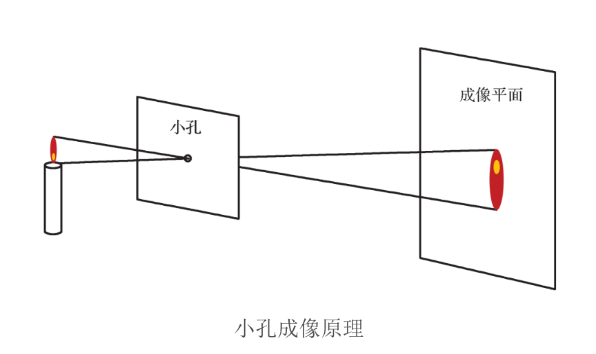
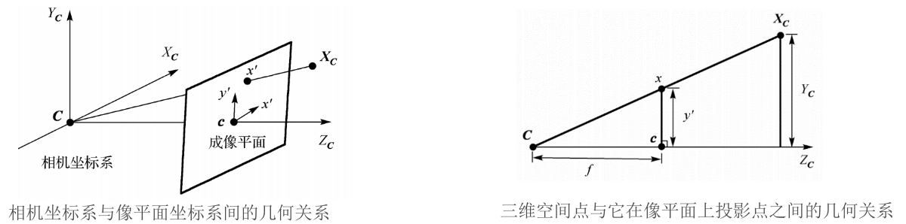
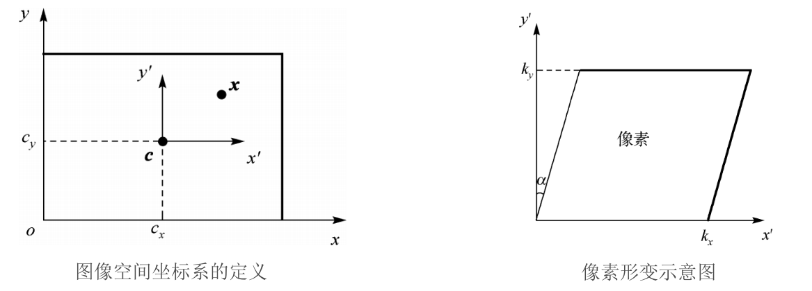
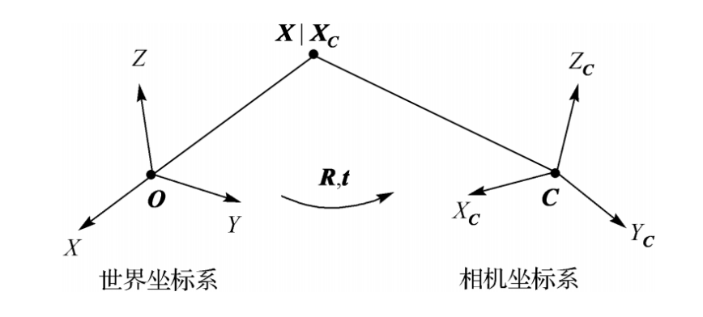
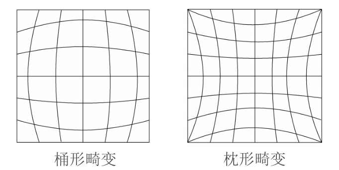

.. highlight:: c++

.. default-domain:: cpp

=============
Pinhole Model
=============

齐次坐标
========

在原有的坐标上增加一个维度：

.. math:: 

    \begin{bmatrix}
        x \\
        y
    \end{bmatrix}
    \rightarrow
     \begin{bmatrix}
        x \\
        y \\
        1
    \end{bmatrix}
    \qquad
    \begin{bmatrix}
        x \\
        y
    \end{bmatrix}
    \rightarrow
     \begin{bmatrix}
        x \\
        y \\
        z \\
        1
    \end{bmatrix}

新增的维度并不会增加自由度：

.. math:: 

    (x, y, z, w) \quad w \neq 0 \longrightarrow (\frac{x}{w}, \frac{y}{w}, \frac{z}{w})

使用齐次坐标判断点是否在线上:

.. math:: 

    \mathbf{l} = 
    \begin{bmatrix}
        l_1 \\
        l_2 \\
        l_3
    \end{bmatrix}
    \qquad \qquad
    \mathbf{x}^{T} \mathbf{l} = 
    \begin{bmatrix}
        u & v & 1
    \end{bmatrix}
    \begin{bmatrix}
        l_1 \\
        l_2 \\
        l_3
    \end{bmatrix}
    = 0

使用齐次坐标判断点是否在平面上:

.. math:: 

    \mathbf{\pi} = 
    \begin{bmatrix}
        n_1 \\
        n_2 \\
        n_3 \\
        d
    \end{bmatrix}
    \qquad \qquad
    \mathbf{x}^{T} \mathbf{\pi} = 
    \begin{bmatrix}
        x & y & z & 1
    \end{bmatrix}
    \begin{bmatrix}
        n_1 \\
        n_2 \\
        n_3 \\
        d
    \end{bmatrix}
    = 0

两个点定义一条直线: 

.. math:: \mathbf{I} = \mathbf{p} \times \mathbf{q}

两条直线定义一个点:

.. math:: \mathbf{x} = \mathbf{I} \times \mathbf{m}

针孔相机模型
=============

针孔成像模型是一个理想的透视投影变换，将三维空间点变换为图像空间的像素点

相机坐标系与像平面坐标系间的关系

投影方程：

.. math:: 

    \begin{bmatrix}
        x_{'} \\
        y_{'} \\
        f
    \end{bmatrix}
    \backsim 
      \begin{bmatrix}
        X_{C} \\
        Y_{C} \\
        Z_{C}
    \end{bmatrix}

齐次坐标表示：

.. math::

    \begin{bmatrix}
        x_{'} \\
        y_{'} \\
        f
    \end{bmatrix}
    \backsim 
    \begin{bmatrix}
    1 & 0 & 0 & 0 \\
    0 & 1 & 0 & 0 \\
    0 & 0 & 1 & 0 
    \end{bmatrix}
    \begin{bmatrix}
        X_{C} \\
        Y_{C} \\
        Z_{C} \\
        1
    \end{bmatrix}

内参矩阵
========

齐次坐标表示：

.. math::

        \begin{bmatrix}
            x \\
            y \\
            1
        \end{bmatrix}
        = 
        \begin{bmatrix}
            f_x & 0   & c_x \\
            0   & f_y & c_y \\
            0   &  0  & 1
        \end{bmatrix}
        \begin{bmatrix}
            x_{'} \\
            y_{'} \\
            f
        \end{bmatrix}

外参矩阵
=========

.. math::

    \mathbf{X} = 
    \begin{bmatrix}
        R  & \mathbf{t}
    \end{bmatrix}
    =
    \hat{\mathbf{X}}
    \begin{bmatrix}
        R  & -R\tilde{C} 
    \end{bmatrix}
    \hat{\mathbf{X}}

透视相机模型

.. math:: 

    \mathbf{P} =  
    \mathbf{K}
    \begin{bmatrix}
        \mathbf{R} & \mathbf{t}
    \end{bmatrix}

.. NOTE::

    11个自由度(5 + 3 + 3)

    * 5个内参
    * 3个旋转角度
    * 3个平移

径向畸变
========

切向畸变
========

.. NOTE::

    切向畸变主要是由于透镜和成像平面不严格平行造成的

.. math::

    \begin{align}
        x_d^{\prime} &= x^{\prime}(1 + \kappa_1 r^2 + \kappa_2 r^4 + \cdots ) + 2p_1x^{\prime}y^{\prime} + p_2(r^2 + 2{x^{\prime}}^2) \\
        y_d^{\prime} &= y^{\prime}(1 + \kappa_1 r^2 + \kappa_2 r^4 + \cdots ) +  p_1(r^2 + 2{y^{\prime}}^{2}) + 2p_2{x^{\prime}}y^{\prime}
    \end{align}