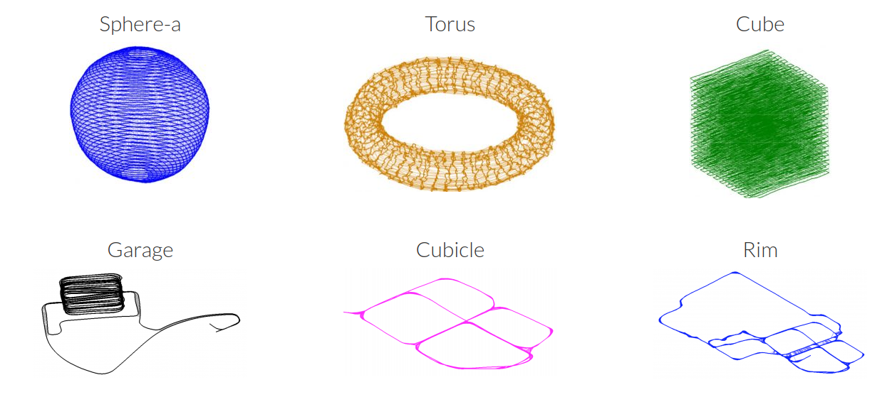

<center> <font color='green' size=12>Ceres Solver</font></center>

---

**<font color='red' size=5> weichat contact</font>**


https://gitee.com/quanduyong/slam_tutorial.git

**2021-12-09**

## Robust Curve Fitting

* no use lost function result image

  

```c++
problem.AddResidualBlock(cost_function, nullptr , &m, &c);
```


* use lost function result image

  

```c++
problem.AddResidualBlock(cost_function, new CauchyLoss(0.5) , &m, &c);
```


找到一个$ n$ 维的变量$ X^{∗} \in \mathbb{R}^n$，使得损失函数 $F(x)$ 取局部最小值：
$$
F(X) = \frac{1}{2}\sum_{i=1}^{m}(f_i(X))^2
$$
二阶泰勒展开 :
$$
F(X + \Delta{X}) = F(X) +  J\Delta{X} + \frac{1}{2}\Delta{X}^TH\Delta{X} + O(||\Delta{X}||^3)
$$

### Lost Function


HuberLoss :
$$
\rho(s) =
\begin{cases}
	s    		 &  \text{$s \leq  1 $} \\
	s\sqrt{s} - 1 & \text{$s \gt  1 $} 
\end{cases}
$$
CauchyLoss :
$$
\rho(s) = \log(1 + s)
$$
http://ncfrn.mcgill.ca/members/pubs/AtAllCosts_mactavish_crv15.pdf

### Octave

```shell
# 第一步,添加源
sudo apt-add-repository ppa:octave/stable

# 第二步,更新源
sudo apt-get update

# 第三步,用apt-get安装octave
sudo apt-get install octave

# 第四步,运行
octave
```

 #### plot

```octave
x = -10:0.1:10; # Create an evenly-spaced vector from -10..10
y = sin (x);    # y is also a vector
plot (x, y);
title ("Simple 2-D Plot");
xlabel ("x");
ylabel ("sin (x)");
```


#### Solve the system Ax = b

```octave
b = [4; 9; 2] # Column vector
A = [ 3 4 5;
      1 3 1;
      3 5 9 ]
x = A \ b     # Solve the system Ax = b
```


$$
A^TAx = A^Tb \\
x = (A^TA)^{-1}A^Tb
$$


#### robust curve fitting data

```octave
randn('seed', 23497);
m = 0.3;
c = 0.1;
x=[0:0.075:5];
y = exp(m * x + c);
noise = randn(size(x)) * 0.2;
outlier_noise = rand(size(x)) < 0.05;
y_observed = y + noise + outlier_noise;
data = [x', y_observed'];
```

## G-N

#### [367. 有效的完全平方数](https://leetcode-cn.com/problems/valid-perfect-square/)

> 给定一个 正整数 num ，编写一个函数，如果 num 是一个完全平方数，则返回 true ，否则返回 false 。
>
> 进阶：不要 使用任何内置的库函数，如  sqrt 
>
> **示例 1：**
>
> ```c++
> 输入：num = 16
> 输出：true
> ```
>
> **示例 2：**
>
> ```c++
> 输入：num = 14
> 输出：false
> ```


牛顿迭代法。牛顿迭代法是一种近似求解方程（近似求解函数零点）的方法。其本质是借助泰勒级数，从初始值开始快速向函数零点逼近


如果 $ \textit{num}$ 为完全平方数，那么一定存在正整数 $x$ 满足 $x \times x = num$。于是我们写出如下方程:
$$
y=f(x)=x^2−num
$$

* 如何选取初始值?

* 如何进行迭代?

  对 $f(x)$ 求导，得到:
  $$
  f'(x) = 2 x
  $$
  假设当前值为 $x_i$ ，将 $x_i$  代入 $f(x)$ 得到函数图像上的点 $(x_i,x_i^2 - \textit{num})$，过该点做一条斜率为 $f'(x_i) = 2 x$的直线，则直线的方程为:
  $$
  y−(x_i^2−num)=2x_i(x−x_i)
  $$
  

  直线与横轴（$X$轴）交点的横坐标为上式中的 $y = 0$时 $x$的解。于是令上式中 $y=0$，得到 : 
  $$
  2x_ix−x_i^2−num=0
  $$
  整理上式即可得到下一次迭代的值：
  $$
  x_{i+1} = \frac{x_i^2+num}{2x_i} = \frac{1}{2}(x_i + \frac{num}{x_i})
  $$

* 如何判断迭代是否可以结束?

每一次迭代后，我们都会距离零点更近一步，所以当相邻两次迭代的结果非常接近时，我们就可以断定，此时的结果已经足够我们得到答案了。一般来说，可以判断相邻两次迭代的结果的差值是否小于一个极小的非负数 $\epsilon$，其中 $\epsilon$一般可以取 $10^{-6}或 10^{-7}$

* 如何通过迭代得到的近似零点得到最终的答案?

```c++
bool isPerfectSquare(int num) 
{
    // 初始值
    double x0 = num;
    while (true) 
    {
        // 迭代
        double x1 = (x0 + num / x0) / 2;
        // 判断迭代是否可以结束
        if (x0 - x1 < 1e-6) {
        	break;
		}
		x0 = x1;
	}
    // 最终的答案
    int x = (int) x0;
    return x * x == num;
}
```

## Bundle Adjustment

### Camera Model

$$
\begin{bmatrix}
u \\
v \\
1
\end{bmatrix}
= \frac{1}{Z}
\begin{bmatrix}
f_x & 0   & c_x \\
0   & f_y & c_y \\
0   & 0   & 1
\end{bmatrix}
\begin{bmatrix}
X \\
Y \\
Z
\end{bmatrix}
$$

conversion from world to camera coordinates :
$$
P  =  R  X + t
$$
perspective division :
$$
p  = \frac{-P}{P.z}
$$
conversion to pixel coordinates :
$$
p' =  f * r(p) * p
$$
here `P.z` is the third (`z`) coordinate of `P`. In the last equation, `r(p)` is a function that computes a scaling factor to undo the radial distortion

where :
$$
\begin{align}
r(p) = 1.0 + k1 * ||p||^2 + k2 * ||p||^4.
\end{align}
$$

### Reprojection error

$$
argmin \quad \sum{||\pi(C_i, X_j) - x_{ij}||^2}
$$


### Data Format

```shell
# <num_cameras>     <num_points>     <num_observations>
     318               41628           179919
# <camera_index_1> <point_index_1> <x_1> <y_1>
0 0     1.224100e+02 6.554999e+01
1 0     1.233900e+02 6.003003e+01
4 0     1.226800e+02 7.053998e+01
8 0     1.269600e+02 7.732001e+01
20 0     1.372900e+02 9.367999e+01
```

## Robot Motion

### robot model

$$
\begin{bmatrix}
x \\
y \\
\theta
\end{bmatrix}_{n+1}
=
\begin{bmatrix}
x \\
y \\
\theta
\end{bmatrix}_{n}
+

\begin{bmatrix}
\delta{x} \\
\delta{y}  \\
\delta{\theta} 
\end{bmatrix}_{n+1} + w_n
$$

that:
$$
\begin{bmatrix}
    \delta{x} \\
    \delta{y}  \\
    \delta{\theta} 
\end{bmatrix} 
=
\begin{bmatrix}
v \delta t \cos({\theta + \delta\theta}) \\
v \delta t \sin({\theta + \delta\theta})  \\
w \delta{t} 
\end{bmatrix}
$$

### Lidar Data

```c++
Header header            # timestamp in the header is the acquisition time of 
                         # the first ray in the scan.
                         #
                         # in frame frame_id, angles are measured around 
                         # the positive Z axis (counterclockwise, if Z is up)
                         # with zero angle being forward along the x axis
                         
float32 angle_min        # start angle of the scan [rad]
float32 angle_max        # end angle of the scan [rad]
float32 angle_increment  # angular distance between measurements [rad]

float32 time_increment   # time between measurements [seconds] - if your scanner
                         # is moving, this will be used in interpolating position
                         # of 3d points
float32 scan_time        # time between scans [seconds]

float32 range_min        # minimum range value [m]
float32 range_max        # maximum range value [m]

float32[] ranges         # range data [m] (Note: values < range_min or > range_max should be discarded)
float32[] intensities    # intensity data [device-specific units].  If your
                         # device does not provide intensities, please leave
                         # the array empty.
```


2D雷达扫描到障碍物之间的距离$r$和角度$\phi$
$$
\begin{bmatrix}
r_i \\
\phi_i
\end{bmatrix}
=
\begin{bmatrix}
\sqrt{x_i^2 + y_i^2} \\
\arctan(\frac{y_i}{x_i})
\end{bmatrix}
$$

## Pose Graph 2D

### dataset 2D

https://lucacarlone.mit.edu/datasets/


### error model


residuals :
$$
r_{ab} =
\begin{bmatrix}
R_{a}^{T}(p_a - p_b) - \hat{p}_{ab} \\
Normalize(\psi_b - \psi_a - \psi_{ab})

\end{bmatrix}
$$
where the function Normalize() normalizes the angle in the range $[−π,π)$, and $R$ is the rotation matrix given by :
$$
R_a = 
\begin{bmatrix}
    \cos{\psi_a} & -\sin{\psi_a} \\
    \sin{\psi_a} &  \cos{\psi_a} 
\end{bmatrix}
$$

```c++
// Normalizes the angle in radians between [-pi and pi).
template <typename T>
inline T NormalizeAngle(const T& angle_radians)
{
    // Use ceres::floor because it is specialized for double and Jet types.
    T two_pi(2.0 * M_PI);
    return angle_radians - two_pi * ::ceres::floor((angle_radians + T(M_PI)) / two_pi);
}
```

 Visualizing the results


### 参考

[graph slam tutorial : 从推导到应用1](https://blog.csdn.net/heyijia0327/article/details/47686523)

[graph slam tutorial : 从推导到应用2](graph slam tutorial ：从推导到应用２)

[graph slam tutorial：从推导到应用3](https://blog.csdn.net/heyijia0327/article/details/47428553/)

## Pose Graph 3D

### dataset 3D

https://lucacarlone.mit.edu/datasets/



### error model

$$
r_{ab} = 
\begin{bmatrix}
	R_{q_a}^T(p_a - p_b) - \hat{p}_{ab}  \\
	2.0 * vec((q_a^{-1} * q_b^{-1})\hat{q}_{ab}^{-1})
\end{bmatrix}
$$


## glog使用

### 日志屏幕输出

```c++
 FLAGS_logtostderr = true;       //设置日志消息是否转到标准输出而不是日志文件
 FLAGS_alsologtostderr = true;   //设置日志消息除了日志文件之外是否去标准输出
 FLAGS_colorlogtostderr = true;  //设置记录到标准输出的颜色消息（如果终端支持）
```


### 日志文件输出

```c++

    FLAGS_logtostderr = false;
    FLAGS_log_dir = "./";
```


### 条件输出

```c++
int num_cookies = 20;
LOG_IF(INFO, num_cookies > 10) << "Got lots of cookies";  //当条件满足时输出日志

//google::COUNTER 记录该语句被执行次数，从1开始，在第一次运行输出日志之后，每隔 10 次再输出一次日志信息
LOG_EVERY_N(INFO, 10)  << "Got the " << google::COUNTER << "th cookie";

//上述两者的结合，不过要注意，是先每隔 10 次去判断条件是否满足，如果滞则输出日志；而不是当满足某条件的情况下，每隔 10 次输出一次日志信息
int size = 2048;
LOG_IF_EVERY_N(INFO, (size > 1024), 10) << "Got the " << google::COUNTER << "th big cookie";

//当此语句执行的前 20 次都输出日志，然后不再输出
LOG_FIRST_N(INFO, 1) << "Got the " << google::COUNTER << "th cookie";
```

## gflag使用

gflags支持的变量类型如下：

- DEFINE_bool: 布尔类型
- DEFINE_int32: 32-bit 整型
- DEFINE_int64: 64-bit 整型
- DEFINE_uint64: 无符号 64-bit 整型
- DEFINE_double: double
- DEFINE_string: C++ string

```c++
DEFINE_bool(slam_version, false, "Current soft version");
DEFINE_int32(port, 0, "What port to listen on");
```

## Eigen使用


